# Linux Deploy 使用教程

Linux Deploy 是一款能够在 Android 设备上运行 Linux 的软件，使用的是 chroot 原理（因此需要安卓设备拥有 root 权限），不是虚拟机，因此性能很强！~~但似乎并没有什么卵用~~

## 安装 Linux Deploy

首先下载 LinuxDeploy apk，酷安上有。

进入主界面，先点击设置按钮进行配置：

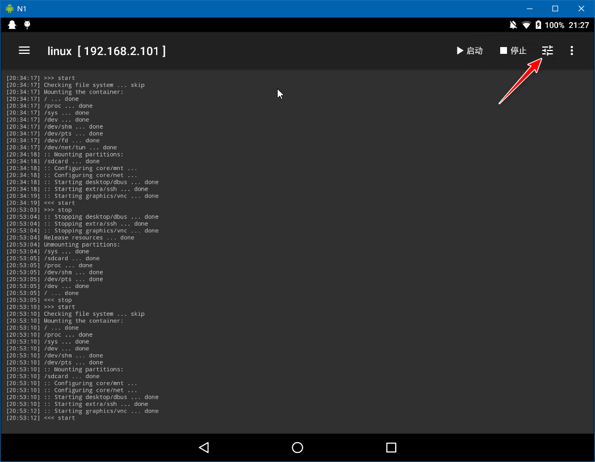

然后按下面的说明，根据个人情况进行配置：

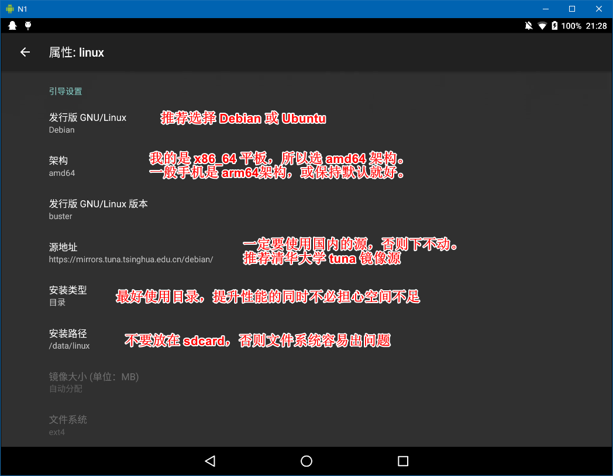

Debian 阿里云镜像：http://mirrors.aliyun.com/debian/

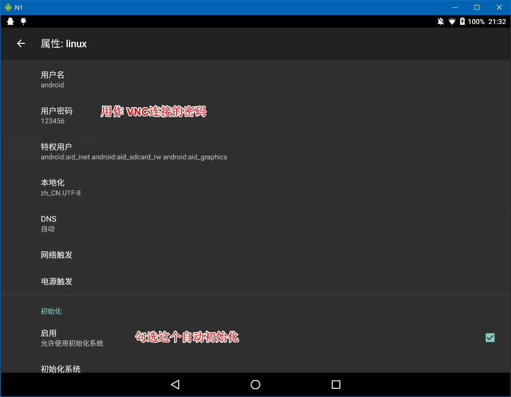

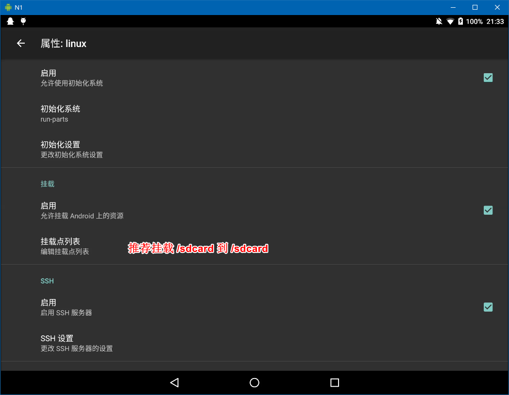

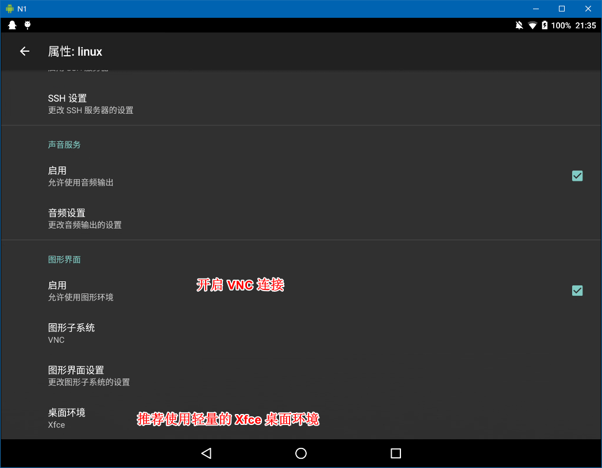

按上述要求配置完成后，返回主界面，点击“安装”

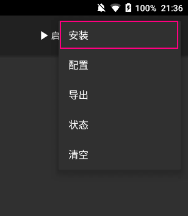

此时会下载大量资源自动进行安装。

此时注意观察日志，等待出现 `<<<` 字样表示安装结束：

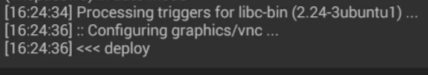

安装过后应该会自动“配置”，注意：每次修改了设置以后都要手动点击配置，才能生效！

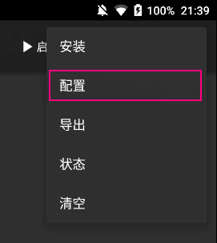

一切就绪后，点击“启动”，出现以下图像则启动成功：

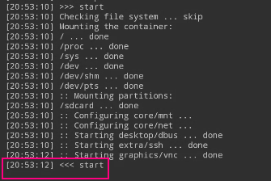

此时就可以用 VNC Viewer 连接 Linux 了!

如果是安卓本地的直接连 `localhost` 即可，密码为上面设置中的密码

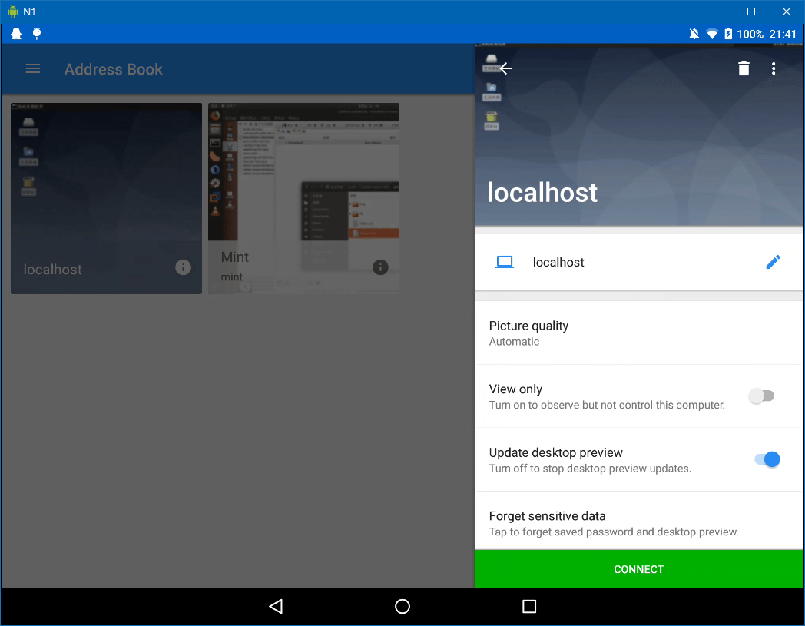

手机操作略为不爽，我们还是用电脑连接吧，IP 地址为 LinuxDeploy 软件标题上的 IP：

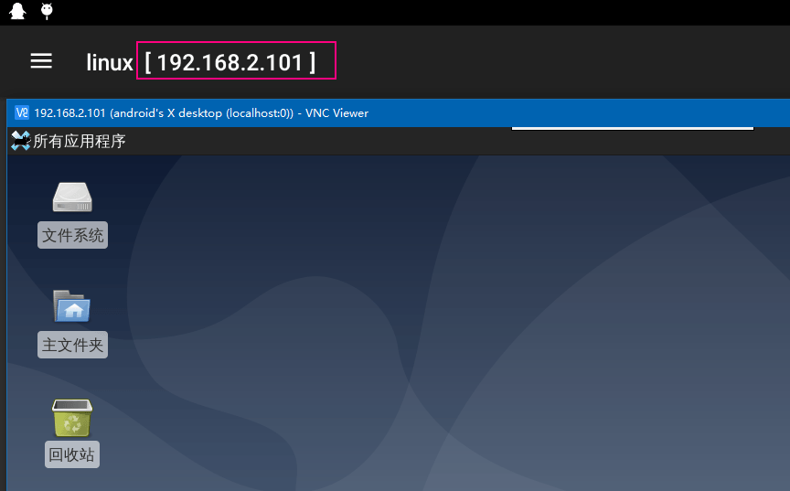

## 桌面环境体验

如果你的手机系统是中文的，那么进入 Linux 后默认也是中文，但是 Linux 没有中文字体，所以首次进去会出现方块。你需要安装中文字库，打开终端，输入`sudo apt install ttf-wqy-zenhei`。

可以流畅运行各种软件，效果还不错！

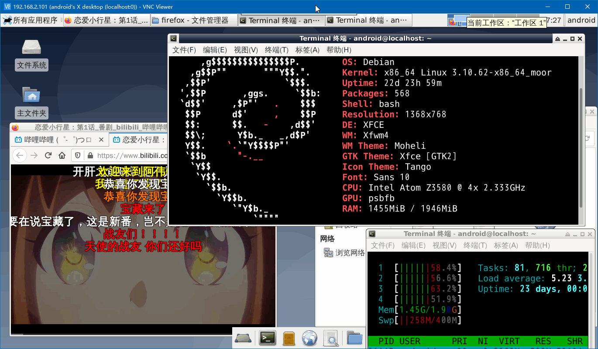

运行 VirtualBox 是不可能的，只能运行 aqemu，即使我的平板是 AMD64 架构，仍然非常的卡。

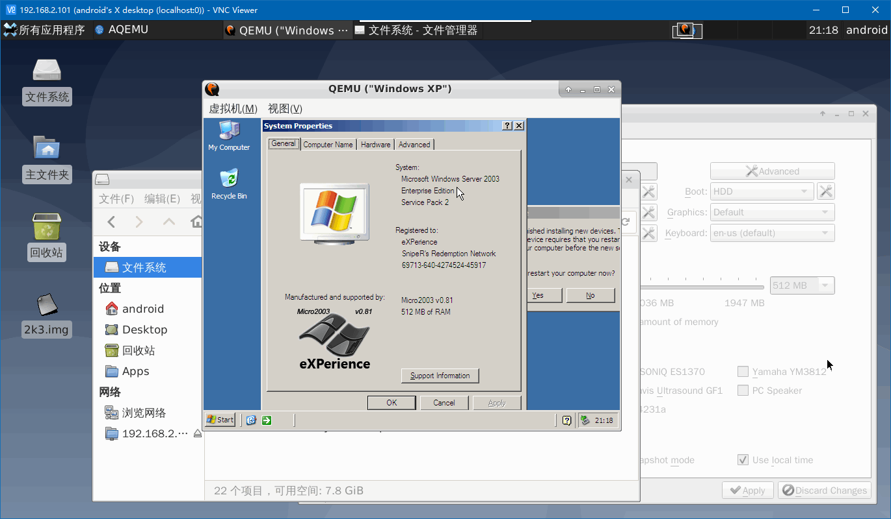

使用 wine 可以运行一些基础 Windows 软件：

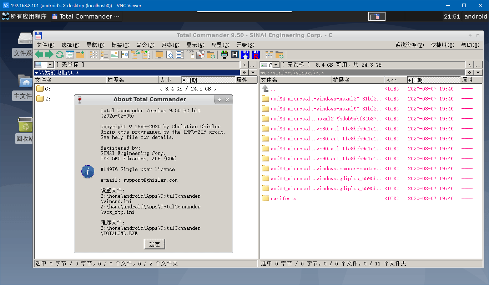

---

（完）
