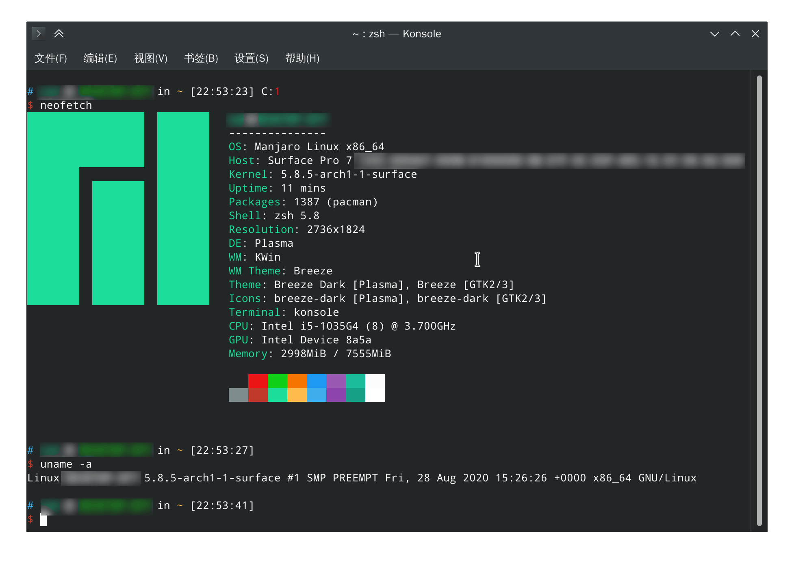

# Surface Pro 7 安装 Linux 指南

如果你网络状况良好，直接参考 `linux-surface` 的[官方文档](https://github.com/linux-surface/linux-surface/wiki/Installation-and-Setup)安装就可以了。下面介绍如何手动下载包并在离线的情况下安装。

## 1. 安装 Debian/Ubuntu


### 1.1 手动下载

可以直接到 linux-surface 的 release 页面下载内核，或者到 https://pkg.surfacelinux.com/debian 手动获取 `deb` 包：

下载 [Packages](https://pkg.surfacelinux.com/debian/dists/release/main/binary-amd64/Packages) 文件，用文本编辑器打开，搜索包名。

例如搜索：`linux-headers-surface`，可以在下方得到这么一串地址：

```
Filename: pool/main/l/linux-surface/linux-headers-surface_5.8.5-surface-1_amd64.deb
```

直接和上面的地址进行拼接，得到下载地址：`https://pkg.surfacelinux.com/debian/pool/main/l/linux-surface/linux-headers-surface_5.8.5-surface-1_amd64.deb`

全部需要下载的包有：

```
linux-headers-surface linux-image-surface surface-ipts-firmware libwacom-surface iptsd
```

### 1.2 安装

使用 `sudo dpkg -i 本地安装包.deb` 来安装，顺序如下：

```sh
# 内核
sudo dpkg -i linux-headers-5.8.5-surface_5.8.5-surface-1_amd64.deb \
	linux-headers-surface_5.8.5-surface-1_amd64.deb \
	linux-image-5.8.5-surface_5.8.5-surface-1_amd64.deb \
	linux-image-surface_5.8.5-surface-1_amd64.deb

# 驱动程序
sudo dpkg --auto-deconfigure -i libwacom-surface_1.4.1-2_amd64.deb
sudo dpkg -i surface-ipts-firmware_20200402-1_amd64.deb
sudo dpkg -i iptsd_0.1-1_amd64.deb
```

## 2. 安装 Arch Linux / Manjaro



### 2.1 手动下载

在 [这里](https://pkg.surfacelinux.com/arch/) 可以直接下载 `zst` 文件，下载前需去除 `.blob` 后缀，如：`https://pkg.surfacelinux.com/arch/iptsd-0.1-1-x86_64.pkg.tar.zst`

需要下载这些包：

```
linux-surface-headers linux-surface surface-ipts-firmware iptsd
```

### 2.2 安装

如果直接安装，可能会提示签名错误，此时需要修改配置：`sudo vim /etc/pacman.conf`

```
# SigLevel = Required DatabaseOptional
SigLevel = Never
# LocalFileSigLevel = Optional
LocalFileSigLevel = Never
```

然后就可以直接安装了：

```sh
# 内核
sudo pacman -U linux-surface-5.8.5.arch1-1-x86_64.pkg.tar.zst \
	linux-surface-headers-5.8.5.arch1-1-x86_64.pkg.tar.zst

# 驱动程序
sudo pacman -U surface-ipts-firmware-20200402-1-any.pkg.tar.zst \
	iptsd-0.1-1-x86_64.pkg.tar.zst
	
# 额外的软件，来自 AUR，如果你装了 yay
# 可能需要开启代理才能下载成功
export ALL_PROXY=socks5://proxyAddress:port
yay -S libwacom-surface surface-dtx-daemon surface-control
```

## 3. 常见问题

### 3.1 vmlinuz has invalid signature

重启后可能提示 `vmlinuz has invalid signature`，此时请进入 UEFI 关闭安全启动，或者安装 `linux-surface-secureboot-mok`。

### 3.2 没有触控

在内核 5.8 及更高版本中，还需要安装 iptsd 以获得触摸支持并启用 iptsd 守护程序 `sudo systemctl enable iptsd.service`

### 3.3 [SP7](https://github.com/linux-surface/linux-surface/wiki/Surface-Pro-7) 重启后卡田牌 Logo

1. `sudo vim /etc/default/grub`
2. 添加 `reboot=pci` 到你的内核参数，如：
    ```
    GRUB_CMDLINE_LINUX_DEFAULT="quiet splash reboot=pci"
    ```
3. 更新 grub 配置：`sudo update-grub`

### 3.4 从公钥服务器接收失败

```
:: Importing keys with gpg...
gpg: 从公钥服务器接收失败：一般错误
```

手动指定可访问的密钥服务器以添加密钥（最后那一长串就是密钥）：

```
gpg --keyserver keyserver.ubuntu.com --recv-keys 3C2C43D9447D5938EF4551EBE23B7E70B467F0BF
```

