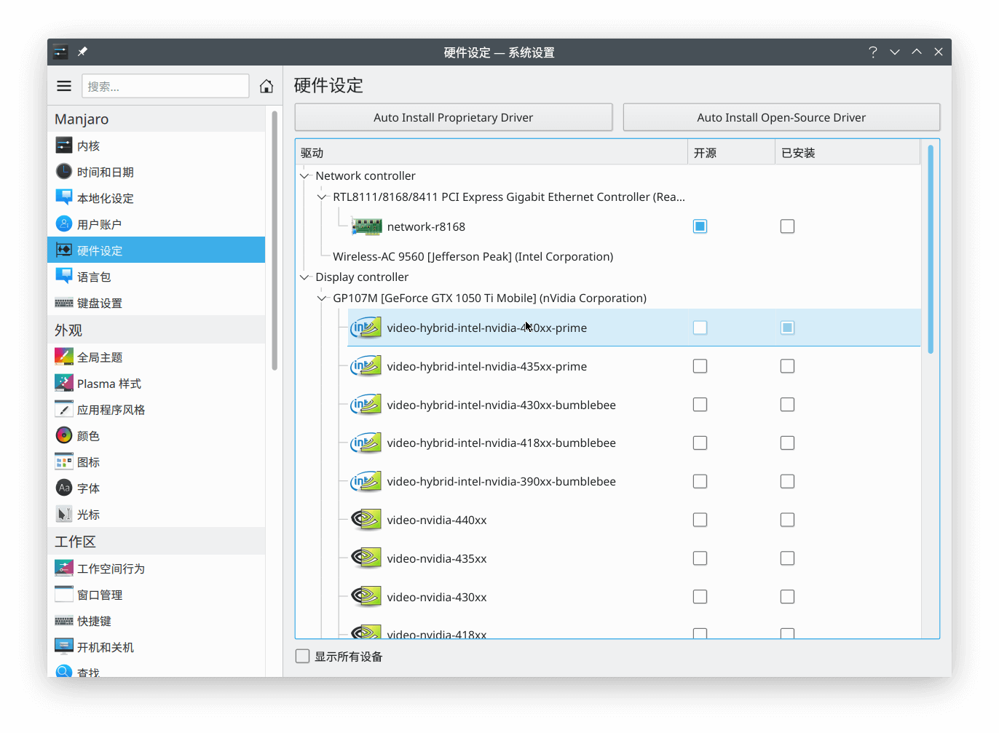
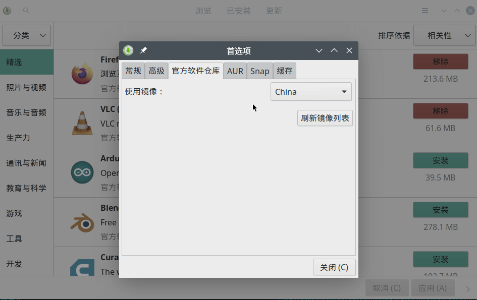
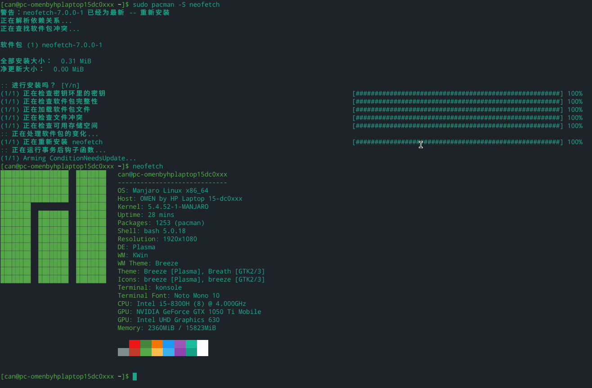
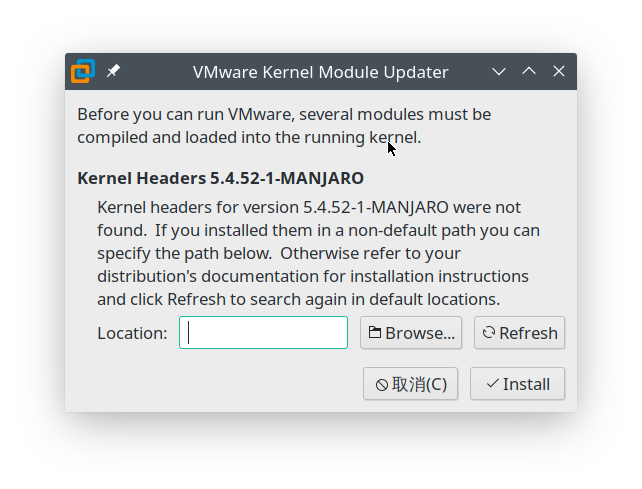

 

# Manjaro Linux (KDE) 入门记录

## 简介

Manjaro Linux 是一款基于 Arch Linux 的发行版。

KDE 是一款桌面环境，操作与 Windows 类似，强大好用 :)

## 安装

首先进入PE，使用 Dism++ 备份原来的 Windows 系统。

去[官网](https://manjaro.org/download/)下载最新版本（[manjaro-kde-20.0.3-200606-linux56.iso](https://osdn.net/projects/manjaro/storage/kde/20.0.3/manjaro-kde-20.0.3-200606-linux56.iso)）后，使用 rufus 刷入 U 盘，然后启动系统，让其直接抹掉固态硬盘安装。

安到最后报了一个错，好象是 `/boot/efi` 装不上去，折腾了半天也没有解决，于是我翻出了旧版（19.0.2）进行安装。

安装很顺利，重启后成功进入桌面。

由于我的笔记本是双显卡，没有安装驱动，因此在关机和盖上盖子时会死机。

在装好显卡驱动后，问题终于解决了：



## 日常环境配置

### 软件源

在大陆，配置软件源是十分必要的，否则几乎无法下载。

在“软件更新”中，点击菜单-首选项，将官方软件库的使用镜像改成 China，然后刷新镜像列表。



### pacman 包管理器

由之前没怎么用过 Arch，所以对 pacman 完全不熟悉，去[官方文档](https://wiki.archlinux.org/index.php/pacman#Removing_packages)看了一下基本操作，感觉非常简单，安装速度比 apt 快多了！

立即装了个 neofetch 试试手：

```sh
sudo pacman -S neofetch
```



还找到了一个一键更新所有软件包的命令：`pacman -Syu`，运行后十分顺利，甚至把 Linux 内核更新了，重启也没有多大问题。不过我觉得没事最好不要去尝试这个命令，可能会把系统更新坏。

### 文泉驿字体

```
sudo pacman -S wqy-microhei wqy-bitmapfont wqy-zenhei
```

### 安装输入法（fcitx）

fcitx 是一款输入法框架。

```sh
sudo pacman -S fcitx

# KDE 输入法设置界面
sudo pacman -S kcm-fcitx
```

如果出现安装失败的情况，把系统软件包更新到最新。更多使用方法参考[官方文档](https://wiki.archlinux.org/index.php/Fcitx)。fcitx 自带了几个输入法，虽然词库很少，但基本能用。

安装好还需要修改 `~/.pam_environment` 否则是没法输入的，按照下面的内容填写文件：

```
GTK_IM_MODULE=fcitx
QT_IM_MODULE=fcitx
XMODIFIERS=@im=fcitx
```

注销重新登录后生效，`ctrl+space` 是开启或关闭 fcitx 输入，`ctrl+shift` 是切换输入法。

个人推荐中州韵（[fcitx-rime](https://www.archlinux.org/packages/?name=fcitx-rime)）+小鹤双拼，具体配置可以参考这篇文章：[Rime 输入法配置记录](https://10101.io/2019/01/30/rime-configuration)

### 安装 VMware Workstation 虚拟机

到官网下载 Linux 二进制文件：[VMware-Workstation-Full-15.5.6-16341506.x86_64.bundle](https://download3.vmware.com/software/wkst/file/VMware-Workstation-Full-15.5.6-16341506.x86_64.bundle)

```sh
chmod +x *.bundle
./VMware-Workstation-Full-15.5.6-16341506.x86_64.bundle
```

- Q: Directory must be non-empty System service scripts directory (commonly /etc/init.d)
- A: sudo mkdir `/etc/init.d`

---



启动 VMware，如果出现这个窗口，则需要：`sudo pacman -S linux-headers`，选择对应的版本安装，比如我的是 `linux54-headers`。安装完成后重新打开 VMWare 就可以了。更多说明请查看 [Arch VMware 文档]([https://wiki.archlinux.org/index.php/VMware_(%E7%AE%80%E4%BD%93%E4%B8%AD%E6%96%87)](https://wiki.archlinux.org/index.php/VMware_(简体中文))

### 安装 VirtualBox 虚拟机

```sh
sudo pacman -S virtualbox
# 选择内核对应的版本安装

# 初次启动报错：Kernel driver not installed (rc=-1908)
sudo pacman -S linux-headers
sudo pacman -S virtualbox-host-dkms
sudo modprobe vboxdrv
```

