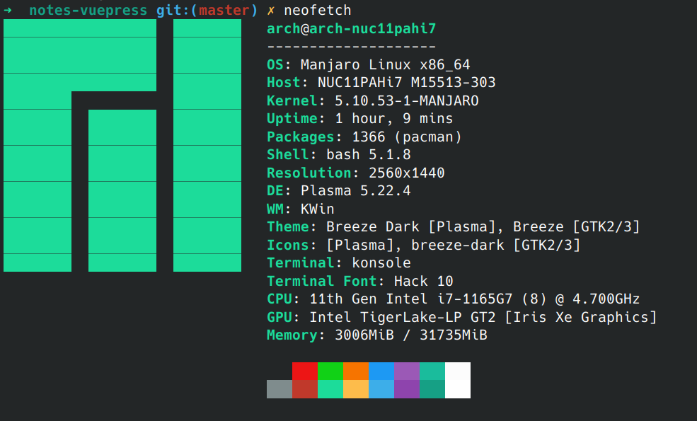
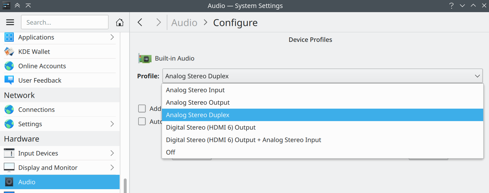

# NUC11 安装 ArchLinux 填坑

参考：

- [NUC11 简单开箱](https://blog.abyss.moe/posts/NUC11/)
- [Intel NUC](https://wiki.archlinux.org/title/Intel_NUC)

推荐安装 Manjaro Linux 可解决大部分驱动问题。



## 显示器或 VNC Server 屏幕闪烁

创建文件`sudo vim /etc/X11/xorg.conf.d/20-intel-graphics.conf`，粘贴以下内容：

```
Section "Device"
   Identifier  "Intel Graphics"
   Driver      "intel"
   Option      "TripleBuffer" "true"
   Option      "TearFree"     "true"
   Option      "DRI"          "false"
   Option      "NoAccel" "True"
   Option      "AccelMethod" "sna"
EndSection
```

在显示设置里，把合成器换成 `OpenGL 3.1` 可以防止登录界面闪屏。

重启生效。

## Audio plug

The [PulseAudio#Switch on connect](https://wiki.archlinux.org/title/PulseAudio#Switch_on_connect) module is buggy.

编辑 `sudo vim /etc/pulse/default.pa`，注释掉这一行：

```
#load-module module-switch-on-port-available
```

## 外接耳机不在音频设备列表中

创建文件 `sudo vim /etc/modprobe.d/alsa-base.conf` 添加以下内容：

```
options snd-hda-intel model=dell-headset-multi
```

重启生效。

