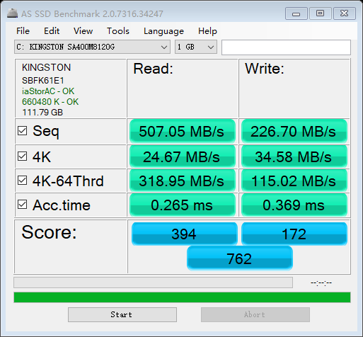
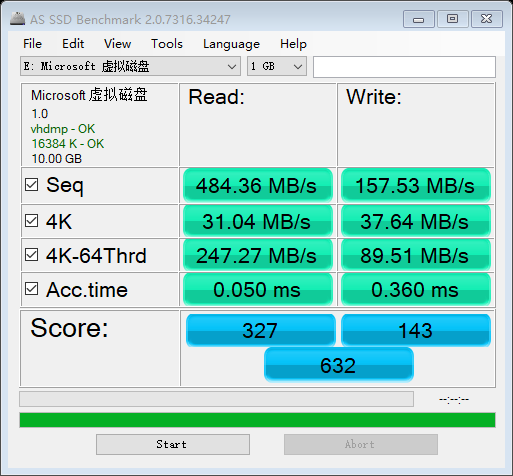
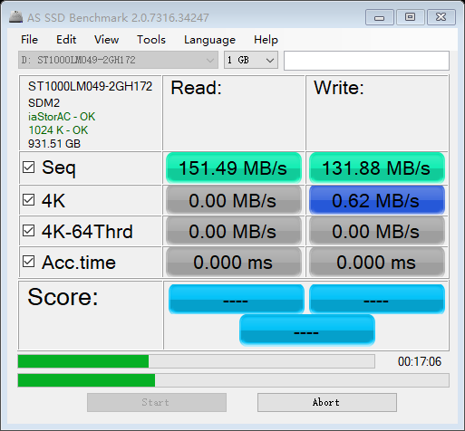

# 虚拟磁盘用于前端开发的尝试

考虑到现代前端开发使用 npm 会在 node_modules 中产生成千上万的小文件，这使得系统迁移变成了一项漫长的工作。而这恰好考验的是硬盘的 4KB 小文件读写能力，于是我想能不能通过创建虚拟磁盘的方式，在虚拟磁盘中完成项目开发，迁移的时候直接复制虚拟磁盘文件，从而解决这个问题。

首先我们来看看在固态硬盘下的 AS SSD Benchmak 跑分：

然后我通过 Windows 磁盘管理工具新建了一块 10GB 的虚拟磁盘（vhd），选的是动态扩展大小，再进行跑分：

第一次跑分：由于磁盘是动态分配的，AS SSD 写入 1GB 的数据需要事实扩展大小，所以速度不如第二次

第二次跑分才能体现真实成绩，可以看出虽然连续读写速度不如物理硬盘，但 4K 读写速度居然比物理硬盘要快！~~(微软NB)~~
 

后面我还用 VMware Workstation 创建、分区并挂载了 VMDK，可惜只能在资源管理器里看到，无论是 AS SSD 还是磁盘管理都无法识别，所以没能跑分。

结论：

- 前端开发过程中webpack一般都只是操作代码一类的 4KB 小文件，所以使用虚拟硬盘，理论上可以胜任。但是要注意数据丢失的可能性，所以最好通过 git 进行备份，永远不要只在本地保存代码。
- 使用 Linux 文件系统性能更高

另外，在机械硬盘跑分：

太慢了，跑了17分钟4K写入还没跑完👎
