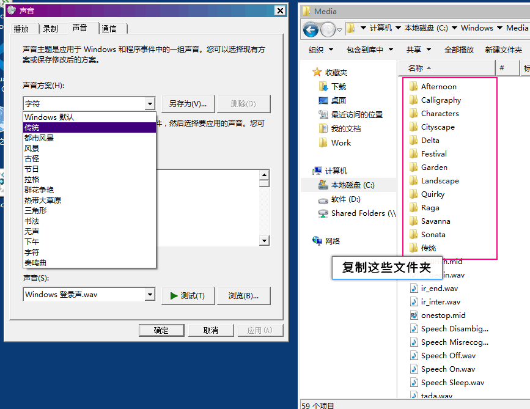
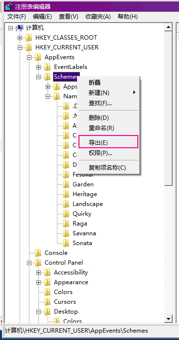
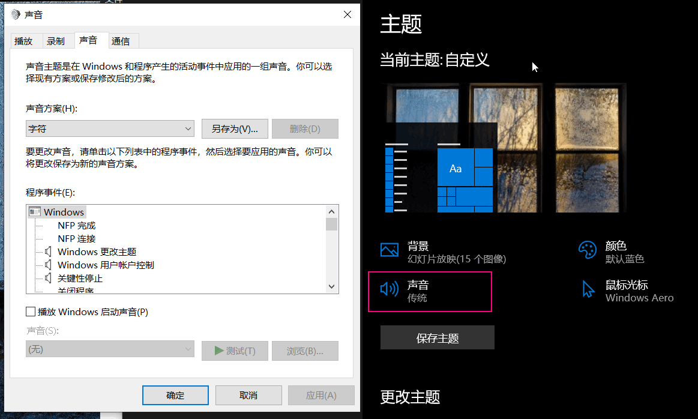

# 修改 Win10 声音主题为 Win7

> Win7 时代有很多自带的声音主题（Sound Scheme），但是到 Win8 以后就被砍了，并且替换为了冗长而且播放起来有延迟的音频文件，感觉很不爽。于是我打算恢复 Win7 的声音主题到 Win10（1909），理论上 Win8 也适用。

可以直接使用我打包好的资源：https://gitee.com/canwdev/static/blob/master/Windows7%20Sound%20Pack.zip

#### 复制 Win7 原版声音文件

声音文件的位置在：`C:\Windows\Media`，直接复制出这些文件到 Win10 的相同位置，如果想覆盖掉 Win10 的默认声音也可以全部复制（记得备份）。

#### 导出 Win7 注册表

在 Win7 系统中运行注册表编辑器（regedit），定位到 `计算机\HKEY_CURRENT_USER\AppEvents\Schemes` ，右键点击 `Schemes` 导出：

#### 导入到 Win10 的注册表

1. 备份：在 Win10 中定位到上述路径，也导出一份作为备份。
2. 导入：双击从 Win7 中导出的 `Win7-sound-scheme.reg` 文件，确认后即可应用声音主题。

