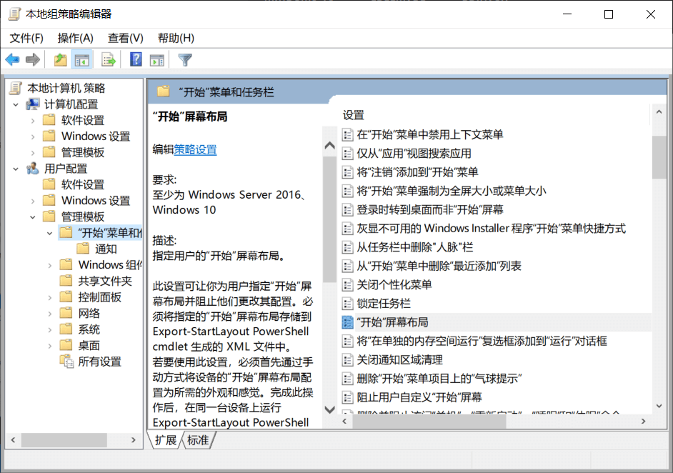
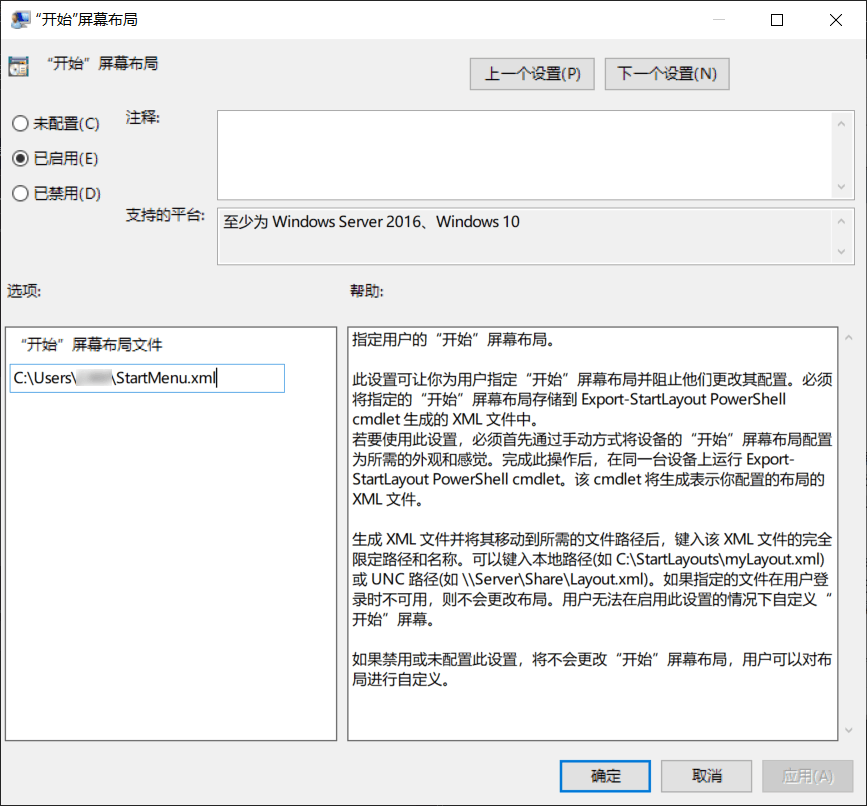

# Win10 开始菜单的备份与恢复

#### 导出到 xml 文件：

使用管理员权限打开 Powershell，执行下面命令：

```
Export-StartLayout -Path "C:\Users\XXX\StartMenu.xml"
```

#### 导入 xml 文件：

我这样做没有成功过，可以尝试用组策略的方法

```
Import-StartLayout -LayoutPath "C:\Users\XXX\StartMenu.xml" -MountPath "C:\"
```

#### 使用组策略指定 xml 文件

运行 `gpedit.msc` 跳转到 **User configuration** > **Administrative templates** > **Start menu and Taskbar**



编辑开始屏幕布局，点击已启用并指定文件路径



点击确定后，重启系统或 explorer 即可生效

用这种方式指定的开始菜单配置，是只读的，用户不可修改。但是当我再次设置成“未配置”，保存并重启就可以修改了，导入的开始菜单模板也不会丢失。

#### 参考：

- [Export-StartLayout](https://docs.microsoft.com/en-us/powershell/module/startlayout/export-startlayout?view=win10-ps)
- [Import-StartLayout](https://docs.microsoft.com/en-us/powershell/module/startlayout/import-startlayout?view=win10-ps)
- [How To Export And Import Start Menu Layout In Windows 10](https://www.intowindows.com/how-to-export-and-import-start-menu-layout-in-windows-10/)
