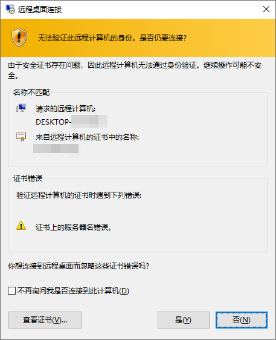
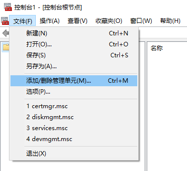
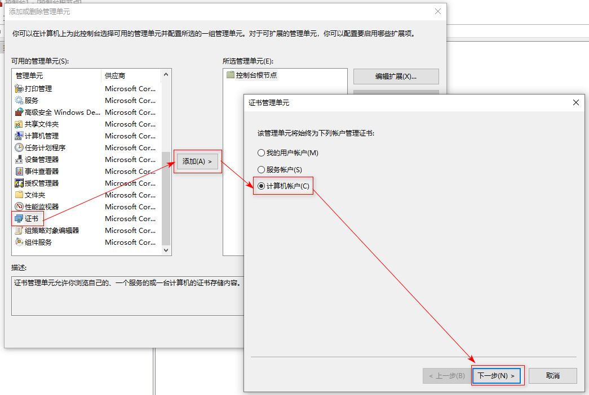
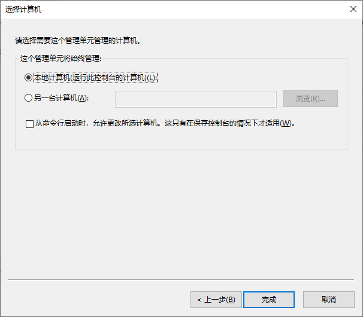
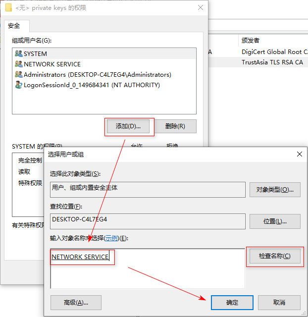
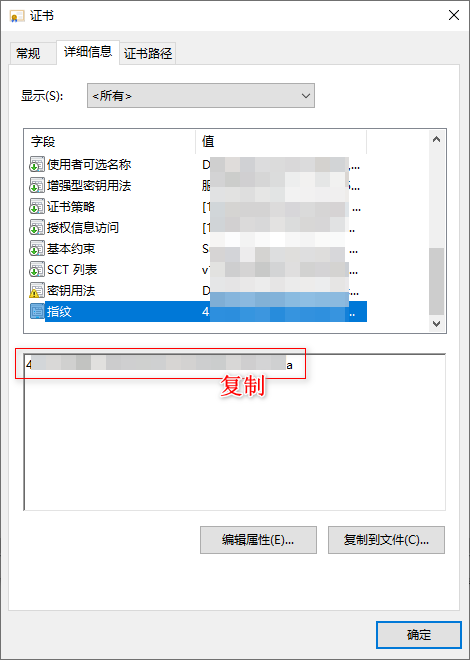
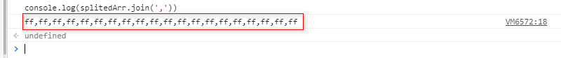
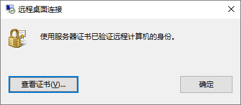

# 在远程桌面连接（RDP）服务中使用自定义证书加密

参考：

- [RDP（MSTSC）远程桌面程连接替换使用可信任的 SSL 证书来加密连接](https://vircloud.net/exp/rdp-ssl.html)
- [使用可信证书为windows RDP服务提供加密](https://ngx.hk/2017/01/05/%E4%BD%BF%E7%94%A8%E5%8F%AF%E4%BF%A1%E8%AF%81%E4%B9%A6%E4%B8%BAwindows-rdp%E6%9C%8D%E5%8A%A1%E6%8F%90%E4%BE%9B%E5%8A%A0%E5%AF%86.html)

### 0. 概述

如果不使用可信任证书，RDP 服务器会使用自己的证书，由于客户端没有这个证书，我们进行远程桌面连接的时候往往会看到这样的警告：



> 这在家里的局域网内没什么问题，但是如果服务器暴露在外网，则容易受到中间人攻击。

在远程桌面服务器上使用了可信任的证书（`.p12` 文件）加密后，可以使用该证书对 RDP 服务器进行更安全的加密通信。

> 注意：下列操作都是在RDP服务端进行的。TL;DR

### 1. 生成证书

参考：[免费 SSL 证书生成与配置](../manual/free-ssl.md)

### 2. 安装证书

1. Win+R 运行 `mmc`，打开控制台（这里不使用 `certmgr.msc`，因为它只能管理当前用户的证书，我们要操作系统证书）

2. 在【控制台根节点】点击**文件** -> **添加/删除管理单元** -> 在左侧 **可用的管理单元** 找到 **证书** 添加到右侧，选择**计算机账户** -> **本地计算机** -> 完成 -> 确定

   

   

   

3. 在 证书(本地计算机) -> 个人 -> 证书 -> 所有任务 -> 导入

4. 右击导入的证书，在**所有任务**中选择**管理私钥**，添加 `NETWORK SERVICE` 组的权限

   

5. 双击刚添加的证书，将指纹复制以便后续使用

   

### 3. 在注册表指定证书

我写了一段 js 用来快速分割指纹字符串，将下面 js 代码粘贴到 Chrome 控制台，替换 `fff...` 为上面步骤复制的指纹，回车，可以输出每两位用逗号隔开的 `SSLCertificateSHA1Hash`

```js
function splitStr(str, num=2) {
    var arr = str.split('')
    var result = []

    var temp = ''
    for (var i = 0; i < arr.length; i++) {
        temp += arr[i]
        if ((i + 1) % num === 0) {
            result.push(temp)
            temp = ''
        }
    }
    return result
}

var splitedArr = splitStr('ffffffffffffffffffffffffffffffffffffffff', 2)

console.log(splitedArr.join(','))
```



新建一个 `.reg` 注册表文件，粘贴以下内容，将 `ff,ff,...` 替换成控制台输出的结果，保存后双击执行即可导入注册表

```
Windows Registry Editor Version 5.00

[HKEY_LOCAL_MACHINE\SYSTEM\CurrentControlSet\Control\Terminal Server\WinStations\RDP-Tcp]
"SSLCertificateSHA1Hash"=hex:ff,ff,ff,ff,ff,ff,ff,ff,ff,ff,ff,ff,ff,ff,ff,ff,ff,ff,ff,ff
```

完成后，再次进行远程桌面的效果如图：



