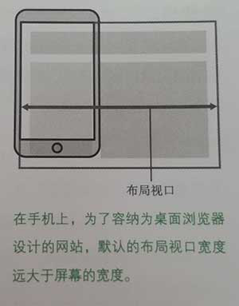
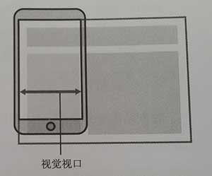

# 移动 Web 开发的几个概念

原文：https://blog.csdn.net/u013778905/article/details/78073566

## 像素

- 物理像素：设备的物理像素是指在设备屏幕上显示的最小的单元，也就是屏幕分辨率，比如iPhone 6的分辨率是 `750*1334 (px)`。每个物理像素可以根据操作系统设置自己的颜色和亮度。
- 独立像素：设备独立像素又称CSS像素，这是一个抽象的概念，是指Web编程中的逻辑像素。如iPhone 6的CSS像素是 `375*667 (px)`，可以看出来，这刚好是物理像素的一半。也就是说，如果我们在css代码中设置某个div的宽度为375px，在iPhone 6竖屏情况下，刚好能占满屏幕宽度。

## 像素密度（PPI）

每英寸像素（英语：Pixels Per Inch，缩写：PPI），又被称为像素密度，是一个表示打印图像或显示器单位面积上像素数量的指数。一般用来计量电脑显示器，电视机和手持电子设备屏幕的精细程度。通常情况下，每英寸像素值越高，屏幕能显示的图像也越精细。
有研究表明，人类肉眼能够分辨的最高像素点密度是300每英寸像素。超过300每英寸像素的屏幕被苹果公司称为Retina显示屏。

**屏幕PPI计算公式：** 
 要计算显示器的每英寸像素值，首先要确定屏幕的尺寸和分辨率。


- dp为屏幕对角线的分辨率 
- wp为屏幕横向分辨率 
- hp为屏幕纵向分辨率 
- di为屏幕对角线的长度(单位为英寸)

以屏幕尺寸为4吋的iPhone 5为例，分辨率为1136x640，像素密度为326PPI。而分辨率为1920x1080的家用21.5寸显示器，像素密度为103PPI。

## 设备像素比（DPR）

我们还可以通过设备像素比（dpr）来判断是不是Retina显示屏。

设备像素比(Device Pixel Ratio 简称：DPR)，是指物理像素和CSS像素的比例。

设备像素比（DPR） = 物理像素个数 / CSS像素个数 （计算公式，前提是缩放比为1）

对于一般的显示屏设备来说，DPR一般为1：1，但是在Retina屏幕设备中，DPR一般都是大于1：1的，以DPR为2的 iPhone 6 为例。

## 视口

### 布局视口（Layout Viewport）

在PC浏览器中，视口只有一个，并且 视口的宽度 = 浏览器窗口的宽度。在移动端，视口和浏览器窗口将不再关联，布局视口要比浏览器窗口大的多。布局视口是移动端CSS布局的依据，即CSS布局会根据布局视口来计算。 

可以通过`document.documentElement.clientWidth`来获取宽度。



### 视觉视口（Visual Viewport）

用户正在看到网站的区域。 
 JS可以通过`window.innerWidth`来获取宽度。



### 理想视口（Ideal Viewport）

布局视口的宽度一般在 680~1024像素之间，这样可以使得PC网站在手机中不被压扁，但是这并不理想，因为手机更适合窄的网站，换句话说，布局视口并不是最理想的宽度。

我们可以通过设置Viewport的 `width=device-width` 就可以将 Layout Viewport 的宽度设置为 Ideal Viewport 的宽度，还有通过设置 `initial-scale=1.0` 也同样可以实现效果，因为缩放是以 Ideal Viewport 作为参考的。

```html
<meta name="viewport" content="width=device-width,initial-scale=1">
```

