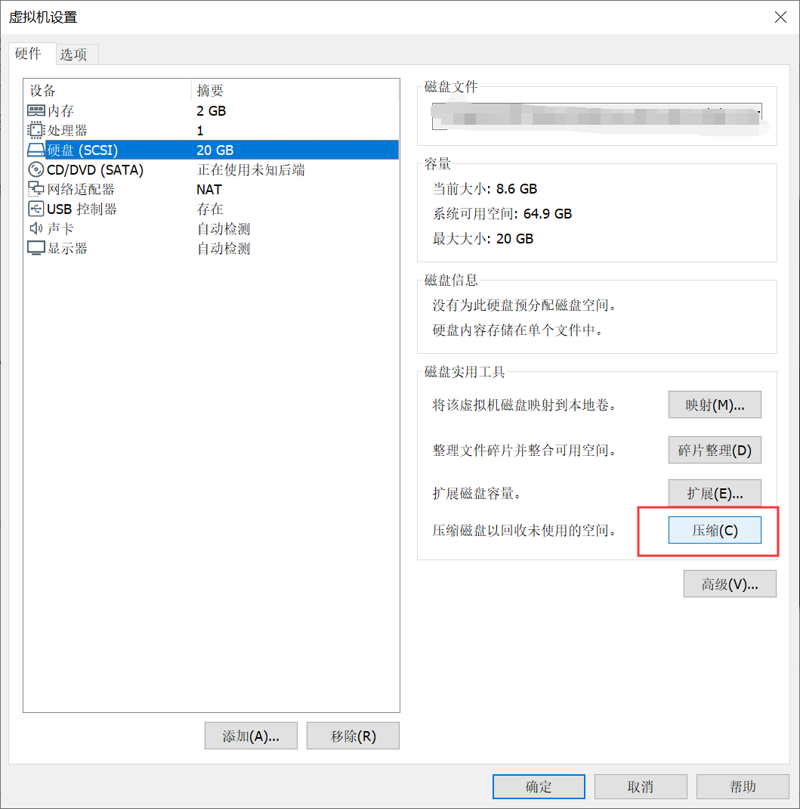

# 虚拟机

## VMWare 将多个vmdk文件合并为一个或者将一个vmdk文件拆分为多个

**vmware-vdiskmanager.exe** 的位置在：`C:\Program Files (x86)\VMware\VMware Workstation\vmware-vdiskmanager.exe`

执行合并功能：`vmware-vdiskmanager -r <原文件路径(含文件名)> -t 0 <合并后文件路径(含文件名)>`

```
vmware-vdiskmanager.exe -r "D:\VM\VMW7\Windows 7.vmdk" -t 0 "D:\VM\Win7-single.vmdk"
```

执行拆分功能：`vmware-vdiskmanager -r <原文件路径(含文件名)> -t 1 <分割后文件路径(含文件名)>`

```
vmware-vdiskmanager -r G:\ubuntu\Ubuntu.vmdk -t 1 G:\ubuntu\ubuntu2.vmdk
```


## [vmware压缩vmdk文件大小](https://www.cnblogs.com/kagari/p/12010147.html)             

在搭建靶机环境的过程中总是遇见vmdk越来越大，导致上传时间变长。记一下压缩vmdk的方法

### linux

```
apt-get clean

cat /dev/zero > zero.fill;sync;sleep 1;sync;rm -f zero.fill

/usr/bin/vmware-toolbox-cmd disk shrinkonly
```

至于原理，第一句是将硬盘空余地方全部填0，第二句是vmware的工具。

如果提示：`shrink disk is disabled for this virtual machine`，有两种可能：

- 磁盘是固定分配大小的，这样的话不能收缩
- 当前磁盘存在快照，删除快照后就再试

### windows

第一种：右键我的电脑->管理->存储->磁盘管理->右键任意磁盘->压缩卷->压缩

第二种：vmware安装目录下，vmware-vdiskmanager.exe -k vmdk路径

```
D:\VMware>vmware-vdiskmanager.exe -k  C:\Users\windows\Desktop\xxxx-disk1.vmdk
```

第三种：



### mac下 

常规->清理虚拟机

# VMware Workstation 与 Device/Credential Guard 不兼容。在禁用 Device/Credential Guard 后，可以运行 VMware Workstation。

这往往是因为开启了 Hype-V 功能导致的，先关闭 Hyper-V，然后在命令行以管理员身份执行：`bcdedit /set hypervisorlaunchtype off`，重启电脑。
