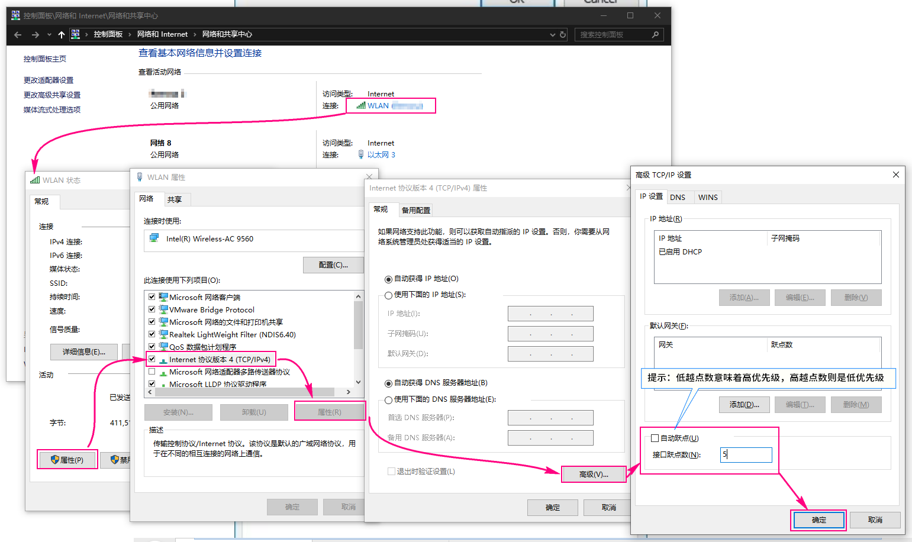

# Windows 双网卡(WLAN & LAN)选择优先级高的上网

## 推荐使用更简单的方式：直接通过控制面板设置

https://www.windowscentral.com/how-change-priority-order-network-adapters-windows-10

> Quick Tip: The lower the metric number means higher priority, and a higher number indicates lower priority.

## 其他方法

1. 管理员模式CMD
2. 路由表解释
    `route print -4`
3. 删除默认设置
    `route delete 0.0.0.0`
4. 外网路由，全走无线，192.168.0.1为无线网关
    `route add 0.0.0.0 mask 0.0.0.0 192.168.0.1 –p`
5. 内网路由，全走有线，192.168.12.1为有线网关
    `route add 192.168.0.0 mask 255.255.0.0 192.168.12.1 –p`

## emmm...

直接执行`route delete 0.0.0.0`删除默认路由，然后重新插拔网线即可，但这样似乎不稳定。
