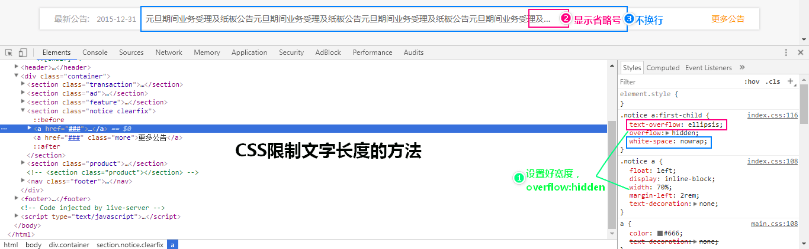
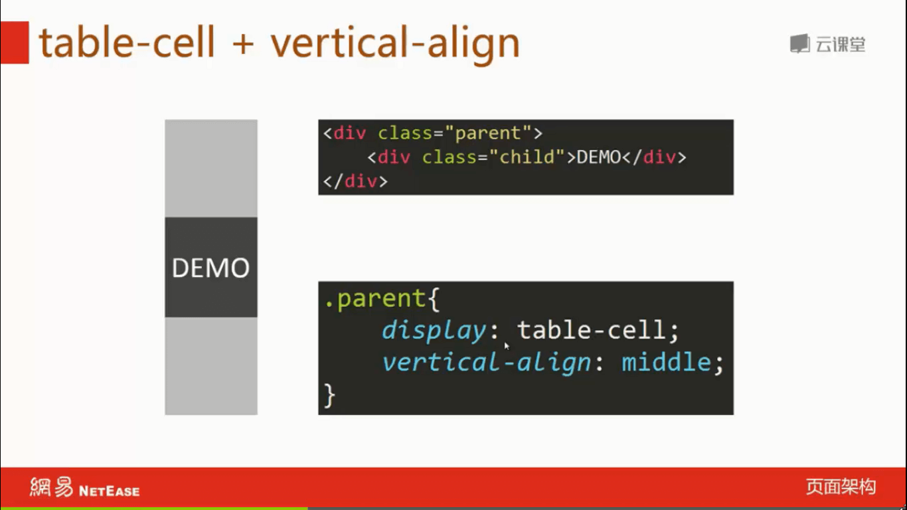

# CSS 基础用法收集

## HTML5

```html
<!DOCTYPE html>
<html lang="en">
<head>
  <meta charset="UTF-8">
  <meta name="viewport" content="width=device-width, initial-scale=1.0">
  <meta http-equiv="X-UA-Compatible" content="ie=edge">
  <title>Document</title>
</head>
<body>
  
</body>
</html>
```

## 外部调用CSS的写法

```html
<link rel="stylesheet" type="text/css" href="style.css"/>

<!-- 一种标准的写法 -->
<link rel="stylesheet" href="style.css">
```


## 告诉IE浏览器使用最新的IE内核渲染页面

```html
<meta http-equiv="X-UA-Compatible" content="IE=EDGE">
```

## 适应移动设备以及允许缩放

```html
<meta name="viewport" content="width=device-width, initial-scale=1, maximum-scale=2, user-scalable=yes">
```

## 在CSS中引入外部CSS

```css
@import url("animate.css");
```

## 点击穿透

```css
.demo {
    pointer-events: none;
}
```

## 内部边框（怪异盒模型）

```css
.contact_banner {
    border: 42px solid #ff674d;
    box-sizing: border-box;
    -moz-box-sizing: border-box;
    -webkit-box-sizing: border-box;
}
```

## checkbox勾选后文字变色选择器

```css
.time_con ul li input[type=checkbox]:checked+.cb-label{
    background: #f58612;
}
.time_con ul li input[type=checkbox]:checked+.cb-label+.time_info{
    color: #f58612;
}
```

## 偶数显示背景色

```css
.news-list:nth-of-type(even) {
    background-color: #fafafa;
}
```

## 大写字母

```css
h1 {text-transform:uppercase}
h2 {text-transform:capitalize}
p {text-transform:lowercase}
```

## 自然段缩进2个空格

```css
.demo {
    text-indent:2em;
}
```

## CSS在前面和后面追加内容

```css
#xn_n_18_navHome>a:before {
    content:'HOME';
}

p:after {
    content:"台词：";
}
```

## 限制文字长度，多的字显示“...”



```css
.xn_c_34_lbenname {
    overflow: hidden;
    text-overflow: ellipsis;
    white-space: nowrap;
    max-width: 470px;
}
```

## input 选中（:focus）边框

```css
.demo {
    outline-color: rgb(77, 144, 254);
}

.con3input:focus,.con3texta:focus {
    border-color: #FFEB3B;
    outline-color: #FFEB3B;
}
::-webkit-input-placeholder { /* WebKit browsers */
    color: #ffffff;
}
:-moz-placeholder { /* Mozilla Firefox 4 to 18 */
    color: #ffffff;
}
::-moz-placeholder { /* Mozilla Firefox 19+ */
    color: #ffffff;
}
:-ms-input-placeholder { /* Internet Explorer 10+ */
    color: #ffffff;
}
```

## textarea 固定大小

`resize: none;`

## 点击按钮不提交刷新页面

`<button type="button">提交</button>`

## 使元素变大

```css
transform: scale(2.0);
```

## 禁止鼠标选择

```css
.article-holder.unable-reprint {
    user-select: none;
    -webkit-user-select: none;
}
```

## CSS实现水平居中


## CSS实现垂直居中




## CSS居中


## CSS3 img 元素自适应

```css
img {
    height: 100%;
    width: 100%;
    object-fit: contain;
}
```

## webkit 移动设备点击时的覆盖颜色

```css
a:active {
    -webkit-tap-highlight-color: rgba(255, 166, 0, 0.555);
}
```

## 鼠标选择文字的背景色

```css
::selection {
    background-color: rgba(255, 166, 0, 0.555);
    text-shadow: none;
}
```

## IE浏览器"兼容"代码

```html
<head>
    <!--[if lt IE 9]>
      <script src="http://cdn.bootcss.com/html5shiv/3.7.2/html5shiv.min.js"></script>
      <script src="http://cdn.bootcss.com/respond.js/1.4.2/respond.min.js"></script>
    <![endif]-->
    <!--[if lt IE 9]>
  <script>
    var tip = '建议升级您的浏览器（如 Chrome, Firefox）以获得更好的体验！',
        url = 'http://browsehappy.com';
    document.execCommand('stop');
    alert(tip);
    window.location.href = url;
  </script>
<![endif]-->
</head>
<body>
    <!--[if lte IE8]>
        <p class="update-browser">您使用的浏览器版本较低，可能存在严重的安全隐患或导致页面显示异常，建议<a href="http://browsehappy.osfipin.com/" target="_blank">立即升级</a>浏览器。
        </p>
    <![endif]-->
</body>
```

## 媒体查询

```css
@media only screen and (max-width: 800px) {
/* 最大屏幕限制：800px，小于该分辨率的使用此样式 */
}
@media only screen and (min-width: 481px) and (max-width: 800px) {
/* 屏幕宽度在：481~800px之间 */
}
@media only screen and (max-width: 480px) {
/* 最大屏幕限制：480px，小于该分辨率的使用此样式 */
}
```

## rem/em 单位


## .clearfix 清除浮动

清除浮动主要有两种实现方式，一种是`overflow:hidden`，但最好的方式还是使用下面这种，这也是 Bootstrap 使用的方法：

```css
.clearfix::before,
.clearfix::after {
    content: " ";
    display: table;
}

.clearfix::after {
    clear: both;
}
``` 

## 去除input账号密码自动填充的黄色背景

```css
input:-webkit-autofill {
    -webkit-box-shadow: 0 0 0px 1000px #ffffff inset !important;
    -webkit-text-fill-color: #313a69 !important;
}
```

## 移除 input [type=number]小箭头

```css
input::-webkit-outer-spin-button,
input::-webkit-inner-spin-button {
  -webkit-appearance: none;
}
```
