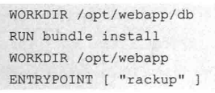

# Docker 学习笔记

> 《第一本 Docker 书》的读书笔记。


链接：

-  [书中源码](https://github.com/turnbullpress/dockerbook-code)

-  [learn-docker 学习项目](https://gitee.com/canwdev/learn-docker)

-  [docker-server 实用化项目](https://gitee.com/canwdev/docker-server)

## Docker 基础

### 在 Ubuntu 安装 Docker

参考文档：https://docs.docker.com/engine/install/ubuntu/

下面是[华为开源镜像站](https://mirrors.huaweicloud.com/)的说明，国内推荐使用这种方式安装。

1、若您安装过docker，需要先删掉，之后再安装依赖:

```sh
sudo apt-get remove docker docker-engine docker.io
sudo apt-get install apt-transport-https ca-certificates curl gnupg2 software-properties-common
```

2、根据版本不同，运行公钥，添加软件仓库。您使用的发行版： Ubuntu

信任Docker的GPG公钥: `curl -fsSL https://mirrors.huaweicloud.com/docker-ce/linux/ubuntu/gpg | sudo apt-key add -`

对于amd64架构的计算机，添加软件仓库: `sudo add-apt-repository "deb [arch=amd64] https://mirrors.huaweicloud.com/docker-ce/linux/ubuntu $(lsb_release -cs) stable"`

对于树莓派或其它ARM架构计算机，请运行: `echo "deb [arch=armhf] https://mirrors.huaweicloud.com/docker-ce/linux/ubuntu $(lsb_release -cs) stable" | sudo tee /etc/apt/sources.list.d/docker.list`

3、更新索引文件并安装

```
sudo apt-get update
sudo apt-get install docker-ce
```

---

或者可以参考清华TUNA镜像源说明：https://mirrors.tuna.tsinghua.edu.cn/help/docker-ce/

Debian/Ubuntu 用户

以下内容根据 [官方文档](https://docs.docker.com/engine/installation/linux/docker-ce/debian/) 修改而来。

如果你过去安装过 docker，先删掉:

```
sudo apt-get remove docker docker-engine docker.io
```

首先安装依赖:

```
sudo apt-get install apt-transport-https ca-certificates curl gnupg2 software-properties-common
```

根据你的发行版，下面的内容有所不同。（Ubuntu）

信任 Docker 的 GPG 公钥:

```
curl -fsSL https://download.docker.com/linux/ubuntu/gpg | sudo apt-key add -
```

对于 amd64 架构的计算机，添加软件仓库:

```
sudo add-apt-repository \
   "deb [arch=amd64] https://mirrors.tuna.tsinghua.edu.cn/docker-ce/linux/ubuntu \
   $(lsb_release -cs) \
   stable"
```

如果你是树莓派或其它ARM架构计算机，请运行:

```
echo "deb [arch=armhf] https://mirrors.tuna.tsinghua.edu.cn/docker-ce/linux/ubuntu \
     $(lsb_release -cs) stable" | \
    sudo tee /etc/apt/sources.list.d/docker.list
```

最后安装

```
sudo apt-get update
sudo apt-get install docker-ce
```


### 确保 Docker 已准备就绪

docker 的全部操作都要在 root 下进行。

```
## docker info
```

如果没有报错，则你的 Docker 安装成功了。

### 运行我们的第一个容器

```sh
docker run -i -t ubuntu /bin/bash
```

第一次运行，没有ubuntu镜像，将会从 DockerHub 下载（如果下载失败请看[【**Docker Hub** **镜像配置**】](#docker-hub-镜像配置)），完成后会自动 **附着** 到该容器里。

在容器环境里，运行 ps -aux 可以查看容器容器中运行的全部进程，当 /bin/bash 退出之后，容器也就停止运行。

 

在容器里可以安装软件，因为网络问题，同样也需要设置镜像。然而，并没有装 vi/vim 所以没法修改 `/etc/apt/sources.list` ψ(｀∇´)ψ 所以，到网上查了一会儿，找到了可以用 cat 配合 echo 写入文件的技巧：

```
root@0b38badb7130:~# cat > test.txt << EOF
> hello
> world!!
> EOF
root@0b38badb7130:~# ls
test.txt
root@0b38badb7130:~# cat test.txt
hello
world!!

```

利用这种方法，可以轻松写入 sources.list。

在看镜像站的时候，发现了一种更好的方式，直接替换，非常好用：

```sh
sed -i "s@http://.*archive.ubuntu.com@http://mirrors.huaweicloud.com@g" /etc/apt/sources.list
sed -i "s@http://.*security.ubuntu.com@http://mirrors.huaweicloud.com@g" /etc/apt/sources.list
```

 

安装了一个 screenfetch（`sudo apt install screenfetch`）：


一旦输入 exit 命令退出容器，容器就会停止运行，其中的数据不会被删除，可以通过 `docker ps -a` 查看所有的镜像

 

 

### 容器命名

包含以下字符：小写字母a、z、大写字母A-z、数字0、9、下划线、圆点、横线（如果用正则表达式来表示这些符号，就是 `[a-zA-Z0-9_.-]`，可以用容器命名代替容器id，因此容器命名必须是唯一的

- 启动新的时命名：`docker --name bob_the_container run -i -t ubuntu /bin/bash`

- 重命名：`docker rename 3d0746cf585e bob_the_container`

- 查看最后运行的镜像：`docker ps -l`

- 删除镜像：`docker rm 3d0746cf585e`

- 启动镜像：`docker start bob_the_container`（重启则是 restart）

### 附着到容器上

使用这条命令可以附着到运行中的容器上：`docker attach bob_the_container`

### 创建守护式容器

上面所创建的容器都是交互式运行的容器，也可以创建长期运行的容器，叫做守护式容器，没有交互式会话，非常适合运行应用程序和服务。

```
docker run --name daemon_dave -d ubuntu /bin/sh -c "while true; do echo hello world; sleep 1; done"
```

这段代码创建一个守护式容器，作用是每隔一秒输出一句 hello world。


### 查看容器内部的日志

使用 `docker logs -ft daemon_dave` 查看容器的日志输出，其中 **f** 是 follow 即实时输出（和 tail -f 类似），t 是时间戳。

### 查看容器内的进程

```
docker top daemon_dave
```

 

### 在容器内部运行进程（进入容器内部的shell）

打开shell交互式任务：

```
sudo docker exec -t -i daemon_dave /bin/bash
```

> -t -i 标志为我们的进程创建了可交互的 TTY

执行一条命令，创建一个空文件：

```
docker exec -d daemon_dave touch /etc/new_config_file
```

> -d 表示要运行一个后台进程


::: tip
**注意**：exec命令只能在运行中的容器中执行（容器停止后不能使用exec进入容器），如果容器始终无法启动（比如配置有误），可使用 `docker run -it --name <容器名> <镜像名> sh` 的方法进入容器调试。
:::


### 自动重启容器

添加 --restart 标志，在服务器启动时让docker自动启动容器。

```
docker run --restart=always --name daemon_dave -d ubuntu /bin/sh -c "while true; do echo hello world; sleep 1; done"
```

`--restart=on-faliure:5` 意思是只在容器退出代码为非0时才会自动重启，最多重启5次

要修改一个已经启动的容器，使用命令：`docker update --restart=always my-container`

要关闭自动启动，使用 `--restart=no` 选项。

### 深入容器

使用 `docker inspect daemon_dave` 命令，可以输出大量容器信息。

也可以添加 --format 参数以显示指定的信息：

```sh
docker inspect --format='{{ .State.Running }}' daemon_dave
```

--format 非常强大，其支持完整的 Go 语言模板

 

### 删除容器

不仅可以使用 `docker rm daemon_dave` 来删除容器，还可以用这条命令来删除所有容器：

```sh
## 删除所有容器（危）
docker rm `docker ps -a -q`

## 删除异常停止的容器（慎用）
docker rm `docker ps -a | grep Exited | awk '{print $1}'`
```

## Docker Hub 镜像配置

国内要设置 Docker Hub 的镜像源，否则可能下载失败。

编辑 /etc/docker/daemon.json 文件（不存在则新建），内容如下：

```
{
    "registry-mirrors": ["https://hub-mirror.c.163.com/"]
}
```

然后重启 docker 服务：

```
sudo systemctl daemon-reload
sudo systemctl restart docker  
```

命令行执行 docker info，如果从结果中看到了如下内容，说明配置成功。


更多镜像列表：

| **镜像加速器**                                               | **镜像加速器地址**                      | 专属加速器       | 其它加速                                                     |
| ------------------------------------------------------------ | --------------------------------------- | ---------------- | ------------------------------------------------------------ |
| [Docker 中国官方镜像](https://docker-cn.com/registry-mirror) | https://registry.docker-cn.com          |                  | Docker Hub                                                   |
| [DaoCloud 镜像站](https://daocloud.io/mirror)                | http://f1361db2.m.daocloud.io           | 可登录，系统分配 | Docker Hub                                                   |
| [Azure   中国镜像](https://github.com/Azure/container-service-for-azure-china/blob/master/aks/README.md#22-container-registry-proxy) | https://dockerhub.azk8s.cn              |                  | Docker Hub、GCR、Quay                                        |
| [科大镜像站](https://mirrors.ustc.edu.cn/help/dockerhub.html) | https://docker.mirrors.ustc.edu.cn      |                  | Docker Hub、[GCR](https://github.com/ustclug/mirrorrequest/issues/91)、[Quay](https://github.com/ustclug/mirrorrequest/issues/135) |
| [阿里云](https://cr.console.aliyun.com)                      | https://<your_code>.mirror.aliyuncs.com | 需登录，系统分配 | Docker Hub                                                   |
| [七牛云](https://kirk-enterprise.github.io/hub-docs/#/user-guide/mirror) | https://reg-mirror.qiniu.com            |                  | Docker Hub、GCR、Quay                                        |
| [网易云](https://c.163yun.com/hub)                           | https://hub-mirror.c.163.com            |                  | Docker Hub                                                   |
| [腾讯云](https://cloud.tencent.com/document/product/457/9113) | https://mirror.ccs.tencentyun.com       |                  | Docker Hub                                                   |

## 使用 Docker 镜像和仓库

 

### 什么是 Docker 镜像

docker 镜像是分层的，利用了写时复制机制，上面的层不会影响下面的层。


### 列出镜像

使用 `docker images` 列出本地的 Docker 镜像（使用 docker ps 列出容器）


DockerHub：https://hub.docker.com/search?q=&type=image

相同镜像用不同的 tag 来区分版本，如果需要安装指定的 tag，可以在仓库名后面加上一个冒号和标签名来指定：

```
docker run -t -i --name new_container ubuntu:12.04 /bin/bash
```


### 拉取镜像

如果本地宿主机上没有镜像，Docker 会自动从 Docker Hub 下载，如果想手动拉取，可以使用 pull 命令：

```
docker pull fedora
```

### 查找镜像

使用 `docker search` 命令来查找所有公开的镜像：


然后运行 `docker run -i -t node /bin/bash` 就可以启动该镜像

### 构建镜像

要构建自己的镜像，首先要注册一个 [Docker Hub](https://hub.docker.com/) 账号，我的账号名是 canwdev

 

### 用 commit 命令创建镜像

我们使用之前创建的镜像，名为 bob_the_container。和 git 很像，使用 commit 命令来提交修改：

```
docker commit bob_the_container canwdev/screenfetch
```

 

查看刚刚创建的镜像：

```
docker images canwdev/screenfetch
```


可以使用更复杂的命令：

```
docker commit -m="A new custom image" --author="canwdev" bob_the_container canwdev/screenfetch:test1
```

- `-m="A new custom image"` 提交说明
- `--author="canwdev"` 作者
- `:test1` 标签

运行容器：`docker run -t -i canwdev/screenfetch:test1 /bin/bash`


### 用 Dockerfile 构建镜像

并不推荐使用 docker commit 的方式构建镜像，推荐使用 Dockerfile。

创建一个 Dockerfile（空文件）：

```
root@mint-virtual-machine:/home/mint# mkdir static_web
root@mint-virtual-machine:/home/mint# cd static_web/
root@mint-virtual-machine:/home/mint/static_web# touch Dockerfile
```

推荐使用VSCode Remote + Docker 插件来完成编辑：


在文件中写入以下代码：

```
## Version: 0.0.1
FROM ubuntu:14.04
LABEL maintainer="canwdev"
RUN sed -i "s@http://.*archive.ubuntu.com@http://mirrors.huaweicloud.com@g" /etc/apt/sources.list
RUN sed -i "s@http://.*security.ubuntu.com@http://mirrors.huaweicloud.com@g" /etc/apt/sources.list
RUN apt-get update
RUN apt-get install -y nginx
RUN echo 'Hi, I am in your container' \
    >/usr/share/nginx/html/index.html
EXPOSE 80
```

当然，也可以使用阿里云镜像：`sudo sed -i 's/archive.ubuntu.com/mirrors.aliyun.com/g' /etc/apt/sources.list`

### 基于 Dockerfile 构建新镜像

```
cd static_web/
docker build -t="canwdev/static_web:v1" .
```


构建成功！

### 构建指令失败了会怎么样


此时，可以使用 `docker ps -a` 配合 `docker run -t -i c6c2d0078e38 /bin/bash` 进入到容器内部进行调试，该容器的状态是这次构建到目前为止已经成功的最后一步。

 

如果上次有构建，则会存在构建缓存。如果不想要这个缓存，可以使用 --no-cache 命令在构建时关闭缓存：

```
docker build --no-cache -t="canwdev/static_web" .
```

更新构建缓存的另一种方式：


通过 ENV 设置一个环境变量，如果想刷新一个构建，秩序修改 REFRESHED_AT 环境变量的日期即可。

### 查看新镜像

使用 docker images：


使用 docker history 可以看到构建镜像的每一层和指令：


### 从新镜像启动容器

```
docker run -d -p 80 --name static_web canwdev/static_web nginx -g "daemon off;"
```


使用 docker port 查看端口映射情况：


更实用的端口绑定方式，将容器80端口映射到宿主机指定端口（8080）：

```
docker run -d -p 8080:80 --name static_web canwdev/static_web nginx -g "daemon off;"
```


### Dockerfile 指令

**CMD** 命令指定一贯容器启动时要运行的命令，**ENTRYPOINT** 命令和它相似。

写法如下，每个 Dockerfile 中只能指定一条 CMD 指令：

```
CMD ["/bin/bash", "-l"]
CMD ["./frps","-c","./frps.ini"]
```

```
ENTRYPOINT ["/usr/sbin/nginx", "-g", "daemon off;"]
```

CMD 和 ENTRYPOINT 的区别是：CMD 命令会被 docker run 后面追加的命令覆盖，而 ENTRYPOINT 不会。

**WORKDIR** 指令用来在从镜像创建一个新容器时，在容器内部设置一个工作目录，ENTRYPOINT 和/或 CMD 指定的程序会在这个目录下执行。



**ENV** 用来在镜像构建过程中设定环境变量。

```
ENV RVM_PATH /home/rvm
```

**USER** 指令用来指定该镜像会以什么样的用户去运行，如果怕不设定，默认用户为 root。

```
USER nginx
```


**ADD** 指令用来将构建环境下的文件和目录复制到镜像中，对于归档文件（tar.gz）可以自动解压。

```
ENV FRP_NAME frp_0.33.0_linux_amd64
ADD ${FRP_NAME}.tar.gz /frp/
```

**COPY** 指令非常类似于ADD，它们根本的不同是COPY只关心在构建上下文中复制本地文件，而不会去做文件提取（extraction）和解压（decompression）的工作。

```
ADD software.lic /opt/application/software.lic
ADD http://wordpress.org/latest.zip /root/wordpress.zip
## 这条会自动解压：
ADD latest.tar.gz /var/www/wordpress/
COPY conf.d/ /etc/apache2/
```

对于不存在的文件夹，会自动创建（类似于 mkdir -p）。

**ONBUILD** 指令会紧跟FROM之后执行。ONPUILD指令能为镜像添加触发器(tngger)。当一个镜像被用做其他镜像的基础镜像时（比如你的镜像需要从某未准各好的位置添加源代码，或者你需要执行特定于构建镜像的环境的构建脚本），该镜像中的触发器将会被执行。

触发器可以是任何构建指令：


### 将镜像推送到 DockerHub

```
docker push canwdev/static_web
```


可以看到上传镜像到 DockerHub 还是很慢的，所以在国内建议自己搭建 Docker Registry。

发布成功：


### 删除镜像

使用 `docker rmi` 来删除镜像：`docker rmi canwdev/screenfetch`

和 `docker rm` 用法相似，区别是 rm 是删除容器而 rmi 是删除镜像。

删除名称或标签为`<none>`的镜像：

```sh
docker rmi -f `docker images | grep '<none>' | awk '{print $3}'`
```

## 在测试中使用Docker

### 使用Docker测试静态网站

项目代码：https://gitee.com/canwdev/learn-docker/tree/master/nginx-web

 nginx-web项目结构如下：


构建镜像：`docker build -t canwdev/nginx .`

 

### 从nginx-web项目和nginx镜像构建容器

```
docker run -d -p 80 --name nginx_web -v $PWD/website:/var/www/html/website canwdev/nginx nginx
```


也可以在“容器内路径”后加上 `:ro` 表示挂载的目录是只读的。

在宿主机打开对应端口的网页，效果如下：


### * 从Docker安装 Gitea

我们在 Docker Hub 的 Gitea 组织中提供了自动更新的 Docker 镜像，它会保持最新的稳定版。你也可以用其它 Docker 服务来更新。首先你需要pull镜像：

```
docker pull gitea/gitea:latest
```

如果要将git和其它数据持久化，你需要创建一个目录来作为数据存储的地方：

```
sudo mkdir -p /var/lib/gitea
```

然后就可以运行 docker 容器了，这很简单。 当然你需要定义端口数数据目录：

```
docker run -d --name=gitea -p 10022:22 -p 10080:3000 -v /var/lib/gitea:/data gitea/gitea:latest
```

然后 容器已经运行成功，在浏览器中访问 http://hostname:10080 就可以看到界面了。你可以尝试在上面创建项目，clone操作 `git clone ssh://git@hostname:10022/username/repo.git.`

注意：目前端口改为非3000时，需要修改配置文件 `LOCAL_ROOT_URL = http://localhost:3000/`。

### 构建Sinatra应用程序


到 https://gitee.com/canwdev/learn-docker/tree/master/sinatra/webapp 下载源代码然后cd到 learn-docker/ sinatra / webapp目录，运行 `docker build -t canwdev/sinatra .` 

费尽周折，终于跑起来了：`docker run -d -p 4567 --name sinatra_app -v $PWD:/opt/webapp canwdev/sinatra`

`-p 4567` 代表公开容器中的4567端口


查看最新日志：`docker logs -ft sinatra_app`

查看容器内的进程：`docker top sinatra_app`

查看容器内的4567端口被映射到宿主机的哪个端口：`docker port sinatra_app 4567`

用curl命令测试sinatra服务：`curl -i -H 'Accept: application/json' -d 'name=Foo&status=Bar' http://localhost:32771/json`


### 构建Redis镜像和容器

我们要扩展Sinatra程序，加入Redis后端数据库，并在数据库中存储涮涮的参数，因此需要利用Docker的特新来关联两个容器。


首先用Dockerfile构建Redis镜像：https://gitee.com/canwdev/learn-docker/tree/master/redis

启动容器：`docker run -d -p 6379 --name redis canwdev/redis`

查看映射到宿主机的端口，是32772。


在宿主机安装redis-tools来调试redis服务器：apt install -y redis-tools

测试连接：redis-cli -h 127.0.0.1 -p 32772


连接成功。

### 容器的网络接口

Docker会自动给宿主机创建一个新的网络接口，名为docker0，每个Docker容器都会在这个接口上分配一个IP地址，在宿主机使用 `ip a show docker0` 查看该接口。


要进入容器的终端可以使用：`docker exec -t -i redis /bin/bash`

如果容器内没有ip和ifconfig命令，可以安装busybox，然后用 `busybox ip a` 来查看网络接口。

也可以通过这种更简便的方法获取到容器的IP地址：

```sh
docker inspect -f '{{ .NetworkSettings.IPAddress }}' redis
```

经过暗中观察，宿主机和容器的网络结构图如下：


知道了redis的ip地址，我们就可以在宿主机或sinatra容器中直接用ip地址来访问redis服务了，不过这里有一个弊端，那就是这个ip地址是会变的（如容器重启），有没有什么好的办法解决这个问题呢？请看下节。

### 让Docker容器互连

docker提供了link参数用于让容器与容器之间连接。

将Sinatra容器连接到Redis容器：

首先，删除之前创建的容器，因为我们要重新创建：

```
docker stop redis sinatra_app
docker rm redis sinatra_app
```

新建redis容器（这里我们没有给宿主机公开端口）：

```
docker run -d --name redis canwdev/redis
```

cd到Sinatra项目，新建Sinatra容器（连接到Redis容器）：

```
cd sinatra/webapp/
docker run -p 4567 \
--name sinatra_app --link redis:db -t -i \
-v $PWD:/opt/webapp canwdev/sinatra \
/bin/bash
```

这里用到了 --link 标志，它创建了两个容器间的父子连接，需要两个参数，一个是要连接的容器名字，第二个是连接后的容器别名，用冒号隔开。这个别名会被放到hosts文件中：


另外，环境变量中也会有一些相关内容：


::: tip
**提示**：如果想要让容器内的网络端口和宿主机的保持一致，使用 --net=host 参数，让Docker容器和宿主机在同一个网络中，这适用于frp、nginx等服务。
:::

### 搭建 DroneCI

如果之前安装了Gitea，则只需要参照这个脚本就可以搭建好Drone CI，具体还请阅读官方文档。

> 运行下面代码前，需要把注释（#）去掉。

```
docker rm -f drone
docker run \
  # 这一行可以不需要，除非你没有固定的Gitea域名
  --link gitea:gitea_host  \
  # 挂载存储Drone的配置文件夹（当前文件夹的data目录）
  --volume=$PWD/data :/data \
  # 我的Gitea域名启用了SSL证书，但证书不被Drone认可，所以需要手动挂载证书文件
  --volume=$PWD/certificate.crt :/etc/ssl/certs/ca-certificates.crt:ro \
  # 同样的，在Drone中指定证书文件
  --env=DRONE_RUNNER_VOLUMES=$PWD/certificate.crt :/etc/ssl/certs/ca-certificates.crt \
  # Gitea 服务器网址
  --env=DRONE_GITEA_SERVER=https://xxx.top:9005  \
  --env=DRONE_GITEA_CLIENT_ID=Gitea客户端ID \
  --env=DRONE_GITEA_CLIENT_SECRET=Gitea客户端密钥 \
  --env=DRONE_RPC_SECRET=参考文档生成的密钥 \
  # Drone 域名（和端口号），不要添加 https 等协议名
  --env=DRONE_SERVER_HOST=xxx.top:9004  \
  # 使用http协议
  --env=DRONE_SERVER_PROTO=http  \
  # Drone 映射到宿主机的http端口
  --publish=9004 :80 \
  --restart=always \
  --detach=true \
  --name=drone \
  drone/drone:1
```

## 使用Docker构建服务

### 构建Jekyll应用

#### Jekyll基础镜像

```
FROM ubuntu:18.04
LABEL maintainer="canwdev"
ENV REFRESHED_AT 2020-07-27

RUN sed -i "s@http://.*archive.ubuntu.com@http://mirrors.huaweicloud.com@g" /etc/apt/sources.list
RUN sed -i "s@http://.*security.ubuntu.com@http://mirrors.huaweicloud.com@g" /etc/apt/sources.list
RUN apt update
RUN apt -y -q install ruby-full make gcc g++ nodejs
RUN ruby -v
RUN gem sources --add https://gems.ruby-china.com/ --remove https://rubygems.org/
RUN gem install jekyll

VOLUME [ "/data", "/var/www/html" ]

WORKDIR /data

ENTRYPOINT [ "jekyll", "build", "--destination=/var/www/html" ]
```

`/data` 用来存放网站的源代码

`/var/www/html` 用来存放编译后的Jekyll网站码

构建Jekyll镜像：`docker build -t canwdev/jekyll .`

在这个Dockerfile里，我们使用VOLUME命令创建了两个卷。

#### Apache镜像

```
FROM ubuntu:18.04
LABEL maintainer="canwdev"
ENV REFRESHED_AT 2020-08-03

RUN sed -i "s@http://.*archive.ubuntu.com@http://mirrors.huaweicloud.com@g" /etc/apt/sources.list
RUN sed -i "s@http://.*security.ubuntu.com@http://mirrors.huaweicloud.com@g" /etc/apt/sources.list
RUN apt update
RUN apt -y -q install apache2

VOLUME [ "/var/www/html" ]
WORKDIR /var/www/html

ENV APACHE_RUN_USER www-data
ENV APACHE_RUN_GROUP www-data
ENV APACHE_LOG_DIR /var/log/apache2
ENV APACHE_RUN_DIR /var/run/apache2
ENV APACHE_LOCK_DIR /var/lock/apache2

RUN mkdir -p ${APACHE_RUN_DIR} ${APACHE_LOCK_DIR} ${APACHE_LOG_DIR}

EXPOSE 80

ENTRYPOINT [ "/usr/sbin/apache2" ]
CMD ["-D", "FOREGROUND"]
```

构建Apache镜像: `docker build -t canwdev/apache .`

#### 启动Jekyll网站

现在我们有了Jekyll和Apache镜像，可以启动了，不过在此之前还要先到这里https://github.com/turnbullpress/james_blog.git 获取作者的示例源码。

使用Jekyll编译james_blog源码：

```
docker run --name james_blog \
-v $PWD/james_blog:/data/ \
canwdev/jekyll
```

查看卷的位置：

```sh
docker inspect -f "{{range.Mounts}}{{.}}{{end}}" james_blog
```

上面的Docker命令并不会帮我们启动Jekyll网站，而仅仅是编译网站源代码（生成静态HTML），要启动网站，则需要使用Apache：

```
docker run -d -P --volumes-from james_blog --name james_blog_apache canwdev/apache
```

其中`--volumes-from`把指定容器里的所有卷都加入新创建的容器里，这意味着Apache容器可以访问james_blog容器里面的`/var/www/html`卷中存放的编译过后的HTML文件。

在Apache容器运行起来之后，使用 `docker port james_blog_apache 80` 查看映射到本地的端口，然后在浏览器中打开：


除了一些库404了，网站可以正常的运行！

## 附录

### 镜像的导出和导入

1. 在外网环境下使用 docker pull 命令下载相应的镜像，使用docker images 列出所有镜像：

   ```
   docker images
   REPOSITORY          TAG                 IMAGE ID            CREATED             SIZE
   ubuntu              latest              74435f89ab78        2 weeks ago         73.9MB
   ```

2. 使用docker save命令对镜像进行打包：

   ```
   docker save -o ubuntu.tar ubuntu
   ls -lah
   total 73M
   drwxr-xr-x 2 root root 4.0K Jul  1 10:43 .
   drwxr-xr-x 5 mint mint 4.0K Jul  1 10:43 ..
   -rw------- 1 root root  73M Jul  1 10:43 ubuntu.tar
   ```

3. 将打包好的镜像传送至内网离线环境的机器，使用docker load 命令将镜像加载

   ```
   docker load -i ubuntu.tar
   Loaded image: ubuntu:latest
   root@mint-MacBookAir:/home/mint/Code/docker-test# docker images
   REPOSITORY          TAG                 IMAGE ID            CREATED             SIZE
   ubuntu              latest              74435f89ab78        2 weeks ago         73.9MB
   ```

4. 现在使用docker images 就可以查出刚才加载的镜像了。

---

导出和导入镜像的另一种写法：

```
docker save imageID > filename.tar
docker load < filename.tar
```

保存为压缩：

```
docker save myimage:latest | gzip > myimage_latest.tar.gz
```

### 批量导出/导入镜像

参考：[How to save all Docker images and copy to another machine](https://stackoverflow.com/a/37650072)

一次性导出所有镜像为一个大型 tar：

```sh
docker save $(docker images -q) -o /path/to/save/mydockersimages.tar
```

保存 tag 列表：

```sh
docker images | sed '1d' | awk '{print $1 " " $2 " " $3}' > mydockersimages.list
```

在另一台机器上导入：

```sh
docker load -i /path/to/save/mydockersimages.tar
```

为导入的镜像打上 tag：

```sh
while read REPOSITORY TAG IMAGE_ID
do
        echo "== Tagging $REPOSITORY $TAG $IMAGE_ID =="
        docker tag "$IMAGE_ID" "$REPOSITORY:$TAG"
done < mydockersimages.list
```

### 容器的导出和导入

```
docker export containID > filename.tar
docker import filename.tar [newname]
```

### 使用阿里云容器镜像服务

```sh
docker login --username=<用户名> registry.cn-hangzhou.aliyuncs.com
# 发布镜像
docker image tag <镜像名>:latest registry.cn-hangzhou.aliyuncs.com/<命名空间>/<镜像名>:latest
docker image push registry.cn-hangzhou.aliyuncs.com/<命名空间>/<镜像名>:latest
# 拉取镜像
docker pull registry.cn-hangzhou.aliyuncs.com/<命名空间>/<镜像名>:latest
```
