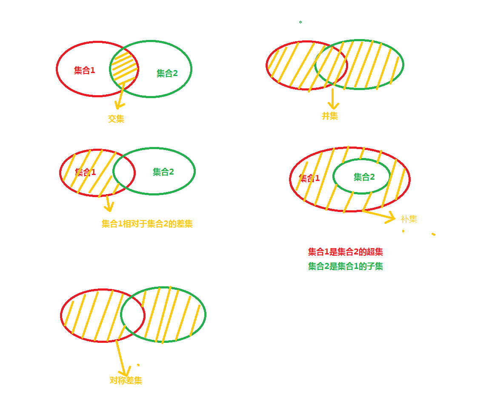
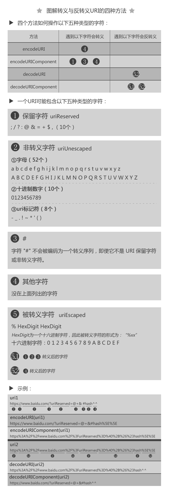
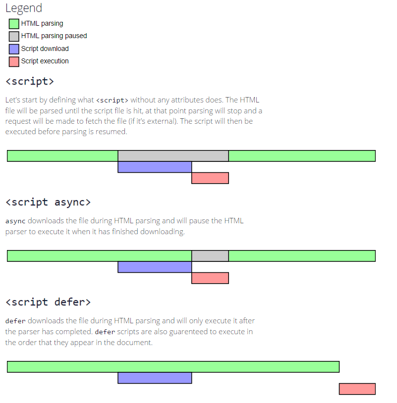

# 1-100天 [前端面试 3+1](https://github.com/haizlin/fe-interview/blob/master/category/history.md) & 个人答案总结

> 原作：[前端面试每日 3+1（每日三问）](https://github.com/haizlin/fe-interview)

<ClientOnly>
<ProgressBar completedClass=".theme-default-content>h2" :maxNumber="100" testRegStr="."/>
</ClientOnly>

## 第100天 (2019.07.25)

### [html] HTML5怎么为输入框添加语音输入的功能呢？

`<input type=”text” speech x-webkit-speech />`

这是Chrome 的私有功能，还不算规范

### [css] 如何让大小不同的图片等比缩放不变形显示在固定大小的div里？写出来

用 `object-fit: contain;` 或用背景 `background-size: contain`

### [js] 分别封装精确运算的加减乘除四个方法

big.js - A small, fast JavaScript library for arbitrary-precision decimal arithmetic. https://github.com/MikeMcl/big.js/

### [软技能] 你有画过流程图吗？开始和判定分别用什么图形表示？

https://github.com/haizlin/fe-interview/issues/982

## 第99天 (2019.07.24)

### [html] HTML5的页面可见性（Page Visibility）有哪些应用场景？

```js
document.addEventListener('visibilitychange', (e) => {
  if (document.visibilityState === 'hidden') {
    document.title = '页面不可见';
  }
  if (document.visibilityState === 'visible') {
    document.title = '页面可见';
  }
})
```

hidden的条件：

- PC端窗口最小化或切换到其他标签页
- 移动端切换最近任务、返回桌面

应用场景：

- 停止页面音视频
- 停止服务器的轮询

### [css] 你对视网膜(Retina)分辨率有了解吗？有没有在实际中使用过？

Retina 分辨率指的是屏幕的物理分辨率达到了使得人眼难以看到单个物理像素，也就是 DPR > 1 的屏幕适配，需要给出适合尺寸的图片以避免模糊。

### [js] 不用第三方库，说说纯js怎么实现读取和导出excel？

https://github.com/haizlin/fe-interview/issues/977

```js
const blob = new Blob([res], { type: 'application/msexcel;charset=UTF-8' })
const url = URL.createObjectURL(blob)
const a = document.createElement('a')
a.href = url
a.click()
```

### [软技能] 你有用过单例模式吗？主要运用场景有哪些？

单例模式对象的类必须保证只能有一个实例存在，mysql 数据库连接一般使用的是单例模式，便于控制。


## 第98天 (2019.07.23)

### [html] 列举出你最常用的meta标签的写法和作用

- 设定文档字符集：`<meta charset="UTF-8">`
- 设定视口宽度和缩放：`<meta name="viewport" content="width=device-width, user-scalable=no, initial-scale=1.0, maximum-scale=1.0, minimum-scale=1.0">`
- 让 IE/Edge 系列使用最新内核渲染：`<meta http-equiv="X-UA-Compatible" content="ie=edge">`

### [css] 移动端微信页面有哪些兼容性问题及解决方案是什么？

- 视频元素永远是最高层级，无法修改
- [各种各样的坑](https://www.zhihu.com/question/30465777)
- 微信就是垃圾。
- 引导用户使用系统浏览器打开

### [js] 说说你理解的同步和异步的区别是什么？

- 同步操作会阻塞后面代码的执行，只有等待同步操作执行完成后，后面的程序才能继续运行
- 异步操作不会影响接下来的执行，当异步操作结束后会触发回调函数，此时处理异步操作的结果

### [软技能] 不查资料，你会手写正则吗？

会一些

## 第97天 (2019.07.22)

### [html] Doctype有什么作用？你知道有多少种Doctype文档类型吗？

表明文档的类型和版本，以及模式

```html
<-- html5-->
<!DOCTYPE html>
<-- html4-->
<!DOCTYPE HTML PUBLIC "-//W3C//DTD HTML 4.01//EN" "http://www.w3.org/TR/html4/strict.dtd">
<!DOCTYPE HTML PUBLIC "-//W3C//DTD HTML 4.01 Transitional//EN" "http://www.w3.org/TR/html4/loose.dtd">
<!DOCTYPE HTML PUBLIC "-//W3C//DTD HTML 4.01 Frameset//EN" "http://www.w3.org/TR/html4/frameset.dtd">
```

### [css] 如何更改placeholder的字体颜色和大小？

```html
<style>
  /* Chrome浏览器 */
  input::-webkit-input-placeholder {
    color: red;
  }

  /* 火狐浏览器 */
  input::-moz-placeholder {
    color: red;
  }

  /* IE */
  input:-ms-input-placeholder {
    color: red;
  }
</style>
<body>
<input type="text" placeholder="Hello world">
```

### [js] 写例子说明如何给li绑定事件（ul下有1000+个li）？

优先使用事件委托

```html
<ul id="ul">
  <li>aaaaa</li>
  <li>bbbbb</li>
  <li>ccccc</li>
</ul>

<script>
  var ul = document.getElementById('ul')
  ul.addEventListener('click', function (e) {
    // 事件委托
    if (e.target.tagName === 'LI') {
      console.log(e.target.innerText)
    }
  })

  // 生成多个节点
  for (var i = 0; i < 30; i++) {
    var li = document.createElement('li')
    li.innerText = Math.random()
    ul.appendChild(li)
  }
</script>
```

### [软技能] 你认为前端工程师应该分为哪些级别呢？说说你的看法

https://github.com/haizlin/fe-interview/issues/970


## 第96天 (2019.07.21)

### [html] 写出以下几个HTML标签：字体、居中、文字加粗、下标

- `<font></font>` depreciated
- `<center></center>` depreciated
- `<b></b>` `<strong></strong>`
- `<b></b>` `<strong></strong>`
- `<sub></sub>`

### [css] 行内css和important哪个优先级高？

!important > 行内 > id > 伪类 > 属性 > 类 > 标签 > *

### [js] 要实现一个js的持续动画，你有什么比较好的方法？

使用 requestAnimationFrame 或类库：GSAP。

### [软技能] 说说你对Git的branch, diff, merge的理解？

- branch 分支操作
- diff 对比差异
- merge 合并两个分支

## 第95天 (2019.07.20)

### [html] HTML5标准提供了哪些新的API？你有用过哪些？

- 选择器：`document.querySelectorAll()`
- 离线存储：LocalStorage/SessionStorage
- 绘图：Canvas
- 定位：Geolocation
- 多媒体：Audio/Video
- 拖放：ondrop/ondragover/draggable/ondragstart
- svg
- 通知：Notification

### [css] 当一个元素被设置为浮动后，它的display值变为什么呢？

display 值都变为 block。可以使用 `window.getComputedStyle(element).display` 获取它的值。

### [js] 分别写出数组的交集、并集、差集、补集这四个方法



```js
var arr1 = [1, 2, 3, 4, 5, 6];
var arr2 = [4, 5, 6, 7, 8, 9];

// 交集
function intersect(arr1, arr2) {
  // return arr1.filter(item => arr2.includes(item))

  var r = [];
  for (var i = 0; i < arr1.length; i++) {
    for (var j = 0; j < arr2.length; j++) {
      if (arr1[i] === arr2[j]) {
        r.push(arr1[i])
      }
    }
  }
  return r
}

// 差集
function exclude(arr1, arr2) {
  // return arr1.filter(item => !arr2.includes(item))

  var r = [];
  for (var i = 0; i < arr1.length; i++) {
    var eq = false;
    for (var j = 0; j < arr2.length; j++) {
      if (arr1[i] === arr2[j]) {
        eq = true
      }
    }
    if (!eq) {
      r.push(arr1[i])
    }
  }
  return r
}

// 并集
function union(arr1, arr2) {
  arr1 = exclude(arr1, arr2)

  // return [...arr1, ...arr2]

  return arr1.concat(arr2)
}

// 补集
function complement(arr1, arr2) {
  return exclude(arr1, arr2).concat(exclude(arr2, arr1))
  // return exclude(union(arr1, arr2), intersect(arr1, arr2))
}

console.log({arr1, arr2})
console.log('交集：', intersect(arr1, arr2))
console.log('差集：', exclude(arr1, arr2))
console.log('并集：', union(arr1, arr2))
console.log('补集：', complement(arr1, arr2))
```

### [软技能] 你知道什么是图片防盗链吗？防盗链怎么实现呢？说说你的方法

在服务端检测请求 header 字段里面的 Referer，如果不是列表中的域名，则拒绝响应

## 第94天 (2019.07.19)

### [html] 使用HTML5需要遵守哪些设计原则？

- 语义化标签
- 向下兼容

### [css] 为什么会出现浮动？在什么时候需要清除浮动呢？

使用 float 布局会出现浮动，当高度塌陷时需要清除浮动

### [js] 用js写出死循环的方法有哪些？

```js
while (true) {}
for(;;) {}
```

### [软技能] 说说你对emojig表情的理解，前端如何处理emoji表情？它的运用场景有哪些？

emoji 是用字体显示的表情符号，可以用 utf-8 编码表示和存储。应用场景：社交、聊天、特殊符号。


## 第93天 (2019.07.18)

### [html] 有使用过svg吗？请用svg画一个圆

```html
<svg width="50" height="50">
  <circle cx="25" cy="25" r="10" fill="#000"></circle>
</svg>
```

### [css] 写出div在不固定高度的情况下水平垂直居中的方法？

重复：【第39天】写出你知道的CSS水平和垂直居中的方法

### [js] js的函数有哪几种调用形式？

- 直接调用：`fn()`
- 作为对象的方法调用：`obj.fn()`
- 作为构造函数调用：`new fn()`
- 使用 call/apply 调用：`fn.call(this, arg1, arg2)`/`fn.apply(this, [arg1, arg2])`
- 自动执行函数 `(function() {})()`
- eval

### [软技能] 简要描述下什么是DNS？它有什么用？

DNS 全称：域名服务（Domain Name Service），作用是把域名映射为IP地址

## 第92天 (2019.07.17)

### [html] 请说说你对ISISO8859-2字符集的认识

ISO8859 是一系列的字符集标准，-2 在 1 的基础上收集了东欧字符。它不是 UTF-8 但它兼容 UTF-8，它是 UTF-8 的子集。
我们写项目的使用，尽量使用 UTF-8。

### [css] 移动端的布局用过媒体查询吗？写出例子看看

```css
@media screen and (max-width: 375px) {
  body {background: slateblue; color: white;}
}
@media print {
  body {background: white; color: red;}
}
```

### [js] 解释下为什么 `{} + [] === 0` 为true？

`{}` 在这个语句中是空语句块而非空对象。

```js
{} + [] === 0
+ [] === 0
0 === 0
```

### [软技能] 浏览器在什么情况下会出现“已拦截弹窗式窗口”？怎么解决？

用户未点击页面，通过 JS 的 `window.open()` 函数打开新窗口会被拦截。

解决：

- 让用户点击页面后执行 `window.open()`
- 使用 a 链接

## 第91天 (2019.07.16)

### [html] 请描述下元素的href和src有什么区别？

- href 用在 a/link 标签中，用于在当前文档和引用资源之间建立联系
- src 用于 script/img 标签，用于将资源替换当前元素（置换元素）

### [css] CSS的伪类和伪对象有什么不同？

- 伪类：`:hover`、`:active`、`:focus` 等类，在交互时产生特殊效果。
- 伪对象（伪元素）：使用 `::before` 或 `::after` 和其 `content` 属性生成的伪元素。

### [js] 请描述下null和undefined的区别是什么？这两者分别运用在什么场景？

- `null`：表示变量的值为空（`null`），或者资源不存在
- `undefined`：变量被声明，但没有赋值，此时默认值为 `undefined`

### [软技能] 你所在的团队有规范吗？举例说明都定义了哪些规范？

- 命名规范
- 接口标准规范
- https://github.com/haizlin/fe-interview/issues/760


## 第90天 (2019.07.15)

### [html] 举例说明你对ol和ul标签的区别？它们的运用场景分别是什么呢？

ol 是有序列表，ul 是无序列表。ol 应用于需要显示列表序号的地方，ul 只要是列表都可以用到，不会显示序号，默认显示圆点。

### [css] CSS的overflow属性定义溢出元素内容区的内容会如何处理呢?

[overflow](https://developer.mozilla.org/zh-CN/docs/Web/CSS/overflow) 有这些属性：

- `visible`（默认值）：超出的内容正常显示在父元素外
- `hidden`：会隐藏（裁剪掉）超出的内容，不显示滚动条
- `scroll`：超出内容可以滚动，始终显示滚动条
- `auto`：正常情况下显示与 `visible` 相同，当内容溢出时，显示与 `scroll` 相同

### [js] 写个方法随机打乱一个数组

与【第24天：如何快速让一个数组乱序，写出来】重复，洗牌算法：

```js
function suffleArray(arr) {
    for (var i=arr.length-1; i>0; i--) {
        var j = Math.floor(Math.random()*(i+1))
        if (i !== j){
          var temp = arr[i]
          arr[i] = arr[j]
          arr[j] = temp
        }
    }
    return arr
}
console.log(suffleArray([1,2,3,4,5,6,7,8,9,0]))
```


### [软技能] 当项目准备上线前，你有做过哪些性能优化吗？

- 压缩图片缩小文件体积
- 配置 nginx 设置 Gzip 和缓存
- 使用 webpack 压缩 css/js
- 节流与防抖

## 第89天 (2019.07.14)

### [html] a标签的href和onclick属性同时存在时哪个先触发？

onclick 先触发，可以通过 `event.preventDefault()` 或 `return false` 阻止 a 标签的跳转。

### [css] 外层有一个自适应高度的div，里面有两个div，一个高度固定300px，另一个怎么填满剩余的高度？

HTML 结构如下：

```html
<div class="wrapper">
  <div class="box1"></div>
  <div class="box2"></div>
</div>
```

方法一：使用 `calc()`

```css
.wrapper {
  height: 500px;
  border: 2px dashed orange;
}
.box1 {
  height: 300px;
  background: red;
}
.box2 {
  height: calc(100% - 300px);
  background: yellow;
}
```

方法二：使用 `flex-basis`

```css
.wrapper {
  display: flex;
  flex-flow: column nowrap;
  height: 500px;
  border: 2px dashed orange;
}
.box1 {
  flex-basis: 300px;
  background: red;
}
.box2 {
  flex: 1;
  background: yellow;
}
```

### [js] js异步加载有哪些方案？

题目重复，请参阅：【第85天】js延迟加载的方式有哪些？

### [软技能] 说说你对robots文件的理解，它有什么作用？

robots 可以指导搜索引擎爬虫该做出什么样的行为，如阻止或引导爬取某些页面，参考 [Robots.txt 规范](https://developers.google.com/search/reference/robots_txt)

## 第88天 (2019.07.13)

### [html] 怎么使用HTML5来获取定位？定位不准怎么解决？

使用 [geolocation](https://developer.mozilla.org/zh-CN/docs/Web/API/Geolocation/Using_geolocation) 获取定位，如果 HTML5 原生的定位不太准，可以使用 高德/百度/腾讯 的定位SDK

### [css] 说说你对CSS样式覆盖规则的理解

1. 按权重（优先级）：权重高的会覆盖权重低的样式：!important > 内联样式 > #id > .class > tag > *
2. 同等权重时，按照 CSS 的书写顺序，后面的覆盖前面的

### [js] 判断instanceof的结果并解释原因 [代码]

```js
function test(){ 
    return test; 
} 
new test() instanceof test;
```

结果：false

- 如果函数明确返回 non-primitive 值，那么 new 运算符的结果将是这个值
- 所以原表达式相当于：`test instanceof test`
- instanceof 的作用时判断一个实例是否属于一个对象，通过在实例（左值）的原型链上查询 `constructor`，判断是否等于目标对象（右值）
- 所以函数 `test` 的原型链为：`Function -> Object -> null`，可以看到原型链上没有为 test 的 `constructor` 所以返回 false

### [软技能] 说说你对hosts文件的理解，它都有哪些作用？

host 文件可以指定域名对应的 IP 地址，浏览器首先会查询本机 host，如果查询到了就不会去查询 DNS 服务器，这样节省了查询时间。

- 可以指定域名的 IP 地址
- 节省查询 DNS 的时间


## 第87天 (2019.07.12)

### [html] 举例说明如何原样输出HTML代码，不被浏览器解析？

- 使用 `<pre></pre>` 标签包裹代码
- 使用 `<textarea></textarea>` 包裹代码
- 把 HTML 特殊字符转义，如 `<` 转义为 `&lt;`

### [css] 写出几个初始化CSS的样式，并解释说明为什么要这样写

```css
/*清除默认的 body margin*/
body {
  margin: 0;
}
/*取消列表的标识符*/
li {
  list-style: none;
}
```

参考 [normalize.css](https://cdn.bootcss.com/normalize/8.0.1/normalize.css)

### [js] 请写一个sleep（暂停）函数

```js
// 异步的暂停函数，需要在 async/await 中运行
function sleep(time) {
  return new Promise(resolve => setTimeout(resolve, time))
}
async function run() {
  console.log('1')
  await sleep(3000)
  console.log('2')
}
run()
```

```js
// 同步的暂停函数，可能导致程序卡死
function sleep(time) {
  var now = new Date()
  while((new Date() - now) < time) {}
}
function run() {
  console.log('1')
  sleep(3000)
  console.log('2')
}
run()
```

### [软技能] 你平常都看哪些方面的书？你看书的方法是怎样的？

https://github.com/haizlin/fe-interview/issues/603

## 第86天 (2019.07.11)

### [html] 举例说明你对HTML5的ruby标签的理解，都有哪些应用场景？

可以用于显示拼音或注释字符：

<ruby>醍<rt>tí</rt>醐<rt>hú</rt>灌<rt>guàn</rt>顶<rt>dǐng</rt></ruby>

```html
<ruby>
    醍
    <rt>tí</rt>
    醐
    <rt>hú</rt>
    灌
    <rt>guàn</rt>
    顶
    <rt>dǐng</rt>	
</ruby>
```


### [css] display有哪些值？分别说明他们的作用是什么？

`display:`

- `block` 块级元素，一个占一行显示
- `inline` 内联元素，多个元素在一行显示，同时不支持 height/width/margin 等属性
- `inline-block` 内联块级元素，融合了上述两者的特点，在不会换行的同时支持 height/width/margin
- `table`
- `list-item`
- `flex` 弹性盒子布局
- `grid` 网格布局

### [js] 把Script标签放在页面最底部的`</body>`之前和之后有什么区别？浏览器会如何解析它们？

- 放在 `</body>` 之前，JS 可以访问已经加载完成的 DOM 结构
- 放在 `</body>`之后，是不符合标准的，不要这么写

### [软技能] Git的reset和revert有什么区别？它们分别适用于什么场景？

[参考](https://github.com/haizlin/fe-interview/issues/599#issuecomment-510337866)

- `git reset`：将某次提交后的版本全部抹除

    **通常，在与他人协作开发时**，将已经提交到远端的更改 reset 回去不是一个好主意。如果执意要这么做，那么 push 时应该加上 `-f` 选项用本地内容强制覆写远端。

- `git revert`：创建一次新的提交，将某次提交的更改撤销；变动如下

适用场景：没有绝对的适用场景，也不存在什么最佳实践。符合你需求的就是最好的，或者你的团队用哪种你就用哪种。

## 第85天 (2019.07.10)

### [html] iframe的使用场景有哪些？

- 后台管理不刷新页面更新内容 
- 嵌入别的网站内容
- 隔离页面，例如打印某些内容

### [css] 怎么让body高度自适应屏幕？为什么？

```css
html, body {
  height: 100%;
}
```

### [js] js延迟加载的方式有哪些？

- script 标签的 defer/async 属性
- 动态创建 script 标签
- 把 script 放在 `</body>` 前面
- `<script type="module">` [Module 的加载实现](http://es6.ruanyifeng.com/#docs/module-loader)

### [软技能] 你平时开发是用mac还是windows系统？至少举三个例子说明两者的区别？

Windows，macOS/Windows/Linux 都有用过。

- macOS/Linux 环境变量设置和 Windows 有差异
- macOS/Linux 支持 sh 脚本，Windows 默认只支持 bat
- 界面于交互体验、软件生态的差异

## 第84天 (2019.07.09)

### [html] a标签下的href="javascript:void(0)"起到了什么作用？说说你对javascript:void(0)的理解？

a 标签的 `javascript:` 后面跟着 JavaScript 表达式，`viod(0)` 不执行任何操作，也就是说点击该 a 标签不会触发跳转行为。

### [css] font-style的属性有Italic和oblique，两者有什么区别呢?

- italic 优先使用字体的斜体字形，如果字体没有斜体，就用倾斜体（oblique）代替。
- oblique 倾斜体，将字体倾斜显示（通过浏览器进行倾斜处理）。

参考：https://stackoverflow.com/questions/1680624/font-style-italic-vs-oblique-in-css

### [js] 请描述你对浏览器同源策略的理解

浏览器限制了不同源的 XHR 请求：协议、域名、端口号中有一个不同就会产生同源限制，两者之间不允许通信。

解决方案：

- 使用 CORS（服务端设置 Access-Control-Allow-Origin）
- 使用 Nginx 进行反向代理
- 使用 JSONP

### [软技能] 刷新和强制刷新有什么区别？说说你对两者的理解

刷新，一般是点击浏览器上的刷新按钮、Ctrl+R 或按 F5，在刷新的时候会重用缓存的资源而不会重新下载，从而提高加载速度，但有些缓存的资源可能不会更新。
强制刷新，在 Chrome 中使用 Shift+Ctrl+F5，或使用控制台 Network 面板中的 Disable Cache，会从服务器重新请求所有资源，就像第一次打开网站一样。

## 第83天 (2019.07.08)

### [html] 在新窗口打开链接的方法是什么？那怎么设置全站链接都在新窗口打开？

- 使用 `<a href="#" target="_blank">#</a>`
- 在 `<head>` 中设置：
    ```html
    <head>
        <base target="_blank">
    </head>
    ```

参考：[`<base>`：文档根 URL 元素](https://developer.mozilla.org/zh-CN/docs/Web/HTML/Element/base)

### [css] IE(6/7/8/9/10/11/Edge)下的hack写法分别有哪些？

https://github.com/haizlin/fe-interview/issues/585

### [js] 举例说明js如何实现继承？

最常用的是组合继承（组合了`原型链继承`和`借用构造函数继承`）

请参阅：[JS 对象实现继承的几种方法以及优缺点](../js/js-inherit.md)

### [软技能] 你会抓https和移动端的包吗？分别描述下这两种包要怎么抓？

可以使用这些抓包工具：WireShark/Fiddler/whistle

- https 抓包先要配置证书
- 移动端抓包需要让移动设备连接上抓包的网络（比如使用代理）

## 第82天 (2019.07.07)

### [html] 用HTML5实现手机摇一摇功能你有做过吗？你知道它的原理吗？

利用 window.DeviceMotionEvent 检测加速来实现，[核心代码](https://github.com/qieguo2016/h5_shake/blob/master/js/shaked.js)：

```js
var Shake = function (threshold) {
	var that = this;
	this.SHAKE_THRESHOLD = threshold ? threshold : 2000; //定义阈值            
	this.last_update = 0;
	this.x = this.y = this.z = this.last_x = this.last_y = this.last_z = 0; 
	
	this.shakeAudio = new Audio();		//摇一摇声音
	this.shakeAudio.src = 'source/shake_sound.mp3';
	this.audioLoaded = false;	//音频加载标志
	
	this.shakeEffect = document.getElementsByClassName('shake-box')[0];  //摇一摇图片分裂效果
	this.img = document.getElementById('id-shake-image');	//摇一摇后显示图片
	var images = ['source/000.jpg', 'source/001.jpg', 'source/002.jpg'],
		imgSource = new Image();
	for (var _index = 0; _index < images.length; _index++) {
		imgSource.src = images[_index];
	}
	
	
	this.init = function() {                
		if (window.DeviceMotionEvent) {
			window.addEventListener('devicemotion', this.deviceMotionHandler, false); 
		} else {                  
			alert('您的浏览器不支持重力传感器');    
		}           
	};
	
	this.deviceMotionHandler = function(eventData) {        
		var acceleration = eventData.acceleration;   
		var curTime = new Date().getTime();         
		
		//检测频率：每100ms一次
		if ((curTime - that.last_update) > 100) {     
			var diffTime = curTime - that.last_update;      
			that.last_update = curTime;     
			
			that.x = acceleration.x;            
			that.y = acceleration.y;         
			that.z = acceleration.z;      
			var speed = Math.abs(that.x + that.y + that.z - that.last_x - that.last_y - that.last_z) / diffTime * 10000;            
			if (speed > that.SHAKE_THRESHOLD) {  
				
				//do something
				that.shakeAudio.play();		//摇一摇音效
				window.navigator.vibrate(200);	//振动效果
				that.shakeEffect.className = 'shake-box shaking';	//摇一摇图片动态
				clearTimeout(shakeTimeout);
				clearTimeout(changeImage);
				
				var shakeTimeout = setTimeout(function() {
					that.shakeEffect.className = 'shake-box';
				},4000);
				
				//更改显示的图片
				var changeImage = setTimeout(function () {
					that.img.src = images[ Math.floor( Math.random() * 3)];
				},4200);				
			}    
			
			that.last_x = that.x;      
			that.last_y = that.y;               
			that.last_z = that.z;         
		}        
	};
};
```

参考：

- [HTML5 摇一摇加强版之一次失败的探索](https://www.cnblogs.com/qieguo/p/5448786.html)
- [HTML5 控制裝置陀螺儀 (三軸)](https://www.oxxostudio.tw/articles/201506/html5-device-orientation.html)

### [css] 写出你遇到过IE6/7/8/9的BUG及解决方法

举一个遇到的bug：IE11 以下不支持 `--` 开头的 CSS 类命名，如（`.--abc`），使用这样的类名，不会渲染样式。

https://github.com/haizlin/fe-interview/issues/581

### [js] 用js实现一个九九乘法口诀表

```js
function chengFaBiao() {
  var table = ''
	for (var i=1; i<=9; i++) {
    for (var j=1; j<=9; j++) {
      if (j>=i) {
	    	table += `${i}*${j}=${i*j}\t`     
      }
    }
    table += `\n`
  }
  console.log(table)
}
chengFaBiao()
```

### [软技能] 说下你平时是怎么自学的？怎么安排时间的？

有空就自学、通勤时间、晚上、周末抽一些时间自学。

## 第81天 (2019.07.06)

### [html] 你有用过HTML5的Device API吗？说说它都有哪些应用场景？

[Web APIs](https://developer.mozilla.org/en-US/docs/Web/API)

应用场景：获取设备信息、定位、屏幕旋转方向、电池电量等

### [css] 举例说明css的基本语句构成是什么呢？

选择器，花括号，参数声明

```css
.selector {
  display: inline-block;
}
```

### [js] 在js中怎么捕获异常？写出来看看？应该在哪些场景下采用呢？

使用 try-catch 语句：

```js
try {
  throw new Error('抛出了一个错误')
} catch (e) {
  console.error(e.message)
} finally {
}
```

应用在接口请求，或者是不想让用户看见的错误处理中。

### [软技能] 你申请的这个职位，你觉得你还欠缺什么呢？

缺乏一些对底层原理的深刻理解。

https://github.com/haizlin/fe-interview/issues/579

## 第80天 (2019.07.05)

### [html] 简述下HTML的快捷键属性是哪个？并举例说明有什么用？

accesskey 属性是 HTML5 中的全局访问快捷键属性，用法如下：

```html
<a href="https://developer.mozilla.org/zh-CN/docs/Web/HTML/Global_attributes/accesskey" target="_blank" accesskey="x">打开链接（<u>x</u>）</a>
<button accesskey="z" onclick="this.style.color = 'red';">变红（<u>z</u>）</button>
```

除了 Firefox 是按 `shift+alt+key` 外，其他浏览器都是 `alt+key` 来激活点击事件。

参考：

- [accesskey MDN](https://developer.mozilla.org/zh-CN/docs/Web/HTML/Global_attributes/accesskey)
- [HTML accesskey属性与web自定义键盘快捷访问](https://www.zhangxinxu.com/wordpress/2017/05/html-accesskey/)

### [css] 写例子说明如何强制（自动）中、英文换行与不换行

CSS 属性 word-break 指定了怎样在单词内断行。

- `normal` 使用默认的断行规则（短的非中日韩文本（如英文）单词换行，长单词不换行，对于中日韩文本自动换行）
- `break-all` 对于非中日韩文本，在任意字符间断行（强制换行）
- `keep-all` 中日韩文本不换行，非中日韩文本表现同 `normal`
- `break-word` 不推荐使用，因为作用与 `word-break: normal` 和 `overflow-wrap: anywhere` 相同

参考MDN：[word-break](https://developer.mozilla.org/zh-CN/docs/Web/CSS/word-break) / [overflow-wrap](https://developer.mozilla.org/en-US/docs/Web/CSS/overflow-wrap) / [white-space](https://developer.mozilla.org/en-US/docs/Web/CSS/white-space)

### [js] 举例说明什么是decodeURI()和encodeURI()是什么？

这两个方法可以把 URL 中的特定字符解码或编码

- `encodeURI()`：除了 `A-Z a-z 0-9 ; , / ? : @ & = + $ - _ . ! ~ * ' ( ) #` 不会被转换外， 其他字符都会被编码成 `%XX` 的转义序列（xx 为十六进制数）
- `decodeURI()`：将已编码 URI 中所有能识别的转义序列转换成原字符，但不能解码那些不会被 [`encodeURI`](https://developer.mozilla.org/zh-CN/docs/Web/JavaScript/Reference/Global_Objects/encodeURI) 编码的内容（例如 "`#`"）。
- `encodeURIComponent()`： 转义除了字母、数字、`(`、`)`、`.`、`!`、`~`、`*`、`'`、`-`和`_`之外的所有字符。
- `decodeURIComponent()`：将已编码 URI 中所有能识别的转义序列转换成原字符。


参考：

- [`decodeURI`](https://developer.mozilla.org/zh-CN/docs/Web/JavaScript/Reference/Global_Objects/decodeURI)
- [`encodeURI`](https://developer.mozilla.org/zh-CN/docs/Web/JavaScript/Reference/Global_Objects/encodeURI)
- [`encodeURIComponent`](https://developer.mozilla.org/zh-CN/docs/Web/JavaScript/Reference/Global_Objects/encodeURIComponent)
- [`decodeURIComponent`](https://developer.mozilla.org/zh-CN/docs/Web/JavaScript/Reference/Global_Objects/decodeURIComponent)




参考：[encodeURI](https://developer.mozilla.org/en-US/docs/Web/JavaScript/Reference/Global_Objects/encodeURI)

### [软技能] 你知道什么是websocket吗？它有什么应用场景？

WebSocket 可以在浏览器和服务器（端口）之间建立并保持长连接，并且允许服务端向客户端推送数据。应用场景：

- 即时通信
- 多媒体聊天
- 多人游戏
- 股票行情
- 实时数据更新

> docs/.vuepress/public/files/effects/websocket-demo

## 第79天 (2019.07.04)

### ✅ [html] [HTML5的应用程序缓存与浏览器缓存有什么不同？](./contents/79-1.md)

### [css] 说说你对BEM规范的理解，同时举例说明常见的CSS规范有哪些？

- B（Block，块）、E（Element，元素）、M（Modifier，修饰符）是一种 CSS 类名命名约定，可以让 CSS 选择器更高效（避免了多层子代选择）、方便理解、易于维护。示例：

```html
<div class="article">
    <div class="article__body">
        <div class="tag"></div>
        <button class="article__button--primary"></button>
        <button class="article__button--success"></button>
    </div>
</div>
```

参考：

- [CSS — BEM 命名规范](https://juejin.im/post/5b925e616fb9a05cdd2ce70d)
- [CSS代码重构与优化之路](http://luopq.com/2016/01/05/css-optimize/)

### [js] 举例说明什么是IIFEs？它有什么好处？

IIFEs（Instantly Invoked Function Expression，即时调用函数表达式）用于创建一个匿名函数并且立即执行，可以用于独立作用域、直接递归、用闭包解决问题。

```js
// 写法
;(function() {
  // 函数内容
})()

for (var i=0;i<10;i++) {
     (function(i){
          setTimeout(function(){
               console.log(i);
          }, 100*i);
     })(i)
}
```

### [软技能] 一个项目写很多的纯静态页面，有公共的部分（例如头和尾）你是怎么提取公用的？

纯静态的话，可以把公用部分拆分成模块（组件），打包的时候使用 gulp 对页面进行整合。我之前做过的一个 [DEMO](https://github.com/canwdev/learn-front-end/tree/master/gulp/re-html)

也可以使用 Vue/React 的组件化编程，还可以使用 EJS 等模板引擎。

## 第78天 (2019.07.03)

### [html] 你有用过HTML5中的datalist标签吗？说说你对它的理解

HTML5 的 datalist 标签一般与 input 配合使用。

```html
<label for="ice-cream-choice">Choose a flavor:</label>
<input list="ice-cream-flavors" id="ice-cream-choice" name="ice-cream-choice" />

<datalist id="ice-cream-flavors">
    <option value="Chocolate">
    <option value="Coconut">
    <option value="Mint">
    <option value="Strawberry">
    <option value="Vanilla">
</datalist>
```

`<datalist>`元素包含了一组`<option>`元素，这些元素表示其它表单控件可选值。———[MDN](https://developer.mozilla.org/zh-CN/docs/Web/HTML/Element/datalist)

### [css] 遇到overflow: scroll不能平滑滚动怎么解决？

一般是 iOS Safari 的滚动不跟手（滚动无惯性，无回弹）的问题。

加一句CSS代码解决：`-webkit-overflow-scrolling: touch;`

### [js] 举例说明数组和对象的迭代方法分别有哪些？

数组迭代方法：

- forEach 遍历数组，无返回值，不可中断
- map 遍历数组，返回一个新数组
- filter 根据判断结果返回值为 `true` 的项构成新的数组
- reduce 允许遍历数组时，前一项与当前项进行操作，返回自定义类型值

```js
var arr = [1,2,3,4,5,6,7,8,9,10]
arr.forEach((item,index)=>{console.log(item,index)}) // 遍历输出数组
arr.map((item,index)=>{return item+1}) // 返回一个新数组，该数组每项都+1
arr.filter((item,index)=>{return item&1}) // 返回一个新的奇数数组（`x&1` 当x为奇数时返回true）
arr.reduce((prev,cur, index)=>{return prev+cur}) // 55，返回每一项相加的值
```

对象迭代方法：

- Object.keys(obj)
- for-in 循环
- for-of 循环

### [软技能] 你有使用过JWT吗？说说你对它的理解

- JWT(JSON Web Token) 是一种身份认证方式，通常是用户执行登录操作后，在服务端根据用户信息生成一个 TOKEN 加密后发送给客户端，可存储在 Cookie 或 LocalStorage 中，用户下次发送请求时带上 TOKEN（一般在请求头部中携带），这样服务器解密 TOKEN 就可以判断用户是否登录以及用户的身份。

## 第77天 (2019.07.02)

### [html] 说说你对HTML5的img标签属性srcset和sizes的理解？都有哪些应用场景？

通过 srcset 可以在加载图像前判断设备尺寸，有两种写法：

```html
<picture>
  <source media="(max-width: 799px)" srcset="elva-480w-close-portrait.jpg">
  <source media="(min-width: 800px)" srcset="elva-800w.jpg">
  
</picture>


```

应用场景：

- 在移动端加载更小的图片
- 在移动端和PC断加载不同尺寸的图片

参考：[响应式图片](https://developer.mozilla.org/zh-CN/docs/Learn/HTML/Multimedia_and_embedding/Responsive_images)

### [css] 请问display:inline-block在什么时候会显示间隙？

在元素间有回车、空格或者其他空白节点时，会有间隙（幽灵空白节点），可以通过设置父元素 `font-size: 0;` 解决。

参考：【第43天】span与span之间有看不见的空白间隔是什么原因引起的？有什么解决办法？

### [js] 请快速答出此题的答案并解释：var x, y = 1; x + y = ?

NaN，因为 x 为 `undefined`，`undefined + 1 ==> NaN`

### [软技能] 你会抓包吗？都有用过哪些抓包工具？

有用过：WireShark/Fiddler/[whistle](https://github.com/avwo/whistle/blob/master/README-zh_CN.md)

## 第76天 (2019.07.01)

### [html] HTML5如何识别语音读出的内容和朗读指定的内容？

- [Web Speech API](https://developer.mozilla.org/zh-CN/docs/Web/API/Web_Speech_API)
- [SpeechSynthesis](https://developer.mozilla.org/zh-CN/docs/Web/API/SpeechSynthesis)

### [css] 用CSS画出一个任意角度的扇形，可以写多种实现的方法

使用两个矩形遮罩 + `border-darius` 实现

```html
<style>
  .fan-wrapper {
    position: relative;
    width: 300px;
    height: 300px;
    border-radius: 50%;
    background-color: #4CAF50;
    overflow: hidden;
  }
  .fan-wrapper .mask {
    position: absolute;
    top: 0;
    width: 50%;
    height: 100%;
  }
  .fan-wrapper .mask1 {
    transform: rotate(83deg);
    left: 0;
    transform-origin: right center;
    background: #FFEB3B;
  }
  .fan-wrapper .mask2 {
    transform: rotate(-180deg);
    transform-origin: left center;
    left: 50%;
    background: #4CAF50;
  }
</style>
<div class="fan-wrapper">
  <div class="mask mask1"></div>
  <div class="mask mask2"></div>
</div>
```

使用 clip-path:polygon 实现

```html
<style>
.fan {
  display: inline-block;
  width: 300px;
  height: 300px;
  background: #4CAF50;
  border-radius: 50%;
  transform: rotate(45deg);
  animation: fanAnim 5s linear both infinite;
}
@keyframes fanAnim{from{clip-path:polygon(50% 50%,0 0,0 0)}25%{clip-path:polygon(50% 50%,0 0,100% 0)}25.000001%{clip-path:polygon(50% 50%,0 0,100% 0,100% 0)}50%{clip-path:polygon(50% 50%,0 0,100% 0,100% 100%)}50.000001%{clip-path:polygon(50% 50%,0 0,100% 0,100% 100%,100% 100%)}75%{clip-path:polygon(50% 50%,0 0,100% 0,100% 100%,0 100%)}75.000001%{clip-path:polygon(50% 50%,0 0,100% 0,100% 100%,0 100%,0 100%)}to{clip-path:polygon(50% 50%,0 0,100% 0,100% 100%,0 100%,0 0)}}
</style>
<div class="fan">
```

另请参阅：

- [CSS3 clip-path polygon图形构建与动画变换二三事](https://www.zhangxinxu.com/wordpress/2015/03/css3-clip-path-polygon-shape-transition-animation/)
- [CSS clip-path maker](https://bennettfeely.com/clippy/)

### [js] 说说instanceof和typeof的实现原理并自己模拟实现一个instanceof

- instanceof 利用[原型链](https://github.com/mqyqingfeng/Blog/issues/2)判断父级的原型对象是否在实例的原型链上
- typeof 利用变量底层标识符判断数据类型，返回 `'string', 'number', 'undefined', 'boolean', 'object', 'function', 'symbol'`

```js
function instanceOf(L, R) {
  L = L.__proto__
  while (true) {
    if (L === null) return false
    if (L === R.prototype) return true
    L = L.__proto__
  }
}
```


### [软技能] 你对web服务器软件有了解吗？都使用过哪些？各有哪些优缺点呢？

有用过 nginx/Apache/IIS，还有像宝塔面板、phpStudy这样封装好的环境。

## 第75天 (2019.06.30)

### [html] 移动web页面如何自动探测电话号码？

添加一个 meta：`<meta name="format-detection" content="telephone=yes">`

参考：

- [Meta标签中的format-detection属性及含义](http://blog.sina.com.cn/s/blog_51048da70101cgea.html)
- [HEAD](https://github.com/Amery2010/HEAD)

### [css] 请你解释下什么是浮动和它的工作原理是什么？同时浮动会引起什么问题？

浮动是设置父元素属性：`float:left/right`，其子元素就会脱离文档流向左或右浮动：

- 浮动的元素脱离文档流，因此设置了浮动布局的元素如果不设置高度，则高度为 0
- 浮动的元素相互贴靠
- 浮动的元素如果没有设置 width，那么宽度自动为内容宽度

会引起浮动元素高度为 0 的问题，可以使用清除浮动的方法：

```css
.clearfix::before,
.clearfix::after {
    content: " ";
    display: table;
}

.clearfix::after {
    clear: both;
}
```


### [js] js中=、==、===三个的区别是什么？并说明它们各自的工作过程

- `=`：赋值操作符，左边是被赋值的变量或对象，右边是值或者地址
- `==`：不严格等于，判断两个变量的值是否相等，判断前会进行隐式类型转换
- `===`：严格等于，判断两个变量的值和类型是否相等，不会进行隐式类型转换

### [软技能] 说说你做过让你觉得最满意的项目是什么？为什么？

https://github.com/haizlin/fe-interview/issues/524

## 第74天 (2019.06.29)

### [html] 在a标签上的四个伪类执行顺序是什么？

执行顺序：

- link
- hover
- active
- visited

书写顺序（LVHA）：

- `:link`
- `:visited`
- `:hover`
- `:active`

### [css] 说说你对!important的理解，一般在哪些场景使用？

`!important` 可以将当前选择器地权重提升到最高，一般在强制覆盖一些样式的情况下使用，不建议使用，因为别人无法再次覆盖这个样式。

### [js] 写一个方法随机生成指定位数的字符串

```js
function createRandomString() {
    return Math.random().toString(36).substr(2)
}

function genRandomString(length = 10) {
    var str = ""
    while(str.length < length) {
        str += createRandomString()
    }
    return str.substring(0, length)
}

console.log(genRandomString(8))
```

### [软技能] 说下你对互联网行业及前端技术发展趋势的看法

移动互联网将持续发展，前端行业的跨平台优势和开发效率将更加明显，对原生开发产生冲击。随着 Node.js 的发展，各种前端框架层出不穷，前端生产力也逐步提高。

## 第73天 (2019.06.28)

### [html] favicon.ico有什么作用？怎么在页面中引用？常用尺寸有哪些？可以修改后缀名吗？

favicon 是浏览器标签或收藏夹上的小图标，在网站静态资源根目录下放置 favicon.ico，浏览器会自动请求并加载。常用尺寸：16x16，32x32，48x48。可以通过设置 `<link rel="icon" type="image/x-icon" href="/favicon.png">` 来自定义文件格式和路径。

### [css] 在实际编写css中你有遇到过哪些浏览器兼容性的问题？怎么解决的？

一般是一些标准的兼容问题，先查询 caniuse.com 看看样式属性的兼容性情况，然后再针对不兼容的浏览器做专门的处理。在现代前端工程中，使用这些工具可以解决大部分问题：

- [PostCSS](https://www.npmjs.com/package/postcss)
- [Autoprefixer](https://github.com/postcss/autoprefixer)
- [Browserslist](https://github.com/browserslist/browserslist)

### [js] 移动端点击事件为什么会有延迟？有哪些方法可以解决？

移动端点击会有 300ms 的延迟，是因为移动端有双击放大的操作，浏览等待 300ms 是为了判断用户是点击还是双击放大。解决方法：

- 方法1：设置 viewport：`<meta name="viewport" content="width=device-width">`
- 方法2：设置 CSS `html {touch-action: manipulation;}`
- 方法3：使用 fastclick.js 

参考：[300ms tap delay, gone away](https://developers.google.com/web/updates/2013/12/300ms-tap-delay-gone-away)

### [软技能] 说说你对RESTful的理解

RESTful 是一种 API 设计风格，REST(Representational State Transfer, 表征状态转移)，推荐使用统一的资源接口，使用 GET/POST/PUT/DELETE 方法来实现 API 接口的 查/增/改/删 操作。

| 传统接口         | RESTful        | 操作     |
| ---------------- | -------------- | -------- |
| GET getPost?id=1 | GET /post/1    | 获取推文 |
| POST editPost    | PUT /post/1    | 修改推文 |
| POST deletePost  | DELETE /post/1 | 删除推文 |
| POST addPost     | POST post/     | 新增推文 |

## 第72天 (2019.06.27)

- [html] [video和audio分别支持哪些格式？](./contents/72-1.md)

### [css] 怎么改变选中文本的文字颜色和背景色？

```css
*::selection {
  color: white;
  background-color: red;
}
```

### [js] 写一个字符串重复的repeat函数

```js
function repeat1(str, n) {
    if (typeof str !== 'string') {
        throw new TypeError()
    }
    var result = '';
    for (var i = 0; i < n; i++) {
        result += str;
    }
    return result;
}
function repeat2(str, n) {
    return new Array(n + 1).join(str);
}
var repeat3 = (str, n) => str.repeat(n)
var repeat4 = (str, n) => str.padEnd(n*str.length,str)
var repeat5 = (str, n) => {
    if (!str || n === 1) return str
    return str += repeat5(str, --n)
}

repeat1('Abcd', 3) // "AbcdAbcdAbcd"

```

### [软技能] 你知道二维码的原理是什么吗？要把android和ios的下载地址合成一个二维码怎么做呢？

通过相机图像识别和二维码算法获取二维码中的文本信息，如果是链接就用浏览器打开。

二合一二维码：制作一个中转页面，打开页面后判断 UA 是 Android 还是 iOS，跳转到相应下载页面。附 UA 检测代码：

```js
function getMOS() {
    var userAgent = navigator.userAgent;
    if (/windows phone/i.test(userAgent)) { // Windows Phone must come first because its UA also contains "Android"
      return "Windows Phone";
    }
    if (/Android/i.test(userAgent)) {
      return "Android";
    }
    if (/iPad|iPhone|iPod|Macintosh/.test(userAgent) && !window.MSStream) {
      return "iOS";
    }
    return "unknown";
  }
```

## 第71天 (2019.06.26)

### [html] 怎么在IE8及以下实现HTML5的兼容？

使用各种 polyfill，如 html5shiv.js

### [css] 你对响应式设计的理解是什么？知道它基本的原理是吗？要想兼容低版本的IE怎么做呢？

响应式就是在不同尺寸的屏幕上呈现最佳显示效果，实现原理是 CSS 的媒体查询。兼容：Respond.js

### [js] 说说你对深浅拷贝的理解？并实现一个对数组和对象深拷贝的方法

- 浅拷贝：只拷贝对象的第一层属性，原生方法：`{...obj}`/`Object.assign({}, obj)`
- 深拷贝：递归拷贝对象的所有属性，原生方法：`JSON.parse(JSON.stringify(obj))`

[JS 浅拷贝与深拷贝](../js/js-object-clone.md)

### [软技能] 做了这么多年开发，说说你最大的感悟是什么？

- https://github.com/haizlin/fe-interview/issues/505

## 第70天 (2019.06.25)

### [html] html的a标签属性rel='nofollow'有什么作用？

搜索引擎爬虫遇到链接默认会爬取链接里面的内容，这个属性告诉爬虫不要抓取某个链接（一般是外链）里的内容，以防止爬虫跳出站点。

### [css] 你有使用过哪些栅格系统？都有什么区别呢？

- Bootstrap3 栅格系统，利用 float 和 百分比布局实现，分为 12 格
- ElementUI 栅格系统，利用 flex 实现，分为 24 格

### [js] Ajax请求中get和post方式有什么区别呢？分别在哪些场景下使用？

- GET 方法
  - 语义上来说是获取数据，一般用于查询数据
  - 请求数据内容放在 URL query 字符串中，有大小限制（2000字符）
  - 安全性较低，直接在地址栏输入或用一个 img 标签就可以模拟请求，由于 URL 是明文的，数据容易被窃取
  - 请求的数据可以被缓存，而 POST 不行
- POST 方法
  - 语义上来说是向服务器发送数据，一般用于增、删、改数据
  - 请求数据内容放在消息体中，没有大小限制
  - 相对安全：数据在消息体中传输，如果消息体被加密，则数据很难被窃取

### [软技能] 本地git与远程仓库连接的方式有哪些？

0. 全局设置

   ```sh
   git config --global user.name "xxx"
   git config --global user.email "xxx@live.com"
   ```

1. 创建新的项目

   ```sh
   git init
   git add .
   git commit -m "first commit"
   git remote add origin https://gitee.com/xxx/to_talk_about.git
   git push -u origin master
   ```

2. 已有项目

   ```sh
   git clone https://gitee.com/xxx/to_talk_about.git
   git add .
   git commit -m "first commit"
   git push
   ```

   

## 第69天 (2019.06.24)

### [html] 怎样禁止表单记住密码自动填充？

- hack方法：增加一组 password 和 username 输入框，并设置隐藏
- `autocomplete = "new-password"` 不一定兼容全部浏览器

### [css] 请说说*{box-sizing: border-box;}的作用及好处有哪些

使用 IE 盒模型（怪异盒模型）进行渲染，这样就不用计算一些值。

### [js] 说说你对base64的理解，它的使用场景有哪些？

base64 是一种编码技术，可以在数据与 base64 字符串之间进行转换，使用场景：

- 文件上传，将图片转换成 base64 再上传
- 对于小于 8 KB 的图片（如小图标）可以用打包工具转换成 base64 内联在 html 中，这样可以避免多余的网络请求

### [软技能] 为什么浏览器会有兼容的问题呢？

历史遗留问题（上古时期没有一套统一的标准），各厂商实现的方式与 W3C 标准不同，不同浏览器版本的差异问题。

## 第68天 (2019.06.23)

### [html] 写个例子说明HTML5在移动端如何打开APP？

使用 a 标签：

```html
<a href="zhihu://">在 APP 内打开</a>
```


### [css] 说说你对jpg、png、gif的理解，分别在什么场景下使用？有使用过webp吗？

重复：第30天第二题。


### [js] formData主要是用来做什么的？它的操作方法有哪些？

处理表单提交，例如文件上传。

```js
var formData = new FormData()
formData.append('name', 'User')
formData.append("file", fileInputElement.files[0])

var request = new XMLHttpRequest()
request.open("POST", url)
request.send(formData)
```


### [软技能] js动画和css动画有什么区别？

- JS 动画通过操作 DOM 元素的 style 属性来实现，可控制性比 CSS 动画更强

- CSS 动画使用 @keyframes/transition 来使元素运动，复用性、可维护性强，支持 GPU 加速


## 第67天 (2019.06.22)

### [html] 请写出唤醒拔打电话、发送邮件、发送短信的例子

- 电话：`<a href="tel:10000">Click</a>`
- 邮件：`<a href="mailto:abc@example.com">Click</a>`
- 短信：`<a href="sms:10000">Click</a>`

### [css] 如何消除transition闪屏？

没有遇到过闪屏的情况，如果出现了可以试试下面代码：

```css
.css { 
    -webkit-transform-style: preserve-3d; 
    -webkit-backface-visibility: hidden; 
    -webkit-perspective: 1000; 
} 
```

### [js] 举例子说说你对js隐式类型转换的理解

发生隐式转换的场景：

- 双等号：`==`
- 字符串拼接/加号：`+`
- 大于/小于号：`>` `<`

建议：

- 不要使用双等号，而使用全等号（`===`）来判断数据值和类型是否相等，不会进行隐式转换
- 对不确定的数据类型用 `typeof` 判断后再操作

### [软技能] 你觉得你自己最大的优点和缺点分别是什么？能否举例说明一下？

- 优点：有解决问题的能力，学习能力强，有责任心，能吃苦
- 缺点：战略思维不足，很少用长远的眼光去思考一件事，这是我应该改进的地方

## 第66天 (2019.06.21)

### [html] HTML5如果不写<! DOCTYPE html> ，页面还会正常工作么？

`doctype` 定义的是页面的 W3C 标准，而 `<!doctype html>` 是 HTML5 的文档标准，如果不写，在主流浏览器可能可以正常渲染，但在旧版浏览器可能会按旧标准渲染，导致渲染不准确。

### [css] 元素竖向的百分比设置是相对容器的高度吗？

- 是的，height 是相对于父元素的高度设定的
- 但 margin/padding 是参照父元素的宽度设定的

### [js] 请解释下什么是cookie隔离？为什么要隔离？如何隔离？

不同域名之间，浏览器限制了 cookie 的跨域访问，也就是隔离；子域名之间可以没有隔离，但可以在后端设置隔离，这样做有以下好处：

- 访问静态资源子域名时，不会带上 cookie，否则每次请求静态资源都带上 cookie 非常浪费流量
- 隔离 cookie 可以降低不同子域名之间的请求头大小、降低请求时间、减轻服务器压力

### [软技能] 如果面试官让你说说下你的家庭？你会从哪些方面说呢？

> https://github.com/haizlin/fe-interview/issues/406

## 第65天 (2019.06.20)

### [html] html直接输入多个空格为什么只能显示一个空格？

该行为由 CSS `white-space` 控制，默认为 `normal`，即多个空格显示为一个，改成 `pre-wrap` 或 `pre` 可以显示多个。

### [css] 用CSS绘制一个红色的爱心

```html
<style>
  .heart {
    position: relative;
    width: 100px;
    height: 90px;
  }
  .heart::before,
  .heart::after {
    position: absolute;
    content: "";
    top: 0;
    right: 0;
    width: 50px;
    height: 80px;
    background: red;
    border-radius: 50px 50px 0 0;
    transform: rotate(-45deg);
    transform-origin: 0 100%;
  }
  .heart:after {
    left: 0;
    transform: rotate(45deg);
    transform-origin: 100% 100%;
  }
</style>
<div class="heart"></div>
```


### [js] 说说你对数据类型转换的理解是什么？类型转换的方法有哪些？

字符串类型 - 数字类型 - 布尔类型何以互相转换。由显式转换和隐式转换两种：

- 显式转换：`Boolean();Number();String();parseInt();parseFloat();toString();JSON.stringify()`
- 隐式转换：`==`、`+`、`*` 等

### [软技能] 最后如果技术面和HR面问你：你还有什么问题吗？你分别会问些什么？

问对我本次的面试评价，有没有可以改进的地方；问技术栈和团队情况等。

---

[优秀回答摘抄：](https://github.com/haizlin/fe-interview/issues/297#issuecomment-503800907)

#### 技术面

技术面提问的话我会比较关注团队情况，技术栈和方向，以及目前的业务方向
团队人数，团队里面的工作、学习、生活氛围等。
目前的技术栈是什么，以及接下来的技术方向是怎样的，比如是否拓展多端能力等
业务方向，因为很多公司会有很多业务，有些甚至是跨行业的，比如一家教育公司可能有金融业务等，所以了解清楚业务对我来说也比较重要。

#### HR面

HR面提问的话我会比较关注切身的利益，毕竟你都到HR面了，谈谈待遇也无伤大雅的。

1. 五险一金是否缴纳，社保公积金缴纳比例，这块其实差别还蛮大的，按基础交和全额交，差距挺大。
2. 公司有哪些福利待遇？
3. 公司对新人会有培训吗？
4. 公司有完善的绩效考核系统和职级晋升体系吗？
5. 公司发薪日

以上是我目前会比较关注的，当然不同时期可能关注的点会不一样，比如大佬级别后期根本不关注待遇，人家就是去当合伙人的，那也没话说。

## 第64天 (2019.06.19)

### [html] 写出html提供的几种空格实体（5种以上）

- `&nbsp;` 不换行空格
- `&ensp;` 半角空格
- `&emsp;` 全角空格
- `&thinsp;` 窄空格
- `&zwnj;` 零宽不连字
- `&zwj;` 零宽连字

> 此外，浏览器还会把以下字符当作空白进行解析：空格`&#x0020;`、制表位 `&#x0009;`、换行 `&#x000A;` 和回车 `&#x000D;` 还有 `&#12288;` 等等。

### [css] 举例说明css中颜色的表示方法有几种

- `#ff0000` 十六进制（HEX）
- `red` 颜色单词
- `rgb(255, 0, 0)` 红/绿/蓝（RGB）
- `rgba(255, 0, 0, 0.5)` RGB带透明度
- `hsl(0, 100%, 50%)` 色调/饱和度/透明度（HSL）
- `hsla(0, 100%, 50%, 0.5)` HSL带透明度

### [js] 如何让(a==1 && a==2 && a==3)的值为true，把"=="换成"==="后还能为true吗？

> 考察了 `==` 会隐式调用 `valueOf()` 进行转换的原理

```js
let a = {
	value: 0,
	valueOf() {
	    return ++this.value;
	}
}
a == 1 && a == 2 && a == 3 // true
// 换成 === 之后不行
```

> 这种方式适用于 == 和 ===

```js
let val = 0;
Reflect.defineProperty(window, 'a', {
  get: () => ++val,
});
(a===1 && a===2 && a===3)
```

> 优秀👏

```js
let a
!(a==1 && a==2 && a==3)
```

### [软技能] 如果面试官让你先自我介绍下，然后说下你的工作经历，你该怎么说？

> 苟全性命于乱世，不求闻达于诸侯。

## 第63天 (2019.06.18)

### [html] 什么是html的字符实体？版权符号代码怎么写？

在 HTML 中有些字符是预留的（如 `<`、`>`、空格等），如果直接写入文本，可能会产生渲染错误，这时候就需要字符实体。

版权符号 &copy; ：`&copy;` 

> [HTML 字符实体](https://www.runoob.com/html/html-entities.html)

### [css] 说说position的absolute和fixed共同与不同点分别是什么？

共同点：都脱离文档流，形成了独立的渲染区域。

不同点：

- absolute 根据第一个不为 `static` 的祖先元素定位
- fixed 相对于视口进行定位，通过设置 `z-index` 可使元素始终显示在屏幕上。当元素祖先的 `transform`, `perspective` 或 `filter` 属性非 `none` 时，容器由视口改为该祖先。

> [MDN position](https://developer.mozilla.org/zh-CN/docs/Web/CSS/position)

### [js] 举例子说明javascript的变量声明提升和函数声明提升

#### 变量声明提升

> 只提升变量声明，不提升赋值操作

```js
console.log(a); // undefinde 已经声明但未定义
var a= "hello world";
console.log(a); //  "hello world"
```

#### 函数声明提升

> 同时提升函数声明和函数定义

```js
getName() // 5 ，函数（5）声明并定义了

var getName = function(){
  console.log(4)
}

function getName() {
  console.log(5)
}

getName() // 4 ，函数（5）先声明，然后被（4）覆盖
```


### [软技能] 说说什么是设计模式，你最常用的设计模式有哪些？

#### 对象设计模式

工厂模式、原型链模式、单例模式等

#### 消息设计模式

- 发布-订阅模式
- 观察者模式

#### 架构设计模式

- MVVM/MVC 
- 组件化编程/关注点分离

## 第62天 (2019.06.17)

### [html] 有使用过HTML5的拖放API吗？说说你对它的理解（drag-drop）

- 图片默认自带拖拽功能，非图片元素设置draggable属性为true即可拖拽。
- 被拖拽元素的事件：

1. ondragstart 拖拽的一瞬间触发
2. ondrag 拖拽期间连续触发
3. ondragend 拖拽结束触发

- 目标元素事件（将拖拽元素释放的地方）：

1. ondragenter 进入目标元素触发（鼠标光标进入）
2. ondragover 进入离开目标元素连续触发
3. ondragleave 离开目标元素触发
4. ondrop 在目标元素上释放鼠标触发

- 默认状态下，一个元素不能放在另一个元素上面，需要在ondragover上阻止默认事件。

> DEMO: <a href="/files/effects/draggable-mouse-touch/drag-element.html">drag-element.html</a>

### [css] 手动写动画最小时间间隔是多少，为什么？

> 16.667ms 一般浏览器的刷新频率为每秒60次，所以最小事件间隔为 1000ms/60FPS = 16.667ms/FPS

### [js] 有用过HTML5的WebWork吗？它主要解决了什么问题？

与《第53天 (2019.06.08)》题目重复。

> WebWork可以创建多线程，充分利用多核CPU。
>
> 解决长轮询/长连接问题。

### [软技能] 说说你对同构和SSR的理解

- 同构：浏览器端和服务端可以执行同一套代码。
- SSR（服务端渲染）：在服务端预先渲染好界面，减少首屏加载时间、利于SEO。

可以使用 Nuxt.js 或 Next.js。

## 第61天 (2019.06.16)

### ✅ [[html] 有用过HTML5的webSQL和IndexedDB吗？说说你对它们的理解](./contents/61-1.md)

### [css] 怎样把一个div居中？怎样把一个浮动元素居中？怎样把绝对定位的div居中？

- div 居中：`margin: 0 auto`

- 浮动元素居中：`margin-left: 50%; transform: translate(-50%);`

- 绝对定位居中：

  - 方案1

  ```css
  position: absolute;
  top: 50%;
  left: 50%;
  transform: translate(-50%,-50%);
  ```
  
  - 方案2
  
  ```css
  top:0; left:0; bottom:0; right:0; margin: auto;
  ```


### [js] 写一个方法获取图片的原始宽高

```html

<script>
  var img = document.getElementById('picture')
  img.addEventListener('load', function () {
    console.log({
      width: img.naturalWidth,
      height: img.naturalHeight
    })
  })
</script>
```

### [软技能] 知道IPV6是什么吗？说说它和IPV4的区别是什么？

IPV6 是下一代 IP 协议，用于解决 IPV4 地址枯竭问题。IPV6 采用 128 位地址、而 IPV4 采用 32 位。

>  IPv6二进位制下为128位长度，以16位为一组，每组以冒号“:”隔开，可以分为8组，每组以4位[十六进制](https://zh.wikipedia.org/wiki/十六進制)方式表示。例如：`2001:0db8:86a3:08d3:1319:8a2e:0370:7344` 

通俗的说，这样可以产生 `2^128` 个地址，几乎可以让地球上的每一台联网设备都分配一个 IP。


## 第60天 (2019.06.15)

### [html] src、href、link的区别是什么？

- src：可用于 `<video><audio>` 等标签表示媒体的资源文件，用在 `<script>` 标签表示引入外部JS代码。
- href：用于 `<a>` 标签表示链接的地址，用于 `<link>` 标签表示外部资源（如CSS）。
- `<link>`：是一个标签，放在 `<head>` 标签中：
  - 可用于引入外部 CSS：`<link rel="stylesheet" href="/assets/css/0.styles.36575a46.css">`。
  - 利用 ` rel="prefetch" ` ` rel="preload" ` 等属性预加载资源文件。

### [css] 用css画一个太阳

```html
<style>
  html, body {
    height: 100%;
    width: 100%;
    margin: 0;
    position: relative;
    background: #afe1f4;
    box-shadow: 0 0 30vw #10537a inset;
  }
  .sun {
    position: absolute;
    top: 20%;
    left: 25%;
    width: 10vw;
    height: 10vw;
    background: radial-gradient(#fff, #FF0);;
    border-radius: 50%;
    box-shadow: 0 0 1vw .5vw #ff0;
  }
</style>
<body>
  <div class="sun"></div>
</body>
```

### [js] 请实现一个flattenDeep函数，把多维数组扁平化

 Array.flat() 方法（不兼容IE）

```js
const arr = [1,2,[1,2]]
console.log(arr.flat(Infinity)) // [1,2,1,2]
```

手写递归 [@Konata9](https://github.com/haizlin/fe-interview/issues/252#issuecomment-509178140)

```js
 const deepFlatten = (arr) => {
  let result = [];
  arr.forEach((item) => {
    Array.isArray(item)
      ? (result = [...result, ...deepFlatten(item)])
      : (result = [...result, item]);
  });

  return result;
};

const arr = [
  1,
  [2, 3, "a", ["b"], ["c", "d", "e"]],
  [4, 5, 6, [7, 8, 9, [10, 11, 12]]]
];
console.log(deepFlatten(arr));
```


### [软技能] 如何预防掉头发？

- 勤学习、多思考、多运动、提高工作效率、不加班。


## 第59天 (2019.06.14)

### [html] 有用地过WebGL吗？说说你对它的理解

>  WebGL (Web图形库) 是一种JavaScript API，用于在任何兼容的Web浏览器中呈现交互式3D和2D图形，而无需使用插件。WebGL通过引入一个与OpenGL ES 2.0紧密相符合的API，可以在HTML5 ` canvas`元素中使用。 —— [MDN-WebGL](https://developer.mozilla.org/zh-CN/docs/Web/API/WebGL_API)

可以用于制作游戏引擎或者一些炫酷的动效，常见的基于 WebGL 的引擎有：three.js

### [css] 你有用过哪些css框架？说说它们的特点

#### 纯 CSS 的框架

- Bootstrap：著名的响应式布局、移动端优先框架，有强大的栅格排版系统和许多常用类样式组件。
- Animate.css：内置大量 CSS 动画效果，配合 wow.js 使用更佳。
- normalize.css：用来抹平不同浏览器的样式差异。

#### UI 组件库

- Layer：jQuery 时代经常用的 UI 框架。
- Element UI：基于 Vue 的 UI 框架，封装了大量常用组件，非常适合做后台管理系统以及网站开发。
- Vant：基于 Vue 的移动版框架，封装了大量常用组件，适合做手机混合APP开发。
- Antd：基于 React 的 UI 框架，与 Element UI 类似。

### [js] 写一个格式化金额的方法

兼容性好，方便使用的方法：

```js
function moneyFormal(m){
  return m.toLocaleString()
}
```

支持 IE11+ 的方法（[MDN]( https://developer.mozilla.org/en-US/docs/Web/JavaScript/Reference/Global_Objects/NumberFormat )）：

```
var number = 123456.789;
new Intl.NumberFormat('en-GB', { style: 'currency', currency: 'USD' }).format(number)
// expected output: "US$123,456.79"
```

### [软技能] 对于让你接手一个你觉得很烂的老项目，你该怎么办？

- 看代码和文档，分析其架构、功能，看懂了再改，逐步用新技术代替旧技术。
- 如果能重构并且在有多余的时间的情况下，就重构项目。


## 第58天 (2019.06.13)

### [html] HTML5相对于HTML4有哪些优势？

规范更加标准，兼容性强，新增了更多语义化标签、支持 CSS3 和 Canvas 等新特性。

### [css] box-sizing常用的属性有哪些？分别有什么作用？

- `box-sizing: border-box`：以 IE 盒模型（怪异盒模型）的方式显示元素
- `box-sizing:  content-box `：标准盒模型，盒子高度和宽度不包括 padding/margin

### [js] 请说下你对 `__proto__` 和 `prototype` 的理解

所有的对象都有一个 `__proto__` 属性指向其原型（即它的构造函数的 `prototype`），所有函数都有 `prototype` 属性，是这个函数的原型，而这个函数的原型的 `constructor` 属性指向其构造函数（函数本身）。

另外，最上层对象 `Object` 的 `__proto__` 是 `null`。

### JS 原型链 · 一图胜千言


> 参考：[JavaScript深入之从原型到原型链](https://github.com/mqyqingfeng/Blog/issues/2)

### [软技能] 对于5G的到来，你是怎么看的？说说你的想法

5G 技术带来了更大的网络带宽，并减少了设备端到基站的延迟。可以让移动端应用发挥更大的潜力，如更好的直播体验、混合现实、物联网等。


## 第57天 (2019.06.12)

### [html] 你了解HTML5的download属性吗？

`download` 是 `<a>` 标签的一个属性，可以控制下载文件的保存文件名。

> 兼容性：不兼容 IE全版本 和移动版 Safari。

### [css] inline、block、inline-block这三个属性值有什么区别？

- inline 是行内元素，不会换行，多个行内元素可以在一行内排列，但盒模型属性 width/height 属性对其不生效，margin/padding 属性不会正常显示。
- block 是块级元素，每个块级元素占一行的空间（自带换行），适用于盒模型的属性。
- inline-block 结合了两者的特点，既可以在一行显示而不换行，又适用于盒模型的属性。

### [js] 写一个方法，使得sum(x)(y)和sum(x,y)返回的结果相同

> 考察了柯里化/高阶函数

```js
function sum0(x,y) {
    return x+y
}
console.log(sum0(3,2))

function sum(x) {
    return function(y) {
        return x+y
    }
}
console.log(sum(1)(2))
```

### [软技能] 说说你对浏览器的关键渲染路径的理解

> 优化关键渲染路径是指优先显示与当前用户操作有关的内容

个人的理解就是优先渲染用户看见的内容，余下内容使用懒加载技术等进行处理

参考：https://developers.google.com/web/fundamentals/performance/critical-rendering-path/


## 第56天 (2019.06.11)

### [html] 渐进式渲染是什么？

通过不一次性加载全部内容，而是随着用户的滚动或点击逐渐加载网站剩余内容，有提升网页性能、加快加载速度的作用。例如：图片、视频甚至是DOM节点的懒加载，Vue 的 PWA 等。

### [css] margin和padding使用的场景有哪些？

有很多：

- margin 是外部边距，一般在调整两个盒子之间的间距时使用；另外，上下两个相连的盒子之间的 margin 是可以重叠的。
- 可以通过设置 width 和 `margin: 0 auto` 来实现水平居中的效果。
- padding 是内部边距，用于调整盒子边框与内容的距离。
- 通过设置子盒子的 `padding-bottom: ?%` 或 `padding-top: ?%` 可以实现父盒子按照等比例缩放。

### ✅ [js] [JSONP的原理是什么？解决什么问题？](./contents/40-3.md)

### [软技能] 说说你对域名收敛和域名发散的理解？分别在什么场景下使用？

- 域名发散：在上古时期，服务器负载较差，再加上浏览器限制并发地对一个域名发起请求，导致资源过多时网页加载速度较慢。为了解决这个问题，采用域名发散策略，把资源散布到多个不同的地方（CDN），以加快加载速度。
- 域名收敛：进入 HTTP1.1 时代后，浏览器对同一服务器请求可以复用之前打开的 TCP 连接，而对于分散的资源请求则必须重新进行 TCP 连接，这样域名发散就没有了优势，因此采用域名收敛策略（将资源集中在一个域名），可以有效提升加载速度。


## 第55天 (2019.06.10)

### [html] HTML5中新添加的表单属性有哪些？

- form 属性
  - autocomplete
  - [novalidate](https://developer.mozilla.org/en-US/docs/Web/HTML/Element/form)
- input 属性
  - autocomplete
  - autofocus
  - form
  - form overrides (formaction, formenctype, formmethod, formnovalidate, formtarget)
  - height 和 width
  - list
  - min, max 和 step
  - multiple
  - pattern (regexp)
  - placeholder
  - required

### [css] 什么是视差滚动？如何实现视差滚动的效果？

在滚动的时候，不同元素以不同的速度进行移动，造成一种视差效果。

可以使用  [parallax.js](https://pixelcog.github.io/parallax.js/) 或者 [ScrollMagic](http://scrollmagic.io/) 来实现

### [js] 写出4个使用this的典型例子

```js
var img = new Image()
img.src = "/test.png"
img.onload = function() {
    console.log(this.width, this.height)
}
```

```js
function Person(name) {
    this.name = name
}
```

```js
this.name = 'win'
function aa() {
    console.log(this.name)
}
function bb() {
    this.name = 'bb'
    aa.call(this)
}
bb() // bb
// aa.bind(bb)
```

### [软技能] 网站被劫持植入广告该怎么办？如何防止？

使用 HTTPS。


## 第54天 (2019.06.09)

### [html] 你有了解HTML5的地理定位吗？怎么使用？

https://developer.mozilla.org/zh-CN/docs/Web/API/Geolocation/getCurrentPosition

```js
navigator.geolocation.getCurrentPosition(success, error, options)
```

支持IE9+

### [css] css3的:nth-child和:nth-of-type的区别是什么？

区别在于：

- `p:nth-child(2)`选择的是与 `p` 同级的所有标签中的第 2 个**且**标签为 `p` 的元素。[Demo](http://www.zhangxinxu.com/study/201106/css3-nth-child-test2.html)

- `p:nth-of-type(2)` 选择的是与 `p` 同级所有标签中，**`p` 标签** 第二个元素。[Demo](http://www.zhangxinxu.com/study/201106/css3-nth-of-type-test2.html)

> 参考：[CSS3选择器:nth-child和:nth-of-type之间的差异](https://www.zhangxinxu.com/wordpress/2011/06/css3选择器nth-child和nth-of-type之间的差异/)

### [js] 写一个函数找出给定数组中的最大差值

1. 先排序后尾减去头

   ```js
   function getMaxDiff(arr) {
       var sorted = arr.sort(function(a, b) {
           return a - b
       })
       return sorted[sorted.length-1] - sorted[0]
   }
   
   getMaxDiff([1, 2, 3, 4, 5]) // 4
   ```

2. Math.max() / Math.min()

   ```js
   function getMaxDiff2(arr) {
       return Math.max.apply(null, arr) - Math.min.apply(null, arr)
   }
   ```

### [软技能] 和你的上级领导意见不一致时你该怎么办？

说出自己的观点、理由，看是否可以说服上级，如果不行，就执行上级的安排。


## 第53天 (2019.06.08)

### [html] web workers有用过吗？能帮我们解决哪些问题？

Web Worker 为 JavaScript 创造了多线程环境，允许主线程创建 Worker 线程，使用消息（传值）在这两者之间通信，可以通过新建 Worker 进行并行计算来提升性能（充分利用多核 CPU）。

> [Web Worker 使用教程](http://www.ruanyifeng.com/blog/2018/07/web-worker.html)

### [css] 怎么使用自定义字体？有什么注意事项？

通过引入一个 CSS，并在里面设置 `@font-face` 来实现

```css
@font-face {
    font-family: "Montserrat";
    font-weight: 500;
    font-style: normal;
    font-display: fallback;
    src: url("Montserrat-Medium.eot");
    src: url("Montserrat-Medium.eot?#iefix") format('embedded-opentype'),
         url("Montserrat-Medium.woff2") format("woff2"),
         url("Montserrat-Medium.woff") format("woff");
}
```

使用的时候：`font-family: Montserrat;`

不建议引入过大的字体文件（一般是中文字体），那样会严重影响加载性能。


### [js] document的load 和ready有什么区别？

- window.onload 是 DOM 解构和资源完全加载后才执行。
- $.ready 是 jQuery 的一个方法，在 DOM 加载完成后立即执行。原生 JS 并没有这个方法，不过可以用 `document.addEventListener('DOMContentLoaded', fn, false);` 代替，如果要考虑兼容性，可以直接把 `<script>` 放到 `</body>` 标签之前，或者参考 jQuery 源码。

Here is a viable replacement for jQuery ready:

```js
function ready(callback){
    // in case the document is already rendered
    if (document.readyState!='loading') callback();
    // modern browsers
    else if (document.addEventListener) document.addEventListener('DOMContentLoaded', callback);
    // IE <= 8
    else document.attachEvent('onreadystatechange', function(){
        if (document.readyState=='complete') callback();
    });
}

ready(function(){
    // do something
});
```

> https://stackoverflow.com/a/9899701
> https://stackoverflow.com/a/7053197


### [软技能] 有用过本地存储吗？有什么限制？有没有考虑过超出了限制怎么办？

LocalStorage 的限制一般为 [10MB](https://stackoverflow.com/a/2989317)

超出限制可以使用  [File System API](https://developer.mozilla.org/en/DOM/File_API/File_System_API)，MEGA 网盘就使用了 [fileSystem API](https://webapps.stackexchange.com/a/41138)。 该特性是非标准的，尽量不要在生产环境中使用！ 


## 第52天 (2019.06.07)

### [html] From表单提交时为什么会刷新页面？怎么预防刷新？

在 AJAX 技术发明之前，传统的表单提交通过 form 向服务器发送数据并让服务器返回一个新的页面作为结果，所以会刷新。

通过用 JS 拦截 form 的 submit 事件（`event.preventDefault()`）可以防止刷新。

### [css] 要是position跟display、overflow、float这些特性相互叠加后会怎么样？

当 `display: none` 的时候，其他属性都失效。当设置 `position: absolute` 时，`float` 没有作用。

`overflow` 不会影响元素本身，而是影响其滚动内容。可以复制代码到浏览器 Devtools 测试。

```html
<style>
  #block {
    width: 100px;
    height: 100px;
    background: red;
  }
</style>
<div id="block" style="
    position: absolute;
    top: 0;
    left: 0;
    float: right;
    overflow: scroll;
    display: none;
"></div>
```

### [js] 什么是事件委托？它有什么好处？能简单的写一个例子吗？

什么是事件委托：利用事件冒泡原理，通过在父元素上监听事件，并判断事件的来源，如果事件来源是要委托的子元素，则执行对应操作。

好处：

- 只需要在父元素设置监听，节约内存并且减少 DOM 查询的操作，提高页面性能。
- 可以为动态添加的新元素执行操作。

```html
<ul id='ul'>
  <li>1</li>
  <li>2</li>
  <li>3</li>
</ul>
<button id='button'>添加元素</button>

<script>
  let oUl = document.getElementById('ul');
  let btn = document.getElementById('button');

  oUl.onmouseover = function (event) {
    let target = event.target;
    if (target.nodeName.toLowerCase() === 'li') {
      target.style.background = 'red';
    }
  }
  oUl.onmouseout = function (event) {
    let target = event.target;
    if (target.nodeName.toLowerCase() === 'li') {
      target.style.background = '';
    }
  }
  btn.onclick = function () {
    let newLi = document.createElement('li');
    newLi.innerHTML = 'new element';
    oUl.appendChild(newLi);
  }
</script>
```


### [软技能] 说说你对CDN的理解，使用过程中有没有遇到过问题？

CDN 全称内容分发网络，可以对一些静态资源（图片、视频、CSS/JS库等）进行加速传输，并且可以设置资源在浏览器的缓存，以加快用户加载页面的速度。如果用 JS 请求资源存在跨域问题需要设置 CDN 来解决。


## 第51天 (2019.06.06)

### [html] Form表单是怎么上传文件的？你了解它的原理吗？

使用纯 HTML Form 上传文件：

name 属性是与后端约定的文件上传字段

```html
<form action="http://localhost:3001/api/tools/upload" method="POST" enctype="multipart/form-data">
    <input type="file" name="fileToUpload">
    <button type="submit">Submit</button>
</form>
```

Node.js + express + multer 实现后端文件接收处理

```js
const express = require('express');
const router = express.Router();
const path = require('path')
const multer = require('multer') // 图片上传模块

var upload = multer({
  dest: path.join(__dirname, '../public/upload/'),
})// 定义图片上传的临时目录
router.post('/tools/upload', authLogin, upload.single('fileToUpload'), (req, res, next) => {
    let file = req.file
    // 处理文件
});
```


### [css] 有用过Flex吗？简要说下你对它的了解

设置弹性盒子布局：`display: flex` 或 `inline-flex`

垂直对齐方式：`align-items: flex-start/center/flex-end`

水平对齐方式：`justify-content: flex-start/center/flex-end/space-between/space-around`

子元素设置撑满布局：`flex:1` 


### [js] 字符串相连有哪些方式？哪种最好？为什么？

`var hello = 'hello'`

- 直接拼接：

  ```js
  var str = hello + ' world'
  ```

- 字符串模板（ES6）：

  ```js
  var str = `${hello} world`
  ```

  

这两种方法都可以，在有 babel 的情况下推荐字符串模板，因为更方便、不用考虑转义


### [软技能] 你写文档一般用什么工具？Markdown有用过吗？

Markdon，这一系列的文档都是用 vue-press + Markdown 写的：https://github.com/canwdev/notes-vuepress


## 第50天 (2019.06.05)

### [html] Ajax与Flash的优缺点分别是什么？

ajax 的优点：无刷新更新页面数据、相对的缺点就是ajax的数据不能被搜索引擎抓取。

flash在2019年是过时的技术，目前主流浏览器已经默认拦截flash。优点：支持一些旧的flash应用，缺点：不安全、低性能


### [css] 列举CSS优化、提高性能的方法

#### 加载性能

1. 压缩、合并CSS。
2. 使用link方式加载，而不是 @import。

#### 选择器性能

1. 尽量减少选择器的嵌套，可以采用 BEM 的方式来解决命名问题。
2. 尽量少用（不用）标签选择器和 `*`选择器，这些选择器的性能非常差。
3. 利用属性继承，减少代码量。

#### 渲染性能

1. 慎用高开销属性：浮动、定位、box-shadow、border-radius、filter、opacity、:nth-child 等。
2. 尽量减少页面重排、重绘。
3. 使用 css 雪碧图以减少网络请求。
4. 少用自定义 web 字体。
5. 使用 transform 来变换元素，而不使用宽高等会造成元素重绘的属性。


### [js] 请写出一个函数求出N的阶乘（即N!）

```js
function factorial(num) {
    if (num > 1) {
        return num * factorial(num-1)
    }
    return 1
}
// factorial(5)
```


### [软技能] 说说你对http、https的理解

HTTP 是基于 TCP 的协议，因此是无状态的。使用 HTTP 协议时，必定一端是服务端，另一端是客户端。

HTTPS 是身披 SSL 协议的 HTTP，通过证书和非对称加密算法保护数据传输。

> 本题与第44天重复了。


## 第49天 (2019.06.04)

### [html] 说说你对target="_blank"的理解？有啥安全性问题？如何防范？

#### 问题

在调用window下的open方法创建一个新窗口的同时，可以获得一个创建窗口的opener句柄，通过target="_blank"点开的窗口活着标签页，子窗口也能捕获opener句柄，通过这个句柄，子窗口可以访问到父窗口的一些属性，虽然很有限，但是却可以修改父窗口的页面地址，让父窗口显示指定的页面。

#### 防范

如果需要限制window.opener的访问行为，我们只需要在原始页面每个使用了target="_blank"的链接中加上一个rel="noopener"属性。
但是，火狐并不支持这个属性值，火狐浏览器里需要写成rel="noreferrer"，所以我们可以将两个属性值合并写成rel="noopener noreferrer"来完整覆盖。

`<a href="https://www.baidu.com" target="_blank" rel="noopener noreferrer nofollow">内容</a>`

nofollow 是HTML页面中a标签的属性值。这个标签的意义是告诉搜索引擎"不要追踪此网页上的链接或不要追踪此特定链接"。

参考：https://github.com/haizlin/fe-interview/issues/185#issuecomment-535824955

### [css] 假如设计稿使用了非标准的字体，你该如何去实现它？

先沟通清楚使用非标准字体的弊端（加载速度、版权问题等），建议使用图片、如果字体无版权问题且字体较小的话可以使用 css webfont。


### [js] 写个还剩下多少天过年的倒计时

```html
<body>
<h1 id="count_down">倒计时</h1>
</body>
<script>
    uiObj = document.getElementById('count_down');

    setInterval(function () {
        uiObj.innerText = counter();
    }, 1000);

    function counter() {
        var date = new Date();
        var year = date.getFullYear();
        var date2 = new Date(year, 11, 31, 23, 59, 59);

        var time = (date2 - date) / 1000;   //转换成秒
        var day = Math.floor(time / (24 * 60 * 60));
        var hour = Math.floor(time % (24 * 60 * 60) / (60 * 60));
        var minute = Math.floor(time % (24 * 60 * 60) % (60 * 60) / 60);
        var second = Math.floor(time % (24 * 60 * 60) % (60 * 60) % 60);
        return year + "年还剩" + day + "天" + hour + "时" + minute + "分" + second + "秒";
    }
</script>
```

### [软技能] 你有遇到过字体侵权的事吗？如何解决？

没有遇到，使用系统默认的字体就行了，让浏览器自己去选择加载字体。

`font-family: -apple-system,BlinkMacSystemFont,Segoe UI,Helvetica,Arial,sans-serif,Apple Color Emoji,Segoe UI Emoji`

参考：https://www.zhihu.com/question/20882169/answer/28537439

## 第48天 (2019.06.03)

### [html] 说说你对WEB标准和W3C的理解与认识？

Web标准可以分为：HTML5、CSS3、ES6+等标准，用于规范化代码书写与引擎的实现。

W3C 组织制定了 CSS、HTML、DOM、SVG、XML 等语言的标准。


### [css] 你知道全屏滚动的原理是什么吗？它用到了CSS的那些属性？

主要用到了 CSS 的 `overflow: hidden` 属性，其原理是使用 JS 监测鼠标滚动（函数防抖）并控制元素据顶部的滚动距离。


### [js] 你对事件循环有了解吗？说说看！(Event Loop)

- JavaScript 是单线程的，引擎在同一时刻只能运行一个任务，剩余的任务都得在后面排队执行。
- 由于 I/O 操作（如 AJAX 请求）很慢，引出了异步机制，如：请求发起后挂起异步操作，继续执行同步操作，等请求结果返回时再恢复执行。管理这一套运行的机制叫做事件循环（Event Loop）。
- 在浏览器的事件环中，任务分为微任务和宏任务：
  - 微任务：原生 Promise
  - 宏任务：setTimeout、setInterval、或者原生 XHR 等。


### [软技能] 最近996一词很火，谈谈你对996的看法

在薪资给到位的前提下，接受符合**劳动法**的加班，拒绝形式主义与无意义的加班。[](https://996.icu)


## 第47天 (2019.06.02)

### [html] HTML5如何使用音频和视频？

利用 `<audio>` 和 `<video>` 标签。以及相应的 JS API。

### [css] 你是怎样抽离样式模块的？

公用css做成公用模块，组件级css利用 vue 的 scope 特性和组件绑定在一起，最后使用 webpack 打包。

### [js] 请说说你对事件冒泡机制的理解？

当一个元素触发事件时（比如点击按钮），这个元素会向外触发事件，直到 `document` 根元素，这个过程叫做冒泡。可以使用 `event.target` 来获取触发冒泡事件的元素；用 `event. stopPropagation()` 阻止冒泡。

### [软技能] 如果HR说要做背调，还要你给出近三个月的银行流水，你该怎么办？

给他看，身正不怕影子斜。


## 第46天 (2019.06.01)

### [html] 页面中怎么嵌入Flash？有哪些方法？写出来

object 和 embed

```html
<object width="550" height="400">
	<param name="movie" value="somefilename.swf">
	<embed src="somefilename.swf" width="550" height="400"></embed>
</object>
```


### [css] 说说你对媒体查询的理解

为了适配不同尺寸的屏幕。

```css
.content {
    width: 400px;
}
@media screen and (max-width: 460px) {
    .content {
        width: 100%;
    }
}
```


### [js] 写一个使两个整数进行交换的方法（不能使用临时变量）

-  利用运算符优先级和0* 

  ```js
  b = a + 0 * (a = b)
  ```

- 利用执行顺序

  ```js
  a = a + b
  b = a - b
  a = a - b
  ```

- 异或取值

  ```js
  a ^= b;
  b ^= a;
  a ^= b;
  ```

- ES6 结构

  ```js
  [a, b] = [b, a]
  ```

  

### [软技能] 说说你对本项目的看法及建议

本项目，发生了会如何，不发生又会如何。 老子说过一句富有哲理的话，知人者智，自知者明。胜人者有力，自胜者强。这句话语虽然很短，但令我浮想联翩。 每个人都不得不面对这些问题。 在面对这种问题时， 歌德在不经意间这样说过，读一本好书，就如同和一个高尚的人在交谈。这启发了我， 现在，解决本项目的问题，是非常非常重要的。 所以， 而这些并不是完全重要，更加重要的问题是， 经过上述讨论， 就我个人来说，本项目对我的意义，不能不说非常重大。 


## 第45天 (2019.05.31)

### [html] xml与html有什么区别？

- XML 标签区分大小写，而 HTML 标签不区分。
- XML 标签必须闭合，HTML 标签可以不闭合。
- XML 的属性必须有属性值，HTML 属性可以没有属性值。
- XML 主要用于描述、存储数据，HTML 主要用于展示数据。
- HTML 的标签是有规范的，XML 标签是自由定义的、可扩展的。


### [css] 你知道的等高布局有多少种？写出来

假设DOM结构是这样的：

```html
<div class="row">
  <div class="item">
    <h2>载驱</h2>
    <p>载驱薄薄，簟茀朱鞹。</p>
    <p>鲁道有荡，齐子发夕。</p>
    <p>四骊济济，垂辔沵沵。</p>
    <p>鲁道有荡，齐子岂弟。</p>
    <p>汶水汤汤，行人彭彭。</p>
    <p>鲁道有荡，齐子翱翔。</p>
    <p>汶水滔滔，行人儦儦。</p>
    <p>鲁道有荡，齐子游遨。</p>
  </div>
  <div class="item">
    <h2>剑阁赋</h2>
    <p>咸阳之南，直望五千里，见云峰之崔嵬。前有剑阁横断，倚青天而中开。上则松风萧飒瑟飓，有巴猿兮相哀。旁则飞湍走壑，洒石喷阁，汹涌而惊雷。</p>
    <p>送佳人兮此去，复何时兮归来？望夫君兮安极，我沉吟兮叹息。视沧波之东注，悲白日之西匿。鸿别燕兮秋声，云愁秦而暝色。若明月出于剑阁兮，与君两乡对酒而相忆！</p>
  </div>
  <div class="item">
    <h2>乌夜啼·离恨远萦杨柳</h2>
    <p>离恨远萦杨柳，梦魂长绕梨花。青衫记得章台月，归路玉鞭斜。</p>
    <p>翠镜啼痕印袖，红墙醉墨笼纱。相逢不尽平生事，春思入琵琶。</p>
  </div>
</div>
```


- 方案一：flex布局

  ```css
  .row {
    width: 100%;
    display: flex;
    justify-content: space-between;
  }
  .row .item {
    width: 32%;
    background: #ccc;
  }
  ```

- 方案二：display: table-cell;

  ```css
  .row {
    width: 100%;
  }
  .row .item {
    display: table-cell;
    width: 30%;
    background: #ccc;
  }
  ```

- 方案三：假等高布局

  ```css
  .row {
    width: 100%;
    overflow: hidden;
  }
  .row .item {
    float: left;
    width: 30%;
    padding-bottom: 10000px;
    margin-bottom: -10000px;
    background: #ccc;
  }
  ```

  


### [js] 写出几种创建对象的方式，并说说他们的区别是什么？

- 单例模式：直接使用变量字面量（`{}`）或Object构造函数创建对象。
- 工厂模式：写一个函数，在函数内部创建单例对象并返回。
- 构造函数模式：编写构造函数，内部用 `this` 绑定对象属性，使用 `new` 关键字创建对象。
- 原型模式：创建一个构造函数后，在构造函数的 `prototype` 上挂载属性，使用 `new` 关键字创建对象。

>  [JS高程：创建对象](../pro-js-for-web-dev-note/chapter06.md#创建对象)

### [软技能] 从你的角度上来讲，你觉得如何管理前端团队？

> 1. 业务职责清晰（团队和个人）
> 2. 流程规范有序（开发流程和上下游合作流程）
> 3. 团队技术氛围好，能发现每个人的闪光点，帮助其找到在团队中的价值和定位
> 4. 活跃和有归属感的团队氛围 
> ——https://github.com/haizlin/fe-interview/issues/172#issuecomment-497993771


## 第44天 (2019.05.30)

### [html] 说说video标签中预加载视频用到的属性是什么？

```html
<video src="" preload></video>
```

- `preload` 预加载
- `autoplay` 视频就绪后自动播放
- `controls` 显示原生控件
- `loop` 循环播放
- `src` 视频url

### [css] 手写一个满屏品字布局的方案

```css
html,body {
  height: 100%;
  margin: 0;
}
.row1 {
  width: 100%;
  height: 50vh;
  background: palevioletred;
}
.row2 {
  height: 50vh;
  display: flex;
}
.row2 .item {
  height: 100%;
  width: 50%;
  background: greenyellow;
}
.row2 .item:nth-child(2) {
  background: royalblue;
}
```

```html
<body>

<div class="row1"></div>
<div class="row2">
  <div class="item"></div>
  <div class="item"></div>
</div>

</body>
```


### [js] 深度克隆对象的方法有哪些，并把你认为最好的写出来

最简单的原生方法：`JSON.parse(JSON.stringify(obj))`。

[手写一个深拷贝](../js/js-object-clone.md)


### [软技能] 说说你对http、https、http2的理解

HTTP 是基于 TCP 的协议，因此是无状态的。使用 HTTP 协议时，必定一端是服务端，另一端是客户端。

HTTPS 是身披 SSL 协议的 HTTP，通过证书和非对称加密算法保护数据传输。

HTTP2 是 HTTP1.1 之后的更新，增加了 二进制分帧、多路复用、服务器推送、头部压缩 等特性，可以极大提升传输效率：[HTTP1.1 对比 HTTP2](https://http2.akamai.com/demo)


## 第43天 (2019.05.29)

### [html] 如何让元素固定在页面底部？有哪些比较好的实践？(Sticky Footer/固定页脚)

假设 DOM 结构是这样的：

```html
<div class="wrapper">
  <div class="content">
    Content
  </div>
  <div class="footer" style="background: #cccccc">Footer</div>
</div>
```

实现 Sticky Footer 有以下几种方案

- 方案1：绝对定位

  ```css
    html, body {
      height: 100%;
      margin: 0;
    }
  
    .wrapper {
      position: relative;
      min-height: 100%;
      padding-bottom: 50px;
      box-sizing: border-box;
    }
  
    .footer {
      position: absolute;
      left: 0;
      width: 100%;
      bottom: 0;
      height: 50px;
    }
  ```

- 方案2：使用 `calc()` 和 `vh`，需要考虑兼容性

  ```css
    body {
        margin: 0;
    }
  
    .content {
      min-height: calc(100vh - 50px);
    }
  
    .footer {
      height: 50px;
    }
  ```

- 方案3：使用 `table` 属性使得页面以表格形态呈现

  ```css
    html, body {
      height: 100%;
      margin: 0;
    }
  
    .wrapper {
      display: table;
      width: 100%;
      min-height: 100%;
    }
  
    .content {
      display: table-row;
      height: 100%;
    }
  ```

- 方案4：Flexbox，需要考虑兼容性，支持可变的 footer 高度

  ```css
    html, body {
      height: 100%;
      margin: 0;
    }
  
    .wrapper {
      min-height: 100%;
      display: flex;
      flex-direction: column;
    }
  
    .content {
      flex: 1;
    }
  ```

  

> 考察了 Sticky Footer 布局，参考：[Sticky Footer，完美的绝对底部](https://aotu.io/notes/2017/04/13/Sticky-footer/index.html)


### [css] span与span之间有看不见的空白间隔是什么原因引起的？有什么解决办法？

间隔是由于代码中的回车换行（空白节点）引起的。

```html
<style>
    .wrapper>span {
      background: red;
    }
</style>
<div class="wrapper">
  <span>hello</span>
  <span>world</span>
</div>
```

上面代码中的span可以明显地看到有间隔，解这几种决办法：

- 去掉换行，将 span 写成一行 `<span>hello</span><span>world</span>`
- 父元素使用 flex 布局：`.wrapper {display: flex; flex-direction: row;}`
- 父元素设置 `font-size: 0;`，span 子元素再设置字体大小 `font-size: 16px;`
- span 子元素设置 `float: left`

### [js] JQuery的源码看过吗？能不能简单概括一下它的实现原理？

👀没有...按我的理解，jQuery 是封装了一些常用 API，通过浏览器检测抹平兼容性问题，在 $ 原型链上挂载函数，最后导出 $，支持链式调用。

### [软技能] 最近在学什么？能谈谈你未来3，5年给自己的规划吗？

学习 React.js、Node.js 中，三年内还清技术债务，之后向伪全栈方向发展。


## 第42天 (2019.05.28)

### [html] 解释下什么是ISISO8859-2字符集？

> ISO 8859-2，正式编号为ISO/IEC 8859-2:1999，又称Latin-2或“中欧语言”，是国际标准化组织内ISO/IEC 8859的其中一个8位字符集。曾推出过 ISO 8859-2:1987 版。

可以看作是 ASCII 码的一部分。

### [css] 重置（初始化）css的作用是什么？

清除不同浏览器默认的样式，让元素的样式统一。不过完全重置样式不利于开发和维护，推荐使用 normalize.css 在消除不同浏览器的样式差异的同时，保留元素的默认样式。

### [js] window对象和document对象有干什么区别？

window 对象在浏览器中就是全局对象，而 document 对象是 window 的一个成员，document 保存了整个 DOM 结构及其 API，window 对象中有很多浏览器自带的 API 如 alert、confirm 等。

### [软技能] 你现在在团队是什么角色，有起到了什么显著的作用吗？

公司唯一的 野生 Web 前端攻城狮，公司官网、后台管理前端界面由我一人负责😂（20191115）

## 第41天 (2019.05.27)

### [html] webSocket怎么做兼容处理？

使用 ajax 轮询实现伪 websocket 通信

### [css] 怎么让英文单词的首字母大写？

CSS：`text-transform: capitalize;`

### [js] 说说你对IIFE的理解

IIFE(Immediately Invoked Function Expression)，立即调用函数表达式，可以建立匿名函数，因此这个匿名函数具有独立的词法作用域，避免污染全局作用域。

```js
;(function(){
    var name = "Barry"
})()
```


### [软技能] 你有自己的博客吗？平时自己有写一些技术文章吗？

博客: [Notes · 离线笔记](https://canwdev.github.io/)


## 第40天 (2019.05.26)

### ✅ [html] [html5都有哪些新的特性？移除了哪些元素？](./contents/40-1.md)

### [css] 怎么才能让图文不可复制？

`user-select: none;` 属性，让元素不可选中。

### ✅ [js] [为什么会有跨域问题？怎么解决跨域？](./contents/40-3.md)

### [软技能] 说说你对NodeJs的理解及用途

 Node.js® 是一个基于 [Chrome V8 引擎](https://v8.dev/) 的 JavaScript 运行时。 可以用来做 服务、中间件、自动化脚本以及更多，是前端通向全栈的便捷之路。

目前 npm 和 webpack 就是由驱动的。


##  第39天 (2019.05.25) 

### [html] title与h1、b与strong、i与em的区别分别是什么？

1. `title` 是网页的标题，写在 `<head>` 标签内，显示在浏览器标签页上，也是搜索引擎爬取的标题；`h1` 是网页内容的标题，写在 `<body>`标签内。

2. `b` 和 `strong` 都是文字加粗标签，而 `strong` 有强调语气的意思。

3. `i` 和 `em` 都用于展示斜体字，而 `em` 有内容强调的意思。

> 这两种强调都是语义上的，对 SEO 没有影响。

### [css] 写出你知道的CSS水平和垂直居中的方法

假设 DOM 节点是这样的：

```html
<div id="root">
  <div id="content"></div>
</div>
```

水平居中有下面几种方法：

1. 设置 `width: 100px` 和 `margin: 0 auto;`

   ```css
   #content {
     width: 100px;
     height: 100px;
     background: rosybrown;
     margin: 0 auto;
   }
   ```

2. 设置 `display: inline-block` ，其父元素 `text-align: center;`

   ```css
   #root {
     text-align: center;
   }
   #content {
     width: 100px;
     height: 100px;
     background: rosybrown;
     display: inline-block;
   }
   ```

3. 绝对定位和 `transform`

   ```css	
   #root {
     width: 100%;
     height: 400px;
     position: relative;
   }
   #content {
     width: 100px;
     height: 100px;
     position: absolute;
     background: rosybrown;
     left: 50%;
     transform: translateX(-50%);
   }
   ```

4. flex 布局

   ```css
   #root {
     height: 400px;
     display: flex;
     justify-content: center;
   }
   #content {
     width: 100px;
     height: 100px;
     position: absolute;
     background: rosybrown;
   }
   ```

水平和垂直居中有下面几种方法：

1. 设置 `line-height` 和其子元素 `display: inline-block`

   ```css
   #root {
     width: 100%;
     line-height: 500px;
     text-align: center;
     height: 500px;
   }
   #content {
     display: inline-block;
     width: 100px;
     height: 100px;
     background: rosybrown;
   }
   ```
   
2. 绝对定位

   在上面的绝对定位的基础上，#content 设置了 `top:50%` 和 transform 偏移：`transform: translate(-50%, -50%);`

   ```css
   #content {
     width: 100px;
     height: 100px;
     position: absolute;
     background: rosybrown;
     left: 50%;
     top: 50%;
     transform: translate(-50%, -50%);
   }
   ```

   


3. flex 布局

   在上面的 flex 布局的基础上，在 #root 中加了一句 `align-items: center;`

   ```css
   #root {
     height: 400px;
     display: flex;
     align-items: center;
     justify-content: center;
   }
   ```


### [js] 说说你对模块化的理解

模块化解决了代码复用的问题，把代码拆分成多个小部分，适合团队写作并且让后期维护变得简单。

模块化有：

- AMD/CMD：

  - AMD：require.js 为代表，依赖前置，一律先加载再使用。

  - CMD：sea.js 为代表，依赖就近原则。

- CommonJS：

  Node.js 标准中的语法，如：`require('xxx')` 和 `module.exports`。

- ES Module：

  ES6 的语法，如：`import xxx from 'xxx'` 和 `export`。


### [软技能] 公钥加密和私钥加密是什么？

私钥加密，也称对称加密，使用一个密钥对内容进行加密和解密，加密算法可以是公开的，但密钥必须保密，常见的私钥加密算法有：DES、AES、RC5

公钥加密，也称非对称加密，使用两个密钥，一个公开密钥用来加密，另一个私有密钥用来解密，基于其特性，可以用作数字签名的功能（如 HTTPS），常见的公钥加密算法有：RSA


## 第38天 (2019.05.24)

### [html] 说说你对cookie和session的理解

cookie 是服务端在响应头部（字段名为`Set-Cookie`）向客户端返回数据时携带的内容，用于区分不同的用户或在前端保存用户状态，一般都是服务端控制生成的，不需要在浏览器端设置。

session 是指会话，由服务端生成一个 token 并记录在服务器中，通过 cookie 保存到浏览器中，这样服务端就可以使用这个 token 来鉴别身份。

注意 session 与 SessionStorage 是不同的， SessionStorage 是纯前端的数据保存 API，和 LocalStorage 的区别是页面关闭后就会被清空，除此之外并无太大区别。


### [css] 实现单行文本居中和多行文本左对齐并超出显示"..."


```html
<div class="demo">这是一段特别长特别长特别长特别长特别长特别长特别长特别长特别长特别长特别长特别长特别长的文本</div>
```

1. 适用于单行文本溢出显示省略号的情况

    ```css
   .demo {
         width: 300px;
         white-space: nowrap;
         overflow: hidden;
         text-overflow: ellipsis;
     }
   ```
   
2. 多行文本溢出省略（不支持 IE）

    ```css
    .demo {
        width: 300px;
        overflow: hidden;
        display: -webkit-box;
        -webkit-line-clamp: 2;
        -webkit-box-orient: vertical;
      }
    ```

3. 更多方案参考：[可能是最全的 “文本溢出截断省略” 方案合集](https://juejin.im/post/5dc15b35f265da4d432a3d10#heading-5)


### [js] 说说你对eval的理解

`eval(string)` 可以把字符串作为 JS 代码执行，具有以下缺点：

- 由于传入的是字符串，有很大的安全隐患，并且容易出错
- 性能低下
- 不利于代码的可维护性和可扩展性
- 作为终极 hack 方法，不到万不得已不要使用


### [软技能] 你知道网页三剑客指的是什么吗？你有用过Dreamwear吗？

1. Dreamweaver

2. Fireworks

3. Flash

有用过 Dreamweaver 和 Flash，不过随着科技进步，这些工具已经过时，现在在用 WebStorm、VSCode、Photoshop 


## 第37天 (2019.05.23)

### [html] html5哪些标签可以优化SEO?

1. head 标签中的meta信息，如 keywords 和 description
2. 使用语义化标签（h1~h6/p），尽量不要一直 `div` 到底，html5新增的 header/footer/nav/section 等


### [css] 不使用border画出1px高的线，在不同浏览器的标准和怪异模式下都能保持效果一样

```html
<style>
.demo {
  height: 1px;
  width: 100px;
  background: #000;
}
</style>
<div class="demo"></div>
```


### [js] 找到字符串中最长的单词，并返回它的长度

```js
function findLongestWord(str) {
    if (!str) return str
    
    str = str.replace(/[,\.]/g, '')
    const words = str.split(' ')
    const sortedWords = words.sort((a,b) => b.length - a.length)

    return sortedWords[0]
}

console.log(findLongestWord('I have a apple, I have a pen, duang, applepen.'))
```

### [软技能] 如果让你快速使用一门你不熟悉的新技术，你该怎么办？

1. Google 搜索，了解这项技术解决了什么问题，及其具体用途和场景。
2. 阅读官方文档，并跟着文档写 demo；如果文档难懂的话，尝试寻找教程并跟随教程学习。
3. 尝试使用这项技术进行实战，直到掌握这项技术。


## 第36天 (2019.05.22)

### [html] HTML与XHTML二者有不同?

主要的不同是 XHTML 更加严格，XTML 的严格表现在：

- 标签必须关闭
- 标签必须小写

### [css] 写出主流浏览器内核私有属性的css前缀

- Safari（Webkit内核）/Chrome（Blink内核）: -webkit-
- Firefox（Gecko内核）: -moz-
- Opera（Presto内核）: -o-
- IE（Trident内核）/Edge: -ms-

### [js] 请手写一个幻灯片的效果

- 思路一：内容元素使用绝对定位/并排浮动，改变 `left` 的偏移
- 思路二：内容元素绝对定位（层叠），改变 `z-index`
- 思路三：内容元素绝对定位（层叠），移动 DOM 节点位置

<a href="/files/effects/my-effects/slides">docs/.vuepress/public/files/effects/my-effects/slides</a>

### [软技能] 对于前端安全，你了解多少？说说你对XSS和CSRF的理解

- XSS(Cross-site scripting)攻击，跨站脚本攻击：是代码注入攻击的一种，假设在没有防范的情况下用户在输入框内输入了 JS 代码，如 `<script>alert(document.cookie)</script>`，并且这段代码在渲染时未经过过滤处理直接输出，就可能被执行，产生风险。解决方法：不信任用户提交的任何内容，不允许非法代码保存到数据库；在渲染时要经过过滤，不要直接在页面上输出用户输入的内容。

- CSRF(Cross-site request forgery)，跨站请求伪造：

  用户在本站登录并获取了Cookie，然后访问CSRF恶意网站，该网站通过 `  `（GET方法）或者 `<form action="xxx" method=POST>`（POST方法） ，伪造用户的提交表单请求，这种请求是自动带上 Cookie 的，所以如果不做处理，服务器无法分辨哪个是真正的请求，导致攻击产生。

  
  
  - 防范措施：
    - 服务端同源检测
    - 服务端和客户端使用 CSRF Token 校验
  
  - 参考：
    - [前端安全系列之二：如何防止CSRF攻击？](https://juejin.im/post/5bc009996fb9a05d0a055192)
    - [浅谈CSRF攻击方式](https://www.cnblogs.com/hyddd/archive/2009/04/09/1432744.html)


## 第35天 (2019.05.21)

### [html] 用一个div模拟textarea的实现

```html
<style>
  .my-textarea {
    width: 300px;
    height: 300px;
    border: 1px solid #ccc;
    padding: 5px;
    resize: both;
    overflow: auto;
  }
</style>
<div class="my-textarea" contenteditable="true">Hello Wolrd!</div>
```

### [css] 使用flex实现三栏布局，两边固定，中间自适应

```html
<style>
  .content {
    display: flex;
    height: 500px;
  }
  .left,.right {
    width: 100px;
    background: #FFEB3B;
  }
  .center {
    flex: 1;
    background: #2196F3;
  }
</style>
<div class="content">
  <div class="left"></div>
  <div class="center"></div>
  <div class="right"></div>
</div>
```


### [js] 请你解释一个为什么10.toFixed(10)会报错？

```js
10.toFixed(10)
// Uncaught SyntaxError: Invalid or unexpected token
```

在 JS 中，点（`.`）操作符可以是从对象中取值，也可以表示小数。这里点操作符产生了歧义，表示成了小数点，所以报错。解决方案如下：

- `(10).toFixed(10) // "10.0000000000"`（推荐这种，清晰明了）
- `10..toFixed(10) // "10.0000000000"`

### ✅ [软技能] [谈一谈你知道的前端性能优化方案有哪些？](./contents/35-4.md)

## 第34天 (2019.05.20)

### [html] Standards模式和Quirks模式有什么区别？

标准盒模型和怪异盒模型的区别

- 标准盒模型构成：margin + border + padding + width * height + 内容
- 怪异盒模型（IE盒模型）：margin + width * height + border+ padding + 内容

使用 `box-sizing: border-box` 可以让元素使用怪异盒模型，否则就是标准盒模型。

参考：[CSS盒模型，在不同浏览器的差异](../fe-self-check/chapter-02-html-css.md#_1-css盒模型，在不同浏览器的差异)

### [css] 浏览器是怎样判断元素是否和某个CSS选择器匹配？

匹配规则是先产生一个元素集合，然后从右往左进行匹配，这样的话效率会比较高。例如 `div.ready #wrapper > .bg-red`，匹配顺序是 `.bg-red` 👉 `#wrapper > .bg-red` 👉 `div.ready #wrapper > .bg-red`。

> 浏览器先产生一个元素集合，这个集合往往由最后一个部分的索引产生（如果没有索引就是所有元素的集合）。然后向上匹配，如果不符合上一个部分，就把元素从集合中删除，直到真个选择器都匹配完，还在集合中的元素就匹配这个选择器了。

### [js] 请用canvas写一个关于520浪漫表白的代码

```html
<canvas id="canvas" width="800px" height="800px"></canvas>
<script>
  const canvas = document.getElementById('canvas')
  const context = canvas.getContext('2d')
  context.font = '520px love'
  const gradient = context.createLinearGradient(0, 0, canvas.width, 0);
  gradient.addColorStop("0", "red");
  gradient.addColorStop("1", "pink");
  context.fillStyle = gradient;
  context.fillText(
    '❤',
    150,
    520
  )
</script>
```


### [软技能] 你了解什么是技术债务吗？

> 代码写好就提交，意味着欠债的开始。稍微欠点儿技术债的确可以加速开发速度，但前提是事后及时重写代码。如果只借不还，后果很危险。在不准确的代码上所花的每一分钟，都算是技术债的应付利息。不稳固、脆弱的代码实现所引发的债务负担，会使整个工程组织陷入裹足不前的艰难境地！


## 第33天 (2019.05.19)

### [html] html和html5有什么区别呢？

HTML5：

- 新的文档标准
- 新的语义化标签：header/footer/nav/section/article 等
- 支持 Canvas/Video/Audio/Svg
- 支持 LocalStorage/SessionStorage
- 更多的 input type：date/time/email

### [css] 用CSS绘制一个三角形

```html
<style>
  .arctangle {
    display: inline-block;
    border: 50px solid transparent;
    border-bottom-color: red;
    /* border-width: 0px 50px 80px 50px; */
  }
</style>
<div class="arctangle"></div>
```

### [js] 说说你对this的理解

this 指向有一定的规律可遵循：

- 单例对象中的函数，使用这个对象调用该函数，则 this 指向该对象
- 如果把函数的地址"赋"给全局对象中的一个变量，则在全局调用这个函数时，this指向全局变量
- 如果调用前进行了赋值操作，则 this 指向 undefined
- 非严格模式下 this 的 undefined 值会隐式转换成全局对象

```js
var value = 1;
var foo = {
  value: 2,
  bar: function () {
    return this.value;
  }
}
var bar2 = foo.bar

// 谁调用了函数，函数就指向谁
console.log(foo.bar()); // 2
console.log((foo.bar)()); // 2
console.log(bar2()) // 1 // 在严格模式下会报错，因为 this 指向 undefined

// 调用前执行了赋值操作
console.log((foo.bar = foo.bar)()) // 1
console.log((false || foo.bar)()) // 1
console.log((foo.bar, foo.bar)()) // 1
```

按上述例子可以得出结论：在非严格模式下，谁调用了函数，函数中的 this 就指向谁（在全局调用指向全局对象），如果调用前执行了赋值操作，则还是指向全局对象。

上面只是一些经验的总结，如果想知道真是的原理细节，请参考：[JavaScript深入之从ECMAScript规范解读this](https://github.com/mqyqingfeng/Blog/issues/7)

### [软技能] 你对全栈工程师的理解是什么？

前后端通吃：

- 能写前端页面
- 能写后端数据接口
- 超强学习能力
- ~~全干工程师(雾)~~

## 第32天 (2019.05.18)

### [html] 说说你对HTML元素的显示优先级的理解

显示优先级根据 `z-index` 和 `position` 的嵌套关系决定。

> https://github.com/haizlin/fe-interview/issues/114#issuecomment-525792687

帧元素（frameset) 优先级最高 >>> **表单元素** > **非表单元素**，即 `input type="radio"` 之类的表单控件 > 普通的如 `a`,`div` 等元素。

从有窗口和无窗口元素来分，有**窗口元素** > **无窗口元素**。有窗口元素如 Select 元素、Object 元素。

`z-index` 属性也可以改变显示优先级，但只对同种类型的元素才有效。

### [css] 说下line-height三种赋值方式有何区别？

- `line-height: 16px`：根据像素定义行高
- `line-height: 1.5`：根据 `font-size` 的比例定义行高（`1.5 * font-szie`）
- `line-height: 150%`：和上面类似（`150% * font-szie`）

### [js] 造成内存泄漏的操作有哪些？

- 闭包
- 死循环
- 无效的全局变量
- 未清除的事件监听器

### [软技能] 你在上一家公司工作流程是怎么样的，如何与其他人协作的？是怎样跨部门合作的？

> https://github.com/haizlin/fe-interview/issues/117#issuecomment-493677893

## 第31天 (2019.05.17)

### [html] DOM和BOM有什么区别？

- DOM（文档对象模型）：提供了操作页面元素的API，遵循 W3C
- BOM（浏览器对象模型）：提供了与浏览器交互的API，由浏览器厂商定义

### [css] 让网页的字体变得清晰，变细用CSS怎么做？

- 清晰（[字体平滑](https://developer.mozilla.org/zh-CN/docs/Web/CSS/font-smooth)）：`-webkit-font-smoothing: antialiased` 仅在 macOS 下生效
- 变细：`font-weight: lighter`

### [js] 写一个方法把0和1互转（0置1，1置0）

```js
function convert(num) {
	return num === 0 ? 1 : 0
}
// 异或操作
function convert2(num) {
	return num ^ 1
}
```


### [软技能] 对于有压力时，你是怎么抗压的？

听音乐、跑步、游戏

## 第30天 (2019.05.16)

### [html] 网页上的验证码是为了解决什么问题？说说你了解的验证码种类有哪些

为了防止爬虫爬取网站数据或者暴力破解密码、确认用户身份等。类型：

- 手机/邮箱短信验证码
- 输入图片内容验证码
- 滑动拼图验证码
- 根据文字选图片验证码

### [css] 描述下你所了解的图片格式及使用场景

- jpg：常用于网站照片，支持有损压缩，不支持透明通道
- png：用于图片、图标、logo等，支持无损压缩，支持透明通道
- gif：常用于小的动画效果、支持的颜色有限、支持透明，由于1px的 gif 最小也可用于埋点
- svg：矢量图形，尺寸小并且可以无损放大，常用于图标、logo
- webp：Google 开发的一种图像格式，集合了 jpg 和 png 的优点，在画质不变的情况下压缩率非常高，但只兼容性[不太好](https://caniuse.com/#feat=webp)，不支持 IE 和 Safari（2019.12）

### [js] 写一个方法判断字符串是否为回文字符串

```js
function isPalindome(str) {
    str = str.replace(/[^a-zA-Z0-9]/g, "").toLowerCase()
    return str === str.split('').reverse().join('')
}

isPalindome('A man, a plan, a canal: Panama') // true
isPalindome('race a car') // false
```


### [软技能] 解释下CRLF是什么？

CR(Carriage Return)：回车符；LF(Line feed)：换行符。

- LF：在Unix或Unix兼容系统（GNU/Linux，AIX，Xenix，Mac OS X，...）、BeOS、Amiga、RISC OS
- CR+LF：DOS（MS-DOS、PC-DOS等）、微软视窗操作系统（Microsoft Windows）、大部分非Unix的系统
- CR：Apple II家族，Mac OS至版本9


## 第29天 (2019.05.15)

### [html] 你了解什么是无障碍web（WAI）吗？在开发过程中要怎么做呢？

无障碍 web 是为了让有视觉障碍的人也能正常浏览网页，一般使用屏幕阅读器将网页内容朗读出来。

- 尽可能地使用语义化标签
- img 标签加上 alt
- 图标按钮加上 title
- 使用 [ARIA 技术](https://developer.mozilla.org/zh-CN/docs/Web/Accessibility/ARIA)
- 页面支持 tab导航、focus 样式、高对比度主题、全键盘控制支持等

### [css] 请描述css的权重计算规则

!important > 内联样式 > id 选择器 > 类选择器 > 属性选择器 > 伪类选择器 > 标签选择器 > 伪元素选择器 > 相邻选择器/子代选择器/通配符

| 选择器                         | 案例          | 权重值   |
| ------------------------------ | ------------- | -------- |
| !important                     | !important    | Infinity |
| 内联样式                       | style="..."   | 1000     |
| ID                             | #id           | 100      |
| class                          | .class        | 10       |
| 属性                           | [type='text'] | 10       |
| 伪类                           | :hover        | 10       |
| 标签                           | p             | 1        |
| 伪元素                         | ::first-line  | 1        |
| 相邻选择器、子代选择器、通配符 | * > +         | 0        |

### [js] 写一个获取数组的最大值、最小值的方法

```js
// ES5
Math.max.apply(null, [1,2,3,45,5]) // 45
Math.min.apply(null, [1,0,2,3,45,5]) // 0

// ES6
Math.max(...[1,2,3,45,5]) // 45
Math.min(...[1,0,2,3,45,5]) // 0
```


### [软技能] 在工作中能让你最有成就感的是什么？并介绍下你最得意的作品吧

之前一个人负责公司官网项目，从零搭建项目、编码、上线 这是最有成就感的事情。

得意作品：用 Node.js 制作的自动化部署工具（Automate）

## 第28天 (2019.05.14)

### [html] 说说你对`<meta>`标签的理解

可以定义网页的元数据，如：

- 定义网页编码字符集：`<meta charset="utf-8">`
- 定义视口宽度：`<meta name="viewport" content="width=device-width">`
- SEO 的 description/keywords 内容：`<meta name="description" content="第28天">`
- 制定最新 IE 渲染版本：`<meta http-equiv="X-UA-Compatible" content="IE=Edge">`

### [css] rgba()和opacity这两个的透明效果有什么区别呢？

- opacity 是属性；rgba() 是函数，计算之后是一个属性值
- rgba 指定的是带透明度的颜色色值，用于元素背景可使其产生一种半透明效果
- opacity 直接调整的是整个元素的透明度（包括其子元素）

### [js] 解释下这段代码的意思！

```js
[].forEach.call($$("*"),function(a){ a.style.outline="1px solid #"+(~~(Math.random()*(1<<24))).toString(16) })
```

- `[].forEach.call(elems, function(){})`：遍历全部选中的元素
- `$$('*')` => `document.querySelectorAll('*')` 选中所有元素
- `~~a` => `parseInt(a)`
- `1<<24`：对二进制数1小数点右移24位
- `(parseInt(Math.random()*(1<<24)).toString(16))`：获得一个位于 `0~16777216` 之间的随机整数，也就是随机颜色值，再用 `toString(16)` 转换为 16 进制数

```js
[].forEach.call(document.querySelectorAll('*'), function(a) {
    a.style.outline = "1px solid #" + 
        (parseInt(Math.random() * (16777216)).toString(16))
})
```

效果：所有元素都被添加了 1px 的随机颜色的 outline

### [软技能] 在浏览器中输入url到页面显示出来的过程发生了什么？

- DNS解析域名得到服务器 IP
- 浏览器通过 IP 向服务器发起 TCP 连接（三次握手），HTTP 请求数据，等待服务器响应
- 服务器返回数据，下载资源同时进行渲染：
  - DOM 树构建、CSSOM 树构建、CSS 的重绘
  - JavaScript 资源执行时阻塞渲染进程
- 渲染完成，页面展示

## 第27天 (2019.05.13)

### [html] 说说你对影子(Shadow)DOM的了解

### [css] 怎样修改chrome记住密码后自动填充表单的黄色背景？

```css
input:-webkit-autofill { /* 选择器：Chrome 自动填充元素 */
    box-shadow: inset 0 0 0 100px #263238!important; /* 背景颜色 */
    -webkit-text-fill-color: #fff!important; /* 决定文字颜色 */
}
```

### [js] 说说你对arguments的理解，它是数组吗？

我们先来看一下 argument 是什么：

```js
function aa() {
	console.log(arguments)
}
aa(1,2,"3", {a:1})
/*
Arguments(4) [1, 2, "3", {…}, callee: ƒ, Symbol(Symbol.iterator): ƒ]
    0: 1
    1: 2
    2: "3"
    3: {a: 1}
    callee: ƒ aa()
    length: 4
    Symbol(Symbol.iterator): ƒ values()
    __proto__: Object
*/
```

输出结果表明，arguments 是类数组，也就是对象。可以通过以下方式转换为数组：

- `[...arguments]`
- `Array.from(arguments)`
- `[].slice.call(arguments)`

### [软技能] 你为什么离职呢？

- https://github.com/haizlin/fe-interview/issues/97

## 第26天 (2019.05.12)

### [html] 解释下你对GBK和UTF-8的理解？并说说页面上产生乱码的可能原因

- GBK：汉字内码扩展规范，包含众多汉字，是国家标准格式，与 Unicode 不兼容。
- UTF-8：8 比特 Unicode 交换格式，可变长度，是国际通用格式。

乱码可能是因为：未定义 `<meta charset="">` 或者定义有误（比如使用 utf-8 保存的文件定义了 gbk 编码）导致浏览器解析异常。

### [css] 说说你对z-index的理解

决定使用 `position` 进行定位时的 z 轴坐标优先级，数值越大的显示在越前面（离用户越近）

### [js] 说说bind、call、apply的区别？并手写实现一个bind的方法

用简短的代码来演示：

```js
var a = 1
var context = {
    a: 2
}

function showA() {
    console.log(this.a, arguments)
}

showA(1,2,3) // 1

showA.bind(context)(1, 2, 3) // 2
showA.call(context, 1, 2, 3) // 2
showA.apply(context, [1, 2, 3]) // 2
```

这三个函数的作用都是一样的，就是改变原函数的 `this` 指向，它们的区别只是调用方式不同。

- bind 用于绑定上下文并返回一个函数，不执行。
- call/apply 在绑定上下文后立即执行，区别在于传参的不同：call 接受一个参数列表，apply 接受一个参数数组

手写实现方法：https://github.com/haizlin/fe-interview/issues/92#issuecomment-491557116

```js
Function.prototype.myCall = function (context = window) {
  context.fn = this;

  var args = [...arguments].slice(1);

  var result = context.fn(...args);
  // 执行完后干掉
  delete context.fn;
  return result;
}
Function.prototype.myApply = function (context = window) {
  context.fn = this;

  var result
  // 判断 arguments[1] 是不是 undefined
  if (arguments[1]) {
    result = context.fn(...arguments[1])
  } else {
    result = context.fn()
  }

  delete context.fn
  return result;
}
Function.prototype.myBind = function (context) {
  if (typeof this !== 'function') {
    throw new TypeError('Error')
  }
  var _this = this
  var args = [...arguments].slice(1)
  // 返回一个函数
  return function F() {
    // 因为返回了一个函数，我们可以 new F()，所以需要判断
    if (this instanceof F) {
      return new _this(...args, ...arguments)
    }
    return _this.apply(context, args.concat(...arguments))
  }
}
```

参考：[JavaScript 中 call()、apply()、bind() 的用法](https://www.runoob.com/w3cnote/js-call-apply-bind.html)

### [软技能] 你对Git的branch及工作流的理解是什么？

- 成品分支：master/prod
- 开发分支：dev
- 预上线分支：stage


## 第25天 (2019.05.11)

### [html] 请说说`<script>`、`<script async>`和`<script defer>`的区别

- `<script>` 标签阻塞页面继续加载，等 script 内容加载并执行完成后才继续加载
- `<script async>` 异步下载 script 内容，下载完成后立即执行并阻塞页面加载，等执行完成后再继续加载余下页面
- `<script defer>` 异步下载 script 内容，但与 async 不同的是，defer 会在 **页面加载完成 且 script加载完成** 后再执行 script 内容



[css] 在页面中的应该使用奇数还是偶数的字体？为什么呢？

应该使用偶数的字体大小，比如 16px 14px，因为显示屏像素个数都是偶数的，Windows点阵字体一般只有偶数倍的字体大小，使用奇数可能会造成显示模糊。

[js] 写一个判断设备来源的方法

根据 `window.navigator.userAgent`，通过正则来判断设备、浏览器和操作系统类型。推荐使用 [ua-parser-js](https://www.npmjs.com/package/ua-parser-js)，数据全面准确。

### [软技能] 说说你工作中遇到过比较难的技术问题是什么？是如何解决的？

一般比较难的技术问题是兼容性问题或是我从来没有遇到过的问题，我会这样解决：

1. 查询 Google/Stackoverflow，看看大佬是如何解决
2. 独立思考，问题的产生背景原因和解决方案
3. 到交流群或找身边的大佬询问解决方法

## 第24天 (2019.05.10)

### [html] 说说你对属性data-的理解

`data-*` 用于保存标签上的自定义属性值，可以用 `HTMLElement.dataset.dataName` 获取，参考 [MDN](https://developer.mozilla.org/zh-CN/docs/Web/API/HTMLElement/dataset)

### [css] 你有用过CSS预处理器吗？喜欢用哪个？原理是什么？

用过 stylus/sass/less，原理是解析 AST 语法树，最后编译出 CSS。感觉 stylus 最好用，因为：

- Node.js 原生支持，无需 node-gyp 根据操作系统编译，安装快速
- 兼容原生 CSS 写法，上手简单
- 嵌套、变量、函数、内置方法功能强大，完全满足需求

### [js] 如何快速让一个数组乱序，写出来

### 使用 Fisher–Yates洗牌算法：

```js
function shuffle(array) {
  for (let i = array.length - 1; i > 0; i--) {
    let j = Math.floor(Math.random() * (i + 1))
    if (i !== j) [array[i], array[j]] = [array[j], array[i]]
  }
  return array
}

console.log(shuffle([1,2,3,4,5,6,7,8,9,0]))
```

### [软技能] 你经历过老板要求兼容IE吗？IE几？有什么感悟？

最早在 Win7 要求兼容到 IE8，要兼容这种上古的的浏览器，基本可以回到 jQuery+Bootstrap+CSS2 了。

后面要求兼容 IE9+，IE9 对 CSS3 的实现不完善，flex 布局在 IE10 以下不能使用，只能使用 float 之类的布局，Vue/React 之类的主流框架还可以配合Babel+polyfill使用。

进入 Win10 时代，要求兼容 IE11 和 Edge，这些浏览器已经基本符合 HTML5 标准了，所以按照标准写，不会有太大问题。

## 第23天 (2019.05.09)

### [html] 关于`<form>`标签的enctype属性你有哪些了解？

form 标签的 enctype 属性，用来控制表单上传的数据编码格式，有以下几种可能的值：

| 值                                | 描述                                                         |
| :-------------------------------- | :----------------------------------------------------------- |
| application/x-www-form-urlencoded | 默认。在发送前对所有字符进行编码（将空格转换为 "+" 符号，特殊字符转换为 ASCII HEX 值）。 |
| multipart/form-data               | 不对字符编码。当使用有文件上传控件的表单时，该值是必需的。   |
| text/plain                        | 将空格转换为 "+" 符号，但不编码特殊字符。                    |

### [css] 说说CSS的优先级是如何计算的？

请参考：第29天 —— 请描述css的权重计算规则

### [js] 0.1 + 0.2、0.1 + 0.3和0.1 * 0.2分别等于多少？并解释下为什么？

到浏览器控制台测试的结果：

```js
0.1 + 0.2 // 0.30000000000000004
0.1 + 0.3 // 0.4
0.1 * 0.2 // 0.020000000000000004
```

因为 JavaScript 采用了 IEEE754 双精度标准，因为精度不足导致的问题。

https://github.com/haizlin/fe-interview/issues/80#issuecomment-490757975

### [软技能] 说说一件或几件（介绍下除了工作外）你觉得能为你面试加分的事

- 关注技术动态，出了新的技术马上就去了解
- 坚持阅读，每天至少花 1 小时时间读各种书
- 运动，每周两到三次 10KM 跑步

## 第22天 (2019.05.08)

### [html] js放在html的`<body>`和`<head>`有什么区别？

script 标签放在 head 中，如果不加 `async` 或 `defer` 就会在该脚本加载执行完成前阻塞剩余DOM的加载。所以一般将 script 放在 `</body>` 之前，这样在 DOM 结构加载完成后再加载 JS 就不会造成白屏和卡顿。

### [css] 说说浏览器解析CSS选择器的过程？

从上到下，从右向左解析。之所以从右向左解析，是因为最右侧的节点查找范围大，然后逐渐向左缩小查找范围，这样比遍历所有节点快得多。另外 CSS 选择器不宜嵌套过多，会带来性能问题。

### [js] 你对new操作符的理解是什么？手动实现一个new方法

请参阅：[可以描述new一个对象的详细过程，手动实现一个new操作符](../fe-self-check/chapter-01-js-base.md#_6-可以描述new一个对象的详细过程，手动实现一个new操作符)

### [软技能] 前端工程师这个职位你是怎么样理解的？聊聊它的前景？

广义上来说，用户看得到、能交互的部分，都算前端。我们属于其中的一个分支：Web前端。前端的职责是根据需求和设计稿，与后端进行数据交互，还原并实现界面和功能。

前景：随着技术的进步，前端开发框架的效率也越来越高，开发目标也变得更多，如跨平台、AR/VR等，这些都意味着广阔的前景，但前提是我们必须不断学习新的技术才不会被淘汰，我始终坚信终身学习的重要性。


## 第21天 (2019.05.07)

### [html] 谈谈你对input元素中readonly和disabled属性的理解

- readonly 框内内容可以被选中，但不能修改，使用原生 HTML form submit 时仍会被提交
- disabled 框内内容不可被选中（变灰），不能修改，使用原生 HTML form submit 时不会被提交

### [css] 说说你对line-height是如何理解的？

line-height 属性定义文本的行高，可以使用值作为单位（`16px`/`1em`/`1rem`）或者相对字体大小的单位（`1.2`/`120%`），推荐在设置 line-height 时使用无单位数值。

参考：[line-height MDN](https://developer.mozilla.org/zh-CN/docs/Web/CSS/line-height)

### [js] 写一个方法验证是否为中文

简单版：判断字符是否在常用汉字的 unicode 列表中：

```js
const isChinese = str => /^[\u4e00-\u9fa5]+$/.test(str);
isChinese("全是汉字的字符串"); // true
isChinese("包含English的字符串"); // false
```

完整版：按照汉字字符对应编写正则

| 字符集       | 字数    | Unicode 编码 |
| ------------ | ------- | ------------ |
| 基本汉字     | 20902字 | 4E00-9FA5    |
| 基本汉字补充 | 38字    | 9FA6-9FCB    |
| 扩展A        | 6582字  | 3400-4DB5    |
| 扩展B        | 42711字 | 20000-2A6D6  |
| 扩展C        | 4149字  | 2A700-2B734  |
| 扩展D        | 222字   | 2B740-2B81D  |
| 康熙部首     | 214字   | 2F00-2FD5    |
| 部首扩展     | 115字   | 2E80-2EF3    |
| 兼容汉字     | 477字   | F900-FAD9    |
| 兼容扩展     | 542字   | 2F800-2FA1D  |
| PUA(GBK)部件 | 81字    | E815-E86F    |
| 部件扩展     | 452字   | E400-E5E8    |
| PUA增补      | 207字   | E600-E6CF    |
| 汉字笔画     | 36字    | 31C0-31E3    |
| 汉字结构     | 12字    | 2FF0-2FFB    |
| 汉语注音     | 22字    | 3105-3120    |
| 注音扩展     | 22字    | 31A0-31BA    |
| 〇           | 1字     | 3007         |

参考：

- [中日韩统一表意文字#漢字〇](https://zh.wikipedia.org/wiki/%E4%B8%AD%E6%97%A5%E9%9F%93%E7%B5%B1%E4%B8%80%E8%A1%A8%E6%84%8F%E6%96%87%E5%AD%97#%E6%BC%A2%E5%AD%97%E3%80%87)
- [JavaScript 正则表达式匹配汉字](https://zhuanlan.zhihu.com/p/33335629)

### [软技能] 来说说你对重绘和重排的理解，以及如何优化？

- 重绘是重新绘制元素的样式，重排是重新计算布局改变元素的位置
- 重绘不一定重排，重排一定会重绘

重绘重排的代价：消耗浏览器性能，所以要尽量减少重排和重绘。如何避免重排：使用不会改变布局的属性（如：opacity/transform），或者将该元素脱离文档流（position:absolute/fixed）。


## 第20天 (2019.05.06)

### [html] 请描述HTML元素的显示优先级

请参阅：【第32天】[html] 说说你对HTML元素的显示优先级的理解

### [css] 要让Chrome支持小于12px的文字怎么做？

因为在 Chrome 认为小于 12px 的字体影响阅读，所以不建议使用，如果一定要用，有这些解决方法：

- `-webkit-text-size-adjust: none;` ⚠ 不支持chrome 27.0以上版本
- 使用 `transform: scale(0.5, 0.5)`
- 使用图片代替字体
- 打开 `设置(chrome://settings/fonts) -> 自定义字体 -> 最小字号` 修改值（默认为 12）

### [js] 写一个验证身份证号的方法

https://github.com/haizlin/fe-interview/issues/68#issuecomment-514864919

```js
const isValidIdentity = id => /^\d{6}\d{4}(0[1-9]|1[0-2])(0[1-9]|[12][0-9]|3[01])\d{3}[\dXx]$/.test(id)
```

### [软技能] 你会手写原生js代码吗？

yes。在前端工程化项目中，一般业务逻辑处理、utils工具库、DOM 操作都可以用 Vanilla JS。

## 第19天 (2019.05.05)

### [html] 说说你对html中的置换元素和非置换元素的理解（可替换元素和不可替换元素）

- 置换元素：这些元素是一种外部对象（内容由其属性决定），CSS不对此内容渲染，例如 `img/video/audio/input/textarea/select/object` 都是置换元素
- 非置换元素：除了置换元素之外的都是不可置换元素，即其内容直接展示给浏览器

参考：

- [可替换元素 - MDN](https://developer.mozilla.org/zh-CN/docs/Web/CSS/Replaced_element)
- [置换元素和非置换元素](https://www.jianshu.com/p/d99428ca8065)

### [css] css的属性content有什么作用呢？有哪些场景可以用到？

content 用于在 `::before` 和 `::after` 伪元素中插入内容，使用 content 插入的内容是可替换元素，content 必须要有一个实际的值，否则伪类元素不会产生。

- `" "` 文本内容，可用于一些装饰性伪类
- `url()` 指定一个外部资源（如图片）
- `counter()` 计数器
- `attr(X)` 返回该元素的 X 属性值

参考：

- [content - MDN](https://developer.mozilla.org/zh-CN/docs/Web/CSS/content)
- [【CSS】属性content有什么作用呢？有哪些场景可以用到？](https://xiangshuo.blog.csdn.net/article/details/89843456)

### [js] "attribute"和"property"有什么不同？

- attribute 是 HTML 中的（主要是自定义）标签属性（如：`data-myName="123"`），可以用 setAttribute 和 getAttribute 两个方法操作
- property 是 DOM 元素中的值，如 `el.id / el.value / el.style` 等，可以直接操作

### [软技能] 最近都流行些什么？你经常会浏览哪些网站？

- Vue3.0/ReactHooks
- 掘金/知乎/Github/Google/Stackoverflow

<!--
```
全球首家在款線上成人娛樂遊戲火爆發售中
★高等數學，瘋狂刺激★
★線性代數，腦力搏鬥★
★人與學習，徹夜狂歡★
★多种題型，激戰通宵★
★兄貴百合，數學分析★
★學霸内战，尖端刷題★
★多人联机，學神戰場★
★火爆大題，考場体验★
★概率統計，持久計算★
★各類函數，火辣遊戲★
★仿真測驗，让你秒解★
★更多精彩，等你发掘★
點★擊★就★開
安★全★無★毒
老 婆 不 在 家 ？
㊋☆熱☆勁☆慡☆游☆隵
WwW.ithome.com

絕★對☆無★毒
點★擊☆秒★進
警告;本網站成人內容收集于全球學著的互聯網網站在華東地區教育網總節點進行維護
受中國法律保護
```
-->

## 第18天 (2019.05.04)

### [html] [怎样在页面上实现一个圆形的可点击区域？](./contents/18-1.md)

### [css] 什么是FOUC？你是如何避免FOUC的？

FOUC（Flash of unstyled content，样式闪烁），是因为 HTML 先于 CSS 渲染或 CSS 样式更新（无过渡动画）导致的闪烁效果，解决方法：将 CSS 置于 head 中，会先于 HTML 解析

### [js] 你理解的"use strict";是什么?使用它有什么优缺点？

JavaScript 的严格模式，可以消除一些不合理之处（不允许使用未声明的变量等）、提升代码安全性（不允许 eval 等），目前一些工程化项目打包时会自动帮我们把代码转换成严格模式。

参考：[JavaScript 严格模式(use strict)](https://www.runoob.com/js/js-strict.html)

### [软技能] 你如何看待团建的？你们团建一般都怎么实施？

https://github.com/haizlin/fe-interview/issues/61

## 第17天 (2019.05.03)

### [html] 你认为table的作用和优缺点是什么呢？

table 的作用就是展示数据，优点：构建简单，兼容性好，利于SEO；缺点：影响内容加载和渲染（必须等待表格 DOM 全部加载完才会渲染），不好用 CSS 控制，不好维护。

### [css] 解释下 CSS sprites的原理和优缺点分别是什么？

CSS 雪碧图，通过把多张小图片整合进一张大图片，然后用 CSS background-position 进行定位。优点：节省网络请求，提升加载性能，制作帧动画方便；缺点：位置不好控制，不好维护。

### [js] typeof('abc')和typeof 'abc'都是string, 那么typeof是操作符还是函数？

`typeof` 是操作符，不是函数。可以添加括号，但括号的作用是进行分组而非函数的调用。

### [软技能] 说说你对SVN和GIT的理解和区别

都是版本控制工具。SVN 有集中的服务器来控制版本，而 GIT 是分布式的，可以不依赖服务器。

## 第16天 (2019.05.02)

### [html] 元素的alt和title有什么区别？

- `alt` 属性在 `img` 标签图片加载错误时显示其中的内容
- `title` 属性在鼠标浮在元素上面时显示提示，`<title>` 标签放于 `<head>` 中可作为网页的标题

都有利于 SEO 爬虫抓取数据，也可以给屏幕阅读器使用。

### [css] 请描述margin边界叠加是什么及解决方案

两个相邻的元素，纵向的 margin 会产生叠加，其值以最大的为准，解决方案：

- 使用 padding 代替 margin
- 给元素增加一个父盒子，设置 `overflow: hidden`；或设置 1 像素的 padding；或使用 1 像素的边框 

### [js] 返回到顶部的方法有哪些？把其中一个方法出来

- `document.documentElement.scrollTop = 0`
- `<a href="#">返回顶部</a>`

### [软技能] 你在的公司有没有做代码审查（CodeReview）？如果有是怎么做的？如果没有你觉得应该怎么做才更好？

小公司没有

https://github.com/haizlin/fe-interview/issues/53

## 第15天 (2019.05.01)

### [html] title与h1的区别、b与strong的区别、i与em的区别？

- title与h1的区别：前者是网页的标题，显示在浏览器标签页上；后者是页面的标题，显示在页面内容中，考虑语义化，每个页面应该只有一个 h1 标签
- b与strong的区别：二者都会将字体加粗，但 b 仅仅表示字体加粗，而 strong 有强调的语义在里面（适用于屏幕阅读器）
- i与em的区别：二者都是将字体倾斜，但 i 仅仅表示字体倾斜，em 也有强调的语义。

### [css] style标签写在body前和body后的区别是什么？

区别是决定了样式何时被渲染，写在 body 前（head 中），样式会在 DOM 下载时并行渲染；而写在 body 后则会等 DOM 下载完成后再计算并渲染，造成样式闪烁。

### [js] 写一个数组去重的方法（支持多维数组）

ES5

```js
// 降维
function reduceArrayDimen(arr) {
  var ret = []
  
  arr.forEach(function (item) {
  	if (toString.call(item) === '[object Array]') {
    	reduceArrayDimen(item).forEach(function(item) {
      	ret.push(item)
      })
    } else {
      ret.push(item)
    }
  })
  
  return ret
}

// 去重
function uniqueArr(arr) {
  arr = reduceArrayDimen(arr)
  var ret = [];
  var tempObj = {};
  for (var i = 0; i < arr.length; i++) {
      if (!tempObj[arr[i]]) {
          ret.push(arr[i]);
          tempObj[arr[i]] = true;
      }
  }
  return ret;
}
var arr = uniqueArr([1,2,3,4,[1,2,3,[1,2]]])
console.log(arr)
```

ES6

```js
const uniqueArr = (arr) => [
  ...new Set(
    arr.reduce(
      (prev, cur) =>
        Array.isArray(cur) ? prev.concat(...uniqueArr(cur)) : prev.concat(cur),
      []
    )
  )
];
const arr = uniqueArr([1,2,3,4,[1,2,3,[1,2]]])
console.log(arr)
```

### [软技能] 对于加班你是怎么看的？

接受符合劳动法的加班，拒绝形式主义与无意义的加班。


## 第14天 (2019.04.30)

### [html] 为什么HTML5只需要写<!DOCTYPE HTML>就可以？

因为 HTML5 不基于 HTML4 的 SGML 规范，因此不需要写 DTD 等内容。

https://github.com/haizlin/fe-interview/issues/42#issuecomment-515663230

### [css] position:fixed;在ios下无效该怎么办？

用 absolute 模拟 fixed 定位，内容区域使用 `overflow-y: auto;` 允许滚动，再加一个 `-webkit-overflow-scrolling: touch;` 让滑动更顺畅。

### [js] 什么是闭包？优缺点分别是什么？

闭包就是在 A 函数里返回一个 B 函数，B 函数可以访问 A 函数的作用域，并且在 B 执行完成前，该作用域不会被销毁。例子：[闭包的实现原理和作用](../fe-self-check/chapter-01-js-base.md#_5-闭包的实现原理和作用，可以列举几个开发中闭包的实际应用)

### [软技能] 你最喜欢用哪些编辑器？喜欢它的理由是什么？

WebStorm/VSCode，自动提示、批量重构、CodeSnippet 很好用。

## 第13天 (2019.04.29)

### [html] html5中的form怎么关闭自动完成？

在 `input` 标签中，可以设置 `autocomplete="off"` 来关闭自动完成。
对于 `type="password"` 类型的标签，可能需要配合 `type="newpassword"` 属性来关闭自动完成。

### [css] ::before和:after中单冒号和双冒号的区别是什么，这两个伪元素有什么作用？

单冒号表示伪类，在 CSS3 标准中，双冒号表示伪元素。这两种写法都可以。这两个伪元素默认显示在元素的前和后，必须设置 `content: " "` 才会存在。

### [js] 说说你对javascript的作用域的理解

作用域是保存变量关系的上下文。在 ES5 中有全局作用域和函数作用域，在 ES6 中可以用 let 声明的变量拥有块级作用域。

作用域链：查找变量时会先从当前作用域查找，如果没有找到，就会从父级中查找，一直找到全局对象，这样由多个执行上下文的变量对象构成的链表就叫做**作用域链**。

### [软技能] http都有哪些状态码？

```
分类	分类描述
1**	信息，服务器收到请求，需要请求者继续执行操作
2**	成功，操作被成功接收并处理
3**	重定向，需要进一步的操作以完成请求
4**	客户端错误，请求包含语法错误或无法完成请求
5**	服务器错误，服务器在处理请求的过程中发生了错误
```

## 第12天 (2019.04.28)

### [html] 常见的浏览器内核都有哪些？并介绍下你对内核的理解

内核主要分为渲染引擎和 JS 引擎。前者负责页面的渲染，后者负责执行解析 JavaScript。
由于 JS 引擎越来越独立，现在所说的浏览器内核大都指渲染引擎。

列举一些常见的内核：

- Blink：Chrome / 新Opera / 新Edge
- Webkit：Safari
- Gecko：Firefox
- Presto：旧 Opera
- Trident：IE / Edge

### [css] 说说你对css盒子模型的理解

分为标准盒子模型和怪异盒子模型，请参阅：[CSS盒模型，在不同浏览器的差异](../fe-self-check/chapter-02-html-css.md#1.CSS盒模型，在不同浏览器的差异)

### [js] 写一个获取当前url查询字符串中的参数的方法

```js
var url = "https://github.com/kk?tab=stars&assetId=311&page=DETAIL&projectPhase=2";
function splitUrl(url) {
    if(typeof url !== "string") return;
    var obj = {};
    url.split("?")[1].split("&").forEach(item => {
        var arr = [key, value] = item.split("=")
        obj[arr[0]] = arr[1];
    })
    console.log(obj);
}
splitUrl(url);
```

另外，`window.location.search` 可以直接获取当前页面的 query 字符串

### [软技能] 网页应用从服务器主动推送到客户端有那些方式？

WebSocket

> docs/.vuepress/public/files/effects/websocket-demo


## 第11天 (2019.04.27)

### [html] 你对标签语义化的理解是什么？

语义化标签由很多优点：方便 SEO 的抓取、便于代码的维护、有利于屏幕阅读器的识别。

### [css] css常用的布局方式有哪些？

float布局、position 定位布局、圣杯布局、双飞翼布局、Flex布局、

### [js] 简要描述下JS有哪些内置的对象

- Array
- Boolean
- Date
- Error
- Function
- JSON
- Math
- Number
- RegExp
- String
- Object


## 第10天 (2019.04.26)

### [html] viewport常见设置都有哪些？

viewport 是给移动端使用的，告诉移动端浏览器用怎样的视口宽度来渲染页面，以及缩放操作。

```html
<meta name="viewport" content="width=device-width, initial-scale=1, maximum-scale=1">
```

- `width` 控制视口宽度，可以是 `width=600` 这样固定的值，也可以是 `device-width` 特殊值，代表屏幕宽度
- `initial-scale` 属性控制页面最初加载时的缩放等级
- `maximum-scale`、`minimum-scale`及`user-scalable`属性控制允许用户以怎样的方式放大或缩小页面。

### [css] 对比下px、em、rem有什么不同？

- `px`：像素，绝对长度单位，会根据屏幕像素比自动调整显示大小
- `em`：相对长度单位，相对于父元素字体大小
- `rem`：相对长度单位，相对于根元素（html）字体大小

参考：[CSS values and units](https://developer.mozilla.org/zh-CN/docs/Learn/CSS/Building_blocks/Values_and_units)

### [js] 简要描述下什么是回调函数并写一个例子出来

将函数A作为参数传到函数B中，当B执行完操作后调用该参数（函数A）

```js
function A() {
  console.log('OK')
}
function B(cb) {
  setTimeout(cb, 1000)
}

B(A)

// 也可以用匿名函数
B(function() {
  console.log('OK')
})

// 一般在事件监听器中用的比较多
el.addEventListener('click', function() {
  // do something
})
```

## 第9天 (2019.04.25)

### [html] 浏览器内多个标签页之间的通信方式有哪些？

- 使用 `window.postMessage` API 进行消息通信
- 使用 `cookie/localStorage/sessionStorage` 方式，在同一个域名下进行消息共享
- 借助与服务端通信的 `WebSocket`
- SharedWorker

### [css] 简述下你理解的优雅降级和渐进增强

这两个概念是在 CSS3 出现之后火起来的，为了让新浏览器显示 CSS3 特性的同时支持旧的浏览器

- 优雅降级：先不考虑兼容，优先实现新浏览器效果，之后再逐步适配旧浏览器。
- 渐进增强：优先考虑兼容，先做好能正常使用的版本，再慢慢丰富体验和内容。

### [js] 写一个判断数据类型的方法

- `typeof` 只能判断基本类型：`string/number/boolean/undefined/object`，其中 `null` 和数组都会被判断成 `object`
- 最佳方法是使用 `Object.prototype.toString.call(x)` 方法，返回一个准确的类型字符串（如：`[object Array]`），然后我们对该字符串进行处理即可

```js
function typeCheck(x) {
  var str = Object.prototype.toString.call(x)
  return str.toLowerCase().slice(8, str.length-1)
}

typeCheck([]) // "array"
typeCheck(null) // "null"
```

## 第8天 (2019.04.24)

### [html] 简述下html5的离线储存原理，同时说明如何使用？

- [localStorage](https://developer.mozilla.org/zh-CN/docs/Web/API/Window/localStorage)，在 Chrome 下能保存数据的最大大小为 10MB：
- `setItem`
    - `getItem`
    - `removeItem`
    - `clear`
    
- Service Worker

### [css] 清除浮动的方式有哪些及优缺点？

清除浮动一般使用这种方式：

```css
​```css
.clearfix::before,
.clearfix::after {
    content: " ";
    display: table;
}

.clearfix::after {
    clear: both;
}
​``` 
```

还可以使用 `overflow: hidden` 方式，缺点是会裁剪溢出内容。

除非要兼容旧浏览器，现在一般不用浮动布局。

### [js] 写一个加密字符串的方法

```js
// 算法来自：有声有色2003 - 简单加密
function encryptSimple(str) {
  var out = '';
  var temp1 = [];
  var temp2 = [];
  for (i = 0; i < str.length; i++) {
    var rnd = Math.round(Math.random() * 122) + 68;
    temp1[i] = str.charCodeAt(i) + rnd;
    temp2[i] = rnd;
  }
  for (i = 0; i < str.length; i++) {
    out += String.fromCharCode(temp1[i], temp2[i]);
  }
  return out;
}

function decryptSimple(str) {
  var out = '';
  var temp1 = [];
  var temp2 = [];
  for (i = 0; i < str.length; i++) {
    temp1[i] = str.charCodeAt(i);
    temp2[i] = str.charCodeAt(i + 1);
  }
  for (i = 0; i < str.length; i = i + 2) {
    out += String.fromCharCode(temp1[i] - temp2[i]);
  }
  return out;
}
```

## 第7天 (2019.04.23)

### [html] iframe框架都有哪些优缺点？
优点:

- 可以在页面中内嵌其他页面内容（实现跨域），并且两者之间不会干扰
- iframe 内容刷新时不会影响其父页面，一些传统的管理系统就是使用的这个原理

缺点:

- 性能问题，加载 iframe 内容需要消耗额外的网络请求
- SEO 不友好，搜索引擎爬虫不会爬取 iframe 内容
- `window.onload` 事件会在所有 `iframe` 加载完成后才会触发，因此会造成页面阻塞
- 可能会出现上下、横向滚动条，影响用户体验

### [css] 简述你对BFC规范的理解

BFC（Block Formatting Context，块级格式化上下文），对应的还有 IFC（I = Inline）。如果一个 DOM 元素具有 BFC，那么它内部的子元素不会影响外面的元素，外面的元素也不会影响其内部元素。

最常见的例子时清除浮动用的 `overflow: hidden`，它会触发 BFC，因此其内部的 `float` 元素不会影响到外部元素的布局。

触发 BFC 的条件：

- `<html>` 根元素
- `float` 不为 `none`
- `overflow` 为 `auto`,`scroll`,`hidden`
- `display` 的值为 `table-cell`, `table-caption`,`inline-block` 中任何一个
- `position` 的值不为 `static` 和 `relative`

参考：https://github.com/haizlin/fe-interview/issues/20#issuecomment-514468257

### [js] 统计某一字符或字符串在另一个字符串中出现的次数

```js
function getStrTimes(str, s) {
  return str.split(s).length-1
}
function getStrTimes1(str, s) {
  var count = 0
  if (!s) return count
  while (str.match(s)) {
  	count++
    str = str.replace(s, '')
  }
  return count
}

getStrTimes('abcaacabcasd', 'abc')
```


## 第6天 (2019.04.22)

### [html] label都有哪些作用？并举相应的例子说明

1. 可以与 input 元素关联
2. [实现一些纯 CSS 切换效果](https://github.com/haizlin/fe-interview/issues/16#issuecomment-504650203)

```html
<input type="checkbox" id="controller">
<label class="icon" for="controller">
  <div class="play"></div>
  <div class="pause"></div>
</label>
<div class="animation"></div>

<style>
#controller:checked ~ .animation {
  animation-play-state: paused;
}
</style>
```

### [css] 用css创建一个三角形，并简述原理

本题与 第33天 (2019.05.19) 重复

### [js] 写一个去除制表符和换行符的方法

```js
/**
 * \f  匹配换页字符。
 * \n  匹配换行字符。
 * \r  匹配回车符字符。
 * \t  匹配制表字符。
 * \v  匹配垂直制表符。
 * @param str
 * @returns {void | string}
 */
function removeEmpty(str) {
  return str.replace(/[\t\n\v\r\f]/g, "");
}

console.log(removeEmpty(`|
  
   
|`))
```


## 第5天 (2019.04.21)

### [html] 简述超链接target属性的取值和作用

- "_self" 在当前页面打开（默认）
- "_blank" 在新建标签页打开
- "_top" 如果链接在 iframe 中，则在最顶层框架中打开
- "_parent" 在父层框架中打开

### ✅ [css] [CSS3新增伪类有哪些并简要描述](./contents/2-2.md)

### [js] 写一个把字符串大小写切换的方法

```js
function convertCase(str) {
  return str.split('')
    .map(function (s) {
      return /[A-Z]/.test(s) ? s.toLowerCase() : s.toUpperCase()
    })
    .join('')
}

console.log(convertCase('AbCdE'))
```


## 第4天 (2019.04.20)

### [html] HTML5的文件离线储存怎么使用，工作原理是什么？

- LocalStorage/SessionStorage
- ServiceWorkers

### [css] CSS选择器有哪些？哪些属性可以继承？

选择器：通配符、标签、id、class、后代选择器、子选择器、兄弟选择器、属性选择器、伪类选择器、伪元素选择器

可继承的属性：color, font-size, line-height, font-weight, font-style, font-family, text-align

### [js] 写一个方法把下划线命名转成大驼峰命名

```js
// 下划线转大驼峰
function snakeToCamel(str) {
  return str
    .split('_')
    .filter(s => !!s)
    .map(function (s) {
      return s[0].toUpperCase() + s.slice(1)
    })
    .join('')
}

console.log(snakeToCamel('aaa_bcde___fgha'))

function snakeToCamel2(str) {
  str = str[0].toUpperCase() + str.slice(1)
  while (str.match(/\w_\w/)) {
    str = str.replace(/(\w)(_)(\w)/, function (match, $1, $2, $3) {
      return $1 + $3.toUpperCase()
    })
  }
  return str
}

console.log(snakeToCamel2('a_bcc_def'))


// 转换下划线
function toSnake(str) {
  var target = str[0].toLowerCase() + str.slice(1)

  ;(target.match(/[A-Z]/g) || []).forEach(function (word) {
    target = target.replace(word, '_' + word.toLowerCase())
  })
  return target
}

console.log(toSnake('AaaBBCCDefgHi'))
```

## 第3天 (2019.04.19)

### [html] HTML全局属性(global attribute)有哪些（包含H5）？

全局属性 **可用于任何 HTML 元素**。

| 属性               | 描述                                                       |
| ------------------ | ---------------------------------------------------------- |
| accesskey          | 设置访问元素的键盘快捷键。                                 |
| class              | 规定元素的类名（classname）                                |
| contenteditableNew | 规定是否可编辑元素的内容。                                 |
| contextmenuNew     | 指定一个元素的上下文菜单。当用户右击该元素，出现上下文菜单 |
| data-*New          | 用于存储页面的自定义数据                                   |
| dir                | 设置元素中内容的文本方向。                                 |
| draggableNew       | 指定某个元素是否可以拖动                                   |
| dropzoneNew        | 指定是否将数据复制，移动，或链接，或删除                   |
| hiddenNew          | hidden 属性规定对元素进行隐藏。                            |
| id                 | 规定元素的唯一 id                                          |
| lang               | 设置元素中内容的语言代码。                                 |
| spellcheckNew      | 检测元素是否拼写错误                                       |
| style              | 规定元素的行内样式（inline style）                         |
| tabindex           | 设置元素的 Tab 键控制次序。                                |
| title              | 规定元素的额外信息（可在工具提示中显示）                   |
| translateNew       | 指定是否一个元素的值在页面载入时是否需要翻译               |

### [css] 在页面上隐藏元素的方法有哪些？

- `display:none;`
- `visibility:hidden;`
- `opacity:0;`
- `margin-left: -100%;`
- `width:0; height:0; overflow:hidden;`
- `transform:scale(0);`
- `z-index: -9999;`

### [js] 去除字符串中最后一个指定的字符

```js
function delLast(str, del) {
  var index = str.lastIndexOf(del)
  return str.substring(0, index) + str.substring(index + del.length, str.length)
}

console.log(delLast('hellow.asdfexxx', 'fe'))
```

## 第2天 (2019.04.18)

### [html] html的元素有哪些（包含H5）？

- html, body, head, meta, title, link
- h1-h6
- div, p, span, a, br, img
- ul, ol, li
- input, button, form, textarea
- table, thead, tbody, tr, td
- video, audio, canvas, header, footer, section

### ✅ [css] [CSS3有哪些新增的特性？](./contents/2-2.md)

### [js] 写一个方法去掉字符串中的空格

```js
function removeSpace(str) {
  return str.replace(/\s+/g, '')
}

console.log(removeSpace('asd sad    asdfggg  sa   '))
```

## 第1天 (2019.04.17)

### [html] 页面导入样式时，使用link和@import有什么区别？

- 使用位置不同：link 标签放在 `<head>` 中，@import 语句写在 CSS 文件或 `<style>`中
- 加载方式不同：link 在页面加载时同时加载，@import 需要等页面加载完成后再加载
- 兼容性：link 没有兼容问题，@import 不支持 IE5 以下

### [css] 圣杯布局和双飞翼布局的理解和区别，并用代码实现

参阅：[圣杯布局与双飞翼布局](../fe-effects-collection.md#圣杯布局与双飞翼布局)

### [js] 用递归算法实现，数组长度为5且元素的随机数在2-32间不重复的值

```js
function generateArray(length = 5, arr = []) {
  if (arr.length >= length) {
    return
  }
  const rand = Math.floor(Math.random() * 31 + 2);
  if (arr.indexOf(rand) < 0) {
    arr.push(rand)
  }
  generateArray(length, arr)
  return arr
}

console.log(generateArray())
```
