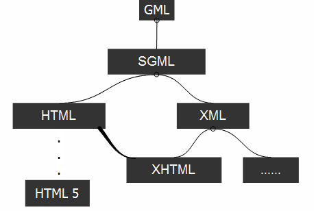
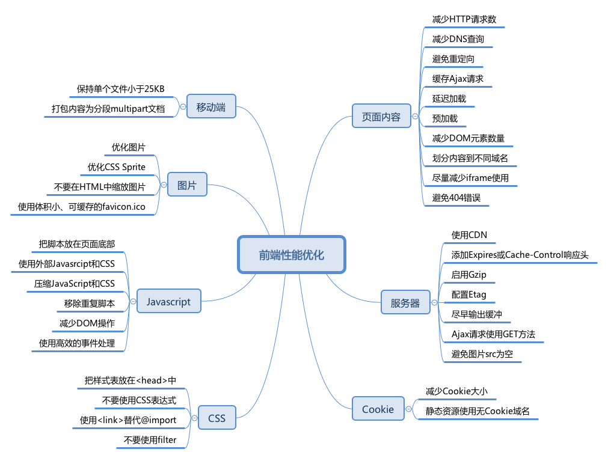
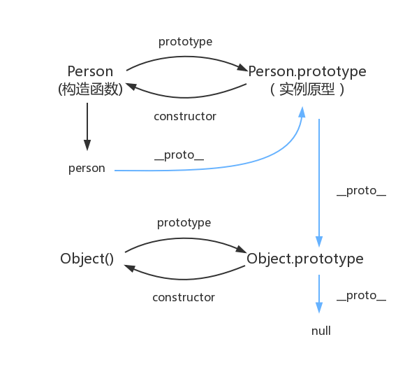

# 101-200天 [前端面试 3+1](https://github.com/haizlin/fe-interview/blob/master/category/history.md) & 个人答案总结

> [ 🌎 | ✅ | 📎 ] 每日一刷

<ClientOnly>
<ProgressBar completedClass=".theme-default-content>h2" :maxNumber="100" testRegStr="."/>
</ClientOnly>

## 第200天 (2019.11.02)

### ✅ [html] [你知道p标签和br标签两者的区别是什么吗？](https://github.com/haizlin/fe-interview/issues/1468)

- p 表示一个段落，块级元素，双标签
- br 表示换行，行内元素，单标签

### ✅ [css] [如何用css自定义滚动条？能做到所有浏览器兼容吗？想要做兼容怎么办呢？](https://github.com/haizlin/fe-interview/issues/1469)

```css
/*自定义滚动条*/
::-webkit-scrollbar {
    width: 6px;
    height: 6px;
    background-color: #F5F5F5;
}
::-webkit-scrollbar-track {
    background-color: #F5F5F5;
}
::-webkit-scrollbar-thumb {
    background-color: #999;
}
::-webkit-scrollbar-thumb:hover {
    background-color: #777;
}
::-webkit-scrollbar-thumb:active {
    background-color: #555;
}
```

兼容性不是太好，比如上面代码仅支持 webkit/blink 内核浏览器。如果要做兼容则须用 JS 模拟滚动条，不过这样可能影响性能。

### 🌎 [js] [页面的编码和被请求的资源编码不一致时如何处理？](https://github.com/haizlin/fe-interview/issues/1470)

统一字符串编码格式，不进行无意义的转码

### 🌎 [软技能] [你要是在家时，公司网站出问题了你是怎么解决的？](https://github.com/haizlin/fe-interview/issues/1471)

远程 桌面 连接

## 第199天 (2019.11.01)

### ✅ [html] [如何在页面中插入TAB符号（制表符）](https://github.com/haizlin/fe-interview/issues/1464)

```html
这是一个制表符：
	
使用HTML实体
&#x0009;
```

### ✅ [css] [border-radius:50%和border-radius:100%有什么区别？](https://github.com/haizlin/fe-interview/issues/1465)

border-radius 使用一个半径时确定一个圆形，使用两个半径时确定一个椭圆。如果值为百分比则这个半径是当前边的百分比，50%是当前边的一半，所以呈现圆形。
如果从50%增加至100%，其中不会有任何变化，因为W3C有“曲线重合”的规范，不要这样写，因为浏览器会进行不必要的计算。

参考：https://developer.mozilla.org/zh-CN/docs/Web/CSS/border-radius

### ✅ [js] [ajax的请求状态有哪几种？（XMLHttpRequest.readyState）](https://github.com/haizlin/fe-interview/issues/1466)

XMLHttpRequest.readyState 状态有如下几种（参考 [MDN](https://developer.mozilla.org/zh-CN/docs/Web/API/XMLHttpRequest/readyState) ）：

| 值   | 状态               | 描述                                                |
| ---- | ------------------ | --------------------------------------------------- |
| `0`  | `UNSENT`           | 代理被创建，但尚未调用 open() 方法。                |
| `1`  | `OPENED`           | `open()` 方法已经被调用。                           |
| `2`  | `HEADERS_RECEIVED` | `send()` 方法已经被调用，并且头部和状态已经可获得。 |
| `3`  | `LOADING`          | 下载中； `responseText` 属性已经包含部分数据。      |
| `4`  | `DONE`             | 下载操作已完成。                                    |

### ✅ [软技能] [假设有一个场景，需要前端自己计算十万级别或更多的数据，你有解决什么方案呢？](https://github.com/haizlin/fe-interview/issues/1467)

使用 WebWorker。

## 第198天 (2019.10.31)

### ✅ [html] [说下cookie都有哪些缺点？](https://github.com/haizlin/fe-interview/issues/1460)

- 容量限制4KB
- 会随着请求一起发送，耗费带宽
- 明文传输，不安全
- 不能跨域使用
- 浏览器操作数据不便
- 有过期时间，不能永久保存

### ✅ [css] [如何使用CSS实现段落首字母或首字放大效果？](https://github.com/haizlin/fe-interview/issues/1461)

- 方法一：使用选择器控制第一个字符的样式 `div::first-letter {}`
- 方法二：使用CSS属性设置第一个字母大写 `text-transform: capitalize;`

### ✅ [js] [请介绍下js的数据类型](https://github.com/haizlin/fe-interview/issues/1462)

- 基本类型：Boolean, String, Number, null, undefined, Symbol
- 引用类型：Object

### 🌎 [软技能] [你有做过H5的游戏开发吗？说说它的开发步骤](https://github.com/haizlin/fe-interview/issues/1463)

## 第197天 (2019.10.30)

### ✅ [html] [举例说明a标签的作用都有哪些？](https://github.com/haizlin/fe-interview/issues/1456)

- 超链接：`href="/test"`
- 电话/邮件：`href="tel:10086"` `href="mailto:test@example.com`
- 下载文件：`download`
- 利用URL Scheme打开app：`href="zhihu://answers/499020040"`
- 锚点：`href="#test"`

### ✅ [css] [如何给段落的首行缩进？](https://github.com/haizlin/fe-interview/issues/1457)

利用 text-indent 属性。

### ✅ [js] [写一个方法找出一段话里面出现频率最多的词](https://github.com/haizlin/fe-interview/issues/1458)

```js
const texts = 'I have a pen, I have an apple, Uh! apple pen. Pen pineapple apple pen.'
const mostFrequentWord = Object.entries(
      texts.toLowerCase()
      .split(/[\s\,\.\!\?;]/)
      .filter(word => word)
      .reduce((sum, word) => ({ ...sum, [word]: (sum[word] || 0) + 1 }), {})
    ).sort((a, b) => b[1] - a[1])[0];													

console.log(mostFrequentWord);		// ["pen", 4]
```

### 🌎 [软技能] [你有做过Hybrid APP开发吗？说说你的经验](https://github.com/haizlin/fe-interview/issues/1459)

## 第196天 (2019.10.29)

### ✅ [html] [请举例说明关于html的引用标签有哪些？](https://github.com/haizlin/fe-interview/issues/1452)

- [`blockquote`](https://developer.mozilla.org/zh-CN/docs/Web/HTML/Element/blockquote) 标签
  - 表示内容为引用内容，使用 `cite` 标签包裹引文出处
- [`q`](https://developer.mozilla.org/zh-CN/docs/Web/HTML/Element/q) 标签
  - 表示短的行内引用文本，会自带双引号

### 🌎 [css] [你有去看过或者了解过css的标准文档吗？](https://github.com/haizlin/fe-interview/issues/1453)
### ✅ [js] [请使用js实现一个省市县级联的效果](https://github.com/haizlin/fe-interview/issues/1454)

```vue
<template>
  <el-form-item label="地址：" prop="address_3">
    <template v-if="pcaList">
      <el-select v-model="roons.address_1" filterable clearable>
        <el-option
          v-for="item in provinces"
          :key="item"
          :label="item"
          :value="item"
        >
        </el-option>
      </el-select>
      <el-select v-model="roons.address_2" filterable clearable>
        <el-option
          v-for="item in cities"
          :key="item"
          :label="item"
          :value="item"
        >
        </el-option>
      </el-select>
      <el-select v-model="roons.address_3" filterable clearable>
        <el-option
          v-for="item in areas"
          :key="item"
          :label="item"
          :value="item"
        >
        </el-option>
      </el-select>
    </template>
    <template v-else>...</template>
  </el-form-item>
</template>

<script>
  import TagChooser from "@/components/TagChooser"

  export default {
    data() {
      return {
        roons: {
          address_1: "", //"广东省",
          address_2: "", //"深圳市",
          address_3: "", //"宝安区",
          address_4: "", //"广东省深圳市宝安区",
        },
        pcaList: null,
      }
    },
    watch: {
      'roons.address_1'() {
        if (!this.editMode) {
          this.roons.address_2 = ''
          this.roons.address_3 = ''
        }
      },
      'roons.address_2'() {
        if (!this.editMode) {
          this.roons.address_3 = ''
        }
      }
    },
    computed: {
      provinces() {
        return Object.keys(this.pcaList)
      },
      cities() {
        const cities = this.pcaList[this.roons.address_1]
        if (cities) {
          return Object.keys(cities)
        }
        this.roons.address_2 = ''
        return []
      },
      areas() {
        const cities = this.pcaList[this.roons.address_1]
        if (cities) {
          return cities[this.roons.address_2]
        }
        this.roons.address_3 = ''
        return []
      }
    },
    mounted() {
      this.getPcaList()
    },
    methods: {
      getPcaList() {
        // https://github.com/modood/Administrative-divisions-of-China/blob/master/dist/pca.json
        return common.pcaList().then(list => {
          this.pcaList = list
        })
      }
    }
  }
</script>
```

数据来源：

- https://github.com/modood/Administrative-divisions-of-China
- 另请参阅：http://wecatch.me/china_regions/

### 🌎 [软技能] [你是计算机专业的吗？你们上学都学了哪些内容？](https://github.com/haizlin/fe-interview/issues/1455)

## 第195天 (2019.10.28)

### ✅ [html] [请举例说明html支持的数学符号有哪些？](https://github.com/haizlin/fe-interview/issues/1448)

[HTML 符号实体参考手册](https://www.runoob.com/tags/html-symbols.html)

### 🌎 [css] [你知道CSS的标准发布流程吗？](https://github.com/haizlin/fe-interview/issues/1449)
### ✅ [js] [用js实现一个轮播图，并简述有哪些实现的方法](https://github.com/haizlin/fe-interview/issues/1450)

- 使用 setInterval 控制自动播放
- 使用绝对定位控制显示第几张图
- 使用动态更行DOM位置实现无缝切换

代码：https://github.com/canwdev/notes-vuepress/tree/master/docs/.vuepress/public/files/effects/my-effects/slides

### 🌎 [软技能] [你知道开发好的功能要自测吗？你一般是怎么自测的呢？](https://github.com/haizlin/fe-interview/issues/1451)

## 第194天 (2019.10.27)

### ✅ [html] [html的标签属性bgcolor支持简写吗？如：bgcolor="#F00"](https://github.com/haizlin/fe-interview/issues/1444)

该特性已经从 Web 标准中删除，虽然一些浏览器目前仍然支持它，但也许会在未来的某个时间停止支持，请尽量不要使用该特性。

### ✅ [css] [你最希望css拥有什么样的特性？（目前没有的）](https://github.com/haizlin/fe-interview/issues/1445)

嵌套语法

### 🌎 [js] [请使用纯js实现一个横向或纵向的无缝滚动效果](https://github.com/haizlin/fe-interview/issues/1446)

### 🌎 [软技能] [你有给自己制定过计划吗？怎么去落实的？](https://github.com/haizlin/fe-interview/issues/1447)

## 第193天 (2019.10.26)

### ✅ [html] [举例说明ul、dl、ol三个标签的区别？](https://github.com/haizlin/fe-interview/issues/1440)

- ul/ol 分别表示无序、有序列表，子元素可以是 li
- [dl](https://developer.mozilla.org/zh-CN/docs/Web/HTML/Element/dl) 用来表示术语定义和描述列表，子元素可以是 dt（术语）、dd（描述）

### ✅ [css] [解释下为什么css的reset不建议直接这么写：*{ margin:0; padding:0;}？](https://github.com/haizlin/fe-interview/issues/1441)

使用通配符选择器（*）会遍历所有元素，非常影响性能。

### 🌎 [js] [请写一个获取颜色的正则](https://github.com/haizlin/fe-interview/issues/1442)

### ✅ [软技能] [在工作中，你对开发环境有什么要求吗？](https://github.com/haizlin/fe-interview/issues/1443)

- 电脑：i5+8G内存+固态硬盘应该是入门级配置

## 第192天 (2019.10.25)

### ✅ [html] [html的a标签属性rel="noopener"有什么作用？](https://github.com/haizlin/fe-interview/issues/1436)

当我们使用`targer=_blank`打开一个新的标签页时, 新页面的window对象上有一个属性 opener, 它指向的是前一个页面的 window 对象, 因此, 后一个页面就获得了前一个页面的控制权. 甚至在跨域的情况下也可以生效, 你可以使用 `window.opener.location.replace` 更改前一个页面的url.
使用 `rel=noopener` 可以把 `window.opener` 置为空, 老一些的浏览器可以使用 `rel=noreferer`.

### ✅ [css] [为什么说不提倡用1px的小尺寸图片做背景平铺？](https://github.com/haizlin/fe-interview/issues/1437)

因为1px的图片不如用 background-color 实现

### 🌎 [js] [请用js实现一个简单的小区楼的电梯运行程序](https://github.com/haizlin/fe-interview/issues/1438)

### ✅ [软技能] [你有在linux下编程过吗？有使用过mac系统吗？说下它和win系统的区别？](https://github.com/haizlin/fe-interview/issues/1439)

- 都用过，类NGINX的系统对命令行支持更友好
- Linux 下没有常用的办公软件（微信、QQ），移植版的很难用，需要装 Windows 虚拟机，另外Linux的显卡驱动程序是个坑
- macOS 操作习惯了以后还是很爽的，但十分依赖苹果生态
- Windows 下有大量效率工具，配合 Linux 虚拟机可以达到极致效能

## 第191天 (2019.10.24)

### ✅ [html] [怎么使用HTML5实现录音的功能？](https://github.com/haizlin/fe-interview/issues/1432)

使用 [MediaDevices.getUserMedia()](https://developer.mozilla.org/en-US/docs/Web/API/MediaDevices/getUserMedia)

### ✅ [css] [举例说明css有哪些简写的属性和属性值？](https://github.com/haizlin/fe-interview/issues/1433)

border/background/animation/flex/padding/margin/transition

### ✅ [js] [举例说明atob和btoa的用法](https://github.com/haizlin/fe-interview/issues/1434)

将字符串转换成base64编码、或者解码。

```js
btoa('hello') //"aGVsbG8="
atob('aGVsbG8') //"hello"

// 对于超过 Latin1 范畴的字符，可以使用 encodeURI/decodeURI 进行转换：
btoa(encodeURI('字')) // "JUU1JUFEJTk3"
decodeURI(atob('JUU1JUFEJTk3')) // "字"
```

### ✅ [软技能] [你有用记事本来写过代码吗？说说你的感受！](https://github.com/haizlin/fe-interview/issues/1435)

嘿，还真有过。在重装系统时无聊用记事本写代码，贼难用：

- 默认编码格式 ANSI 在 utf-8 里会乱码
- tab 不是空格，而且过长，不能自动缩进
- 没有任何自动补全和提示，适合高手使用！
- 写写纯文本文档还行。

## 第190天 (2019.10.23)

### 📎 [html] [主框架如何与iframe通信？如何解决跨域？](./contents/190-1.md)
### ✅ [css] [请说说颜色中#F00的每一位分别表示什么？为什么会有三位和六位的表示呢？](https://github.com/haizlin/fe-interview/issues/1429)

- `#F00`是`#FF0000`的简写，其中每两个数字为一组，分别代表 R、G、B 的 16 进制数值。
- 转换成rgb相当于 `rgb(255, 0, 0)`

### ✅ [js] [用原生js实现类似getElementsByClassName的方法，不能使用querySelectorAll](https://github.com/haizlin/fe-interview/issues/1430)

```js
function getElementsByClassName(className) {
    const tags = document.getElementsByTagName('*');
    const tempTags = [];
    for(let i=0, len = tags.length; i< len; i++)
    {
        let tag = tags[i];
        tag.classList.contains(className) && tempTags.push(tag)
    }
    return tempTags;
}
```

### ✅ [软技能] [强类型和弱类型语言的区别是什么？](https://github.com/haizlin/fe-interview/issues/1431)

- 强类型：声明变量时需指定数据类型，一旦指定则不可改变
- 弱类型：变量没有数据类型的限制，可以随意修改变量的数据类型

## 第189天 (2019.10.22)

### 🌎 [html] [有哪些方法可以将图片和文字显示在同一行上呢？](https://github.com/haizlin/fe-interview/issues/1417)

使用 inline 或 flex 布局

### 🌎 [css] [请使用css写一个多级的下拉菜单](https://github.com/haizlin/fe-interview/issues/1418)
### 🌎 [js] [写一个方法将html页面生成为图片](https://github.com/haizlin/fe-interview/issues/1419)

html2canvas

### ✅ [软技能] [你觉得该不该写注释？你写注释的原则是什么？](https://github.com/haizlin/fe-interview/issues/1420)

一定要写，不仅写给自己看，还要写给别人看。在代码逻辑复杂的情况下写注释，其他情况保证代码可读就可以了。

## 第188天 (2019.10.21)

### ✅ [html] [png8和png24有什么区别呢？](https://github.com/haizlin/fe-interview/issues/1413)

- 颜色深度不同，png 8 每个像素可存 8 bit 的数据，`2^8=256` 因此每像素可以存储 256 种颜色。
- png 24 相当于 `3*8=24`，也就是说用三个 8 bit 分别存放 R、G、B 三基色，即 `256*256*256=16777216` 种颜色。
- png 32 在 png 24 之上多了一个透明度通道。

参考：[PNG图片压缩原理解析](https://juejin.im/post/6844903798658318343)

### ✅ [css] [用css给一个元素加边框有哪些方法？](https://github.com/haizlin/fe-interview/issues/1414)

[参考](https://github.com/haizlin/fe-interview/issues/1414#issuecomment-544439771)

```css
:scope {
  border: 3px solid black;

  box-shadow: 0 0 0 1px black; /*不影响布局,无限叠加*/

  outline: 1px solid black; /*不支持圆角*/

  background-image: url("data:image/svg+xml,%3Csvg xmlns='http://www.w3.org/2000/svg'%3E%3Crect width='100%25' height='100%25' stroke='%23000' fill='transparent'/%3E%3C/svg%3E");

  background-clip: content-box; /*形成透明边框*/
  padding: 1px;

  border-image: linear-gradient(red, black) 1;
  border: 1px solid;
}
```

### ✅ [js] [stopPropagation()和preventDefault()这两个方法有什么区别？](https://github.com/haizlin/fe-interview/issues/1415)

- 阻止冒泡：阻止事件向外扩散
- 阻止默认行为：阻止浏览器的默认行为，如 form 刷新，右键点击弹出菜单等

<!-- ### 🌎 [软技能] [你有听说过“分词”吗？说说你对它的理解](https://github.com/haizlin/fe-interview/issues/1416) -->

## 第187天 (2019.10.20)

<!--### 🌎 [html] [placeholder如何在兼容IE？](https://github.com/haizlin/fe-interview/issues/1408)-->
### ✅ [css] [相邻兄弟选择器、后代选择器和子选择器三者有什么区别？](https://github.com/haizlin/fe-interview/issues/1409)

选择的对象不同：
- 相邻兄弟选择器：`a+a {}` 选择 a 的相邻兄弟元素，不包括第一个 a
- 后代选择器：`div a {}` 选中 div 元素下所有为 a 的元素
- 子选择器：`div>a {}` 仅选中 div 素的子元素 a

### ✅ [js] [你有使用过FileReader吗？说说它有哪些应用场景？](https://github.com/haizlin/fe-interview/issues/1410)

[`FileReader`](https://developer.mozilla.org/zh-CN/docs/Web/API/FileReader) 对象允许Web应用程序异步读取存储在用户计算机上的文件（或原始数据缓冲区）的内容，使用 `File` 或 `Blob` 对象指定要读取的文件或数据。

应用场景：

- 读取用户选择的文件（File），或网络上的 Blob 文件
- 由于是异步读取，适合读取较大的文件

### 🌎 [软技能] [你知道什么是人工智能和机器学习吗？说说你对它们的理解认知](https://github.com/haizlin/fe-interview/issues/1411)

## 第186天 (2019.10.19)

### 🌎 [html] [举例说明如何实现浏览器桌面通知？](https://github.com/haizlin/fe-interview/issues/1403)

websocket + Notification API

### ✅ [css] [举例说明你对相邻兄弟选择器的理解](https://github.com/haizlin/fe-interview/issues/1404)

```
li+li {}
```

可以选中除了第一个 li 后面的所有相邻兄弟 li 元素。

### 🌎 [js] [当用户刷新网页时，js的请求有哪些地方会有缓存处理呢？](https://github.com/haizlin/fe-interview/issues/1405)

- Service Worker
- Memory Cache
- Disk Cache
- Push Cache

### 🌎 [软技能] [你知道什么是PDCA吗？要怎么运用好它呢？](https://github.com/haizlin/fe-interview/issues/1406)

## 第185天 (2019.10.18)

### 📎 [html] [HTML5如何唤醒APP？](https://github.com/haizlin/fe-interview/issues/1383)

> 第68天

### 📎 [css] [你是怎么设计css sprites（精灵图）的？有哪些技巧？](https://github.com/haizlin/fe-interview/issues/1384)

### ✅ [js] [onload事件和DOMContentLoaded哪个先执行呢？](https://github.com/haizlin/fe-interview/issues/1385)

- DOMContentLoaded 先执行。
- DOMContentLoaded 相当于 jQuery 中的 `$(document).ready(function)`，在 DOM 加载完成后立即执行，onload 事件在所有资源（包括图片、样式）加载完成后才执行。

### 🌎 [软技能] [你知道什么是域名备案吗？备案有什么用？可以不备案吗？](https://github.com/haizlin/fe-interview/issues/1386)

## 第184天 (2019.10.17)

### ✅ [html] [如何给一个下拉选项进行分组？](https://github.com/haizlin/fe-interview/issues/1379) (optgroup)

<select name="city">
	<optgroup label="山东">
		<option value="1">青岛</option>
		<option value="2">青岛</option>
		<option value="3">威海</option>
	</optgroup>
	<optgroup label="安徽">
		<option value="1">蚌埠</option>
		<option value="2">合肥</option>
		<option value="3">宿州</option>
	</optgroup>
</select>

```html
<select name="city">
	<optgroup label="山东">
		<option value="1">青岛</option>
		<option value="2">青岛</option>
		<option value="3">威海</option>
	</optgroup>
	<optgroup label="安徽">
		<option value="1">蚌埠</option>
		<option value="2">合肥</option>
		<option value="3">宿州</option>
	</optgroup>
</select>
```

### ✅ [css] [请描述下你对translate()方法的理解](https://github.com/haizlin/fe-interview/issues/1380)

```
transform: translate(x,y)
transform: translate3d(x,y,z) 
```

translate 是二维平面变换，让一个元素在当前位置进行偏移，在平面直角座标系中，x增加是往右移动，y增加是往下移动。
translate3d 多了一个空间维度z，可以理解为眼睛到屏幕之间的距离，z越大元素离眼睛越近。

### ✅ [js] [说下你对面向对象的理解](https://github.com/haizlin/fe-interview/issues/1381)

世间万物皆可抽象为对象的类，类实例化出多个对象，每一个对象都拥有自己的属性、方法，并且可以继承父类的特征。

### 🌎 [软技能] [你上家公司的接口是怎么管理的？](https://github.com/haizlin/fe-interview/issues/1382)

- Postman
- Yapi
- Swagger UI

## 第183天 (2019.10.16)

### 📎 [html] [HTML5的output是非常棒的一个标签，你对它有了解吗？](https://github.com/haizlin/fe-interview/issues/1375)

> [第162天 (2019.09.25) [html]](#第162天-2019-09-25) 

### ✅ [css] [怎样去除图片自带的边距？](https://github.com/haizlin/fe-interview/issues/1376)

有多种方案：

- 设置图片的 `vertical-align: middle;` (默认值是 `baseline`)
- 父级容器使用 flex 布局
- 父级容器设置：`font-size: 0`
- 设置图片 `display: block`

### ✅ [js] [在js中函数返回多个值有哪些方法？](https://github.com/haizlin/fe-interview/issues/1377)

将多个值放到数组或对象内返回

### 🌎 [软技能] [说说你对AMD、CMD和CommonJS的理解](https://github.com/haizlin/fe-interview/issues/1378#issuecomment-542516480)

- CommonJS: 是 Node.js 的规范，特点是同步。
- AMD：require.js 推崇依赖前置、提前执行。
- CMD：sea.js 推崇依赖就近、延迟执行。
- ES6 Module：目前最常用的前端方案，在 webpack 中得到泛用。

## 第182天 (2019.10.15)

### ✅ [html] [举例说明HTML5的标签meter的用法](https://github.com/haizlin/fe-interview/issues/1371)

meter 标签和 progress 标签很像，用于显示进度：

<meter value="3" min="0" max="10">3/10</meter><br>
<meter value="0.6">60%</meter>

```html
<meter value="3" min="0" max="10">3/10</meter><br>
<meter value="0.6">60%</meter>
```

### ✅ [css] [让你手写一个reset的文件，你应该怎么写？要考虑哪些方面呢？](https://github.com/haizlin/fe-interview/issues/1372)

reset 用来重置浏览器的默认样式，要考虑到不同浏览器的兼容性差异，并且尽量不要用通配符，因为这样会降低性能。

### ✅ [js] [为什么说js是弱类型语言，它的优缺点分别是什么？](https://github.com/haizlin/fe-interview/issues/1373)

因为 JS 的变量在声明以后可以改变类型，或者说变量本身没有类型的限制。优点是写法灵活不受类型的限制；缺点是不同类型的赋值不能在编译期间发现问题，从而导致潜在的bug。

### ✅ [软技能] [你知道什么是ECMAScript吗？](https://github.com/haizlin/fe-interview/issues/1374)

ECMAScript 是一份语言规范，可以有多种实现，JavaScript 就是一种 ECMAScript 的实现。

## 第181天 (2019.10.14)

### ✅ [html] [请使用纯HTML制作一个进度条](https://github.com/haizlin/fe-interview/issues/1367)

<progress value="87" max="100">70 %</progress>

```html
<progress value="70" max="100">70 %</progress>
```

### ✅ [css] [你知道css的预处理器和后处理器都有哪些吗？它们有什么区别呢？](https://github.com/haizlin/fe-interview/issues/1368)

- 预处理器：sass、stylus、less
- 后处理器：postCSS、各种压缩工具

前者增强了CSS语法，后者对标准的CSS语法进行优化

### 🌎 [js] [写一个密码生成器，并同时写一个密码强度校验的方法](https://github.com/haizlin/fe-interview/issues/1369)

### ✅ [软技能] [你有自己写过爬虫的程序吗？说说你对爬虫和反爬虫的理解？](https://github.com/haizlin/fe-interview/issues/1370)

写过一个基于 Node.js 的图片爬虫：[nodejs-crawler](https://github.com/canwdev/nodejs-crawler)

- 爬虫通过获取并解析HTML得到数据，然后批量下载数据
- 反爬虫手段可以使用验证码、客户端检测等方法

## 第180天 (2019.10.13)

### 📎 [html] [你有用过HTML5的track标签吗？说说它的运用场景有哪些？](./contents/118-1.md)
### 📎 [css] [请使用css画一个圆，方法可以多种](./contents/18-1.md)
### ✅ [js] [有什么方案可以提高无限滚动列表的性能？](https://github.com/haizlin/fe-interview/issues/1365)

- 使用虚拟化列表、减少DOM节点。
- 使用 `vue-infinite-scroll` 配合 `vue-virtual-scroller`

参考：https://blog.csdn.net/Cookysurongbin/article/details/103907030

### 📎 [软技能] [举例缓存头都有哪些？并说明它们的用处](./contents/79-1.md)

## 第179天 (2019.10.12)
### ✅ [html] htm、html、shtml三者有什么区别呢？

- htm 和 html 本质上是一个同一个东西：HTML，只是后缀不同
- shtml 是指支持 SSI（服务端内嵌） 的HTML，有点类似于在HTML里写PHP

### ✅ [css] css中最常用的字体有哪些？你是怎么选择字体的？

使用浏览器默认字体，衬线则用 Sans，非衬线用 Sans-Serif，这样不会涉及版权。

### ✅ [js] js如何把网页加入收藏夹功能？

ie下使用addFavorite，firefox使用bookmarks；Opera，Google Chrome和Safari不提供此功能；

### 🌎 [软技能] 说下你对可视化开发的理解

可以用鼠标拖拽快速的生成一些简单的页面，但不能定制复杂的功能，有局限性。

## 第178天 (2019.10.11)

### ✅ [html] [你有用过HTML5的requestAnimationFrame吗？它运用的场景有哪些呢？](https://github.com/haizlin/fe-interview/issues/1341)

requestAnimationFrame方法是h5提供的一种专门解决动画更新的API，浏览器会自动以最合适的频率去刷新动画，不需要自行设置刷新时间。与setTimeout相比，requestAnimationFrame最大的优势是由系统来决定回调函数的执行时机。除此以外，还可以节省CPU，函数节流。

### ✅ [css] [请举例说明css有哪些不可继承的属性？](https://github.com/haizlin/fe-interview/issues/1342)

1、display：规定元素应该生成的框的类型

2、文字样式：

vertical-align：垂直文本对齐

text-decoration：规定添加到文本的装饰

text-shadow：文本阴影效果

white-space：空白符的处理

unicode-bidi：设置文本的方向

3、盒子模型的属性：width、height、margin、border、padding

4、背景属性：background

5、定位属性：float、clear、position、top、right、bottom、left、min-width、min-height、max-width、max-height、overflow、clip、z-index

6、生成内容属性：content、counter-reset、counter-increment

7、轮廓样式属性：outline

可以参考 [W3C CSS2.1 Full property table](https://www.w3.org/TR/CSS21/propidx.html)

### ✅ [js] [你知道什么是三元表达式吗？“三元” 表示什么意思？使用三元表达式应该注意些什么问题？](https://github.com/haizlin/fe-interview/issues/1343)

```js
const result = a ? b : c
```

其中 a、b、c 三个变量即“三元”，需要注意执行顺序的问题，如果逻辑过于复杂则建议使用 if else 便于理解。

### 🌎 [软技能] [当线上代码出现问题了，你该怎么排查呢？](https://github.com/haizlin/fe-interview/issues/1344)

1. 复现bug
2. 查看日志 + 使用 devtools 断点调试
3. 修复

## 第177天 (2019.10.10)

### 📎 [html] [网站首页有大量的图片，加载很慢，要是你，你该怎么去优化呢？](./contents/35-4.md)

### ✅ [css] [你有使用过preload、preconnect、prefetch这些属性吗？说说它们都有什么作用？](https://github.com/haizlin/fe-interview/issues/1338)

预加载资源，当资源需要使用时直接从缓存中读取

### ✅ [js] [说下你对函数的形参与实参的理解](https://github.com/haizlin/fe-interview/issues/1339)

**形参**：声明函数时，设置的参数。
**实参**：函数调用时，代入的参数。

```
function add(a,b){
  return a+b
}
add(1,2)
```

在以上代码中a,b就是**形参**，1和2就是**实参**


### 🌎 [软技能] [当接到一个新的需求时，你的第一反应是什么？](https://github.com/haizlin/fe-interview/issues/1340)

- 分析可行性
- 排期，安排优先级

## 第176天 (2019.10.09)

### ✅ [html] [做好的页面都有在哪些浏览器上测过？](https://github.com/haizlin/fe-interview/issues/1333)

根据需求来测试，一般测试 Chrome，Firefox，Safari，IE11，Edge，手机上的杂牌浏览器（如微信）

### ✅ [css] [你是怎样对css文件进行压缩合并的？](https://github.com/haizlin/fe-interview/issues/1334)

- 使用在线工具，如 http://tool.lu/css
- 使用 webpack 插件 `optimize-css-assets-webpack-plugin`
- 使用 NGINX 开启 Gzip 功能

### 📎 [js] [请用js实现一个promise的方法](./contents/176-3.md)

### 🌎 [软技能] [在工作中，你觉得如何提高幸福指数呢？](https://github.com/haizlin/fe-interview/issues/1336)

不断地学习技能。

## 第175天 (2019.10.08)

### 📎 [html] [HTML5的哪些新特性是令你最兴奋的？](./contents/40-1.md)

### ✅ [css] [如果css文件过大时，如何异步加载它？](https://github.com/haizlin/fe-interview/issues/1330)

- 分割成多个CSS文件
- 进行Gzip压缩
- link preload

### ✅ [js] [请说说你对promise的理解](https://github.com/haizlin/fe-interview/issues/1331)

Promise是ES6中对回调的处理方案，用于处理回调过多，形成回调地狱，不直观的问题；Promise可以链式调用，代码直观易操作,并且有Promise.all, Promise.race等语法糖便于操作

### 🌎 [软技能] [你对“技术服务于生活”的理解是什么？](https://github.com/haizlin/fe-interview/issues/1332)

技术服务于资本

## 第174天 (2019.10.07)

### ✅ [html] [img、input标签它们是行内元素还是块级元素？](https://github.com/haizlin/fe-interview/issues/1315)

是行内元素，还是可置换元素。

### 📎 [css] [css3和css2的区别是什么？](./contents/2-2.md)

### ✅ [js] [你知道断点续传的原理吗？用js怎么实现？](https://github.com/haizlin/fe-interview/issues/1317)

利用HTTP协议的[请求范围](https://developer.mozilla.org/zh-CN/docs/Web/HTTP/Range_requests)，客户端使用请求头中的 Range 字段告诉服务端需要的数据范围，服务端的响应头 Content-Range 说明返回的数据范围和长度。

> IDM 的多线程下载可能就是利用这个原理。

### 🌎 [软技能] [你想当技术总监吗？你觉得技术总监应具备什么样的技能？](https://github.com/haizlin/fe-interview/issues/1318)

## 第173天 (2019.10.06)

### ✅ [html] [HTML的标签区分大小写吗？属性名区分大小写吗？](https://github.com/haizlin/fe-interview/issues/1311)

HTML标签和属性名均不区分大小写，强烈推荐统一使用小写。——[Stackoverflow](https://stackoverflow.com/questions/25033268/are-html5-data-attributes-case-insensitive)

### ✅ [css] [你有使用过字体图标吗？它有什么好处？](https://github.com/haizlin/fe-interview/issues/1312)

用过 iconfont，好处有很多：

- 支持单色、彩色图标，其中单色图标可以使用CSS轻松的调整颜色
- 体积小，使用方便，素材资源多
- 更新便捷

### ✅ [js] [清空一个数组的方式有哪些？它们有什么区别？](https://github.com/haizlin/fe-interview/issues/1313)

`let arr = [1, 2, 3]`

- 设置数组的 `length` 为 0，这将改变原数组：`arr.length = 0`
- 直接给数组赋值一个空数组：`arr = []`
- 使用数组 `.splice()` 方法，会改变原数组：`arr.splice(0, b.arr)`
- 最慢的方法，遍历数组，将每一项出栈：`while (arr.length > 0) { arr.pop() }`

### 🌎 [软技能] [从你的角度上来说下你对“产品经理”这个岗位的理解](https://github.com/haizlin/fe-interview/issues/1314)

连接需求方和实现方的桥梁，把需求转换成可以被实现的原型。

## 第172天 (2019.10.05)

### ✅ [html] [HTML的注释有几种写法？有什么规范吗？](https://github.com/haizlin/fe-interview/issues/1296)

一种：`<!--注释内容-->`，可以在单行写，也可以多行。

### ✅ [css] [你知道什么是流体排版吗？说说它的原理是什么？](https://github.com/haizlin/fe-interview/issues/1297)

在文档流中，内联元素按内联方向显示（默认是横向从左往右，ltr）；块元素则一个占据一行，从上到下显示。

### 📎 [js] [ES5和ES6、ES7有什么区别？](./contents/172-3.md)

### ✅ [软技能] [请解释下单线程与多线程之间的区别？](https://github.com/haizlin/fe-interview/issues/1299)

进程中可以包含多个线程，在单线程中前面代码的执行会阻塞后面代码的执行，除非使用了异步操作。多线程是指多个线程可以并行执行，充分利用多核CPU以提升效率。JS 是单线程的，但使用 WebWorkers 可以实现类似于多线程的操作。

## 第171天 (2019.10.04)

### ✅ [html] [怎样给radio分组呢？](https://github.com/haizlin/fe-interview/issues/1292)

对 `input[type=radio]` 使用相同的name 即可：

```html
<div>
    <label for="f">
        <input id="f" name="gender" type="radio" value="female" checked>
        <span>女</span>
    </label>
    <label for="m">
        <input id="m" name="gender" type="radio" value="male">
        <span>男</span>
    </label>
</div>
```

### ✅ [css] [请说说你对vh、vw的理解以及它们的运用场景是什么？](https://github.com/haizlin/fe-interview/issues/1293)

- vh 是相对于视口高度的百分比单位，vw 则是相当于视口宽度。如 `10vw` 是视口宽度的 10%。
- 运用场景：适合做响应式布局

### 🌎 [js] [写一个根据xpath获取元素的方法](https://github.com/haizlin/fe-interview/issues/1294)

### 📎 [软技能] [浏览器本地存储和服务器端存储有区别呢？](./contents/103-1.md)

## 第170天 (2019.10.03)

### ✅ [html] [你知道HTML什么是单闭合标签和双闭合标签吗？为何要分为这两种呢？](https://github.com/haizlin/fe-interview/issues/1287)

- 单标签如 `<meta />`，只需将标签名声明一遍，使用 `/` 为标签结尾，在 HTML 中，`<br>` `<hr>` `` 可以不用闭合 
- 双标签如 `<div></div>`，标签名需要在首尾各写一遍
- 区别：单标签与双标签都有属性，但双标签可以有内容，即 `innerHTML`

### ✅ [css] [css怎么更改表单的单选框或下拉框的默认样式？](https://github.com/haizlin/fe-interview/issues/1288)

- 单选框：隐藏 input 标签，自定义 CSS 使用 `:checked` 进行实现
- 下拉框：`select` 可以通过 `appearance: none` 去除默认样式，然后进行自定义，但 `option` 标签不能通过CSS自定义，最佳方法是自定义标签重写 `select`

### 📎 [js] [用js实现一个复制粘贴的功能](./contents/170-3.md)

### 🌎 [软技能] [说下你对预加载的理解？](https://github.com/haizlin/fe-interview/issues/1290)

利用浏览器空闲时间对资源进行提前加载，这样当需要使用该资源的时候就不需要发送请求（直接从缓存里得到），从而提升加载速度。参考 [MDN](https://developer.mozilla.org/zh-CN/docs/Web/HTTP/Link_prefetching_FAQ)

## 第169天 (2019.10.02)

### ✅ [html] [什么是Data URI？](https://github.com/haizlin/fe-interview/issues/1283)

  是一种在文档中嵌入小文件的方案，例如用 base64 编码的小图片 `data:image/jpeg;base64,（略）`。

### ✅ [css] [你了解css3的currentColor吗？举例说明它的作用是什么？](https://github.com/haizlin/fe-interview/issues/1284)

  `currentColor` 是当前文字的颜色，例如 `border` 的第三个属性默认就是：`border: thin solid currentColor;`。应用场景还有：`background-color | gradient | box-shadow`

### ✅ [js] [说说你对ArrayBuffer的理解！它和Array有什么区别？](https://github.com/haizlin/fe-interview/issues/1285)

  - ArrayBuffer：表示通用的、固定长度的原始二进制数据缓冲区。不可直接修改，要通过类型数组对象或 DataView 来操作
  - Array: 是 JS 数组，可直接修改

### 📎 [软技能] [你有做过直播相关开发吗？知道它的原理吗？](./contents/169-4.md)


## 第168天 (2019.10.01)

### 📎 [html] [你知道有哪些常见的视频（音频）编码格式和视频（音频）格式吗？](./contents/72-1.md)

### ✅ [css] [怎么去掉点击a链接或者图片出现的边框？](https://github.com/haizlin/fe-interview/issues/1280)

  ```css
  a:active,
  img:active {
      border: none;
      outline: none;
      text-decoration: none;  
  }
  ```

### ✅ [js] [如何解决在手机上长时间点击会选中图片？](https://github.com/haizlin/fe-interview/issues/1281)

  - 使用CSS：`pointer-events: none;`
  - 使用 `<div>` + `background-image` 代替 `` 元素

### ✅ [软技能] [写js代码时你喜欢哪种命名方式？](https://github.com/haizlin/fe-interview/issues/1282)

  - JS一般变量、函数：小驼峰 `handleClick`
  - 类名、组件命名：大驼峰 `NavBar`
  - 常量：全大写下划线分隔 `APP_NAME`
  - JS文件名：小写减号分隔 `dev-tools.js`

## 第167天 (2019.09.30)

### 📎 [html] [Shadow DOM和Virtual DOM有什么区别？](./contents/27-1.md)

### 📎 [css] [css的linear-gradient有什么作用呢？](./contents/167-2.md)

### 📎 [js] [你了解什么是AOP吗？它的作用是什么？举个例子](./contents/167-3.md)

### 🌎 [软技能] [这么多年来，你值得骄傲坚持的是什么？](https://github.com/haizlin/fe-interview/issues/1278)

## 第166天 (2019.09.29)

### [html] meta的属性有哪些组成？说说它们的分别有什么作用？

重复：[【第28天-[html] 说说你对<meta>标签的理解】](./fe-interview-3plus1-100.md#第28天-2019-05-14)

### [css] 会引起Reflow和Repaint的操作有哪些？（回流和重绘）

参考：https://github.com/haizlin/fe-interview/issues/1272#issuecomment-536312805

- 回流： 当Render Tree中部分或全部元素的尺寸、结构、或某些属性发生改变时，浏览器重新渲染部分或全部文档
  - 页面首次渲染
  - 浏览器窗口大小发生改变
  - 元素尺寸或位置发生改变
  - 元素内容变化（文字数量或图片大小等等）
  - 元素字体大小变化
  - 添加或者删除可见的DOM元素
  - 激活CSS伪类（例如：:hover）
  - 查询某些属性或调用某些方法
- 重绘：当页面中元素样式的改变并不影响它在文档流中的位置时（例如：color、background-color、visibility等），浏览器会将新样式赋予给元素并重新绘制它

### [js] 怎么下载一个zip文件？

参考：https://github.com/haizlin/fe-interview/issues/1273#issuecomment-536316228

- a标签加`download`属性

```html
<!-- download:指定下载文件的文件名 -->
<a href="http://somehost/somefile.zip" download="filename.zip">Download file</a>
```

- 文件流的方式

```js
var a = document.createElement('a');
var url = window.URL.createObjectURL(blob);
var filename = 'what-you-want.txt';
a.href = url;
a.download = filename;
a.click();
window.URL.revokeObjectURL(url);
```

> 注意：Bolb的方式构建完 blob 对象后才会转换成文件，所以尽量使用a标签的形式进行下载

- [[软技能] 如何对前端资源进行优化？](./contents/35-4.md)

## 第165天 (2019.09.28)
### [html] 为什么HTML5里面我们不需要DTD？

HTML5 不基于 SGML，因此不需要对DTD进行引用，但是需要doctype来规范浏览器的行为。

### [css] 你有用过clip-path吗？说说你对它的理解和它都有哪些运用场景？

clip-path CSS 属性使用裁剪方式创建元素的可显示区域。区域内的部分显示，区域外的隐藏。

```css
.demo {
    margin: 15px auto;
    width: 400px;
    height: 400px;
    background: #ffc2c2;
    clip-path:;
}
```

- `clip-path: url(#cross);` 指定一个 svg 作为裁剪。

    ```svg
    <svg height="0" width="0">
      <defs>
        <clipPath id="cross">
          <rect y="100" x="100" width="90" height="90"></rect>
          <rect x="0" y="100" width="90" height="90"></rect>
          <rect x="100" y="0" width="90" height="90"></rect>
          <rect x="0" y="0" width="90" height="90"></rect>
        </clipPath>
      </defs>
    </svg>
    ```

- `    clip-path: circle(40%);` 设定一个圆形的裁剪，内容占据40%空间

- 更多使用方式，参考[MDN](https://developer.mozilla.org/zh-CN/docs/Web/CSS/clip-path)

- [CSS clip-path maker](http://bennettfeely.com/clippy)

- [[js] 举例说明如何使用WebSQL？](./contents/61-1.md)

### [软技能] 说说你对前端工程师日常的开发流程的理解

> ~~周一摸鱼、周二摸鱼、周三摸鱼、周四需求出来了开始赶进度，晚上加班，周五接着赶进度加班，晚上上线；周六出bug了在家修bug，周日躺。~~

1. 接到需求（原型图/UI图）
2. 分析功能点、难点（需要研究）
3. 拆分任务、分配人员、确定接口、规划时间
4. 写代码，填坑，记录问题到博客，写文档
5. 提交代码、代码审查、发布测试环境
6. 测试人员测试并提交bug清单
7. 修复bug、提交代码、测试，循环
8. 上线

https://github.com/haizlin/fe-interview/issues/1270

### 第164天 (2019.09.27)

### [html] 前端路由指的是什么？它有什么好处？它有哪些方式可以实现呢？

- 前端路由是单页应用（SPA）中根据url变化动态切换组件（或DOM）的一套系统
- 好处是无需刷新页面即可控制页面内容的变化、本地加载提升速度、前后端代码解耦
- 可以使用 vue-router。基本原理是监听 hash 变化和使用 History API

### [css] 你是怎么选择resetting和normalizing的？为什么？

重复：【第115天】Reset CSS和Normalize CSS的区别是什么？

### [js] 举例说明js如何拖拽排序？

使用 [拖放API（第62天）](./fe-interview-3plus1-100.md#第62天-(2019.06.17))

参考：https://github.com/haizlin/fe-interview/issues/1265#issue-499104854

### [软技能] 你平时是如何管理项目的？

> https://github.com/haizlin/fe-interview/issues/1266

## 第163天 (2019.09.26)

### [html] xpath和dom有什么区别？

- [XPath](https://www.runoob.com/xpath/xpath-tutorial.html) 是一门在 XML 文档中查找信息的语言。
- HTML 是一种用于创建网页的标准标记语言。对应的解析语言是 JavaScript

### [css] position跟margin collapse这些特性相互叠加后会怎么样？

重复：[第157天 CSS](#第157天-2019-09-20)

### [js] 怎样在JavaScript中创建一个worker线程？

```js
var worker = new Worker('work.js');
```

重复：第53天 html

### [软技能] 移动端的性能优化有哪些方法？

重复：第35天 软技能

## 第162天 (2019.09.25)

### [html] 你有使用过HTML5的output吗？说说它的作用是什么？

HTML [`<output>`](https://developer.mozilla.org/zh-CN/docs/Web/HTML/Element/output) 标签表示计算或用户操作的结果。

```html
<form oninput="result.value=parseInt(a.value)+parseInt(b.value)">
  <input type="range" name="b" value="50" /> +
  <input type="number" name="a" value="10" /> =
  <output name="result"></output>
</form>
```

### [css] 移动端的布局用过媒体查询吗？写一个试试

```css
@media screen and (max-width: 375px) {
  .selector {
  }
}
```

[MDN](https://developer.mozilla.org/zh-CN/docs/Web/Guide/CSS/Media_queries)

### [js] 写个给图片加水印的方法

- 使用 Canvas 为图片加水印

```js
/**
 * 为图片加水印
 * 参考：https://github.com/haizlin/fe-interview/issues/1257#issuecomment-534810442
 * @param {*} image img元素
 * @param {*} words 水印内容文本
 */
function generateWatermark(image, words) {
  const { canvas, context } = getCanvas()
  let width = image.width
  let height = image.height
  canvas.width = width
  canvas.height = height
  canvas.style.width = image.style.width
  canvas.style.height = image.style.height

  context.drawImage(image, 0, 0)

  // 重复绘制内容贴图
  const mark = getMark(words)
  for (let i = 0; i < width; i += 250) {
    for (let j = 0; j < height; j += 250) {
      context.drawImage(mark, i, j)
    }
  }
  console.log(canvas)
  return toImage(canvas)
}

function toImage(canvas) {
  var image = new Image()
  image.src = canvas.toDataURL('image/png')
  console.log(canvas)
  return image
}

// 构造内容
function getMark(content = '') {
  const { canvas, context } = getCanvas()
  canvas.width = 200
  canvas.height = 200
  context.translate(100, 100)
  context.rotate((45 * Math.PI) / 180)
  context.font = '30px 微软雅黑'
  context.textAlign = 'center'
  context.fillStyle = 'rgba(220,20,60, 0.5)'

  const words = content.split('\n') // 以\n为换行
  const lines = words.length
  const fontHeight = context.measureText('田').width * 1.1
  const wordsHeight = fontHeight * lines
  const start = -wordsHeight / 2
  for (let i = 0; i < lines; i++) {
    context.fillText(words[i], 0, start + i * fontHeight)
  }
  return canvas
}

function getCanvas() {
    const canvas = document.createElement('canvas')
    return {
      canvas,
      context: canvas.getContext('2d')
    }
}
```

```js
// 使用
;(function () {
  var img = new Image();
  // 必须设置，否则报错 Uncaught DOMException: Failed to execute 'toDataURL' on 'HTMLCanvasElement': Tainted canvases may not be exported.
  img.setAttribute('crossOrigin', 'anonymous');
  img.src = "http://placekitten.com/512/512";
  img.onload = function (event) {
    var img = generateWatermark(event.target, 'test')
    document.body.appendChild(img)
  }
}())
```

- 使用相对于图片的绝对定位元素（略）

### [软技能] 你知道什么是BLOB URL吗？为什么要使用它？

参考：https://github.com/haizlin/fe-interview/issues/1258#issuecomment-535082399

- Blob URL是一种伪协议，允许Blob对象用作图像，下载二进制数据链接等的URL源
- Blob URL只能由浏览器在内部生成
- Blob是纯粹的二进制字节数组，它不像Data-URI那样具有任何重要的开销，这使得它们处理速度越来越快

## 第161天 (2019.09.24)

### [html] HTML5如何调用摄像头？

[参考](https://github.com/haizlin/fe-interview/issues/1251#issuecomment-534541791) 有两种 API：

- [Navigator.getUserMedia()](https://developer.mozilla.org/en-US/docs/Web/API/Navigator/getUserMedia) 已弃用

  ```js
  var constraints = {
      video: true,
      audio: false
  };
  var media = navigator.getUserMedia(constraints, function (stream) {
      var v = document.getElementById('v');
      var url = window.URL || window.webkitURL;
      v.src = url ? url.createObjectURL(stream) : stream;
      v.play();
  }, function (error) {
      console.log(error);
  });
  ```

- [MediaDevices.getUserMedia()](https://developer.mozilla.org/en-US/docs/Web/API/MediaDevices/getUserMedia)

  ```js
  const constraints = {
      video: true,
      audio: false
  };
  let promise = navigator.mediaDevices.getUserMedia(constraints);
  promise.then(stream => {
      let v = document.getElementById('v');
      // 旧的浏览器可能没有srcObject
      if ("srcObject" in v) {
          v.srcObject = stream;
      } else {
          // 防止再新的浏览器里使用它，应为它已经不再支持了
          v.src = window.URL.createObjectURL(stream);
      }
      v.onloadedmetadata = function (e) {
          v.play();
      };
  }).catch(err => {
      console.error(err.name + ": " + err.message);
  })
  ```

  

### [css] 举例说明你知道的css技巧有哪些？

https://github.com/haizlin/fe-interview/issues/1252

### [js] 说说你对执行上下文的理解

执行上下文是运行 JS 代码的环境。

参阅：[3.理解JavaScript的执行上下文栈，可以应用堆栈信息快速定位问题](../fe-self-check/chapter-01-js-base.md#_3-理解javascript的执行上下文栈，可以应用堆栈信息快速定位问题)

### [软技能] 你知道时间四象限吗？说说你对它的理解

| 紧急且不重要   | 重要且紧急   |
| -------------- | ------------ |
| 不重要且不紧急 | 重要且不紧急 |

## 第160天 (2019.09.23)
### [html] 怎么检测浏览器是否支持HTML5特性？

来源：https://github.com/haizlin/fe-interview/issues/1247#issuecomment-533986688

- 检测window中是否拥有HTML5特有的属性

```
'localStorage' in window;
```

- 创建一个HTML5特有的元素，检测是否存在该元素的特有属性

```
function supportCanvas() {
    return !!document.createElement('canvas').getContext;
}
```

- 创建一个元素，然后检测这个元素的DOM对象是否拥有特定方法，同时调用这个方法并检查这个返回值

```
function supportVideoType() {
    return document.createElement("video").canPlayType('video/mp4;codecs="avc1.42E01E,mp4a.40.2"');
}
```

- 创建一个元素，然后检测该元素的DOM对象设定的属性值，然后检查浏览器是否保留了该属性值

```
function supportColorType () {
    var i = document.createElement("input")
    // HTML支持`color`
    i.setAttribute("type", "color");
    console.log(i.type)
    return i.type !== "text"//text为默认的type
}
```

### [css] 判断第一行和第二行的颜色分别是什么？并解释为什么？[代码]
```html
<style>
.red {color:red;}
.green {color:green;}
</style>

<div class="red green">第一行：颜色是什么？</div>
<div class="green red">第二行：颜色是什么？</div>
```

都是绿色，后定义的样式会覆盖之前定义的样式。CSS的覆盖顺序与标签内 class 定义的顺序无关，与 style 中定义的样式有关。

### [js] 有些js库习惯在代码开头处添加分号有什么作用呢？除了分号还可以换成别的吗？

- 作用：防止上个 js 文件末尾没有加分号导致语法错误
- 可以用 `void` `!` `+` `~` 代替

### [软技能] 你知道什么是二、三级域名吗？举例说明下

- 一级域名：.com/.net/.org
- 二级域名：example.com/vuejs.org
- 三级域名：cn.vuejs.org

## 第159天 (2019.09.22)
### [html] 举例说明如何使用纯html怎么实现下拉提示的功能？

使用 input + datalist + option

```html
<input id="input" list="inputList" type="text" />
<datalist id="inputList">
  <option value="Internet Explorer">
  <option value="Firefox">
  <option value="Chrome">
  <option value="Opera">
  <option value="Safari">
</datalist>
```

### [css] 用css怎么实现两端对齐？

- 使用 `text-align-last: justify;`
- flex 布局 `justify-content: space-between;`
- float 布局

示例代码： https://codepen.io/Konata9/pen/GRKeroR?editors=1100

### [js] 在js中attribute和property的区别是什么？

- attribute
  - 设置值：`el.setAttribute('data-age', '18');`
  - 读取值：`el.getAttribute('data-age'))`
  - DOM 结构：`<div data-age="18">justjavac</div>`
- property
  - 设置值：`el.foo = 'bar'`
  - 读取值：`el.foo`

| HTML attribute                  | DOM property                       |
| :------------------------------ | :--------------------------------- |
| 值永远是字符串或 `null`         | 值可以是任意合法 JS 类型           |
| 大小写不敏感                    | 大小写敏感                         |
| 不存在时返回 `null`             | 不存在时返回 `undefined`           |
| 对于 `href`，返回 html 设置的值 | 对于 `href` 返回解析后的完整 `url` |
| 更新其值，property 也更新       | 更新其值，attribute不更新          |

参考：[详解 HTML attribute 和 DOM property](https://zhuanlan.zhihu.com/p/70671215)

### [软技能] 你上家公司有写日报、周报或者月报吗？说说你对写日（周、月）这事的理解

https://github.com/haizlin/fe-interview/issues/1236

## 第158天 (2019.09.21)

### [html] 你有使用过figure标签吗？说说你对它的认识，有哪些应用场景？

**HTML `<figure>` 元素**代表一段独立的内容, 经常与说明（caption） [`<figcaption>`](https://developer.mozilla.org/zh-CN/docs/Web/HTML/Element/figcaption) 配合使用, 并且作为一个独立的引用单元。当它属于主内容流（main flow）时，它的位置独立于主体。这个标签经常是在主文中引用的图片，插图，表格，代码段等等，当这部分转移到附录中或者其他页面时不会影响到主体。[MDN](https://developer.mozilla.org/zh-CN/docs/Web/HTML/Element/figure)

### [css] 你有用过弹性布局吗？说说你对它的理解

flex 布局，可以轻松实现各种排版，在现代浏览器中经常使用。常用语句：

- display: flex
- align-items: center
- justify-content: space-between
- flex-direction: row

### [js] 举例说明数组的排序方法有哪些？

- .sort() 排序
- 冒泡排序
- 快速排序
- https://github.com/haizlin/fe-interview/issues/1231#issuecomment-533885231

### [软技能] 你有做过PHP开发？说说你自己对“PHP是世界上最好的语言”这句话的理解

> PHP is the best language for web programming, but what about other languages?
> PHP是网络编程最好的语言，但其他语言又怎样呢？
>
> ——[PHP and other languages](http://php.net/manual/fa/faq.languages.php)

## 第157天 (2019.09.20)

### [html] 你有用过bdo标签吗？举例说明它的作用是什么？

设置文字的输出顺序，默认是 ltr 即从左往右，设置成 rtl 则会倒序输出：

```html
<bdo dir="rtl">
  Here is some Hebrew text
</bdo>
```

只是看上去是倒序的，复制还是原文字。

### [css] 外边距重叠是什么？重叠的结果是什么？怎么防止外边距重叠？

假设文档结构如下：

```html
<div style="margin-bottom: 10px;">上</div>
<div style="margin-top: 20px;">下</div>
```

上div据下div的间距是 20px 而不是 30px，因为发生了 margin 重叠。

如何防止外边距重叠：

- 使用 padding 代替 margin
- [触发 BFC（第7天）](./fe-interview-3plus1-200.md#第7天-2019-04-23)（`overflow:hidden`）

重复：[第16天 CSS](./fe-interview-3plus1-100.md##第16天-2019-05-02)

### [js] 举例说明js拖拽用到的事件有哪些？

- 拖拽移动事件
  - 鼠标：onmousedown/onmousemove/onmouseup
  - 触屏：ontouchstart/ontouchmove/ontouchend
- 拖放事件:
  - ondragstart/ondrop/ondragover

### [软技能] 说说你们的项目上线流程是怎样的？

项目发布上线的流程：将开发分支合并到 stage 分支 -> 本地测试 -> 没问题后打 tag push -> CI 服务自动部署一个预发布版本 -> 测试 -> 没问题后再合并到 production 分支 -> 打 tag push CI 自动部署 -> 发布成功 

## 第156天 (2019.09.19)

### [html] HTML5的video在有的移动端设备无法自动播放？怎么解决？

使用autoplay属性不行的话，尝试以下几种方法：

- 【垃圾微信】利用微信的JSAPI的创建页面监听WeixinJSBridgeReady()：

  ```html
  <script> document.addEventListener('WeixinJSBridgeReady', function() { document.getElementById('video').play() }) </script>
  ```

- 添加 `controls` 属性，让用户手动播放。

- 添加触摸监听，当用户打开浏览出，触摸屏幕事件来监听播放

  ```js
  document.addEventLinstener('touchstart',function() {
      document.getEmlementById("video").play()
  }, {once: true})
  ```

### [css] css中的border:none和border:0px有什么区别？

- none 是没有边框，不会渲染
- 0px 是边框宽度为 0，相当于隐藏边框

### [js] 用原生JS封装插件的方式有哪些？

```js
// https://github.com/haizlin/fe-interview/issues/1223#issuecomment-532999123
;(function (global) { 
  "use strict";
  function MyPlugin(el, options) {
    //some cod
  };
  MyPlugin.prototype = {
    //定义方法
    show: function () {
      //some code
    }
 };
  if (typeof module !== 'undefined' && module.exports) {    //兼容CommonJs规范 
    module.exports = MyPlugin;
  } else if (typeof define === 'function') {   //兼容AMD/CMD规范
    define(function () {
      return MyPlugin
    })
  } else {    //注册全局变量，兼容直接使用script标签引入插件
    global.MyPlugin = MyPlugin;
  }
})(this);
```

### [软技能] 如何让你做一个文件无刷新上传的功能，你有哪些方法可以做到？

- 将文件转换为 FormData 类型，使用 AJAX 发送 POST 请求。
- 使用 iframe + form，局部刷新。

## 第155天 (2019.09.18)

### 📎 [html] [HTML5有哪些存储类型？它们之间有什么区别？](./contents/103-1.md)

### [css] 如何写高效的CSS？

- 使用 CSS 预处理器
- 减少选择器的层级
- 嵌套使用 CSS，合理嵌套、利用继承
- ~~减少动画和特效以提升性能~~

### [js] 用js模拟实现微信抢红包的算法，并说明你的思路

> https://github.com/haizlin/fe-interview/issues/1219

### [软技能] 你有做过扫码枪的开发吗？知道它的原理吗？

有。扫码枪是一种类似键盘的输入设备，扫码完成后会以极快的速度输入扫描到的字符，一般在末尾会带一个换行符。原理是检测 keydown 事件两次输入的间隔如果小于一个值的话就当成扫码枪输入。

barcodeScanner.js

```js
/**
 * 检测扫码枪输入
 * 创建实例：let bsd = new BarcodeScannerDetect(cb)
 * 开始检测：bsd.startDetect()
 * 关闭检测：bsd.stopDetect()
 * 参考：https://www.jianshu.com/p/3019858e3cad
 * @param callback 扫码枪输入结束回调
 * @constructor
 */
function BarcodeScannerDetect(callback) {
  this.lastTime = null
  this.nextTime = null
  this.code = ''

  this.detect = (e) => {
    const keycode = e.keyCode || e.which || e.charCode
    this.nextTime = new Date()
    // 回车键13
    if (keycode === 13) {
      if (this.lastTime && this.nextTime - this.lastTime < 30) {
        // 扫码枪
        // console.log(this.code)
        callback(this.code)
      } else {
        // 键盘
      }
      this.code = ''
      this.lastTime = null
      e.preventDefault()
    } else {
      // 忽略一些没用的字符以及中文输入法bug字符
      if (keycode !== 16 && keycode !== 229) {
        if (!this.lastTime) {
          this.code = String.fromCharCode(keycode)
        } else {
          if (this.nextTime - this.lastTime < 30) {
            // console.log(keycode, String.fromCharCode(keycode))
            this.code += String.fromCharCode(keycode)
          } else {
            this.code = ''
          }
        }
      }
      this.lastTime = this.nextTime
    }
  }
}

BarcodeScannerDetect.prototype.startDetect = function() {
  // console.log('startDetect')
  document.addEventListener('keydown', this.detect)
}

BarcodeScannerDetect.prototype.stopDetect = function() {
  // console.log('stopDetect')
  document.removeEventListener('keydown', this.detect)
}

export default BarcodeScannerDetect
```

## 第154天 (2019.09.17)

### [html] 不用h标签、css和js怎么实现多个字的字体连续放大的效果？

- 使用 `<big>` 标签，不过已经弃用了
- 使用 `em` 单位实现相对于父级标签字体的放大或缩小（大于1即放大，小于1即缩小）：
    `<div style="font-size:16px;">parent<div style="font-size: 2em;">children</div></div>`

### [css] 如何做图片预览，如何放大一个图片？

- 使用 `transform: scale(1.5)`
- 或请求一个小图一个大图两套资源，分别展示和隐藏。

### [js] 如何实现锁定网页、密码解锁的效果？说说你的方法和步骤是什么？

- 监听鼠标或键盘快捷键，或设置定时器，若5分钟内无操作，则进入锁定模式
- 锁定模式可以使用 `pointer-events:none`、`position:fixed` 蒙层、`tabindex=-1` 或者直接 `display:none` 后，只显示密码输入框和背景。

### [软技能] 请解释下你理解的并行和并发、同步和异步、阻塞和非阻塞之间有什么区别？

- 并发/并行：一次/同时处理多件事。
- 同步/阻塞：在当前结果执行完成前，后面的任务需要等待前面的任务执行完成才能执行。
- 异步/非阻塞：等待前面的任务完成前，可以先执行后面的任务，直到前面任务执行完成后触发回调，才继续执行回调任务。

## 第153天 (2019.09.16)

### [html] 使用标签怎样对一个单词标志缩写呢？

```html
<abbr title="File Transfer Protocol">FTP</abbr>
```

### [css] 举例说明在css3中怎么实现背景裁剪？

```
/* Keyword values */
background-clip: border-box;
background-clip: padding-box;
background-clip: content-box;
background-clip: text;
```

[`background-clip`](https://developer.mozilla.org/zh-CN/docs/Web/CSS/background-clip) 属性

### [js] 你知道1和Number(1)的区别是什么吗？

`1` 和 `Number(1)` 是同样的东西，结果都是字面量。

```js
1 === Number(1) // true
```

而 `new Number(1)` 会将数字转换成 Number 类型的对象，一般在调用其方法时会自动装箱，如 `(1).toString()`。

### [软技能] 你有使用过FTP吗？你知道FTP它的作用是什么吗？

FTP 是最基础的用来与服务器传输文件的协议之一。

## 第152天 (2019.09.15)

### [html] 说说你对small标签的认识，有哪些应用场景？

small 标签会把字体缩小一号(例如从大变成中等，从中等变成小，从小变成超小)，比较语义化。[MDN](https://developer.mozilla.org/zh-CN/docs/Web/HTML/Element/small)

### [css] 如何使用CSS的多列布局？

```
div {
    column-count: 3;
}
```

或者使用flex布局来实现多列布局

### [js] 说说CORS为何要区分预检请求和简单请求呢？

- 预检请求：使用 OPTIONS 方法发送请求到服务器，获取服务器支持的请求方法（Acceess-Control-Allow-Methods）和是否允许跨站请求（Access-Control-Allow-Origin）
- 简单请求：预检请求通过后，再根据当前状况发送 GET、POST 或其他类型的请求

参考：[amandakelake/blog#62](https://github.com/amandakelake/blog/issues/62)

### [软技能] 内存和缓存有什么区别？

- 内存：RAM，是程序运行时保存当前状态和数据的地方，速度极快，断电后数据丢失。
- 缓存：Cache，保存从网络下载下来或计算后的数据，以便下次重新载入时直接读取，合理应用缓存可极大的提升程序性能。

## 第151天 (2019.09.14) 

### [html] 举例说明如何在页面中添加数学公式？

1. [Mathjax](https://www.mathjax.org/): A JavaScript display engine for mathematics that works in all browsers. No more setup for readers. It just works.
2. [KaTex](https://khan.github.io/KaTeX/): The fastest math typesetting library for the web.

### [css] 请说说CSS3实现文本效果的属性有哪些？

- text-shadow
- `mix-blend-mode:difference`，最近发现的一个不错的特效：https://consumer.huawei.com/cn/phones/mate30/

### [js] 实现异步编程有哪些方式？推荐用哪种？

- 回调函数，多层嵌套的话容易产生回调地狱
- Generator 函数，通过迭代器来实现异步操作
- Promise：ES6 特性，使用 resolve 和 reject 来实现异步操作，支持链式调用，解决回调地狱的问题
- async/await：是 Generator 的语法糖，更好理解，就像将异步操作转换成同步操作一样，await 会阻塞后面的代码，通常配合 try-catch 与 Promise 使用。

### [软技能] 客户投诉说网站有些功能用不了，你该怎么办？

配合检查问题的产生原因，修复bug。

## 第150天 (2019.09.13)

### [html] HTML5如何使某个页面元素或整个页面可编辑？

- 在元素上使用 `contenteditable="true"` 属性，控制元素可编辑
- `document.designMode` 控制整个文档是否可编辑。

### [css] 请说说在什么时候用transition？什么时候使用animation？

- 设置过度动画的使用用 transition，例如 hover 效果
- 设置复杂动画时用 animation，可以设定关键帧

### [js] 请为什么说js是单线程，而不是多线程呢？

JavaScript 的主要用途是与用户互动，以及操作 DOM。这决定了它只能是单线程，否则会带来很复杂的同步问题。比如，假定 JavaScript 同时有两个线程，一个线程在某个 DOM 节点上添加内容，另一个线程删除了这个节点，这时浏览器应该以哪个线程为准？

因此即便是 HTML5 提出的 Web Worker 也不允许操作 DOM。

参考文章：[为什么 javascript 是单线程？](https://blog.csdn.net/baidu_24024601/article/details/51861792)

### [软技能] 说说你对堆和栈的理解，它们之间有什么区别？

⚠ https://github.com/haizlin/fe-interview/issues/1200

## 第149天 (2019.09.12)

### [html] 怎样把整个页面中的内容设置成只读，不可编辑的状态？

- 设置 input 元素为 disabled 或 readonly 属性
- 新建透明层，始终置顶
- CSS: `pointer-events: none;`

### [css] 说说响应式设计(responsive design)和自适应设计(adaptive design)的区别？

- 响应式是根据视口宽度自动调整CSS样式，只需一套HTML代码
- 自适应是加载前识别不同设备返回不同的页面，需要多套代码

### [js] 使用js实现摩斯密码的加密和解密

https://www.npmjs.com/package/morse

### [软技能] 说说你对矢量图和位图的理解，它们分别有什么运用场景？

参考：[第30天 (2019.05.16)：描述下你所了解的图片格式及使用场景](./fe-interview-3plus1-100.md#第30天 (2019.05.16))

## 第148天 (2019.09.11)

### [html] input的onblur和onchange事件区别是什么？

- `onblur`: 当元素失去焦点时触发
- `onchange`：当内容(value)改变时触发

### [css] 什么是脱离文档流？有什么办法可以让元素脱离标准的文档流？

脱离文档流即元素不按照正常文档流顺序进行排列。

- `float` 是半脱离，元素内容仍然处于文档流之中
- `position` 为 `absolute/fixed`

### [js] 请使用原生的js实现斐波那契数列

```js
// 斐波那契数列
// 循环实现
const fib1 = (limit = 10, arr = [1, 1]) => {
  if (limit < 3) {
    return arr
  }
  const result = arr
  while (result.length < limit) {
    const len = result.length
    result.push(result[len - 1] + result[len - 2])
  }
  return result
}
console.log(fib1(10))

// 递归实现
const fib2 = (limit = 10, arr = [1, 1]) => {
  if (arr.length < limit) {
    const len = arr.length
    return fib2(limit, [...arr, arr[len - 1] + arr[len - 2]])
  } else {
    return arr
  }
}
console.log(fib2(10))
// [ 1, 1, 2, 3, 5, 8, 13, 21, 34, 55 ]
```

### [软技能] 你知道什么是AST吗？说说你对AST的理解，它的运用场景有哪些？

在计算机科学中，抽象语法树（Abstract Syntax Tree，AST），或简称语法树（Syntax tree），是源代码语法结构的一种抽象表示。它以树状的形式表现编程语言的语法结构，树上的每个节点都表示源代码中的一种结构。

## 第147天 (2019.09.10)

### [html] 本地存储的生命周期是什么？

- `cookie`: `expire` 和 `max-age` 都能控制数据的存储时间。`expire` 是一个绝对的过期时间，`max-age` 是文档被访问之后的存活时间（相对时间），默认是 `session`。
- `sessionStorage`: 当会话被关闭后（浏览器/标签页被关闭），就会被清除。用法与 localStorage 一样。
- `localStorage`：除非被手动清除，否则永久保存在浏览器中。
- `IndexedDB`：没有过期时间，除非手动清除。

参考：https://github.com/haizlin/fe-interview/issues/1174#issuecomment-530632397

### [css] 请问background-attachment属性有什么用途？

`background-attachment: fixed/scroll/local`：设置背景图片滚动的跟随方式。

- `fixed`：背景图片不会随着页面的滚动而滚动（相对于视口固定）
- `scroll`：默认值，背景相对于元素本身固定
- `local`：背景相对于元素内容固定

参考：https://developer.mozilla.org/zh-CN/docs/Web/CSS/background-attachment

### [js] 阻止事件的默认行为有哪些？说说它们之间的区别是什么？

- `preventDefault`：阻止默认行为
- `stopProagation`：阻止事件冒泡

### [软技能] 前端的性能统计有哪些指标？

白屏时间、首屏时间、用户可操作时间、总下载时间。

利用 `window.performance.timing` 来获得各种加载时间。


## 第146天 (2019.09.09)
### [html] 请说说viewport是什么？在什么时候下使用？有什么作用？

viewport 用于设置移动端视口的默认宽度。参考：[第10天-viewport常见设置都有哪些？](./fe-interview-3plus1-100.md#第10天-2019-04-26)

### [css] 移动页面底部工具条有3个图标，如何平分？在设置边框后最后一个图标掉下去了怎么办？

使用 flex 布局

```css
.box {
  display: flex;
  align-items: center; /*垂直居中*/
  justify-content: space-around; /*水平间距*/
  flex-wrap: nowrap; /*防止换行*/
}
```

### [js] 请举例说明动态操作DOM的方法有哪些？

- 选择元素：`document.getElementById()` `document.querySelectorAll()` `document.getElementByClassName()` 等
- 创建元素：`document.createElement()`
- 克隆节点：`node.cloneChild()`
- 插入节点：`document.appendChild()` `document.insertBefore(node, child)`
- 替换节点：`document.replaceChild(node, child)`
- 删除节点：`node.remove()`
- 修改属性：`node.setAttribute()`
- 修改 CSS 类：`node.classList.add()`
- 修改样式：`node.style.color = 'red'`

### [软技能] 移动端的用户体验有哪些优化的方法？

- [第35天-谈一谈你知道的前端性能优化方案有哪些？](./fe-interview-3plus1-100.md#第35天-2019-05-21)
- https://github.com/haizlin/fe-interview/issues/1172

## 第145天 (2019.09.08)
### [html] 说说你对表单属性type="hidden"的理解，它的运用场景有哪些？

属性为 `type="hidden"` 的默认样式是 `display:none`，因此该元素不会被渲染，但提交表单时可以被提交。

### [css] css怎样使每个字符宽度一样？

使用等宽字体。

### [js] 原生Math的方法有哪些？请列举并描述其功能

- `Math.abs(num)` 绝对值
- `Math.round(num)` 四舍五入
- `Math.ceil(num)` 向上取整
- `Math.floor(num)` 向下取整
- `Math.max(num1, num2, ...)` 取最大值
- `Math.min(num1, num2, ...)` 取最小值
- `Math.pow(num1, num2)` num1 的 num2 次幂
- `Math.random()` 生成 0~1 间的伪随机数
- `Math.sqrt(num)` 平方根

### [软技能] 为什么提倡利用多个域名来存储网站的资源？

- 增加并发请求速度，因为不同域名服务器一般有独立的带宽
- 可以按域名合理分配资源
- 跨域不传 cookie 节省带宽

## 第144天 (2019.09.07)

### ✅ [html] [SGML（标准通用标记语言）和HTML（超文本标记语言），XML（可扩展标记语言）和HTML的之间有什么关系？](https://github.com/haizlin/fe-interview/issues/1161)

SGML 衍生出 XHM,HTML，这也是他们需要指定DTD来区分的原因，HTML5不再基于SGML。



### ✅ [css] [说下你对background-size的理解，它有什么运用场景？](https://github.com/haizlin/fe-interview/issues/1162)

用于设置背景图的大小，值可以是：

- `cover` 自适应裁剪，填充容器
- `contain` 自适应宽高，显示完整图像
- `50%` 设定缩放百分比
- `100px 300px` 设定像素大小

### 🌎 [js] [什么是词法分析？请描述下js词法分析的过程？](https://github.com/haizlin/fe-interview/issues/1163)

是js引擎执行前的编译过程之一。

### 🌎 [软技能] [W3C是什么？请说说你对它的理解](https://github.com/haizlin/fe-interview/issues/1164)

制定万维网标准的组织

## 第143天 (2019.09.06)

### [html] 请说说 `<pre>` 和 `<code>` 标签的区别？

- pre 是块级元素，code 是行内元素
- pre 保留换行符和空格，code 不保留
- 多行代码使用 pre，单行代码使用 code

### [css] 如何自定义radio按钮的样式

使用 `input[type=radio]` 选择器选择。

一般不修改原生 radio 样式，因为在不同浏览器下表现不同。推荐使用自定义组件方式实现。

### [js] 自己实现数组的 map、filter、find 方法

```js
Array.prototype.myMap = function(fn, context){
  var arr = []
  var context = arguments[1]
  for (var i = 0, l = this.length; i < l; i++) {
    arr.push(fn.call(context, this[i], i, this))
  }
  return arr
}

var testArr = [1,2,3,4,5]

console.log(testArr.myMap(function(v){return v+1})) // [ 2, 3, 4, 5, 6 ]
```

```js
Array.prototype.myFind = function(fn, context){
  var value
  var context = arguments[1]
  for (var i = 0, l = this.length; i < l; i++) {
    if (fn.call(context, this[i], i, this)) {
      value = this[i]
      break
    }
  }
  return value
}

var testArr = [1,2,3,4,5]

console.log(testArr.myFind(function(v){return v===3}))
```

```js
Array.prototype.myFilter = function(fn, context){
  var arr = []
  var context = arguments[1]
  for (var i = 0, l = this.length; i < l; i++) {
    if (fn.call(context, this[i], i, this)) {
      arr.push(this[i])
    }
  }
  return arr
}

var testArr = [1,2,3,4,5]

console.log(testArr.myFilter(function(v){return v%2===0})) // [ 2, 4 ]
```


### [软技能] 你有自己的博客吗？维护的频率是多久呢？

有，需要更新文章的时候会维护。

## 第142天 (2019.09.05)

### 📎 [html] [如何实现应用缓存（appcache）？说说你对manifest的理解](./contents/79-1.md)

### [css] word-wrap、word-break和white-space有什么区别？

- word-wrap 属性原本属于微软的一个私有属性，在 CSS3 现在的文本规范草案中已经被重名为 [`overflow-wrap`](https://developer.mozilla.org/zh-CN/docs/Web/CSS/overflow-wrap) 。 word-wrap 现在被当作 overflow-wrap 的 “别名”。用于控制换行规则。
- CSS 属性 `word-break` 指定了怎样在单词内断行。
- **`white-space`** CSS 属性是用来设置如何处理元素中的 [空白](https://developer.mozilla.org/en-US/docs/Glossary/whitespace)。

### [js] 请描述下函数的执行过程

1. 创建函数，生成函数作用域
2. 创建函数的执行上下文，压入执行上下文栈中
3. 将函数的作用域复制给函数的执行上下文
4. 生成活动对象，声明函数、变量、加入形参
5. 将活动对象放到作用域最顶端
6. 执行函数
7. 执行完毕，执行栈弹出函数执行上下文

### [软技能] 在选择框架时应该考虑哪些因素？

1. 学习成本
2. 易用性、稳定性、是否靠谱（有大团队维护）
3. 运行效率、维护成本、安全性

## 第141天 (2019.09.04)

### [html] form标签定义请求类型和请求地址分别是哪个属性？

- method:请求方法（POST/GET）
- enctype:提交给服务器的MIME类型（默认：application/x-www-form-urlencoded）
- action:请求地址

参考：[MDN](https://developer.mozilla.org/zh-CN/docs/Web/HTML/Element/form)

### [css] 说说你对字母"X"在CSS中有什么作用？

- 用作关闭按钮的图标
- 用作 `ex` [单位](https://www.runoob.com/cssref/css-units.html)时，指当前段落英文字母小写 `x` 的高度

参考：[字母’x’在CSS世界中的角色和故事](https://www.zhangxinxu.com/wordpress/2015/06/about-letter-x-of-css/)

### [js] 写一个洗扑克牌的方法

[使用 Fisher–Yates洗牌算法](./fe-interview-3plus1-100.md#第24天-2019-05-10)

### [软技能] 你觉得你上家公司的前端开发流程有什么地方要优化的吗？怎么优化呢？

- 规范化前端命名规则
- 完善项目管理规范，如使用钉钉、TAPD 等办公软件

https://github.com/haizlin/fe-interview/issues/1151

## 第140天 (2019.09.03)

### [html] 说说你对HTML5的keygen标签的理解，它的作用是什么？

keygen 是一个已废弃的属性，是为了方便生成密钥材料和提交作为 HTML Form 的一种公钥。——[MDN](https://developer.mozilla.org/zh-CN/docs/Web/HTML/Element/keygen)

### [css] CSS3中的transition是否可以过渡opacity和display？

可以过渡 opacity，但是不能过渡 display。

### [js] 说说用原生js实现封装一个选项卡的功能

思路：根据列表生成 tab 和内容区 DOM 节点，用数组下标进行绑定。监听标签的点击事件，隐藏所有的除了该元素下标的其他内容元素。

### [软技能] 你会PHP、JAVA、Python或GO吗？都有做过哪些应用呢？

https://github.com/haizlin/fe-interview/issues/1147

## 第139天 (2019.09.02)

### [html] 如何让textarea标签中的内容原格式输出？

```html
<textarea name="demo">
   <h1>test</h1>
</textarea>
```

https://github.com/haizlin/fe-interview/issues/1140

### [css] 说下background-color:transparent和opacity:0的区别是什么？

前者是将背景颜色设置为透明，后者是将整个元素变得透明（透明度为0）。

### [js] 说下你对柯里化函数(currying)的理解，它有什么运用场景？

柯里化是指将接收多个参数的函数，转换成一次只接收一个参数的函数，并且返回接收剩余参数且返回结果的新函数。

```js
function add(a, b) {
  return a+b
}
add(1,2) // => 3

// 柯里化
function addCurry(a) {
  return function(b) {
      return a+b 
  }
}
addCurry(1)(2) // => 3
var add5 = addCurry(5)
add5(5) // => 10
```

### [软技能] 你知道Jenkins吗？有没有用过？说说你对它的理解

自动化编译部署工具。用过，配置起来比较复杂，可用于持续集成。

## 第138天 (2019.09.01)

### [html] 请说说应用缓存中的回退和网络分别是什么？

.appcache 文件：

```
CACHE MANIFEST
CACHE:
main.css

NETWORK:

FALLBACK:
/html/ ./404.html
```

- FALLBACK(回退)：当处于离线状态无法访问制定页面时回退到指定的离线页面
- NETWORK(网络)：此标题下面的文件，不用缓存，一律通过网络请求

参考：[HTML5应用缓存 manifest](https://blog.csdn.net/Charissa2017/article/details/104614884)

### [css] 你有用过IE css的expression表达式吗？说说你对它的理解和它有什么作用呢？

没有。https://github.com/haizlin/fe-interview/issues/1137

### [js] 请描述下ajax的请求都有哪些步骤？

1. 新建 XMLHTTPRequest 对象
2. 编写回调函数处理请求状态变化 `onreadystatechange`
3. `open` 打开请求，设置请求方法(POST/GET)、URL等
4. `send` 发送请求
5. 请求返回结果，在回调函数中判断 `readyState===4` 以及 `status` 状态，处理 `response`

[XHR Demo](/files/js/ajax-demo/xhr1.html)

### [软技能] 你期望的薪资是多少呢？

https://github.com/haizlin/fe-interview/issues/1139

## 第137天 (2019.08.31)

### [html] 如何让textarea高度自适应呢？

监听 textarea 的 input 事件，动态获取它的滚动高度(scrollHeight)，并将其设置为 textarea 的高度。

参考： [calcTextareaHeight](https://github.com/ElemeFE/element/blob/dev/packages/input/src/calcTextareaHeight.js#L73)

### [css] z-index有时不起作用的原因是什么？怎么解决？

- 可能是没有设置 position 为非 static 值，可设置为 absolute/relative/fixed 等值
- z-index 的值为 auto 时可能不生效，改成大于0 的整数

### [js] 用js实现页面局部打印和预览原理是什么呢？同时在IE上有什么不同？

保存全部HTML节点，获取要打印的区域节点，替换body内容为要打印的节点，打印，之后再恢复原来的HTML节点。

[局部打印 Demo](/files/effects/print-html)

```js
function printZone(s) {
  if (s === undefined) {
    window.print()
    return
  }

  var bodyHTML = window.document.body.innerHTML;//获取当前页的html代码
  var startFlag = "<!--startprint" + s + "-->";//设置打印开始区域
  var endFlag = "<!--endprint" + s + "-->";//设置打印结束区域
  var printHTML = bodyHTML.substring(bodyHTML.indexOf(startFlag) + startFlag.length); //从开始代码向后取html
  printHTML = printHTML.substring(0, printHTML.indexOf(endFlag));//从结束代码向前取html
  window.document.body.innerHTML = printHTML;
  window.print();
  window.document.body.innerHTML = bodyHTML;
}
```

```html
<!--startprint0-->
<div class="print-zone">
  <h1>打印区域</h1>
  <p>打印内容 打印内容 打印内容</p>
</div>
<!--endprint0-->

<button onclick="printZone(0)">打印</button>
```


### [软技能] 你有玩过Docker吗？你知道它有哪些运用场景吗？

Docker 是可以运行各种服务的容器，和虚拟机很像。使用 Docker 可以方便地部署环境，可用于：

- Web 应用的自动化打包和发布。
- 自动化测试和持续集成、发布。
- 在服务型环境中部署和调整数据库或其他的后台应用。
- 从头编译或者扩展现有的 OpenShift 或 Cloud Foundry 平台来搭建自己的 PaaS 环境。

参考：[菜鸟教程](https://www.runoob.com/docker/docker-tutorial.html)


## 第136天 (2019.08.30)

### [html] HTML5的服务器(server-sent event)发送事件有什么应用场景？

[Server-sent events](https://caniuse.com/#feat=eventsource) 不支持 IE/Edge(非Chromium) 全系列，其他的主流浏览器均支持。

可以自动获取服务器的更新，用途：社交网络消息的更新、股价更新、新的博文、参赛结果等。

```js
var source=new EventSource("demo_sse.php");
source.onmessage=function(event)
{
    document.getElementById("result").innerHTML+=event.data + "<br>";
};
```

参考：[HTML5 服务器发送事件(Server-Sent Events)](https://www.runoob.com/html/html5-serversentevents.html)

### [css] 你有了解css计数器（序列数字字符自动递增）吗？如何通过css的content属性实现呢？

计数器的值通过使用[`counter-reset`](https://developer.mozilla.org/zh-CN/docs/Web/CSS/counter-reset) 和 [`counter-increment`](https://developer.mozilla.org/zh-CN/docs/Web/CSS/counter-increment) 操作，在 `content` 上应用 `counter()` 或 `counters()`函数来显示在页面上。

基础使用：

```html
<!DOCTYPE html>
<html>

<head>
  <meta charset="UTF-8">
  <style>
    body {
      counter-reset: my;
    }

    p::before {
      counter-increment: my;
      content: "P"counter(my) ". ";
    }
  </style>
</head>

<body>
  <p>heheh</p>
  <p>sdgjfgh</p>
  <p>fg9iouhj</p>
</body>

</html>
```

嵌套使用：

```html
<!DOCTYPE html>
<html>

<head>
  <meta charset="UTF-8">
  <style>
    ol {
      counter-reset: mylist;
      list-style-type: none;
    }

    li::before {
      counter-increment: mylist;
      content: counters(mylist, '-') " ";
    }
  </style>
</head>

<body>
  <ol>
    <li>item</li> <!-- 1     -->
    <li>item
      <!-- 2     -->
      <ol>
        <li>item</li> <!-- 2.1   -->
        <li>item</li> <!-- 2.2   -->
        <li>item
          <!-- 2.3   -->
          <ol>
            <li>item</li> <!-- 2.3.1 -->
            <li>item</li> <!-- 2.3.2 -->
          </ol>
          <ol>
            <li>item</li> <!-- 2.3.1 -->
            <li>item</li> <!-- 2.3.2 -->
            <li>item</li> <!-- 2.3.3 -->
          </ol>
        </li>
        <li>item</li> <!-- 2.4   -->
      </ol>
    </li>
    <li>item</li> <!-- 3     -->
    <li>item</li> <!-- 4     -->
  </ol>
  <ol>
    <li>item</li> <!-- 1     -->
    <li>item</li> <!-- 2     -->
  </ol>
</body>

</html>
```


### [js] 用js实现小写金额转大写的方法

```js
/** 数字金额大写转换(可以处理整数,小数,负数) */
function smalltoBIG(n) {
  var fraction = ['角', '分'];
  var digit = ['零', '壹', '贰', '叁', '肆', '伍', '陆', '柒', '捌', '玖'];
  var unit = [['元', '万', '亿'], ['', '拾', '佰', '仟']];
  var head = n < 0 ? '欠' : '';
  n = Math.abs(n);
  debugger

  var s = '';

  for (var i = 0; i < fraction.length; i++) {
    s += (digit[Math.floor(n * 10 * Math.pow(10, i)) % 10] + fraction[i]).replace(/零./, '');
  }
  s = s || '整';
  n = Math.floor(n);

  for (var i = 0; i < unit[0].length && n > 0; i++) {
    var p = '';
    for (var j = 0; j < unit[1].length && n > 0; j++) {
      p = digit[n % 10] + unit[1][j] + p;
      n = Math.floor(n / 10);
    }
    s = p.replace(/(零.)*零$/, '').replace(/^$/, '零') + unit[0][i] + s;
  }
  return head + s.replace(/(零.)*零元/, '元').replace(/(零.)+/g, '零').replace(/^整$/, '零元整');
}

console.log(smalltoBIG('12800.25'))
```


参考：

- [JS将人民币小写金额转换为大写](https://www.cnblogs.com/stsinghua/p/6419427.html)
- [【第114天 (2019.08.08)】[js] 写一个把数字转成中文的方法，例如：101转成一百零一](./fe-interview-3plus1-200.md#第114天-2019-08-08)

### [软技能] 你知道什么是微格式(microformat)吗？说说你的理解，它有什么运用场景？

微格式，是在HTML中利用css类名指定元素的语义化结构数据的标准，这样搜索引擎、屏幕阅读器或其他工具可以方便地提取这些信息。

- "h-*" 表示根类名，如 "h-card",  "h-entry", "h-feed"
- "p-*" 表示纯文本属性，如 "p-name", "p-summary" 
- "u-*" 表示URL属性，如 "u-url", "u-photo", "u-logo" 
  - Special parsing: element attributes a/href, img/src, object/data etc. attributes over element contents.
- "dt-*" 表示日期时间属性，如 "dt-start", "dt-end", "dt-bday" 
- **"e-\*" for element tree properties** where the entire contained element hierarchy is the value, e.g. "e-content"

示例：

```html
<p class="h-card">
  
  <a class="p-name u-url" href="http://example.org">Joe Bloggs</a>
  <a class="u-email" href="mailto:joebloggs@example.com">joebloggs@example.com</a>, 
  <span class="p-street-address">17 Austerstræti</span>
  <span class="p-locality">Reykjavík</span>
  <span class="p-country-name">Iceland</span>
</p>
```


MDN：[Microformats](https://developer.mozilla.org/en-US/docs/Web/HTML/microformats)

## 第135天 (2019.08.29)

### 📎 [html] [如何刷新浏览器的应用缓存？](./contents/79-1.md)

### [css] 说说你对css的will-change属性的理解，它有什么作用呢？

这个属性告诉浏览器，元素的CSS变化方法需要提前计算好，浏览器会针对它进行优化。但是也不能频繁使用，因为浏览器会自动地尝试优化，如果再配合该属性使用，反而会降低性能，只能在元素性能出问题的情况下使用这个属性。

---

[will-change](https://developer.mozilla.org/zh-CN/docs/Web/CSS/will-change)

[CSS](https://developer.mozilla.org/zh-CN/docs/Web/CSS) 属性 `will-change` 为web开发者提供了一种告知浏览器该元素会有哪些变化的方法，这样浏览器可以在元素属性真正发生变化之前提前做好对应的优化准备工作。 这种优化可以将一部分复杂的计算工作提前准备好，使页面的反应更为快速灵敏。

用好这个属性并不是很容易：

- **不要将 will-change 应用到太多元素上**：浏览器已经尽力尝试去优化一切可以优化的东西了。有一些更强力的优化，如果与 `will-change` 结合在一起的话，有可能会消耗很多机器资源，如果过度使用的话，可能导致页面响应缓慢或者消耗非常多的资源。
- **有节制地使用：**通常，当元素恢复到初始状态时，浏览器会丢弃掉之前做的优化工作。但是如果直接在样式表中显式声明了 `will-change` 属性，则表示目标元素可能会经常变化，浏览器会将优化工作保存得比之前更久。所以最佳实践是当元素变化之前和之后通过脚本来切换 `will-change` 的值。
- **不要过早应用 will-change 优化：**如果你的页面在性能方面没什么问题，则不要添加 `will-change` 属性来榨取一丁点的速度。 `will-change` 的设计初衷是作为最后的优化手段，用来尝试解决现有的性能问题。它不应该被用来预防性能问题。过度使用 `will-change` 会导致大量的内存占用，并会导致更复杂的渲染过程，因为浏览器会试图准备可能存在的变化过程。这会导致更严重的性能问题。
- **给它足够的工作时间：**这个属性是用来让页面开发者告知浏览器哪些属性可能会变化的。然后浏览器可以选择在变化发生前提前去做一些优化工作。所以给浏览器一点时间去真正做这些优化工作是非常重要的。使用时需要尝试去找到一些方法提前一定时间获知元素可能发生的变化，然后为它加上 `will-change 属性。`

### [js] 请解释下NaN === NaN的结果

```js
NaN === NaN // => false
```

因为 NaN 与任何数都不相等，包括它自己。如果要判断一个变量是否为 NaN，使用 `Number.isNaN(NaN)` 方法。

### [软技能] 你了解什么是微前端吗？说说你对它的理解

微前端解决了这么几个问题：

- 现在前端项目越来越大，如果仅需要修改很小的一处，可能就需要对这个项目进行打包发布，维护困难
- 一般一个完成的前端项目限定了技术栈，如 Vue 或 React，这样该项目的能力也有所限制

微前端将一个大的前端项目拆分成多个微型的前端项目，这些微前端项目之间是独立的，互不影响，因此可以单独更新，也可以使用不同的技术栈。微前端项目可以通过编译或iframe 的方式嵌入到大的前端项目当中。


## 第134天 (2019.08.28)

### [html] Web Worker线程的限制是什么？

WebWorker 拥有独立的作用域，与主线程隔离，不可访问 window/document/parent 对象，且对一些对象（如 location）的属性是只读的

### [css] transition、animation、transform三者有什么区别？

- `transition`：指定CSS属性过度变化的时长和速度
- `animation`：指定当前元素的动画名（使用 `@keyframes`），时长，动画时间，速度和循环
- `transform`：设置元素的2D或3D变形，指定 transform-function 值，如 `scale(1.2)`

### [js] 请写出如下代码运行的结果并解释为什么？[代码]

```js
    var type = 'images';
    var size = {width: 800, height: 600};
    var format = ['jpg', 'png'];

    function change(type, size, format){
        type = 'video';
        size = {width: 1024, height: 768};
        format.push('map');
    }

    change(type, size, format);

    console.log(type, size, format);
```

结果和原因：

- `type` => `'images'`：函数传入的参数是原变量的副本，修改这个副本不会影响原变量
- `size` => `{ width: 800, height: 600 }`：函数传入的参数是原变量的引用，但是函数参数列表终的 size 和函数外部的 size 变量是不同的，所以修改函数内部 size 的引用不会影响函数外部的 size 的引用
- `format` => `['jpg', 'png', 'map]`：函数内部的 format 变量获取的是函数外部 format 的引用，他们指向同一个数组，所以使用数组内置方法更新数组，会影响原数组的内容

### [软技能] 你在工作中有用到过websocket吗？用它来解决什么问题？

重复：[【第80天】 [软技能] 你知道什么是websocket吗？它有什么应用场景？](./fe-interview-3plus1-100.md#第80天-2019-07-05)

## 第133天 (2019.08.27)

### [html] canvas默认画布的尺寸是多大？怎样设置才能不会变形？

- canvas 元素的默认尺寸是 300*150
- 如果在 css 设置canvas的 width 和 height 会导致画面变形
- 可以在元素属性里直接设置或使用js设置元素属性以保证画面不会变形：

```html
<canvas width="300" height="200" id="cvs">
```

```js
var cvs = document.getElementById('cvs')
cvs.width = '500'
cvs.height = '300'
```

### [css] 如何使用css3实现一个div设置多张背景图片？

使用 background 背景，用逗号隔开。[CSS3 Multiple backgrounds](https://caniuse.com/#feat=multibackgrounds)

```css
.mult-bg {
background: url('pic1.jpg') no-repeat, url('pic2.jpg');
}
```

### [js] 写一个方法，将字符串中的单词倒转后输出，如：my love -> ym evol

```js
'my love'.split(' ').map(s => s.split('').reverse().join('')).join(' ')
```

### [软技能] 说说你是怎么安排你工作外的时间的？

https://github.com/haizlin/fe-interview/issues/1119

## 第132天 (2019.08.26)

### [html] 触发form表单自动提交的方式有哪些？

- `<button type="submit">提交</button>`
- form 元素的 `submit()` 方法

[form](https://developer.mozilla.org/zh-CN/docs/Web/HTML/Element/form) 的主要属性：

- action：一个处理此表单信息的程序所在的URL。此值可以被 `<button>` 或者 `<input>` 元素中的 formaction 属性覆盖。
- enctype：当 `method` 属性值为 `post` 时，enctype 就是将表单的内容提交给服务器的 [MIME 类型](http://en.wikipedia.org/wiki/Mime_type) ,如 `application/x-www-form-urlencoded`，`multipart/form-data`。
- method：`post`/`get`

### [css] 有哪些方式可以对一个DOM设置它的CSS样式？

- 内联样式：`<div style="text-align:center;">233</div>`
- 外部CSS样式表：`<link href="a.css" rel="stylesheet">`
- style 标签里的样式表
- 使用JS控制样式：
  - `getComputedStyle(el)`
  - `el.style.color="red";`
  - `el.className += ' active'`
  - `el.classList.remove('active')`

### [js] 原生的字符串操作方法有哪些？请列举并描述其功能

- `replace()` 替换字符串内容，支持正则
- `substr(a,b)` 截取字符串，第一个参数是开始索引，第二个参数是截取长度。如：`'asdfghjk'.substr(1,3) // => "sdf"`
- `substring(a,b)` 截取字符串，第一个是开始索引，第二个是结束索引的后一位。如：`'asdfghjk'.substring(1,3) // => "sd"`
- `split()`：将字符串拆分为数组
- `toUpperCase()`/`toLowerCase()`：转换大小写
- `indexOf(x)`/`lastIndexOf(x)`：判断x在字符串中的位置

全部方法：[String.prototype](https://developer.mozilla.org/zh-CN/docs/Web/JavaScript/Reference/Global_Objects/String/prototype)

### [软技能] 你会nodejs吗？说说你运用它的场景

会

- 用过 nodejs、express 和 mongodb 写服务端
- 用 shelljs 写自动化部署工具
- 写过爬虫、数据清理脚本

## 第131天 (2019.08.25)

### [html] table去除边框的方法有哪些？

- `border-style: hidden;`
- `border: 0;`
- `border: hidden;`
- `border-width: 0;`
- `border: transparent;`
- `border-color: transparent;` 边框变透明，但仍然存在。

### [css] 举例说明实现圆角的方式有哪些？

- `border-radius: 10px`
- 使用图片作为背景模拟

### [js] JSON.stringify有什么局限性和哪些技巧？

局限性：会忽略 undefined/function/Symbol，不能正确处理 NaN/Infinity 和循环引用情况

技巧：

- 使用 `JSON.parse(JSON.stringify(obj))` 进行简单的深拷贝
- `JSON.stringify(value[, replacer[, space]])` 支持额外的参数，replacer 支持转换键值，space 用于控制缩进

### [软技能] 你知道产品经理一般画的原型是用什么工具吗？有没有自己玩过？

Axure、蓝湖、磨刀

## 第130天 (2019.08.24)

### [html] 你知道什么是锚点吗？它的作用是什么？怎么创建一个锚点？

- 锚点为HTML文档中的一个特定位置
- 锚点的作用使快速跳转到目标元素
- 在目标元素上设置 id 属性，如 `<div id="anchor"></div>`，然后在 a 标签的 href 属性设置 `<a href="#anchor">Go anchor</a>`

### [css] 有用过scss和sass吗？说说它们之间的区别是什么？

sass 和 scss 都是 css 预处理语言，scss 是 sass 的超集，扩展了 cass 的语法。

> SCSS 是 Sass 3 引入新的语法，其语法完全兼容 CSS3，并且继承了 Sass 的强大功能。也就是说，任何标准的 CSS3 样式表都是具有相同语义的有效的 SCSS 文件。

[Saas 中文文档 SCSS 与 Sass 异同](http://sass.bootcss.com/docs/scss-for-sass-users/)

### [js] 如何实现一个全屏的功能？

chrome下：

```js
// 针对某一元素进行全屏，其他元素都被屏蔽。有点类似聚焦的效果。
document.querySelector(".js-issue-title").requestFullscreen();
// 全屏聚焦document元素
document.documentElement.requestFullscreen();
```

可以使用 [screenfull.js](https://github.com/sindresorhus/screenfull.js#screenfulljs) 来实现跨浏览器的全屏。

### [软技能] 说说你对重构的理解

再次审视代码，找出代码中不合理的和可复用的部分，优化或重写不合理的代码，拆分可复用的函数或组件。从而提升代码质量，提高代码可复用性和可扩展性。

## 第129天 (2019.08.23)

### 📎 [html] [请问WebSql是HTML5的一个规范吗？](./contents/61-1.md)

### [css] absolute的containing block（容器块）计算方式和正常流有什么区别？

- 元素会脱离文档流，不占据空间。
- 设置为 `position:absolute` 的元素会向上查找 position 属性不为 `static` 的元素（默认元素都是 `position: static`），如果找不到则是 `<body>`，根据找到的元素进行定位。

### [js] 举例说明js关闭当前窗口有哪些方法？

`window.close()` 方法关闭当前窗口或某个指定的窗口。

该方法只能由 [`window.open()`](https://developer.mozilla.org/zh-CN/docs/Web/API/Window/open) 方法打开的窗口的 `window` 对象来调用。如果一个窗口不是由脚本打开的，那么，在调用该方法时，JavaScript 控制台会出现类似下面的错误：`不能使用脚本关闭一个不是由脚本打开的窗口。`

### [软技能] 关于重复造轮子这件事你是怎么理解的？

- 自己重复造轮子可以更透彻的了解它的的运作原理，提高编程思想和理解
- 如果有现成的、公认的好轮子，直接拿来用就可以了，自己造的可能还不如别人写好的

## 第128天 (2019.08.22)

### [html] 精灵图和base64如何选择呢？

- 精灵图（sprite、雪碧图）
  - 原理：将多张小图片合成为一张大图片，然后用 css background 进行定位并显示
  - 优点：节省网络请求，缩小图片尺寸
  - 弊端：难以更新、维护；增加内存消耗
- base64
  - 原理：将图片编码为 base64 格式，并嵌入 html 或 css 中显示
  - 优点：节省网络请求；可使用工具自动化生成和嵌入
  - 弊端：base64编码的图像可能会比原图大，所以只适用于小图片；IE6以下的浏览器不支持

### [css] 说说visibility属性的collapse属性值有什么作用？在不同浏览器下有什么区别？

[`visibility: collapse`](https://developer.mozilla.org/zh-CN/docs/Web/CSS/visibility)

- 用于 [`<table>`](https://developer.mozilla.org/zh-CN/docs/Web/HTML/Element/table) 行、列、列组和行组，隐藏表格的行或列，并且不占用任何空间（与 `display: none` 相当）。但是，仍会计算其他行和列的大小，就好像折叠的行或列中的单元格一样。此值允许从表中快速删除行或列，而不强制重新计算整个表的宽度和高度。
- 折叠的弹性项目（父元素为 display:flex）被隐藏，他们将占用的空间被删除。
- 对于 [XUL](https://developer.mozilla.org/zh-CN/docs/Mozilla/Tech/XUL) 元素，元素的计算大小始终为零，而且通常会忽略影响大小的其他样式，尽管边距仍然有效。
- 对于其他元素，折叠处理与 `visibility: hidden` 相同，只是视觉上的隐藏，元素布局不变。

### [js] 说说你对js包装对象的理解

当一个基本类型值，如字符串 `"abc"`，对其调用 String 的方法（如 `"abc".split('')`）时，JS 引擎会自动（隐式地）将字符串基本类型转换成包装类型（String），以便调用它的内部方法。

但也有例外，比如 `3.toString(2)` 会报语法错误，因为 JS 引擎会把 `.` 判定为小数点，而不是操作符。此时可以使用这些方法来规避错误：

- `(3).toString(2)` 使用括号修改优先级（推荐）
- `new Number(3).toString(2)` 显式转换
- `3..toString(2)` 容易造成迷惑，不推荐
- `3 .toString(2)` 同上

### [软技能] 知道为何有些网站访不需要端口号？说说你对端口的理解？

80 端口是默认的 http 端口，443 端口是默认的 https 端口，这两个端口号都可以省略

## 第127天 (2019.08.21)

### [html] html的button中的reset有什么作用？

放在 form 元素中含有 `type="reset"` 属性的 button，用于重置表单为初始的值。

### [css] 说说你对min-width和max-width的理解，它们有什么运用场景？

- min-width：设置元素最小宽度，可以阻止元素默认宽度小于该值
- max-width：设置元素最大宽度，可以阻止元素默认宽度大于该值
- 用于响应式自适应布局

### [js] JavaScript有几种类型值？能否画出它们的内存图？

- 基本类型：Number, String, Boolean, null, undefined, Symbol
- 引用类型：Object (包括：Array, Function)
- 基本类型存于栈内存中，会自动为其分配固定大小的内存
- 引用类型是在栈内存中保存的一个地址索引，其实际引用类型的值存储于堆内存中

### [软技能] 说说你对移动端和web前端开发的主要区别是什么？

移动端开发主要是指基于原生SDK的安卓和iOS应用开发，也可以包含移动 Web 开发。

Web 前端包含了 PC Web 前端和 移动 Web 前端。

原生和 Web 对比：

- 原生拥有更好的性能、支持更多特性（拍照、文件存储、语音），而 Web 不支持
- 跨平台：原生端跨平台是一个问题，而 Web 天生支持跨平台
- 开发效率：Web 开发效率快于原生开发
- 应用更新：原生应用需要通过应用商店审核发布，更新复杂；Web 应用可以直接更新


## 第126天 (2019.08.20)

### [html] 请说说Canvas和SVG图形的区别是什么？

- Canvas 使用 JS 来控制内容，是基于像素的位图，适合复杂的动画和游戏的渲染。
- SVG 使用XML语法，是矢量图，可以基于节点进行事件绑定，适合制作简单的动画和当作图标使用。

### [css] 说说你对hasLayout的理解，触发hasLayout的方式有哪些？

haslayout是IE7以下浏览器的特有属性。可理解为是IE7以及更旧版本的BFC。

参考文档：[CSS魔法堂：hasLayout原来是这样!](https://www.cnblogs.com/fsjohnhuang/p/5291166.html)

### [js] 保护js代码的方式有哪些？分别说说他们的原理是什么？

- 压缩：通过替换变量名、删除注释缩进等方式对代码进行压缩，主要用于压缩体积。
- 混淆：通过对代码进行转义、增加无用代码的方式进行混淆。混淆后的代码几乎不可读。
- 加密：使用加密插件对代码进行可逆的加密操作，后续通过密钥进行解密。
- 编译成字节码：火狐spidermoney 和谷歌v8 可以将js文件编译成字节码。

### [软技能] 你有了解opengl吗？它有哪些作用？

**OpenGL**（英语：*Open Graphics Library*，译名：**开放图形库**或者“开放式图形库”）是用于[渲染](https://zh.wikipedia.org/wiki/渲染)[2D](https://zh.wikipedia.org/wiki/二维计算机图形)、[3D](https://zh.wikipedia.org/wiki/三維計算機圖形)[矢量图形](https://zh.wikipedia.org/wiki/矢量圖形)的跨[语言](https://zh.wikipedia.org/wiki/程式語言)、[跨平台](https://zh.wikipedia.org/wiki/跨平台)的[应用程序编程接口](https://zh.wikipedia.org/wiki/应用程序编程接口)（API）。支持硬件加速。

是制作跨平台游戏的首选技术。

## 第125天 (2019.08.19)

### [html] 举例说明table怎么合并行和列的？

colspan是横向合并（行）；rowspan是纵向合并（列）。

<html>

<head>
</head>
<table border="1" width="200 ">
  <tr>
    <td colspan="4">col
    </td>
  </tr>
  <tr>
    <td width="25% "> 　</td>
    <td width="25% "> 　</td>
    <td width="25% "> 　</td>
    <td width="25% "> 　</td>
  </tr>
  <tr>
    <td width="25% " rowspan="2">row</td>
    <td width="25% "> 　</td>
    <td width="25% "> 　</td>
    <td width="25% "> 　</td>
  </tr>
  <tr>
    <td width="25% "> 　</td>
    <td width="25% " rowspan="3">row</td>
    <td width="25% "> 　</td>
  </tr>
  <tr>
    <td width="25% " colspan="2">col</td>
    <td width="25% "> 　</td>
  </tr>
  <tr>
    <td width="25% "> 　</td>
    <td width="25% "> 　</td>
    <td width="25% "> 　</td>
  </tr>
</table>
</html>

```html
<html>
<head>
</head>
<table border="1" width="200 ">
  <tr>
    <td colspan="4">col
    </td>
  </tr>
  <tr>
    <td width="25% "> 　</td>
    <td width="25% "> 　</td>
    <td width="25% "> 　</td>
    <td width="25% "> 　</td>
  </tr>
  <tr>
    <td width="25% " rowspan="2">row</td>
    <td width="25% "> 　</td>
    <td width="25% "> 　</td>
    <td width="25% "> 　</td>
  </tr>
  <tr>
    <td width="25% "> 　</td>
    <td width="25% " rowspan="3">row</td>
    <td width="25% "> 　</td>
  </tr>
  <tr>
    <td width="25% " colspan="2">col</td>
    <td width="25% "> 　</td>
  </tr>
  <tr>
    <td width="25% "> 　</td>
    <td width="25% "> 　</td>
    <td width="25% "> 　</td>
  </tr>
</table>
</html>
```


### [css] 使用纯CSS代码实现动画的暂停与播放

可以使用`animation-play-state`属性；

- `paused`：暂停动画的运行；
- `running`：恢复动画的播放；如果是恢复一个状态为**已暂停**的动画，则是从**动画暂停的地方**开始进行播放。

### [js] 你有用过webRTC吗？它有什么运用场景？

WebRTC (Web Real-Time Communications) 是一项实时通讯技术，它允许网络应用或者站点，在不借助中间媒介的情况下，建立浏览器之间点对点（Peer-to-Peer）的连接，实现视频流和（或）音频流或者其他任意数据的传输。WebRTC包含的这些标准使用户在无需安装任何插件或者第三方的软件的情况下，创建点对点（Peer-to-Peer）的数据分享和电话会议成为可能。——[WebRTC API](https://developer.mozilla.org/zh-CN/docs/Web/API/WebRTC_API)

### [软技能] 说说你对Web App 、Hybrid App和Native App这三者的理解？

- Web App：运行在Web页面上的应用，但对原生功能的支持较弱甚至完全不支持，只要平台上装有现代浏览器，就可以运行。
- Hybrid App：混合Web前端技术和原生技术的应用，使Web前端也能实现原生功能，融合了跨平台和原生功能的优势。
- Native App：原生应用，支持所有原生功能，非常强大，但跨平台是问题。

## 第124天 (2019.08.18)

### [html] HTML5规范将元素分为哪几个大类？分别说说它们的特点

[HTML5 标签列表](https://developer.mozilla.org/zh-CN/docs/Web/Guide/HTML/HTML5/HTML5_element_list)

- [根元素](https://developer.mozilla.org/zh-CN/docs/Web/Guide/HTML/HTML5/HTML5_element_list#根元素)
- [文档元数据](https://developer.mozilla.org/zh-CN/docs/Web/Guide/HTML/HTML5/HTML5_element_list#文档元数据)
- [脚本](https://developer.mozilla.org/zh-CN/docs/Web/Guide/HTML/HTML5/HTML5_element_list#脚本)
- [章节](https://developer.mozilla.org/zh-CN/docs/Web/Guide/HTML/HTML5/HTML5_element_list#章节)
- [组织内容](https://developer.mozilla.org/zh-CN/docs/Web/Guide/HTML/HTML5/HTML5_element_list#组织内容)
- [文字形式](https://developer.mozilla.org/zh-CN/docs/Web/Guide/HTML/HTML5/HTML5_element_list#文字形式)
- [编辑](https://developer.mozilla.org/zh-CN/docs/Web/Guide/HTML/HTML5/HTML5_element_list#编辑)
- [嵌入内容](https://developer.mozilla.org/zh-CN/docs/Web/Guide/HTML/HTML5/HTML5_element_list#嵌入内容)
- [表格](https://developer.mozilla.org/zh-CN/docs/Web/Guide/HTML/HTML5/HTML5_element_list#表格)
- [表单](https://developer.mozilla.org/zh-CN/docs/Web/Guide/HTML/HTML5/HTML5_element_list#表单)
- [交互元素](https://developer.mozilla.org/zh-CN/docs/Web/Guide/HTML/HTML5/HTML5_element_list#交互元素)

### [css] 举例说明伪类:nth-child、:first-child与:first-of-type这三者有什么不同？

nth-child 与 nth-of-type 的主要区别在于：nth-child 强调的是父元素中子元素出现的第几个位置，在位置和标签同时满足后才能选中元素；nth-of-type 强调的是父元素中先根据选择器选择子元素，然后再按照位置选择。

参考：[【第54天】css3的:nth-child和:nth-of-type的区别是什么？](./fe-interview-3plus1-100.md#第54天-2019-06-09)

---

https://github.com/haizlin/fe-interview/issues/1079#issuecomment-522283677

```
<div>
<p>大儿子</p>
<div>二儿子</div>
<p>三儿子</p>
</div>
<p>二叔</p>
<div>三叔<div>
```

`div:nth-child（2）` 选中父元素里的第二个子元素div；（即二儿子被选中）
 `p:first-child` 选中父元素里的第一个p元素；（大儿子被选中，二叔没有被选中，因为它不是父元素里的第一个元素）
 `p:first-of-type `  选中第一个类型为p的子元素（大儿子、二叔被选中，因为大儿子是父元素div的第一个p元素，二叔是body的一个p元素）
 `：nth-child（n）和：first-child` 是强调父元素里的第n个xx子元素，首先是第n个，然后才是xx类型；`：first-of-type` 主要强调类型，即一个父元素里，无论我们想选中的那个元素前面有多少个同级元素，都不算，只要找到父元素里的第一个xx子元素就行。

### [js] 如何实现文件拖动上传？

使用 HTML5 的 drag API：[dragover](https://developer.mozilla.org/zh-CN/docs/Web/API/Document/dragover_event)

```js
// https://codepen.io/Konata9/pen/BaBzExe
const dragUpload = document.getElementById('dragUpload');
dragUpload.addEventListener('dragover', (e) => {
  e.preventDefault();
  // 必须要有 dragover 同时需要 preventDefault，否则不会触发 drop 事件
});

dragUpload.addEventListener('drop', (e) => {
  e.preventDefault();
  // 获取到拖拽进来的文件
  const {dataTransfer:{files = {}} = {}} = e || {};
  // console.log(e.dataTransfer.files);
  console.log('dropped: ', files);
  // 获取到文件后就可以做上传的操作了
});
```


### [软技能] 你有开发过弹幕吗？知道它的原理吗？说说看


- 在 video 上设置一个 position 为 relative 的容器div，子元素都为绝对定位
- 获取后端弹幕列表，根据弹幕出现时间生成元素，并将元素 append 到弹幕容器中
- 设置弹幕元素的 animation 动画，从右到左划过整个容器
- 当弹幕滑出容器后，销毁元素


## 第123天 (2019.08.17)

### [html] [使用canvas画出一个矩形](https://github.com/haizlin/fe-interview/issues/1073)

```html
<canvas width="1000" height="500" id="cvs"></canvas>

<script>
document.getElementById('cvs').getContext('2d').fillRect(100, 100, 800, 300)
</script>
```


### [css] [什么是zoom？它有什么作用？](https://github.com/haizlin/fe-interview/issues/1074)

zoom 是非标准属性，最初是 IE 支持的属性，现在除了Firefox，主流浏览器都支持该属性（[兼容性](https://caniuse.com/css-zoom/embed)），作用是缩放元素，和标准属性 `transform: scale()` 相比有这些区别：

- zoom 不支持负数
- zoom 默认缩放定位在元素左上角，scale 默认缩放定位在元素中间
- zoom 字体大小仍然受 Chrome 最小字号（12px）限制，而 scale 不会
- zoom 缩放会改变元素占据空间的大小，scale 不会改变页面布局

### [js] [分析`('b' + 'a' + +'a' + 'a').toLowerCase()`返回的结果](https://github.com/haizlin/fe-interview/issues/1075)

```js
('b' + 'a' + +'a' + 'a').toLowerCase() // => banana
```

1. `'b'+'a'` 字符串拼接 `'ba'`
2. `++'a'` 自增操作符把 a 转换为数字，但无法完成转换，返回 `NaN`
3. `'ba'+ NaN +'a'` 字符串拼接，结果为 `baNaNa`
4. `toLowerCase()` 转换为小写：`bnana`


### [软技能] [你了解雅虎前端优化的35条军规吗？你能说上几条？](https://github.com/haizlin/fe-interview/issues/1076)

- 尽量减少 HTTP 请求
- 减少 DOM 操作
- 压缩 HTML、CSS、JS 等静态资源
- 使用雪碧图
- 使用懒加载
- 使用 CDN



## 第122天 (2019.08.16)

### [html] 说说form-data、x-www-form-urlencoded、raw、binary的区别是什么？

前两个是发送请求的 enctype 属性的值，表示请求体是什么格式的。raw 和 binary 的意思是原始文件和二进制数据。

当 `method` 属性值为 `post` 时，enctype 就是将表单的内容提交给服务器的 [MIME 类型](http://en.wikipedia.org/wiki/Mime_type) 。

- `application/x-www-form-urlencoded`：未指定属性时的默认值，提交的数据按照 `key1=val1&key2=val2` 的方式进行编码。
- `multipart/form-data`：此值用于一个 `type` 属性设置为 "file" 的 [`<input>`](https://developer.mozilla.org/zh-CN/docs/Web/HTML/Element/input) 元素。用于上传文件。

此值可以被 [`<button>`](https://developer.mozilla.org/zh-CN/docs/Web/HTML/Element/button) 或者 [`<input>`](https://developer.mozilla.org/zh-CN/docs/Web/HTML/Element/input) 元素中的 `formenctype` 属性覆盖。


### [css] 举例说明微信端兼容问题有哪些？

- 微信的 `<video>` 控件实现方式不符合标准，会覆盖到所有层级之上。

https://github.com/haizlin/fe-interview/issues/1070

### [js] 能否正确获取本地上传的文件路径？如果可以怎么做？如果不可以解释下为什么？

不可以。只能获取到类似 `C:\fakepath\xxx` 的虚拟路径。浏览器不允许 JS 脚本访问文件系统，并且文件选择器的属性是只读的，只能让用户自己选择文件。选择文件之后才能用 JS 读取文件内容。

### [软技能] 如果一个项目要你重构成前后端分离，你的方法论是什么？

首先要选择前端框架，如果需要考虑 SEO 的，选择带服务端渲染的框架，如 Nuxt.js、Next.js 或 Express。如果不用服务端渲染直接使用 Vue 或 React。
后端接口也需要重构，提供相应的 API。

## 第121天 (2019.08.15)

### [html] 请描述下application cache的更新过程？

> 参考：https://github.com/haizlin/fe-interview/issues/1065#issuecomment-521516313

application cache需要一个manifest attribuate来链接cache  manifest文件。这个功能可以离线储存，降低page  loading时间。这个cache.manifest文件主要包含三个部分：

1. cache需要离线储存的内容  

2. network只有online才能看见的内容 

3. fallback 

知道基本概念以后，更新过程主要分为5步：

1. 当浏览器第一次遇到含有manifest attribuate网页，浏览器会根据cache.manifest下载需要储存的内容生成第一版application cache
2. 之后的浏览加载cache里有的话，浏览器会从application cache里拿，而不是从server里拿。同时浏览器还要去跟window.applicationCache检查自己的文件是否为最新的。
3. 如果是最新的，浏览器就会给application cache发送noupdate，更新完毕。
4. 如果不是，会把新版清单里的所有文件通过 applicationCache.add()放入创建一个临时的cache
5. 检索完毕以后会自动放到application cache

注意：application cache 是一个被弃用的API，不要在生产环境使用，用 ServiceWorkers 代替。

 MDN：https://developer.mozilla.org/en-US/docs/Web/HTML/Using_the_application_cache
 中文大神讲解：https://segmentfault.com/a/1190000000732617

### [css] 请举例说明伪元素 (pseudo-elements) 有哪些用途？

- 可以用于在一个元素里面生成两个额外的元素（::before/::after），而不用多写DOM结构，一般用于装饰
- 搭配 CSS 的 content 属性，可以实现更多的效果：
  - content: attr(data-*) 显示dataset内容
  - content: counter() 可实现计数器
- 配合 `padding-bottom` 百分比属性，可以实现元素比例固定缩放

### [js] 请说说escape、encodeURI、decodeURI、encodeURIComponent和decodeURIComponent的区别？

废弃的 `**escape()**` 方法生成新的由十六进制转义序列替换的字符串. 使用 [`encodeURI`](https://developer.mozilla.org/zh-CN/docs/Web/JavaScript/Reference/Global_Objects/encodeURI) 或 [`encodeURIComponent`](https://developer.mozilla.org/zh-CN/docs/Web/JavaScript/Reference/Global_Objects/encodeURIComponent) 代替.

encodeURI、decodeURI、encodeURIComponent和decodeURIComponent，参考：[【第80天 (2019.07.05)】举例说明什么是decodeURI()和encodeURI()是什么](./fe-interview-3plus1-100.md#第80天-2019-07-05)

### [软技能] 用哪种格式可以存储包含Alpha通道的图像？Alpha通道是指什么？

Web 上常用的透明图像格式有：png, gif, webp。

Alpha通道指的是一张图片的透明和半透明度。


## 第120天 (2019.08.14)

### [html] 你知道富文本编辑器的实现原理吗？

1. `contenteditable`(HTML)属性：一个全局枚举属性，用于表示元素是否可编辑；该属性可被继承。
2. `caret-color`(CSS)属性：可设置编辑区域内的可插入光标的颜色；
3. `Window.getSelection()`方法：返回一个`Selection`对象，表示用户选择的文本范围或光标的当前位置；利用该方法可以对选中的文字进行样式设置，或在光标处插入内容等操作。

### [css] 设置字体时为什么建议设置替换字体？

当用户系统里没有安装这个字体时，就可以显示替换字体，设置替换字体可以尽可能保证所有用户的浏览体验。

### [js] 如何终止WebWorker？

`Worker.terminate()`

Immediately terminates the worker. This does not let worker finish its operations; it is halted at once. `ServiceWorker` instances do not support this method.

### [软技能] 你有签过保密协议吗？说说你对保密协议的理解

https://github.com/haizlin/fe-interview/issues/1064

## 第119天 (2019.08.13)

### [html] 说说你对富文本的理解，你有用过哪些富文本编辑器呢？

富文本的实现原理是标签的 `contenteditable="true"` 让内容可编辑。富文本支持图片音视频插入、文字排版、样式编辑等功能。

用过百度的 [UEditor](http://ueditor.baidu.com/website/) 和 TinyMCE

### [css] 你有没有自己写过一套UI库？说下遇到哪些难点？

https://github.com/haizlin/fe-interview/issues/1058

### [js] 写一个方法把多维数组降维

```js
const arr = [1, 2, [3, 4, [5, 6]]]
arr.flat(Infinity) // [1, 2, 3, 4, 5, 6]
```

```js
const arr = [1, 2, [3, 4, [5, 6]]]

function flatArr(arr, depth) {
  if (!depth || !Array.isArray(arr)) {
    return arr
  }
  return arr.reduce(function (a, b) {
    return a.concat(flatArr(b, depth - 1))
  }, [])
}

console.log(flatArr(arr, Infinity)) // [1, 2, 3, 4, 5, 6]
```


### [软技能] 你对jsfuck有了解吗？它的原理是什么？请举例说明

https://github.com/haizlin/fe-interview/issues/1060


## 第118天 (2019.08.12)

### 📎 [html] [有使用过HTML5的跟踪（轨道，track）元素吗？说说你对它的理解](./content/118-1.md)

### [css] 说说你对GPU的理解，举例说明哪些元素能触发GPU硬件加速？

GPU 是图形处理单元，相对于 CPU 有更强的图形计算能力。

在css中使用 transform: translateZ(0),可以开启GPU硬件加速。

### [js] 使用正则去掉html中标签与标签之间的空格

```js
const html = `
<div>
   <span>      spaces？  </span>    <span>  test text  </span>
</div>
`
console.log(html.replace(/>\s+</g, '><'));
```


### [软技能] 你有做过骨架屏吗？它的原理是什么知道吗？

骨架屏是一种解决首屏白屏时间过长的一种解决方案，其作用类似于 loading，让用户感觉内容正在加载。

骨架屏可以显示一个空的页面的骨架，通过手写静态 HTML+CSS 或使用图片来实现，等待内容加载完成再替换骨架屏。


## 第117天 (2019.08.11)

### [html] frame和iframe有什么区别？

`frame` 在 HTML5 中已经被废弃。现在建议使用 `iframe` 来代替 `frame`。

区别：

- frame 不能脱离 frameset 使用，iframe 可以单独使用：

  ```html
  <frameset cols="50%,*">
  <frame name="hello" src="up2u.html">
  <frame name="hi" src="me2.html">
  </frameset> 
  ```

- frame 不能放在 body 中，iframe 可以

参考：[frame,iframe,frameset之间的关系与区别](https://www.cnblogs.com/wennxxin/archive/2008/10/11/1308516.html)

### [css] 你知道CSS中的字母"C"代表什么吗？

CSS(Cascading Style Sheets)。C 代表“层叠”，即后面的样式会覆盖前面的样式。

### [js] document.write和innerHTML有什么区别？

- document.write('x') 会将内容添加到 html 的文档流中，导致整个页面重绘
- element.innerHTML = 'x' 会替换元素的内容，只会让目标元素重绘

### [软技能] 你今年多大了？请说说看你认为你的程序员生涯能做到多少岁？

https://github.com/haizlin/fe-interview/issues/1052


## 第116天 (2019.08.10)

### [html] 页面布局中的结构与表现分离，那么什么是结构？什么是表现呢？

结构指的是 HTML，表现是 CSS。表现与结构分离，可以更方便的维护代码，也可以通过引用不同的 CSS 文件实现主题更换

### [css] 怎么自定义鼠标指针的图案？

`cursor: url() ,auto;`

url是自定义光标图案的地址，auto是默认光标，当自定义的光标不起作用时，就用默认光标代替。

重复：【第109天】说下你对cursor属性的理解

### [js] 如何使用js来截图？怎样截可见区域和整个页面？

- 使用 [html2canvas](http://html2canvas.hertzen.com/) + [canvas2image](https://github.com/hongru/canvas2image) 库，并不是真的截图，只是把元素在 canvas 上重新绘制，会有兼容问题
- 使用 Node.js：puppeteer

### [软技能] 对于前后端分离，你是怎么理解的？

分离前后端工作量，实现了低耦合，可以同时开发前后端，方便维护与更新。


## 第115天 (2019.08.09)

### [html] 怎样去除html标签之间换行产生的空格？

> 幽灵空白节点

重复：【第43天】span与span之间有看不见的空白间隔是什么原因引起的？有什么解决办法？

### [css] Reset CSS和Normalize CSS的区别是什么？

> 前者用于重置所有元素的默认样式，后者用于消除不同浏览器的样式差异。

重复：【第42天】重置（初始化）css的作用是什么？

### [js] 分别写出防抖和节流的两个函数，并描述它们分别有什么运用场景？

防抖和节流都用于限制同一事件的重复触发速度，区别在于：

- 节流：适合大量时间按时间平均分配触发，类似于画面帧数限制
- 防抖：适合同一时间内有多次事件只响应一次的情况，可用于防止重复提交

参考：[JS 的节流与防抖函数](../js/js-throttle-debounce.md)

### [软技能] 说下你是如何从PS切出图的，有什么技巧？

- 选择图层，然后右键快速导出PNG
- 使用蓝湖、zeplin 等工具


## 第114天 (2019.08.08)

### [html] 举例说明HTML5的Canvas元素有什么用途？

- 制作动画特效：粒子效果、多图逐帧播放
- 绘制图表：Echarts
- 图像处理、滤镜、水印
- 生成海报
- 游戏引擎

### [css] 为什么要使用css sprites？

CSS 雪碧图把多张小图片合成为一张大图片，好处有：

- 节省网络请求：只需发送一次网络请求就可以获取所有小图片
- 图标不会闪烁，因为预先把小图片下载下来了，所以当切换图标时不会去请求导致图片闪烁

### [js] 写一个把数字转成中文的方法，例如：101转成一百零一

```js
function translateNumber(num) {
  var numStr = Math.round(num).toString().split('')
  if (numStr.length > 12) {
    throw '数字超过最大范围：千亿'
  }
  var digitChar = ['', '一', '二', '三', '四', '五', '六', '七', '八', '九']
  var posChar = ['', '十', '百', '千', '万', '十', '百', '千', '亿', '十', '百', '千']
  var zeroChar = '零'
  var lastChar
  var result = numStr.map((char, index) => {
    var pos = numStr.length - 1 - index
    var res = digitChar[char]
    if (char === '0') {
      if (lastChar && lastChar !== zeroChar) { // 避免重复的零
        if (pos === 4 || pos === 8) { // 处理万和亿
          res += posChar[pos]
        } else {
          res += zeroChar
        }
      }
    } else {
      res += posChar[pos]
    }
    lastChar = digitChar[char]
    return res
  })
  result = result.filter(i => i) // 去除空白数组项
  if (result.lastIndexOf(zeroChar) === result.length - 1) { // 删除最后的零
    result.pop()
  }
  return result.join('')
}
console.log(translateNumber(5)) // 五
console.log(translateNumber(20))  // 二十
console.log(translateNumber(100)) // 一百
console.log(translateNumber(105)) // 一百零五
console.log(translateNumber(111)) // 一百一十一
console.log(translateNumber(256)) // 二百五十六
console.log(translateNumber(1024))  // 一千零二十四
console.log(translateNumber(10086)) // 一万零八十六
console.log(translateNumber(10001)) // 一万零一
console.log(translateNumber(101010))  // 一十万一千零一十
console.log(translateNumber(2050100)) // 二百零五万零一百
console.log(translateNumber(10101101))  // 一千零一十万一千一百零一
console.log(translateNumber(909090909001))  // 九千零九十亿九千零九十万九千零一
```

### [软技能] 你知道什么是B/S和C/S架构吗？说说它们的区别

B/S架构：浏览器/服务器架构；C/S架构：客户端/服务器架构。

区别在于一个是浏览器一个是客户端，客户端相对于浏览器有更多的功能，且不受同源策略限制。


## 第113天 (2019.08.07)

### [html] 在HTML5中如何组合标题？用哪个元素？

使用 `<hgroup>` 标签对网页或区段（section）的标题进行组合：

```html
<hgroup>
  <h1>Welcome to my WWF</h1>
  <h2>For a living planet</h2>
</hgroup>

<p>The rest of the content...</p>
```

### [css] 标签、class和id选择器三者的区别是什么？分别在什么时候用？

- 标签选择器：直接选中同类型标签，如 `h1` `body` 等，用在重置默认样式上
- class 选择器：选中标签中 class 名相同的元素，如 `.container`，经常使用
- id 选择器：选中标签中 id 名相同的元素（id 不可重复），如 `#root`，一般通过 JS 使用

选择器优先级：id > class > 标签

### [js] 用js写一个事件侦听器的方法

- addEventListener

  `el.addEventListener('click', ()=>{})`

- on`eventname`

  `<button onclick="handleClick">Button</button>`

### [软技能] shim和polyfill有什么区别？它们分别有什么用？

shim（垫片） 和 polyfill（填充物） 在 JavaScript 中，都是用于解决浏览器兼容性问题的。区别在于：

- shim 是指兼容性的库，用来弥补旧浏览器对新特性支持的不足，都会预先加载，强调新旧浏览器使用同一套shim代码。
- polyfill 也会对浏览器的不足进行补充，但一般会先检测浏览器是否支持某一特性，如果不支持再进行打补丁，支持的话直接使用原生的方法。另外 polyfill 的特性和用法应该和原生标准相同。

## 第112天 (2019.08.06)

### [html] 你知道checkbox有几种状态吗？它们分别用来表示什么？

- checked，布尔值，是否被选中
- indeterminate，布尔值，是否在半选中状态
- disabled，布尔值，是否禁用

### [css] 举例说明时间、频率、角度、弧度、百分度的单位分别是哪些？

- 时间：s、ms
- 频率：Hz
- 角度：deg
- 弧度：rad
- 百分度：grad

### [js] 函数声明与函数表达式有什么区别？

- 函数声明：`function fn(){}`
- 函数表达式：`var fn = function() {}`

区别：函数声明会使函数提升到最上层，而函数表达式提升会像普通变量一样，在未赋值前值为 `undefined`

### [软技能] 在实际工作中，要是你的想法被反对时你该怎么办？

https://github.com/haizlin/fe-interview/issues/1032


## 第111天 (2019.08.05)

### [html] HTML如何创建分区响应图？

https://github.com/haizlin/fe-interview/issues/1025#issuecomment-518090936

- 分区响应图：一张图片，分成多个区域、点击区域可以跳转到不同的URL地址
- 实现：使用map、area

```html
  <p>
    
  </p>
  <map name="myMap">
    <area href="http://baidu.com" shape="rect" coords="50,106,220,273" />
    <area href="http://google.com" shape="rect" coords="260,106,430,275" />
    <area href="http://juejin.im" shape="default" />
  </map>
```

### [css] 你有用过table布局吗？说说你的感受

https://github.com/haizlin/fe-interview/issues/1026#issuecomment-522508548

在 `div + css` 布局成为主流之前，基本都是以 `table` 布局为主。曾经的三剑客，Dreamever 的所见即所得也是利用 `table` 来做布局。

`table` 布局对于排版比较友好，水平居中、垂直居中都可以利用 `table` 的属性来完成。但缺点也是十分明显的。

- `table` 布局往往是 `table` 嵌套 `table`，会有非常多的 DOM 节点，对于性能来说是一个灾难
- 语义化不明，本身就是标签错误的用法。因此对 SEO 不友好。
- DOM 操作是噩梦，无数的 `tr`、`td` 中要寻找到目标 DOM 元素非常困难，代码没有维护性可言。

### [js] 请用js编写一个红绿灯程序

```js
function sleep(name, time) {
  console.log(name)
  return new Promise((resolve, reject) => {
  	setTimeout(()=>resolve(name), time)
  })
}	

async function light() {
  while(true) {
    await sleep('red', 2000)
    await sleep('yellow', 500)
    await sleep('green', 3000)
  }
}

light()
```

```js
function ySleep(name, time) {
  console.log(name)

  setTimeout(()=> {
    it.next()
  }, time)
}	

function* yLight() {
  while(true) {
    yield ySleep('red', 2000)
    yield ySleep('yellow', 500)
    yield ySleep('green', 3000)
  }
}

const it = yLight()

it.next()
```


### [软技能] 淘宝、京东、百度他们的网站首页秒开是如何做到的呢？

CDN、SSR、懒加载

## 第110天 (2019.08.04)

### [html] 什么是svg？说说svg有什么运用场景？

- SVG 是可缩放的矢量图形，是用 XML 来定义的图像。
- 可用于：图标、Logo 等场景。

使用方式：

```html
<!--直接在HTML里使用svg标签-->
<svg xmlns="http://www.w3.org/2000/svg" version="1.1">
  <rect width="300px" height="100px"  />
</svg>

<!--图片的src-->


<embed src="test.svg" type="image/svg+xml">

<iframe src="test.svg">

<object data="test.svg" type="image/svg+xml">
```

### [css] 说说你对设备像素比(DPR)的理解

设备像素比(Device Pixel Ratio, DPR): 是物理像素与CSS像素的比例

设备像素比（DPR） = 物理像素个数 / CSS像素个数 （计算公式，前提是缩放比为1）

对于一般的显示屏设备来说，DPR一般为1：1，但是在Retina屏幕设备中，DPR一般都是大于1：1的，以DPR为2的 iPhone 6 为例。

参考: [移动 Web 开发的几个概念](../css-mobile.md)

### [js] 请详细描述AJAX的工作原理

AJAX 是异步的 JavaScript 和 XML，也就是在无刷新页面的情况下使用 JS 异步获取服务端数据并且更新页面内容。

基本原理是，通过 XMLHttpRequest 向服务器发送异步请求，获得服务器返回的数据，利用js更新页面。
其核心功能在于 XMLHttpRequest 对象。
创建一个ajax的步骤大致可以分为以下几步

- 创建 XHR 对象: `new XMLHttpRequest()`
- 打开请求（将请求发送到服务器，使用 XMLHttpRequest 对象的 open() 和 send() 方法）
- 处理 readyState （onreadystatechange 事件）
- 解析响应（解析来自服务器的响应，使用 XMLHttpRequest 对象的 response 属性）

```js
var xhr = window.XMLHttpRequest ? new XMLHttpRequest() : new ActiveXObject("Microsoft.XMLHTTP") // 兼容 IE6

xhr.responseType = 'json'
xhr.onreadystatechange = function () {
  if (xhr.readyState === 4) {
    if (xhr.status >= 200 && xhr.status <= 300) {
      console.log(xhr.response)
    } else {
      console.error(xhr)
    }
  }
}

// 打开请求：请求方式（GET），请求地址，是否异步
xhr.open('GET', '/data.json', true)
// 发送请求
xhr.send(null)
```

### [软技能] 前端页面有哪三层构成？分别有什么作用？

- 结构层(HTML)：定义页面的文档结构
- 表示层(CSS)：定义页面的视觉样式
- 行为层(JavaScript)：控制页面的交互和数据展示

## 第109天 (2019.08.03)

### [html] 有好多网站不常用table和iframe这两个元素，知道原因吗？

- table 布局需要等整个表格的节点下载完成后才会显示，加载速度不如 DIV+CSS
- table 的样式相对于 DIV+CSS 不好维护
- 内面内嵌 iframe 不利于 SEO
- iframe 是一个单独的容器，与其父页面隔离，通信比较复杂

### [css] 说下你对cursor属性的理解

cursor 可以设置鼠标指针的样式：

```css
span.crosshair {cursor:crosshair;}
span.help {cursor:help;}
span.wait {cursor:wait;}
```

| 值        | 描述                                                         |
| --------- | ------------------------------------------------------------ |
| *url*     | 需使用的自定义光标的 URL。 注释：请在此列表的末端始终定义一种普通的光标，以防没有由 URL 定义的可用光标。 |
| default   | 默认光标（通常是一个箭头）                                   |
| auto      | 默认。浏览器设置的光标。                                     |
| crosshair | 光标呈现为十字线。                                           |
| pointer   | 光标呈现为指示链接的指针（一只手）                           |
| move      | 此光标指示某对象可被移动。                                   |
| e-resize  | 此光标指示矩形框的边缘可被向右（东）移动。                   |
| ne-resize | 此光标指示矩形框的边缘可被向上及向右移动（北/东）。          |
| nw-resize | 此光标指示矩形框的边缘可被向上及向左移动（北/西）。          |
| n-resize  | 此光标指示矩形框的边缘可被向上（北）移动。                   |
| se-resize | 此光标指示矩形框的边缘可被向下及向右移动（南/东）。          |
| sw-resize | 此光标指示矩形框的边缘可被向下及向左移动（南/西）。          |
| s-resize  | 此光标指示矩形框的边缘可被向下移动（南）。                   |
| w-resize  | 此光标指示矩形框的边缘可被向左移动（西）。                   |
| text      | 此光标指示文本。                                             |
| wait      | 此光标指示程序正忙（通常是一只表或沙漏）。                   |
| help      | 此光标指示可用的帮助（通常是一个问号或一个气球）。           |

### [js] 请描述下什么是原型模式？它主要运用在哪些场景？

原型模式是 JS 对象继承的一种模式，首先创建一个构造函数，然后利用函数的 `prototype` 属性在原型上挂载值，这样使用 new 创建的函数实例对象都可以继承它原型里面的值。

```js
function Person() {}
Person.prototype.sayHello = function() {console.log('Hello')}
```

参考：[ 原型设计模式](../js/js-proto-design-mode.md#原型模式)

### [软技能] 你知道什么是图床吗？它有什么好处？

- 定义：管理图片资源的服务器
- 好处：节省网站服务器空间，一般的图床都有 CDN，可以加快用户加载图片的速度

## 第108天 (2019.08.02)

### [html] 在默认的情况下，使用h1标签呈现出什么效果?

块级元素、粗体、字体大小 24px，并且自带上下 margin。

```css
/* Chrome 下的默认效果 */
h1 {
    display: block;
    font-size: 2em;
    margin-block-start: 0.67em;
    margin-block-end: 0.67em;
    margin-inline-start: 0px;
    margin-inline-end: 0px;
    font-weight: bold;
}
```


### [css] position的relative和absolute定位原点是哪里？

- absolute 的定位原点为第一个 position 不为 static 的父级元素的左上角
- relative 定位原点为元素本身所在位置，并未脱离文档流


### [js] 请描述下js的原型和原型链的理解以及它们之间的关系

- 原型：每一个对象都有原型，对象的原型是它的构造函数的 prototype 属性，原型本身也是一个对象，会被构造函数的实例继承，可以通过实例的 `__proto__` 属性查看原型。
- 原型链：每一个对象都有自己的原型属性（`__proto__` ），指向自己构造函数的原型，原型对象也有自己的原型，一直向上直到 `Object.prototype.__proto__` 为 null，这样一层层的原型指向形成的链表叫做原型链。

[【第58天 请说下你对 `__proto__` 和 `prototype` 的理解】](./fe-interview-3plus1-100.md#第58天-2019-06-13)




### [软技能] 要你做一个国外的web页面，你需要考虑哪些问题？

- 时区
- 翻译、i18n 框架
- 格式（日期时间、货币、单位）


## 第107天 (2019.08.01)

### [html] 网站的TDK该怎么设置？它有什么作用？

TDK 即 Title Description Keywords，`title`可以在`head`里面使用`<title>`标签设置；而`description`和`keywords`可以通过`<meta>`标签设置：

```html
<title>标题</title>
<meta name="description" content="说明"/>
<meta name="keywords" content="关键词"/>
```

作用：利于SEO

### [css] 过渡和动画的区别是什么？

- transition：控制两种效果过渡的时间和速度
- animation：通过 @keyframes 可以实现更为复杂的动画效果，并且支持调整时间、速度、循环

### [js] 写一个方法判断给定的字符串是否同构(isomorphic)

[205. Isomorphic Strings](https://leetcode.com/problems/isomorphic-strings/)

Given two strings ***s\*** and ***t\***, determine if they are isomorphic.

Two strings are isomorphic if the characters in ***s\*** can be replaced to get ***t\***.

All occurrences of a character must be replaced with another  character while preserving the order of characters. No two characters  may map to the same character but a character may map to itself.

**Example 1:**

```
Input: s = "egg", t = "add"
Output: true
```

**Example 2:**

```
Input: s = "foo", t = "bar"
Output: false
```

**Example 3:**

```
Input: s = "paper", t = "title"
Output: true
```

**Note:**
 You may assume both ***s\*** and ***t\*** have the same length.

```js
/**
 * @param {string} s
 * @param {string} t
 * @return {boolean}
 */
var isIsomorphic = function(s, t) {
    var ls = s.length;
    var lt = t.length;
    if(ls!=lt){return false}
    for(var i = 0;i<ls;i++)
        {
            if(s.indexOf(s[i])!=t.indexOf(t[i]))
            {return false}
        }
    return true
};
```


### [软技能] 你上家公司前端团队有多少人？是怎么分工的？

- https://github.com/haizlin/fe-interview/issues/1012

## 第106天 (2019.07.31)

### [html] 除了音频和视频，HTML5还支持哪些媒体标签？

- object：定义一个嵌入对象，比如图像、音频、视频、Java applets、ActiveX、PDF以及Flash。比如在实现web系统使用读卡器，会用到。
- embed：定义嵌入的内容，比如插件。
- canvas：定义画布。
- track：为video、audio添加.vtt格式的字幕文件。
- source：为 audio和video媒介元素定义媒体资源，让浏览器选择其所支持的一个。
- picture：响应式处理图片，通过包含零或多个 `<source>` 元素和一个 `img` 元素来为不同的显示/设备场景提供图像版本。

### [css] CSS中的calc()有什么作用？

动态计算 CSS 值，如：`width: calc(100% - 80px);` -- [MDN](https://developer.mozilla.org/en-US/docs/Web/CSS/calc)

### [js] 说说你对作用域链的理解

JS 是基于词法作用域的语言，因此有全局作用域和函数作用域。作用域可以理解为代码执行的环境。代码执行时会查找变量，首先在自身函数作用域中查找，找不到就逐层向上级作用域查找，直到全局环境，这样形成的链表叫做作用域链。

### [软技能] Web安全色所能够显示的颜色种类有多少种？

1. 概念：不同的平台（Mac、PC等）有不同的调色板，不同的浏览器也有自己的调色板。为了让不同平台显示效果尽量一致，提出了安全色的概念。
2. 公式：WEB安全色的RGB值均为51的倍数。举个例子，rgb(0,0,51),rgb(0,0,102), rgb(0,0,153) 都是web安全色。
3. 种类：256色里有40种颜色在Macintosh和Windows里显示的效果不一样，所以能安全使用的只有216色。

[WEB安全色](https://www.bootcss.com/p/websafecolors/)

## 第105天 (2019.07.30)

### [html] 如何在HTML5页面中嵌入音频和视频？

基于`<video>` `<audio>`两个标签插入，设置src即可

### [css] 怎么实现移动端的边框0.5px？

- 通过 transform:scale 实现

  ```css
  .element {
    border: 1px solid red;
    transform: scale(0.5);
  }
  ```

  

- 通过背景实现

  ```css
  .element {
    height: 2px;
    background-image: linear-gradient(0deg, red 50%, transparent 50%);
  }
  ```

  

### [js] 写个方法，找出指定字符串中重复最多的字符及其长度

```js
function findRepeatStr(str) {
	var obj = {}
  
  for (var i in str) {
    if (obj[str[i]]) {
      obj[str[i]]++
    } else {
    	obj[str[i]] = 1
    }
  }
  
  var arr = []
  for (var key in obj) {
  	arr.push({key:key, num: obj[key]})
  }
  
  return arr.sort(function (a,b) {
		return b.num-a.num
  })[0]
}

findRepeatStr('aaaabbbbbbbbaasdasdasaa')
```

```js
function findTargetChar(str) {
let maxStr = null;
let maxLength = 0;
let obj = {}
let re = null
if (typeof str === 'string' && str.length > 0) {
	str.split('').forEach((ele, index) => {
		if (obj[ele] === undefined) {
			obj[ele] = 1;
		} else {
			obj[ele] += 1;
		}
		if (obj[ele] > maxLength) {
			maxLength = obj[ele]
			maxStr = ele
		}
	})
	re = [maxStr, maxLength]
}
return re
}

findTargetChar('aaaabbbbbbbbaasdasdasaa')
```


### [软技能] 域名解析它有哪几种方式？

https://www.cnblogs.com/zhuxiangru/p/9536092.html


## 第104天 (2019.07.29)

### [html] 说说HTML中的`<html>`标签有什么作用？

- 表明这是一个 HTML 文档
- 定义文档根元素(`document.documentElement`)
- 标识文档的头尾

### [css] 行内元素和块级元素有什么区别，如何相互转换？

- 行内元素（`display: inline;`）：内容不自动换行，所以只在一行内显示，当超过宽度后才会换行，宽度由内容决定，width/height/margin/padding 属性不生效或显示不对
- 块级元素（`display: block;`）：内容独占一行，并且没有行内元素的属性设置的问题

### [js] 请说说json和jsonp的区别？

- JSON 是一种数据交换格式。
- jsonp 是一种跨域技术，其原理是 script 标签可以跨域请求，并且跨域请求后返回的 js 代码可以执行。

### [软技能] 描述下什么是域名解析？简述它的基本过程

域名解析通过查询 DNS 把域名转换为真实的 IP 地址。

具体过程：首先查询本机 hosts 或 DNS 缓存，若不存在则依次向上级域名服务器查找，直到根域名服务器或者查找到对应的 IP，然后将 IP 返回给本机。

## 第103天 (2019.07.28)

### 📎 [html] [请描述一下cookies、sessionStorage和localStorage的区别？](./contents/103-1.md)

### [css] 说说你对低版本IE的盒子模型的理解

低版本 IE 使用的是怪异盒模型（`box-sizing: border-box`），即盒子的总体大小 = 宽x高 + padding + border

### [js] 你是如何更好地处理Async/Await的异常的？

使用 try-catch

```
try {
    const data = await asyncFn()
} catch (err) {
    /* handle err */
}
```

### [软技能] 请列举出多种减少页面加载时间的方法

> ### [SPA首屏加载速度慢的怎么解决？](https://github.com/haizlin/fe-interview/issues/286)

- 压缩 HTML、CSS、JS、图像资源，服务端开启 GZIP
- 对资源使用懒加载
- 使用 CDN 加快下载速度
- 对资源设置缓存
- 利用webpack中的externals这个属性把打包后不需要打包的库文件都分离出去，减小项目打包后的大小
- 使用 SSR（服务器端渲染）
- 使用 HTTP/2

## 第102天 (2019.07.27)

### [html] 行内元素、块级元素、空(void)元素分别有哪些？

- 行内元素(inline)：span, a, input, button, img
- 块级元素(block): h1-h6, div, ul, ol, li, table, form
- 空元素(指自闭合标签)：img, input, br

### [css] 你是如何规划响应式布局的？

一般使用媒体查询区分PC和手机，在组件内部判断并编写相应代码。

### [js] 准确说出'1,2,3,4'.split()的结果是什么（包括类型和值）？

返回一个长度为1的数组，里面的1个值是字符串

```js
'1,2,3,4'.split() // => Array [ "1,2,3,4" ]
'1,2,3,4,5,6'.split(',', 3) // => Array(3) [ "1", "2", "3" ]
```

split 接收2个参数：

- 第一个参数是字符串或正则表达式，从该参数指定的地方分割原字符串
- 第二个参数是限制返回数组的最大长度

### [软技能] 进程与线程有什么区别？JS的单线程带来哪些好处？

1 个程序必定包含 >= 1 个进程，1 个进程必定包含 >= 1 个线程。
进程之间不共享内存，每多一个进程就要多分配一定的内存空间，多线程共享内存，因此多线程可提高程序的并发性。

JS 单线程的好处：因为客户端的JS是用于和用户交互的，所以使用单线程更易于开发者控制任务的流程。

## 第101天 (2019.07.26)

### [html] 说说你对accesskey的理解，举例说明它有什么运用场景？

重复：【第80天】简述下HTML的快捷键属性是哪个？并举例说明有什么用？

### [css] 说说你对前端二倍图的理解？移动端使用二倍图比一倍图有什么好处？

二倍图在 DPR > 1 的屏幕（视网膜屏）上有更清晰的显示效果，因为一倍图会被拉伸从而导致模糊。

- 一倍图：当这个比率为1:1时，使用1个设备像素显示1个CSS像素。
- 二倍图：当这个比率为2:1时，使用4个设备像素显示1个CSS像素，
- 三倍图：当这个比率为3:1时，使用9（3*3）个设备像素显示1个CSS像素。

### [js] 不依赖第三方库，说下如何使用js读取pdf？

原文：https://github.com/haizlin/fe-interview/issues/986#issuecomment-515216386

这个题目有两种解读：

1. 前端不使用第三方库，如何将 PDF 文件显示在网页上。
   - 现代桌面浏览器都自带 PDF viewer 插件的，用 `<iframe src="file.pdf">` 就能显示。（embed应该也可以）
2. 前端不使用第三方库，如何读取并解析 PDF 格式，利用 HTML 技术渲染 PDF 文件内容？
   - 这个就是 pdf.js 干的事情。思路是使用 FileReader API 读取文件二进制内容，根据 PDF 文件规范解析内容（PDF  是开源格式），根据 PDF 文件描述的文档内容和布局，用 canvas 或者 DOM 展现出来。内嵌的 font 或图片可以提取二进制然后用  blob URL 搞定，难点是如何用 DOM 实现 PDF 格式描述的布局 (不清楚 PDF 是如何描述布局的)。

### [软技能] 你有自己买过服务器和域名用来搭建博客或者网站吗？

有，使用了 阿里云 + Linux + Node.js + MySQL 搭建的网站，用 GiteePages 搭建的静态博客

https://github.com/haizlin/fe-interview/issues/987


