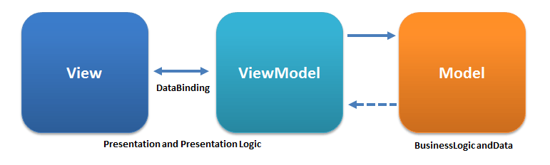
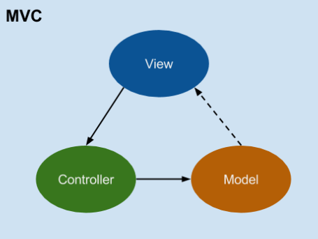
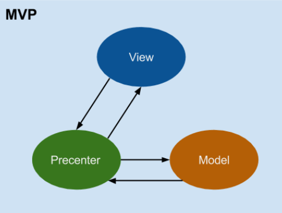
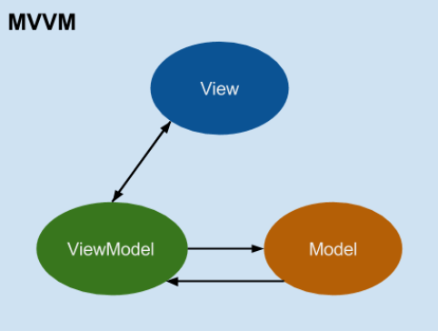

# [说说你对MVC、MVP、MVVM模式的理解](https://github.com/haizlin/fe-interview/issues/232)

> 参考： [谈谈对MVC、MVP和MVVM的理解](https://www.cnblogs.com/keitsi/p/5764785.html)

- MVC：Model-View-Controller
- MVP：Model-View-Presenter
- MVVM：Model-View-ViewModel

#### MVC

MVC 解决了早期把代码糅合在一起从而不好维护的问题，它把软件系统分为三个部分：

- 模型：数据库的相关操作、文件访问和数据结构等
- 视图：专注于显示，如 Web 前端
- 控制器：连接模型和视图，如把视图的请求（用户交互）发送给模型或把数据返回给视图（渲染）等

MVC 实现了视图和模型的分离，避免了视图和模型糅合在一起（当修改视图的时候只要业务逻辑不变则不需要修改模型），但它有一个缺点是 控制器不能直接更新视图，所以 MVC 不能实现视图和模型的完全分离，视图依赖模型的数据来显示。

#### MVP

MVP 针对 MVC 的缺点进行改进，它把软件系统分为三个部分：

- 模型：数据库的相关操作、文件访问和数据结构等
- 视图：专注于显示，如 Web 前端
- 展示器：连接模型和视图，处理视图的请求并根据模型更新视图

MVP 用展示器代替了控制器，而展示器可以直接更新视图，所以 MVP 中展示器可以处理视图的请求并递送到模型又可以根据模型的变化更新视图，实现了视图和模型的完全分离

#### MVVM

MVVM 是 MVP 更进一步的发展，把软件系统分为三个基本部分：

- 模型（Model）：包含应用程序的数据和操作数据的业务逻辑
- 视图（View）：用户可见的 UI 部分，用于交互和展示数据
- 视图模型（ViewModel）：连接模型和视图，Model 和 View 之间的数据是双向绑定的

在 MVVM 架构下，Model 和 View 通过 ViewModel 进行交互，其中 ViewModel 采用数据双向绑定，也就是说 View 的变动，自动反映在 ViewModel，从而自动更新 Model，反之亦然。
