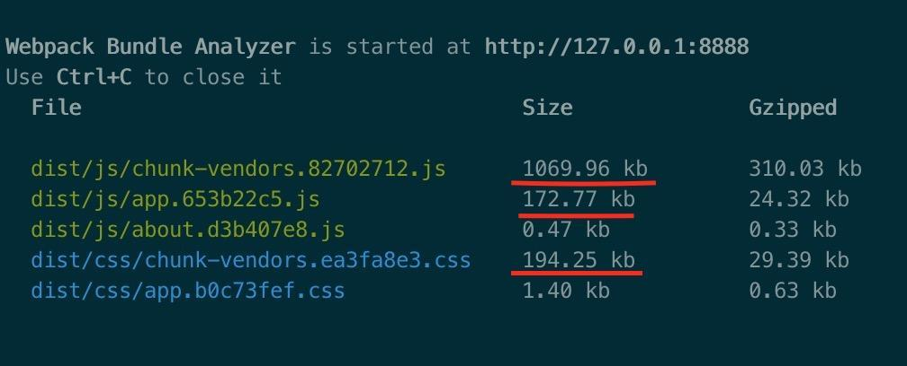
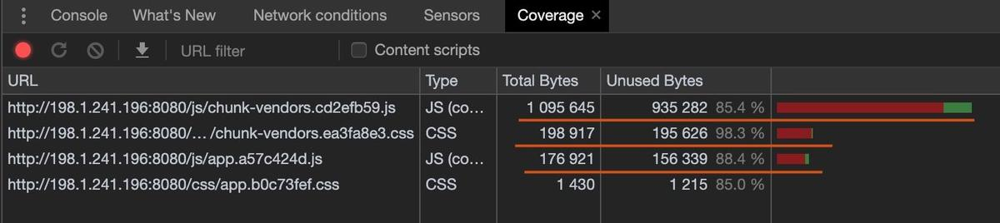
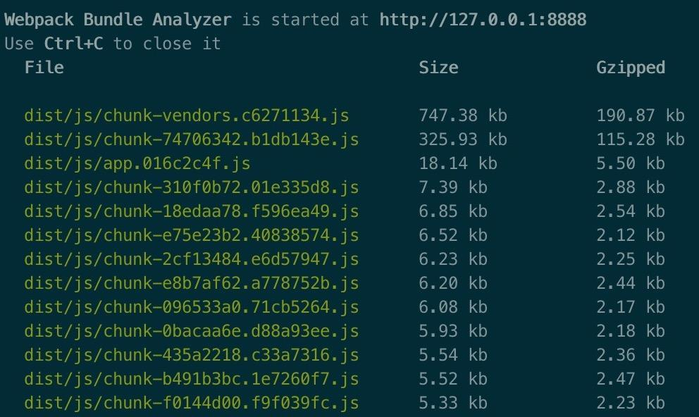
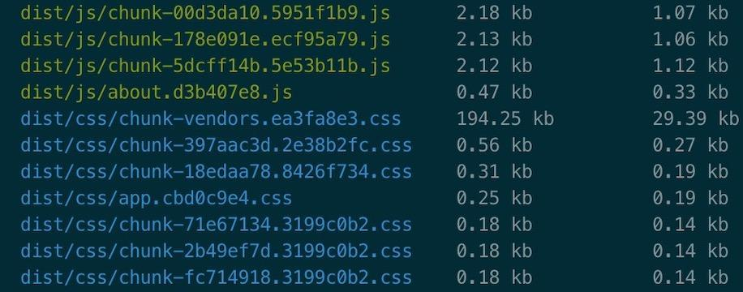
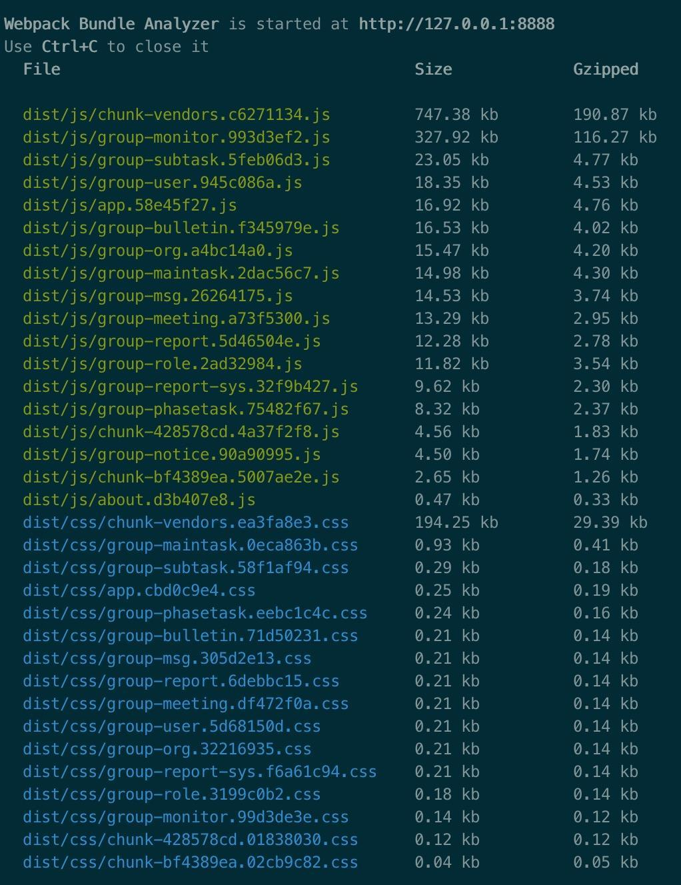
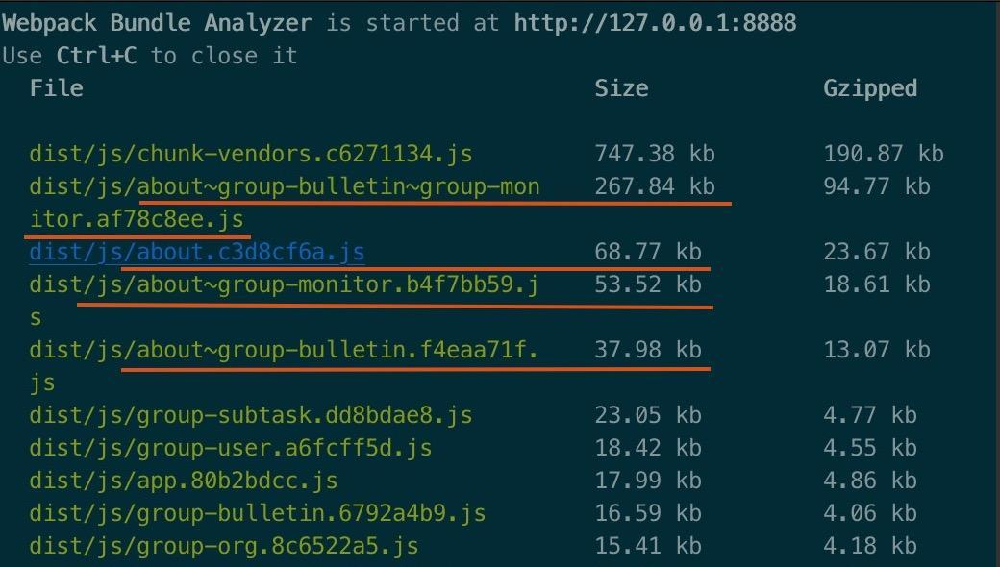
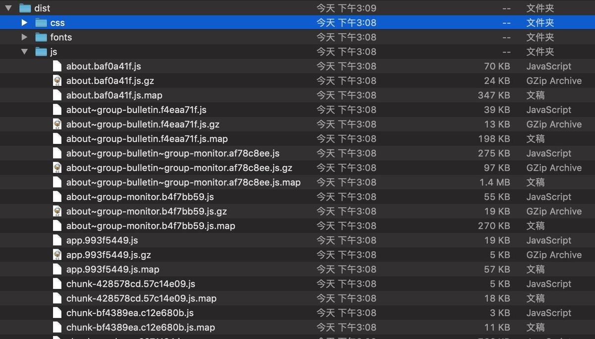
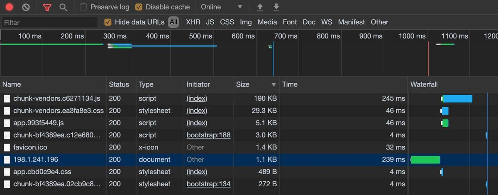
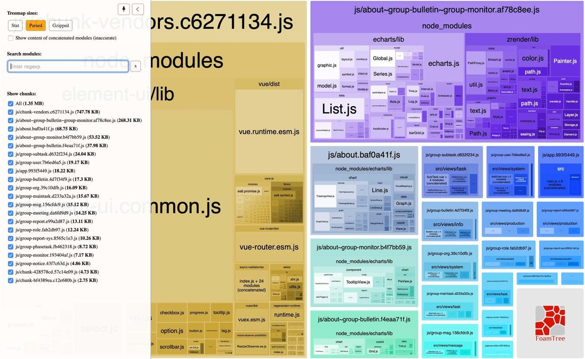

# [如何解决vue打包vendor过大的问题？](https://github.com/haizlin/fe-interview/issues/343)

- 路由懒加载  `component: () => import('../views/Permission.vue')`

- 组件按需引入

- 使用 `npm run build --report` 查看哪个包占用最大，尝试优化掉

- 使用 `compression-webpack-plugin` 压缩

- 延迟加载 vuex 模块

- 在 nginx 启用 gzip 压缩

- 在 **vue.config.js** 设置 [splitChunks](https://stackoverflow.com/a/52634444)：

  ```js
  configureWebpack:{
      optimization: {
        splitChunks: {
          minSize: 10000,
          maxSize: 250000,
        }
      }
    }
  ```


---

> [怎么实现路由懒加载呢？](https://github.com/haizlin/fe-interview/issues/374)

---

## 【转载】vue-cli3 webpack 打包优化实践总结

[Hi川](https://www.jianshu.com/u/06062b2fb381)

12019.10.15 23:25:13字数 2,134阅读 1,941

年前做过一个公司内部的后管平台，前端使用 vue.js 框架开发，基于 vue-cli3 脚手架构建项目，ui 组件库使用 Element-UI，其他组件还包括  axios，echarts，vue-router，vuex 等，该项目功能简单，涉及页面 40 个，都是简单的表单或者列表页。上线的时候直接 `npm run build` 命令打包，未在 vue.config.js 中做任何配置，将 dist 打好的包放到 nginx 服务器，做个反向代理就用上了。

未做优化的打包结果如下：




未做路由组件动态引入

可以看出 `chunk-vendors.82702712.js` 文件大小有 1M 多，对应的 css 文件也有 194 kb，`app.653b22c5.js` 有 172 kb，项目中所有的三方库都打包到 `chunk-vendors.82702712.js` 中，而所有的页面，自定义组件等都在 `app.653b22c5.js` 中。因为没有使用动态加载，所以这些 1M，几百 kb 的 js 都会在刚访问网站的时候一起加载，pc 上还好，一旦放到移动端，弱网情况下只能给用户展示一个大白板。

访问项目主页，通过 Chrome 的 Instrument converge 功能查看 js，css 的资源使用率，发现 `chunk-vendors.82702712.js` 的未使用率达到 85.4%，对应的 `chunk-vendors.ea3fa8e3.css` 未使用率 98.3%，app.js 的未使用率是 88.4 %，app.css 未使用率是 85%，说明项目首页访问的资源体积大，是因为包含了一大部分未使用的组件，如果每个页面都只加载自己需要的组件，那网站的访问速度会得到较大的提升。



资源使用状况

基于上面遇到的问题，优化打包可以从以下几个方面入手。

1. 组件动态引入，按需加载，`app.653b22c5.js` 可以拆分成若干个 js，使用时才去加载对应的 js。
2. 三方库组件，按需加载，`chunk-vendors.82702712.js` 可以做拆分，不必一下全部加载，可在使用时再去加载对应部分的 js。
3. 对资源文件做压缩，上图中可以看到 1069.96kb 的文件， gzip 可以压缩到 310.03kb。

## 着手优化项目打包

### 路由懒加载

结合 Vue 的异步组件和 Webpack 的代码分割功能，轻松实现路由组件的懒加载。
 在 router.js 中，原来导入组件的方式是：

```js
import Home from './views/Home.vue'
import Login from './views/Login.vue'
import Role from './views/system/Role.vue'
import User from './views/system/User.vue'
...
```

这就导致这些组件最后都打包到一个 `app.653b22c5.js` 文件中，我们修改导入组件的方式，改为动态导入：

```js
const Home = () => import('./views/Home.vue')
const Login = () => import('./views/Login.vue')
...
```

修改完所有的组件导入后，在运行 `npm run build` 打包发现，原来的 `app.653b22c5.js` 和 css 文件得到了拆分。



路由动态加载-1


可以看到 app.js 文件从原来的 172.77kb 降到了 18.14 kb。



路由动态加载-2

但是拆分过细，每个页面都独自拆分出来，一个 js 大一点的 7kb，小的才 2，3kb，css 拆分后有的 0.1kb，甚至还有 0.03kb的，拆分的粒度过细，也会造成更多的网络资源请求，对网站加载造成影响。

其实我们的一个功能流程通常会涉及多个页面，如果能将多个页面组件分组打包，效果会更好，避免了多次网络资源请求。

### 路由懒加载分组

分组修改方法如下：

```js
const Role = () => import(/* webpackChunkName: "group-role" */'./views/system/Role.vue')
const AddRole = () => import(/* webpackChunkName: "group-role" */'./views/system/AddRole.vue')
const EditRole = () => import(/* webpackChunkName: "group-role" */'./views/system/EditRole.vue')

const User = () => import(/* webpackChunkName: "group-user" */'./views/system/User.vue')
const AddUser = () => import(/* webpackChunkName: "group-user" */'./views/system/AddUser.vue')
const EditUser = () => import(/* webpackChunkName: "group-user" */'./views/system/EditUser.vue')
const UserAllotRole = () => import(/* webpackChunkName: "group-user" */'./views/system/UserAllotRole.vue')
```

按照功能将组件分组后，打包结果如下：



路由组件动态引入模块分组

每个功能模块打包后的 js 大概有十几kb，文件数量也大大减少。

### node_modules 打包

`chunk-vendors.js` 是对 node_modules 中三方库的打包，本项目中 `chunk-vendors.js` 的大小，Element-UI 占了大部分比例。group-monitor.js 为 327.92 kb 是因为其引入了 echart。

我在 main.js 中完整引入了 Element-UI，而不是按需引入：

```js
import ElementUI from 'element-ui'
import 'element-ui/lib/theme-chalk/index.css'
import http from './utils/network/http'

Vue.use(ElementUI)
```

所以会将 Element-UI 的所有组件打包到项目中。

对三方库的引用务必使用按需加载，不需要的组件就不要引入进来。优化时将 Element-UI 常用的组件在 main.js 中按需引入。

```js
import { Container, Menu } from 'element-ui';

Vue.use(Container);
Vue.use(Menu);
```

页面中有单独用到的 Element-UI 组件，则在该页面中单独引入对应的组件，这样在访问该页面时才去加载这些 ui 组件。

由于 40 多个页面用到了 Element-UI 组件，改造工作量比较大，我用 echart 在其他页面做测试，看下打包情况。

我找到三个页面分别按需引入 echart.js：

```js
// MonitorDetail.vue 按需引入 echart.js
var echarts = require('echarts/lib/echarts');
require('echarts/lib/chart/pie');
require('echarts/lib/component/tooltip');
require('echarts/lib/component/title');
require('echarts/lib/component/legendScroll');

// Bulletin.vue 按需引入 echart.js
var echarts = require('echarts/lib/echarts');
require('echarts/lib/chart/bar');
require("echarts/lib/chart/tree");

// About.vue 按需引入 echart.js
var echarts = require('echarts/lib/echarts');
// 与 Bulletin.vue 公共的引入
require('echarts/lib/chart/bar');
require("echarts/lib/chart/tree");
// 与 MonitorDetail.vue 公共的引入
require('echarts/lib/chart/pie');
require('echarts/lib/component/tooltip');
require('echarts/lib/component/title');
require('echarts/lib/component/legendScroll');
// 自己独有的引入
require("echarts/lib/chart/treemap");
require("echarts/lib/chart/graph");
require("echarts/lib/chart/gauge");
```

About.vue 引入的 echart 组件中有一部分与 MonitorDetail.vue 相同，一部分与 Bulletin.vue  相同，还有三个页面公共的部分，我们期望公共的部分打包成一个 js，不会重复打包，About.vue 独有部分还和 Acount.vue  在一起打包。

打包结果如下：



三方库打包优化

`about~group-bulletin~group-monitor.js` 是三个页面 echart 的公共部分，`about~group-monitor.js` 是 About.vue 与 MonitorDetail.vue echart 的公共部分，`about~group-bulletin.js` 是 About.vue 与 Bulletin.vue 的公共部分，about.js 独有的 echart 组件则还在自己的 js 中。

只要我们按需引入三方库组件，vue-cli3 就能智能的帮助我们合理的打包，这主要是依靠插件 SplitChunksPlugin 来完成的。

### gzip 压缩

如果 Nginx 服务器开启 gzip，会将静态资源在服务端进行压缩，压缩包传输给浏览器后，浏览器再进行解压使用，这大大提高了网络传输的效率，尤其对 js，css 这类文本的压缩，效果很明显。

以下是 Nginx 开启 gzip 的配置：

```nginx
# 开启|关闭 gzip。
gzip on|off;

# 文件大于指定 size 才压缩，以 kb 为单位。
gzip_min_length 10;

# 压缩级别，1-9，值越大压缩比越大，但更加占用 CPU，且压缩效率越来越低。
gzip_comp_level 2;

# 压缩的文件类型。
gzip_types text/plain application/javascript application/x-javascript text/css application/xml text/javascript;

# 开启后如果能找到 .gz 文件，直接返回该文件，不会启用服务端压缩。
gzip_static on|off
    
# 是否添加响应头 Vary: Accept-Encoding 建议开启。
gzip_vary on;

# 请求压缩的缓冲区数量和大小，以 4k 为单位，32 为倍数。
gzip_buffers 32 4K;
```

如果 Nginx 没有开启 gzip，前端在打包的时候可以打包出一份资源的压缩版本，Nginx 也会把压缩文件传输给浏览器。

首先安装一个插件：

```js
npm i -D compression-webpack-plugin
```

在 vue.config.js 中配置下这个插件:

```js
const CompressionPlugin = require("compression-webpack-plugin")

module.exports = {
  configureWebpack: config => {
    if (process.env.NODE_ENV === 'production') {
      return {
        plugins: [
          new CompressionPlugin({
            test: /\.js$|\.html$|\.css/,
            threshold: 10240,
            deleteOriginalAssets: false
          })
        ]
      }
    }
  }
}
```

nginx 服务器还要做一下简单配置:

```nginx
gzip_static on;
```

使用 `compression-webpack-plugin` 插件后的打包结果如下：



使用 gzip 压缩打包

上图中的 .gz 就是对应一个资源文件的压缩版本。

配置成功后，重新将代码部署到 nginx，重新载入 nginx 配置。

我们先看一下没有开启 `gzip_static off;` gzip 的访问情况：


nginx 未开启 gzip 压缩

我们直接看最大的两个文件 chunk-vendors.js 和 chunk-vendors.css，他们的大小分别是 748kb 和 194kb，加载用时分别是 622ms 和 247ms。

然后我们开启 gzip `gzip_static on;` 再看下资源的加载情况：



nginx 开启 gzip 压缩

同样是 chunk-vendors.js 和 chunk-vendors.css，他们的大小变成 190kb 和 29.3kb，加载时间变成 245ms 和 46ms。

以上就是使用 gzip 的效果。

### Vuex 动态注册模块

vuex 通常使用静态模块，这些模块都会打包到 app.js 中，但是如果有的模块过大而且不是立刻就会用到，我们可以动态的注册模块到 vuex 中。

在使用 vuex 某个模块的时候才注册：

```js
mounted () { 
    this.$store.registerModule('myModule', MyModule)
}
```

在不使用的时候，注销模块：

```js
beforeDestroy () {
    this.$store.unregisterModule('myModule')
}
```

这样实现的效果是该页面在加载时才下载模块内容，而不是刚访问网站就去下载。

### 工具

打包时，我们可以通过一些辅助工具帮助分析打包情况，有重点的去做优化。

打开 Chrome 的调试模式，CMD+SHIFT+P 调出命令面板，输入 Coverage，选择 Show Coverage，然后访问指定网站，点击按钮 Instrument converge 就能查看已加载资源的未使用率。


Instrument converge

使用 `webpack-bundle-analyzer` 插件可以分析出打包后的文件结构。

安装该插件 `npm i –D webpack-bundle-analyzer`，vue.config.js 中做如下配置：

```js
  chainWebpack: config => {
    if (process.env.NODE_ENV === 'production') {
      if (process.env.npm_config_report) {
        config
          .plugin('webpack-bundle-analyzer')
          .use(require('webpack-bundle-analyzer').BundleAnalyzerPlugin)
          .end()
        config.plugins.delete('prefetch')
      }
    }
  }
```

然后使用 `npm run build --report` 命令打包就可以查看到打包后的文件结构。



webpack-bundle-analyzer

这个打包后的文件结构页面很有参考价值，对打包的优化帮助很大。

### 参考文章

[提升90%加载速度——vuecli下的首屏性能优化](https://links.jianshu.com/go?to=https%3A%2F%2Fsegmentfault.com%2Fa%2F1190000019499007%23articleHeader4)
 [Vue 性能优化：如何实现延迟加载和代码拆分？](https://links.jianshu.com/go?to=https%3A%2F%2Fwww.infoq.cn%2Farticle%2F9ihyy7HW00ij8suTh*zN)
 [vue-cli3+nginx配置gzip压缩](https://links.jianshu.com/go?to=https%3A%2F%2Fwww.deepwinter.com%2F111.html)
