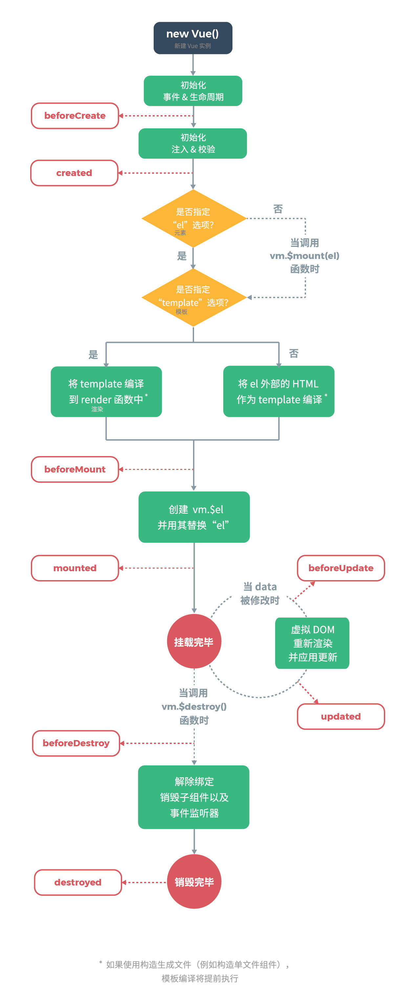

# Vue 生命周期图

## Q&A

- Q: [请描述下vue的生命周期是什么？](https://github.com/haizlin/fe-interview/issues/229)
    A: 生命周期是 Vue 组件在不同的状态下执行的钩子函数。

- Q：[vue在created和mounted这两个生命周期中请求数据有什么区别呢？](https://github.com/haizlin/fe-interview/issues/348)

    A:
    - created 钩子在 vue 组件实例创建完成后执行，此时访问不到组件的 DOM
    - mounted 钩子在 VDOM 挂载到 DOM 节点之后执行，此时可以访问组件的 DOM
    
    可以在 created 钩子里执行数据请求，因为请求是异步的，尽早请求可以尽快获得数据。

- Q：[组件进来请求接口时你是放在哪个生命周期？为什么？](https://github.com/haizlin/fe-interview/issues/315)
    A：一般放在 created，如果要操作 DOM 则放在 mounted，因为 created 比 mounted 先执行，且可是访问 Vue 组件实例。

- Q：[DOM渲染在哪个周期中就已经完成了？](https://github.com/haizlin/fe-interview/issues/312)
    A：mounted

- Q：[第一次加载页面时会触发哪几个钩子？](https://github.com/haizlin/fe-interview/issues/311)
    A：beforeCreate, created, beforeMount, mounted

- Q：[vue生命周期总共有几个阶段？](https://github.com/haizlin/fe-interview/issues/310)
    A: 请看上图。

- Q：[vue生命周期的作用是什么？](https://github.com/haizlin/fe-interview/issues/309)
    A：可以精确控制Vue组件实例在不同执行阶段的状态
