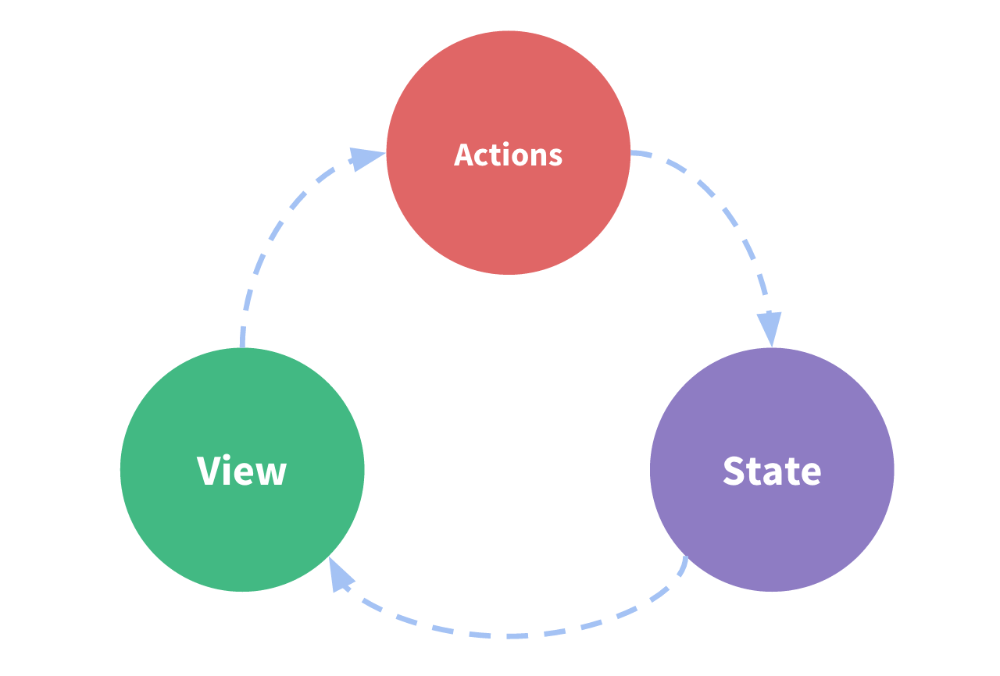

# [说说你对单向数据流和双向数据流的理解](https://github.com/haizlin/fe-interview/issues/365)

- 单向数据流：
  - 顾名思义，数据是单向流动的，例如在 React 中：当用户修改 input 内容，输入事件被捕获然后阻止默认行为，更新 state 里面对应的数据，最后再更新视图。
  - 
  - 优点：所有状态的改变可记录、可跟踪，源头易追溯；所有数据只有一份，组件数据只有唯一的入口和出口，使得程序更直观更容易理解，有利于应用的可维护性
- 双向数据流
  - vue 的 v-model 双向绑定实际上是一个语法糖，本质上还是单向数据流
