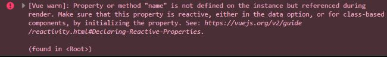
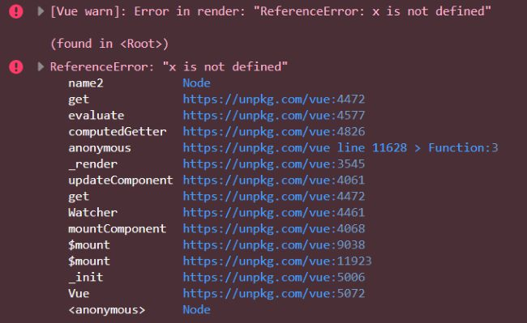
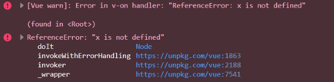
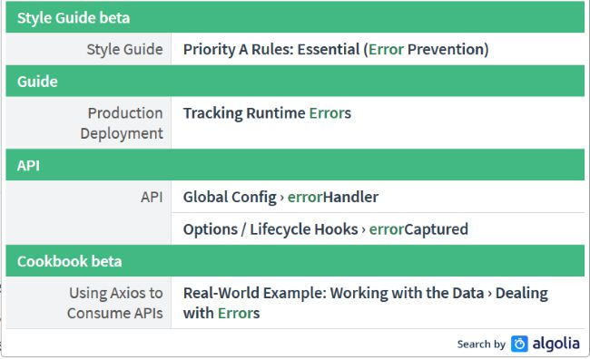

# [说说你对vue的错误处理的了解？](https://github.com/haizlin/fe-interview/issues/472)

## [5种处理Vue异常的方法](https://blog.fundebug.com/2019/06/17/handling-errors-in-vuejs/)

**译者按：** Vue.config.errorHandler 配合 window.onerror 来捕获所有异常。


- 原文: [Handling Errors in Vue.js](https://www.raymondcamden.com/2019/05/01/handling-errors-in-vuejs)
- 译者: [Fundebug](https://www.fundebug.com/)

**本文采用意译，版权归原作者所有**

去年一整年，我都在使用最爱的—Vue.js— 来做项目。最近突然意识到，我竟然从来没有认真去处理异常。我可以自恋地说：”我写的代码是完美的，没有 BUG。”  我相信大家都明白这是迷之自信。最近，我花了不少时间研究了 Vue 中处理异常的各种技巧，在此想把我学到的分享给大家。

#### 错误大全

为了测试各种异常处理技巧，我故意触发三种类型的错误。

- 第一种：引用一个不存在的变量：

```
<div id="app" v-cloak>
    Hello, {{name}}
</div>
```

上述代码运行后不会抛出错误，但是在控制台会有`[Vue warn]`消息。

[](https://image.fundebug.com/2019-06-18-01.png)

你可以在 Codepen 查看例子[完整代码](https://codepen.io/cfjedimaster/embed/qweOKB?height=265&theme-id=0&default-tab=js%2Cresult&user=cfjedimaster&slug-hash=qweOKB&pen-title=Error1A&name=cp_embed_1):

<iframe name="cp_embed_1" src="https://codepen.io/cfjedimaster/embed/qweOKB?height=265&amp;theme-id=0&amp;default-tab=js%2Cresult&amp;user=cfjedimaster&amp;slug-hash=qweOKB&amp;pen-title=Error1A&amp;name=cp_embed_1" scrolling="no" allowtransparency="true" allowfullscreen="" allowpaymentrequest="true" title="Error1A" class="cp_embed_iframe" id="cp_embed_qweOKB" style="max-width:100%;width:740px;overflow:hidden;display:block" height="265" frameborder="0"></iframe>
- 第二种：将变量绑定到一个被计算出来的属性，计算的时候会抛出异常。

```
<div id="app" v-cloak>
    Hello, {{name2}}
</div>

<script>
    const app = new Vue({
        el: "#app",
        computed: {
            name2() {
                return x;
            }
        }
    });
</script>
```

运行上述代码会在控制台抛出一个`[Vue warn]`和一个常规的错误，网页白屏。

[](https://image.fundebug.com/2019-06-18-02.png)

你可以在 Codepen 查看例子[完整代码](https://codepen.io/cfjedimaster/embed/BEXoOw?height=265&theme-id=0&default-tab=js%2Cresult&user=cfjedimaster&slug-hash=BEXoOw&pen-title=Error1B&name=cp_embed_2):

<iframe name="cp_embed_2" src="https://codepen.io/cfjedimaster/embed/BEXoOw?height=265&amp;theme-id=0&amp;default-tab=js%2Cresult&amp;user=cfjedimaster&amp;slug-hash=BEXoOw&amp;pen-title=Error1B&amp;name=cp_embed_2" scrolling="no" allowtransparency="true" allowfullscreen="" allowpaymentrequest="true" title="Error1B" class="cp_embed_iframe" id="cp_embed_BEXoOw" style="max-width:100%;width:740px;overflow:hidden;display:block" height="265" frameborder="0"></iframe>
- 第三种：执行一个会抛出异常的方法

```
<div id="app" v-cloak>
    <button @click="doIt">Do It</button>
</div>

<script>
    const app = new Vue({
        el: "#app",
        methods: {
            doIt() {
                return x;
            }
        }
    });
</script>
```

这个错误在控制台也`[Vue warn]`和常规报错。和上一个错误的区别在于，只有你点击了按钮才会触发函数调用，才会报错。

[](https://image.fundebug.com/2019-06-18-03.png)

你可以在 Codepen 查看例子[完整代码](https://codepen.io/cfjedimaster/embed/oOKjJb?height=265&theme-id=0&default-tab=js%2Cresult&user=cfjedimaster&slug-hash=oOKjJb&pen-title=Error1C&name=cp_embed_3):

<iframe name="cp_embed_3" src="https://codepen.io/cfjedimaster/embed/oOKjJb?height=265&amp;theme-id=0&amp;default-tab=js%2Cresult&amp;user=cfjedimaster&amp;slug-hash=oOKjJb&amp;pen-title=Error1C&amp;name=cp_embed_3" scrolling="no" allowtransparency="true" allowfullscreen="" allowpaymentrequest="true" title="Error1C" class="cp_embed_iframe" id="cp_embed_oOKjJb" style="max-width:100%;width:740px;overflow:hidden;display:block" height="265" frameborder="0"></iframe>
在继续之前，我想声明上面 3 个例子并不代表所有类型的错误。这 3 种是比较常见的错误。

好了，我们该怎么处理异常呢？我很惊讶在 Vue 的[文档](https://vuejs.org/v2/guide/)中竟然没有介绍异常处理的章节。

[](https://image.fundebug.com/2019-06-18-04.png)

是的，文档中是有一个，但是介绍极其简短。

> 如果在组件渲染时出现运行错误，错误将会被传递至全局 `Vue.config.errorHandler` 配置函数 (如果已设置)。利用这个钩子函数来配合错误跟踪服务是个不错的主意。比如 [Sentry](https://sentry.io/)，它为 Vue 提供了[官方集成](https://sentry.io/for/vue/)。

P.S. 国产 BUG 监控服务[Fundebug](https://www.fundebug.com)也为 Vue 提供了[官方集成](https://docs.fundebug.com/notifier/javascript/framework/vuejs.html)。

我个人建议官方应该有详细的介绍。总的来说，Vue 中异常处理包含以下几个方面的技巧：

- errorHandler
- warnHandler
- renderError
- errorCaptured
- window.onerror (不仅仅针对 Vue)

#### 技巧 1：errorHandler

我们要学习的第一个技巧是[errorHandler](https://vuejs.org/v2/api/#errorHandler)。你也许知道，这是 Vue 中最广泛使用的异常处理方式。

```
Vue.config.errorHandler = function(err, vm, info) {};
```

`err`指代 error 对象，`info`是一个 Vue 特有的字符串，`vm`指代 Vue 应用本身。记住在一个页面你可以有多个 Vue 应用。这个 error handler 作用到所有的应用。

```
Vue.config.errorHandler = function(err, vm, info) {
    console.log(`Error: ${err.toString()}\nInfo: ${info}`);
};
```

第一种错误不会触发 errorHandler，它只是一个 warning。

第二种错误会抛出错误被 errorHandler 捕获：

```
Error: ReferenceError: x is not defined
Info: render
```

第三种错误也会被捕获：

```
Error: ReferenceError: x is not defined
Info: v-on handler
```

记住`info`里面的信息也是非常有用的。

#### 技巧 2: warnHandler

[warnHandler](https://vuejs.org/v2/api/#warnHandler)用来捕获 Vue warning。记住在生产环境是不起作用的。

```
Vue.config.warnHandler = function(msg, vm, trace) {};
```

`msg`和`vm`都容易理解，`trace`代表了组件树。请看下面的例子：

```
Vue.config.warnHandler = function(msg, vm, trace) {
    console.log(`Warn: ${msg}\nTrace: ${trace}`);
};
```

第一个错误被`warnHandler`捕获：

```
Warn: Property or method 'name' is not defined on the instance but referenced during render. Make sure that this property is reactive, either in the data option, or for class-based components, by initializing the property. See: https://vuejs.org/v2/guide/reactivity.html#Declaring-Reactive-Properties.
Trace:

(found in <Root>)
```

你可以查看三个例子的实际运行情况:

<iframe name="cp_embed_4" src="https://codepen.io/cfjedimaster/embed/oOKxEa?height=265&amp;theme-id=0&amp;default-tab=js%2Cresult&amp;user=cfjedimaster&amp;slug-hash=oOKxEa&amp;pen-title=Error1A%20with%20Handler&amp;name=cp_embed_4" scrolling="no" allowtransparency="true" allowfullscreen="" allowpaymentrequest="true" title="Error1A with Handler" class="cp_embed_iframe" id="cp_embed_oOKxEa" style="max-width:100%;width:740px;overflow:hidden;display:block" height="265" frameborder="0"></iframe>
<iframe name="cp_embed_5" src="https://codepen.io/cfjedimaster/embed/PgMNao?height=265&amp;theme-id=0&amp;default-tab=js%2Cresult&amp;user=cfjedimaster&amp;slug-hash=PgMNao&amp;pen-title=Error1B%20with%20Handler&amp;name=cp_embed_5" scrolling="no" allowtransparency="true" allowfullscreen="" allowpaymentrequest="true" title="Error1B with Handler" class="cp_embed_iframe" id="cp_embed_PgMNao" style="max-width:100%;width:740px;overflow:hidden;display:block" height="265" frameborder="0"></iframe>
<iframe name="cp_embed_6" src="https://codepen.io/cfjedimaster/embed/wZVGEK?height=265&amp;theme-id=0&amp;default-tab=js%2Cresult&amp;user=cfjedimaster&amp;slug-hash=wZVGEK&amp;pen-title=Error1C%20with%20Handler&amp;name=cp_embed_6" scrolling="no" allowtransparency="true" allowfullscreen="" allowpaymentrequest="true" title="Error1C with Handler" class="cp_embed_iframe" id="cp_embed_wZVGEK" style="max-width:100%;width:740px;overflow:hidden;display:block" height="265" frameborder="0"></iframe>
#### 技巧 3: renderError

和前面两个不同，这个技巧不适用于全局，和组件相关。并且只适用于非生产环境。

下面是一个简单的例子：

```
const app = new Vue({
    el: "#app",
    renderError(h, err) {
        return h("pre", { style: { color: "red" } }, err.stack);
    }
});
```

第一个例子是没有效果的，因为只是一个 warning。第二个例子就会在网页上显示具体的错误信息。

<iframe name="cp_embed_7" src="https://codepen.io/cfjedimaster/embed/NmQrwa?height=265&amp;theme-id=0&amp;default-tab=result&amp;user=cfjedimaster&amp;slug-hash=NmQrwa&amp;pen-title=Error1B%20with%20renderError&amp;name=cp_embed_7" scrolling="no" allowtransparency="true" allowfullscreen="" allowpaymentrequest="true" title="Error1B with renderError" class="cp_embed_iframe" id="cp_embed_NmQrwa" style="max-width:100%;width:740px;overflow:hidden;display:block" height="265" frameborder="0"></iframe>
老实说，我没觉得这个比直接看控制台好多少。但是，如果你们的 QA 团队或则测试对浏览器控制台不熟悉的话，这个还是蛮有用的。

#### 技巧 4: errorCaptured

[errorCaptured](https://cn.vuejs.org/v2/api/#errorCaptured)是最后一个和 Vue 相关的技巧，这个技巧让我很迷惑，现在还是有点搞不明白。文档是这么介绍的：

> 当捕获一个来自子孙组件的错误时被调用。此钩子会收到三个参数：错误对象、发生错误的组件实例以及一个包含错误来源信息的字符串。此钩子可以返回 `false` 以阻止该错误继续向上传播。

基于我的一些分析，这个 error Handler 只能在父组件中处理子组件的错误。据我所知，我们没法直接在 Vue 的主实例(main instance)中使用它。

为了测试，我构造了下面的例子：

```
Vue.component("cat", {
    template: `
<div><h1>Cat: </h1>
  <slot></slot>
</div>`,
    props: {
        name: {
            required: true,
            type: String
        }
    },
    errorCaptured(err, vm, info) {
        console.log(`cat EC: ${err.toString()}\ninfo: ${info}`);
        return false;
    }
});

Vue.component("kitten", {
    template: "<div><h1>Kitten: {{ dontexist() }}</h1></div>",
    props: {
        name: {
            required: true,
            type: String
        }
    }
});
```

注意 `kitten` 组件的代码是有 BUG 的。

```
<div id="app" v-cloak>
    <cat name="my cat">
        <kitten></kitten>
    </cat>
</div>
```

捕获的信息如下:

```
cat EC: TypeError: dontexist is not a function
info: render
```

下面是运行实例.

<iframe name="cp_embed_8" src="https://codepen.io/cfjedimaster/embed/MRMbYJ?height=265&amp;theme-id=0&amp;default-tab=js%2Cresult&amp;user=cfjedimaster&amp;slug-hash=MRMbYJ&amp;pen-title=Error1&amp;name=cp_embed_8" scrolling="no" allowtransparency="true" allowfullscreen="" allowpaymentrequest="true" title="Error1" class="cp_embed_iframe" id="cp_embed_MRMbYJ" style="max-width:100%;width:740px;overflow:hidden;display:block" height="265" frameborder="0"></iframe>
`errorCaptured`是个很有趣的特性，我想那些构建组件库的开发者应该会用到吧。这个特性更像是面向组件开发者而不是一般开发者。

#### 终极技巧: window.onerror

[](https://image.fundebug.com/2019-06-18-05.png)

最后也是最重要的一个候选项 [window.onerror](https://developer.mozilla.org/en-US/docs/Web/API/GlobalEventHandlers/onerror)。它是一个全局的异常处理函数，可以抓取所有的 JavaScript 异常。

```
window.onerror = function(message, source, line, column, error) {};
```

我想函数的参数中只有`source`难以从字面上理解吧，它代表了当前的 URL。

接下来事情就比较好玩了。如果你定义了`onerror`，但是没有启用`Vue.config.errorHandler`，那么有很多异常都抓不到。Vue 希望你定义它，否则异常不会抛出去的。这到底有没有意义？我不是很懂，我觉得没必要，甚至有点奇怪。

如果定义`errorHandler`的代码有 BUG，那么运行起来也不会被`onerror`抓到。下面的例子中，如果将`oopsIDidItAgain()`解注释，你就会发现这个问题。只有第二个按钮没有和 Vue 绑定，所以报错无论如何都会被抓到。

<iframe name="cp_embed_9" src="https://codepen.io/cfjedimaster/embed/WWVowN?height=265&amp;theme-id=0&amp;default-tab=js%2Cresult&amp;user=cfjedimaster&amp;slug-hash=WWVowN&amp;pen-title=Error1C%20with%20Handler%20(window)&amp;name=cp_embed_9" scrolling="no" allowtransparency="true" allowfullscreen="" allowpaymentrequest="true" title="Error1C with Handler (window)" class="cp_embed_iframe" id="cp_embed_WWVowN" style="max-width:100%;width:740px;overflow:hidden;display:block" height="265" frameborder="0"></iframe>
#### 总结

正如开篇提到，这是我第一次写关于这个主题的文章。我也希望从大家获得反馈，包括评论、建议以及修订意见。我希望大家可以分享自己如何使用的具体事例。

##### 版权声明

转载时请注明作者**[ Fundebug](https://blog.fundebug.com)**以及本文地址：
**https://blog.fundebug.com/2019/06/17/handling-errors-in-vuejs/**
