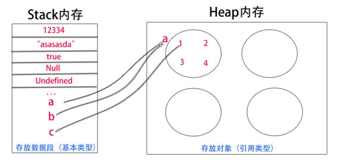
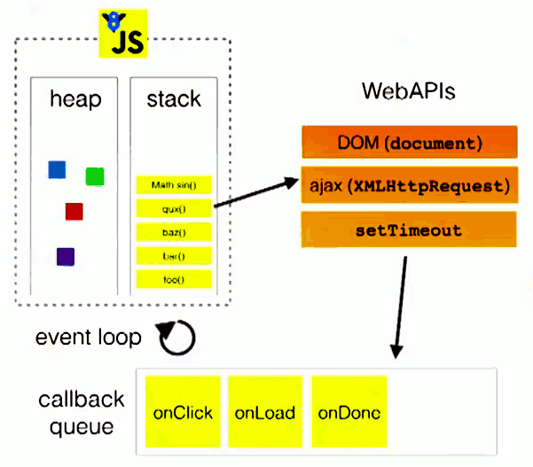
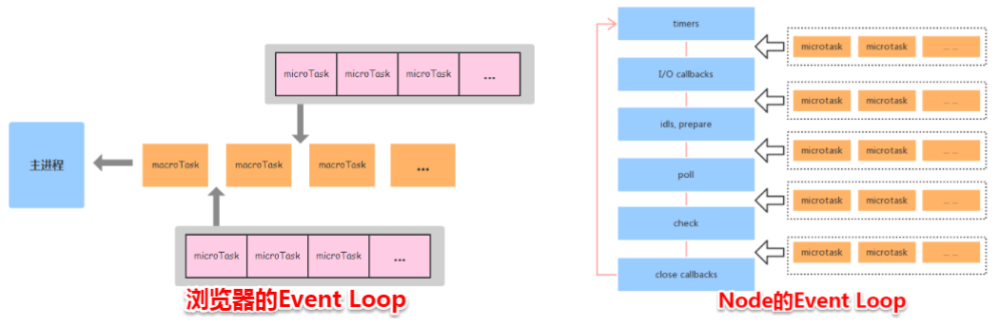
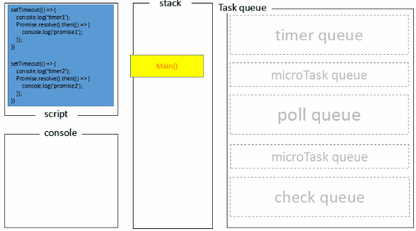

# 1. JavaScript基础

## —— 变量和类型 ——

### 1. JavaScript 规定了几种语言类型

- 基本类型：`Number`, `Boolean`, `String`, `null`, `undefined`, `Symbol`
- 对象类型：`Object`

### 2. JavaScript 对象的底层数据结构是什么

对象属于引用类型，底层数据结构为堆

>  对象被分配在一个堆中，即用以表示一大块非结构化的内存区域。—— MDN

### 3. Symbol 类型在实际开发中的应用、可动手实现一个简单的 Symbol

Symbol 类型是 ES6 新增的一种基本类型，主要用途是生成独一无二的值，可用作对象的属性名、定义一组常量或在switch中使用，代替魔术字符串

- [ES6 中的 Symbol 类型](../js/js-symbol.md)
- [ES6 系列之模拟实现 Symbol 类型](https://juejin.im/post/5b1f4c21f265da6e0f70bb19)

### 4. JavaScript中的变量在内存中的具体存储形式

JS 变量可以分为基本类型和引用类型，基本类型的值存于栈 `Stack`内存，引用类型的值存于堆 `Heap` 内存\


### 5. 基本类型对应的内置对象，以及他们之间的装箱拆箱操作

| 基本类型 | 内置对象 |
|---------|----------|
| 123   | Number   |
| true  | Boolean  |
| "abc"  | String  |

- 装箱：把基本类型转换为对应的内置对象的操作为装箱
- 拆箱：把内置对象转换为对应的基本类型的操作为拆箱

```js
var s1 = 'hello world'
// 装箱操作
s1.a = 1
console.log(s1.substring(6)) // world
console.log(s1.a) // undefined
```

上面代码中，`s1` 是一个基本类型值，不具有方法，JS 通过调用 `new String(s1)` 转换成对象（装箱），这个对象继承了 `substring` 方法，所以可以调用，一旦调用（引用）结束，这个新创建的对象就会销毁，由于临时对象销毁，所以访问 `s1.a` 为 `undefined`

```js
var num = new Number(123)
var str = new String('abc')
   
console.log(typeof num) // object
console.log(typeof str) // object
   
// 拆箱操作
console.log(typeof num.valueOf()) // number
console.log(typeof str.valueOf()) // string
```

### 6. 理解值类型和引用类型

值类型保存的是变量的值，而引用类型保存的是变量的地址

```js
var a = 1
var b = a
a = 2
console.log(b) // 1
// 值类型保存的是值，通过修改值不会对其他值类型造成影响
   
var obj1 = { k: 1 }
var obj2 = obj1
obj1.k = 2
console.log(obj2.k) // 2
// 引用类型保存的是引用地址，赋值操作赋值的是引用地址
// 修改原有的对象k值时，引用地址并未改变，改变的是k的值
// obj2保存的仍然是obj1的地址，所以k也跟着改变
```

### 7. `null` 和 `undefined` 的区别

- `null` 表示值定义了为**空**值，`typeof null` 为 `"object"`
- `undefined` 表示值声明了但**未定义**，`typeof undefined` 为 `"undefined"`

### 8. 至少可以说出三种判断 JavaScript 数据类型的方式，以及他们的优缺点，如何准确的判断**数组**的类型

四种方式：`typeof`, `instanceof`, `constructor`, `toString`

1. typeof
   
    这种方法可以简单的获取一个变量的数据类型，但不能区分 `Array` 和 `Object`，而且有判断 `null` 值为 `"object"` 的历史遗留bug。
    使用方式：
    ```js
    typeof 123 // "number"
    typeof true // "boolean"
    typeof 'abc' // "string"
    typeof [] // "object"
    typeof {} // "object"
    typeof null //"object"
    ```
    
2. instanceof

    用来判断 A 是否为 B 的实例，由于 `instanceof` 检测的是实例，对基本类型无效，且无法检测 `null` 和 `undefined` 类型，好处是可以区分 `Array` 和 `Object`
    ```js
    123 instanceof Number //false
    new Number(123) instanceof Number // true
    [1,2,3] instanceof Array //true
    var obj={}
    obj instanceof Object // true
    "abc" instanceof String // false
    true instanceof Boolean // false
    ```

3. constructor

    `[].constructor // ƒ Array() { [native code] }` 原理和 `instanceof` 类似，用来获取对象的构造函数，优缺点也与其一样

4. Object.prototype.toString.call()

    此为最佳的检测数据类型的方法，使用方式：
    
    ```js
    Object.prototype.toString.call(123) // "[object Number]"
    Object.prototype.toString.call([]) // "[object Array]"
    Object.prototype.toString.call({}) // "[object Object]"
    Object.prototype.toString.call(null) // "[object Null]"
    Object.prototype.toString.call(undefined) // "[object Undefined]"
    ```
   
    封装一下
    
    ```js
    const typeCheck = (obj) => {
      const typeStr = Object.prototype.toString.call(obj);
      return typeStr.toLowerCase().slice(8, typeStr.length - 1);
    };
    ```
要准确判断数组的类型，可以使用 ES5 中的 `Array.isArray()` 方法，或使用上述除了 `typeof` 的其他方法

### 9. 可能发生隐式转换的场景以及转换规则，应如何避免或巧妙应用

```js
3 + true // 4
3 + undefined // NaN
2 + '3' // 23
1 == '1' // true
null == undefined // true
```

上述都是常见的隐式转换场景，隐式转换容易造成bug，如何避免：操作数据时先检查数据类型，使用 `===` 代替 `==` 可避免判断相等时的隐式转换

### 10. 出现小数精度丢失的原因，JavaScript 可以存储的最大数字、最大安全数字，JavaScript处理大数字的方法、避免精度丢失的方法

- 众所周知在 JS 中 `0.1 + 0.2 // 0.30000000000000004`。这是由于 Number 类型采用 `IEEE754` 规范中64位双精度浮点数编码
- 使用 `Number.MAX_SAFE_INTEGER` 和 `Number.MIN_SAFE_INTEGER` 可以分别获取最大和最小安全数字
- 可以先把小数转换成整数再转换成小数的放实来避免精度丢失，或使用 [big.js](https://github.com/MikeMcl/big.js/) 库操作数字


---

## —— 原型和原型链 ——

### 1. 理解原型设计模式以及 JavaScript 中的原型规则

> 参考：[js-- 原型设计模式以及JavaScript中的原型规则](https://juejin.im/post/5ce7cc4451882559ba11549a)

- 原型设计模式

    - [工厂模式](../js/js-proto-design-mode.md#工厂模式)
    - [构造函数模式](../js/js-proto-design-mode.md#构造函数模式)
    - [原型模式](../js/js-proto-design-mode.md#原型模式)
    - [混合模式](../js/js-proto-design-mode.md#混合模式)
    - [动态原型模式](../js/js-proto-design-mode.md#动态原型模式)
    
- 原型规则

    - 所有的引用类型（数组、对象、函数）都具有对象特征，可自由扩展属性
    - 所有的引用类型，都有一个 `__proto__` 属性（隐式原型），属性值是一个对象
    - 所有函数，都有一个 `prototype` 属性（显式原型），属性值是一个原型
    - 所有的引用类型，其隐式原型只想其构造函数的显示原型：`obj.__proto__ === Object.prototype`
    - 当试图得到一个对象某个属性时，如果对象本身没有这个属性，就会去它的 `__proto__`（它的构造函数的 `prototype`）去寻找，如果找不到，再向上寻找，层层向上寻找就是原型链
    
### 2. `instanceof` 的底层实现原理，手动实现一个 `instanceof`

instanceof 主要用途是判断一个实例是否属于某个对象，通过在实例的原型链上查询 `constructor`，判断 `constructor` 与目标对象是否相等来实现此功能

```js
function instanceOf(L, R) {
  L = L.__proto__
  while (true) {
    if (L === null) return false
    if (R === L.constructor) return true
    L = L.__proto__
  }
}

function Foo() {}
var foo = new Foo()
instanceOf(foo, Foo) // true

class Apple {}
var apple = new Apple()
instanceOf(apple, Apple) // true
instanceOf(apple, Object) // true
instanceOf(apple, Foo) // false
```

### 4. 实现继承的几种方式以及他们的优缺点

- [原型链继承](../js/js-inherit.md#原型链继承)
- [借用构造函数继承](../js/js-inherit.md#借用构造函数继承)
- [组合继承](../js/js-inherit.md#组合继承)
- [原型式继承](../js/js-inherit.md#原型式继承)
- [寄生式继承](../js/js-inherit.md#寄生式继承)
- [寄生组合式继承](../js/js-inherit.md#寄生组合式继承)
- [Class继承](../js/js-inherit.md#Class继承)

### 5. 至少说出一种开源项目(如`Node`)中应用原型继承的案例

👀

### 6. 可以描述new一个对象的详细过程，手动实现一个new操作符

`new` 操作符主要执行了下面3个操作：

1. 创建一个空对象，即 `{}`
2. 将属性绑定到新创建的对象
3. 返回这个对象

手动实现一个 `new` 

```js
function newObject(Parent, ...args) {
    let obj = Object.create(Parent.prototype)
    Parent.apply(obj, args)
    return obj
}

function Person(name, age) {
    this.name = name
    this.age = age
}
Person.prototype.sayName = function() {
    console.log('I am '+this.name)
}

var p1 = new Person('小明', 18)
console.log(p1)
p1.sayName()

var p2 = newObject(Person, '小红', 17)
console.log(p2)
p2.sayName()

```

### 7. 理解es6 `class`构造以及继承的底层实现原理

这是一个使用ES6`class`语法创建的类，可以看作是一个语法糖

```js
class Point{
  constructor(x, y) {
    this.x = x
    this.y = y
  }
  
  toString() {
      return `(${this.x}, ${this.y})`
  }
}
```

其中，`constructor` 构造器等同于 ES5 中的构造函数；`class` 内部的所有方法（例如`toString` 方法），都等同于挂载在构造函数的 `prototype` 属性中的方法。

```js
function Point(x, y) { // 构造函数，等同于 class 中的 constructor
    this.x = x
    this.y = y
}
Point.prototype.toString = function() { // 等同于 `class` 内部的 `toString`
  return '(' + this.x + ', ' + this.y + ')'
}
var p = new Point(1,2)
```

class 可以通过 `extends` 关键字实现继承，如下

```js
class ColorPoint extends Point {
}
```

其中如果不写 `constructor` 方法的话，会自动添加，任何子类都有该方法。如果写了 `constructor` 方法，则必须在其中写上 `super()` 方法用来调用父类的 `constructor`，如果不调用 `super` 方法，创建实例是会报错，子类也得不到 this 对象。

```js
class ColorPoint extends Point {
  constructor(x, y, color) {
    super(x, y); // 调用父类的constructor(x, y)
    this.color = color;
  }

  toString() {
    return this.color + ' ' + super.toString(); // 调用父类的toString()
  }
}
```

ES5 的继承，实质是先创造子类的实例对象 `this`，再将父类的方法添加到 `this` 上面（`Parent.apply(this)`）。ES6 的继承机制完全不同，实质是先将父类的属性方法，添加到 `this` 上面（所以必须先调用 `super`），然后再用子类的构造函数修改 `this`。 —— [《Class 的继承》](http://es6.ruanyifeng.com/#docs/class-extends)


---

## —— 作用域和闭包 ——

### 1.理解词法作用域和动态作用域

1. 什么是作用域？

    答：作用域是指程序源代码中定义变量的区域，作用域规定了如何查找变量，也就是确定当前执行代码对变量的访问权限。JavaScript 采用词法作用域，也叫做静态作用域。
    
2. 静态作用域（词法作用域）和动态作用域的区别？
   
    答：词法作用域是再定义函数的时候就决定了的，在函数调用过程中不会改变；而动态作用域则是在函数调用的时候才决定的。

参考：[JavaScript深入之词法作用域和动态作用域](https://github.com/mqyqingfeng/Blog/issues/3)


### 2.理解JavaScript的作用域和作用域链

**作用域**是指程序源代码中定义变量的区域，作用域规定了如何查找变量，也就是确定当前执行代码对变量的访问权限。JavaScript 采用词法作用域，也叫做静态作用域。

当查找变量的时候，会从当前上下文的变量对象中查找，如果没有找到，就会从父级（词法层面上的父级）执行上下文的变量对象中查找，一直找到全局上下文的变量对象（也就是全局对象）。这样由多个执行上下文的变量对象构成的链表就叫做**作用域链**。

参考：[JavaScript深入之作用域链](https://github.com/yy9306/yy9306.github.io/issues/15)


### 3.理解JavaScript的执行上下文栈，可以应用堆栈信息快速定位问题

1. JS 的**可执行代码**的类型由哪些？答：全局代码、函数代码、`eval`代码。
2. 当执行一个函数的时候，引擎会进行准备工作，这里的准备工作就是**执行上下文**。
3. 由于代码中会有很多的函数，所以引擎需要管理这些执行上下文，JS 使用**执行上下文栈（Execution Context Stack, ECS）**来管理执行上下文。
4. 执行上下文栈是一个**栈**的数据结构，我们可以用数组的`push`和`pop`来进行模拟。


当 JS 开始解释执行程序代码的时候，首先遇到的就是全局代码，所以初始化的时候首先会向执行上下文栈推入一个全局执行上下文（暂且用globalContext表示），只有当整个程序结束的时候，ECS 才会被清空，在结束前，栈的底部始终都有 globalContext。

```js
ECStack = [
    globalContext
]
```

**执行上下文栈的工作原理**：当执行一个函数的时候，就会创建一个执行上下文，并且推入执行上下文栈，当函数执行完毕后，就会将函数的执行上下文从栈中弹出

假设我们遇到如下代码：

```js
function fun3() {
    console.log('fun3')
}

function fun2() {
    fun3();
}

function fun1() {
    fun2();
}

fun1();
```

那么根据ECS的工作原理，执行过程应该是这样的：

```js
// 伪代码

// 执行 fun1()
ECStack.push(<fun1> functionContext);

// fun1中竟然调用了fun2，还要创建fun2的执行上下文
ECStack.push(<fun2> functionContext);

// 擦，fun2还调用了fun3！
ECStack.push(<fun3> functionContext);

// fun3执行完毕
ECStack.pop();

// fun2执行完毕
ECStack.pop();

// fun1执行完毕
ECStack.pop();

// javascript接着执行下面的代码，但是ECStack底层永远有个globalContext。
```

参考：[[JavaScript深入之执行上下文栈](https://github.com/mqyqingfeng/Blog/issues/4)]


### 4.this的原理以及几种不同使用场景的取值

要科学地理解 `this` 关键字，我们需要从 [ECMAScript 5 规范](http://yanhaijing.com/es5/) 层面开始。

首先，ECMAScript 的类型分为语言类型和规范类型（**Reference 类型**）：——第 8 章 Types

 1. 语言类型是开发者可以直接操作的，也就是：Number、String、Boolean、Null、Undefined。

 2. Reference 类型：

    >  这里的 Reference 是一个 Specification Type，也就是 “只存在于规范里的抽象类型”。它们是为了更好地描述语言的底层行为逻辑才存在的，但并不存在于实际的 js 代码中。 ——尤雨溪

一个 Reference 类型由：`base value`、`referenced name`、`strict reference` 构成。——8.7 引用规范类型

例子①：

```js
var foo = 1
// foo 对应的 Reference 是：
var fooReference = {
    base: EnvironmentRecord, // `base value`
    name: 'foo', // `referenced name`
    strice: false // `strict reference` 
}
```

例子②：

```js
var foo = {
    bar: function() {
        return this
    }
}
foo.bar() // this 指向 foo

// bar 对应的 Reference 是：
var barReference = {
    base: foo,
    name: 'bar',
    strict: false
}
```

此外，8.7 规范中还定义了一些我们需要的**抽象操作**（只存在于规范中）：

1. GetBase(V)

   返回 Reference 的 `base value`。

2.   IsPropertyReference(V) 

   如果 `base value` 是一个对象，则返回 `true`。

3. GetValue(V)

   返回对象属性真正的值（而不再是 Reference，这很重要）。

在 11.2 有 `MemberExpression`（左值表达式）抽象操作，例如：

```js
function foo() {
    console.log(this)
}
foo(); // MemberExpression 是 foo

function foo() {
    return function() {
        console.log(this)
    }
}
foo()(); // MemberExpression 是 foo()

var foo = {
    bar: function () {
        return this;
    }
}
foo.bar(); // MemberExpression 是 foo.bar
```

所以简单理解 MemberExpression 就是 `()` 左边的部分。

在 10.2.1.1.6 中有 `ImplicitThisValue()` 抽象操作，该操作始终返回 `undefined`。

---

理解了上面的前置知识定义，我们就可以确定**任何情况下** `this` 的指向了！

判断 this 指向的步骤：——  11.2.3 函数调用

1. 计算 `MemberExpression` 的结果，赋值给 `ref`；
2. 判断 `ref` 是不是一个 Reference 类型：
   - 如果 `ref` 是 Reference，并且  `IsPropertyReference(ref)` 是 true，那么 this 的值为 `GetBase(ref)`。
   - 如果 `ref` 是 Reference，并且 `base value` 值是 `EnvironmentRecord`，那么 this 的值为 `ImplicitThisValue(ref)`。
   - 如果 `ref` 不是 Reference，那么 this 的值为 `undefined`。

>  在非严格模式中，this 值为 undefined 时，其值会被隐式转换为全局对象

---

根据上面的步骤，我们来看一个简单的例子：

```js
function foo() {
    console.log(this)
}
foo() // this 的值为全局对象
```

1. 计算 `MemberExpression` 的结果，`ref` = `foo`
2. `ref` 是 Reference 类型，并且 `base value` 是 `EnvironmentRecord`，所以 `this` = `ImplicitThisValue(ref)`，为 `undefined`，在非严格模式下指向全局对象。

复杂一点的例子：

```js
var value = 1;
var foo = {
  value: 2,
  bar: function () {
    return this.value;
  }
}

// 下面两个操作，ref是Reference类型，且 IsPropertyReference 为 true，所以 this 指向 bar 的 GetBase(ref) 为 foo。
console.log(foo.bar()); // 2
console.log((foo.bar)()); // 2

// 下面的三个操作，分别查看规范 11.13.1、11.11、11.14，都执行了 GetValue 抽象操作，GetValue 返回值不是 Reference，所以指向 undefined，非严格模式下为全局对象。
console.log((foo.bar = foo.bar)()) // 1
console.log((false || foo.bar)()) // 1
console.log((foo.bar, foo.bar)()) // 1
```

后记：尽管我们可以简单的理解 this 为调用函数的对象（谁调用了函数函数 this 就指向谁），但我们不能通过这个简单的理解去解释上面例子最后的三个操作。所以，从规范层面理解 this 指向是最科学的办法。

参考：[JavaScript深入之从ECMAScript规范解读this](https://github.com/mqyqingfeng/Blog/issues/7)


### 5.闭包的实现原理和作用，可以列举几个开发中闭包的实际应用

MDN 对闭包的定义为：闭包是指那些能够访问自由变量的函数。

什么是自由变量？自由变量是指在函数使用中的，但既不是函数参数也不是函数局部变量的变量。

所以，`闭包 = 函数 + 函数能够访问的自由变量`。

按照上面的理论，所有的 JS 函数都是闭包，这似乎和我们平常的理解不太一样...

所以这里有两个概念：理论上的闭包和实践上的闭包。

1. 从理论角度：所有的函数都是闭包。
2. 从实践的角度，以下函数才算是闭包：
   1. 即使创建它的上下文已经被销毁，它仍然存在（如：内部函数从父函数中返回）。
   2. 在代码中引用了自由变量。

闭包的形象例子：

```js
var scope = "global scope";
function checkscope(){
    var scope = "local scope";
    function f(){
        return scope;
    }
    return f;
}

var foo = checkscope();
foo();
```

> 从我个人角度解释：函数A返回了函数B，即使A被销毁，函数B仍然可以访问函数A作用域中的变量。

实际应用：

1. 函数防抖
2. 单例模式
3. 设置私有变量
4. for 循环中拿到正确的值

参考：

- [JavaScript深入之闭包](https://github.com/mqyqingfeng/Blog/issues/9)
- [闭包实际场景应用](https://juejin.im/post/5b1f36e6f265da6e1a603e34)

### 6.理解堆栈溢出和内存泄漏的原理，如何防止

堆栈溢出：是指内存空间已被申请完，没有足够的内存提供了。

内存泄漏：是指申请的内存执行完成后没有及时清理或销毁，占用空闲内存，内存泄漏过多就会导致后面的程序申请不到内存，因此内存泄漏会导致内部内存溢出。

常见内存泄漏原因：

1. 未被清除的计时器和事件监听器——及时清除
2. 避免死循环的发生


### 7.如何处理循环的异步操作

```js
// 假设异步操作是这样的
function save() {
    return new Promise(resolve=>{
        setTimeout(()=>{
            console.log('save')
            resolve()
        }
        , 1000)
    })
}
```


1. 确保循环的所有异步操作完成之后再执行其他操作

   - 利用 i，在每个异步操作中对 i 进行检测

     ```js
     let len = 3
     for (let i = 0; i < len; i++) {
         flag++
         save().then(()=>{
             console.log(i)
             if (i === len - 1) {
                 console.log('done')
             }
         })
     }
     ```

2. 循环中的下一步操作依赖于前一步的操作，如何解决

   - 使用递归

     ```js
     const len = 3
     function loop(i=0) {
         if (i >= 3) return
         i++
         save().then(() => {
             loop(i)
         })
         console.log('loop', i)
     }
     loop()
     ```

     

   - 使用 async 和 await

     ```js
     async function run() {
         for (let i = 0; i < 3; i++) {
             await save().then(()=>{
                 console.log('done')
             })
         }
     }
     run()
     ```

     


### 8.理解模块化解决的实际问题，可列举几个模块化方案并理解其中原理

模块化解决了大型工程的多人写作、代码复用、打包、提升效率、后期维护性等问题。

常见模块化方案：

- AMD/CMD：

  - AMD：require.js 为代表，依赖前置，一律先加载再使用。

  - CMD：sea.js 为代表，依赖就近原则。

- CommonJS —— Node.js 标准中的语法

  ```js
  // utils.js
  function add() {}
  module.exports = add
  
  // index.js
  const add = require('../utils')
  add()
  ```

  

- ES Module —— ES6 的语法

  ```js
  // utils.js
  export function add() {}
  
  // index.js
  import {add} from '../utils'
  ```
  


---

## —— 执行机制 ——

### 1.为何try里面放return，finally还会执行，理解其内部机制

```js
(function(){
    try {
        console.log('try')
        return 'return'
        throw '抛出错误'
    } catch (e) {
        console.error('catch:', e)
    } finally {
        console.log('finally')
    }
    console.log('done')
})()
```

上面的代码，输出结果的顺序是：`try -> finally -> return`。可见 finally 无论如何都会在结束时执行，并且 finally 比 **return 操作** 更早的执行了。备注：在 catch 中返回的顺序也是一样。

如果在 finally 里加一个 return 会怎样？我们看下面代码：

```js
function test() {
    try {
        console.log('try')
        return 'return from try'
        throw '抛出错误'
    } catch (e) {
        console.error('catch:', e)
    } finally {
        console.log('finally')
        return 'return from finally'
    }
    console.log('done')

}

console.log(test())
```

输出顺序是：`try -> finally -> return from finally` 这说明了 finally 确实比 try 或者 catch 中的 **return 操作**更早的执行了，因为在 finally 中遇到 return，整个函数就真的 return 了。


### 2.JavaScript如何实现异步编程，可以详细描述EventLoop机制

#### JS 异步编程

1. 回调函数（callback）

   ```js
   function f1(callback) {
       setTimeout(function() {
           callback()
       }, 1000)
   }
   function f2(){
       console.log('done')
   }
   f1(f2)
   ```

   

2. 事件监听

3. 发布/订阅

4. Promise 对象

   ```js
   function f1(){
       return new Promise(resolve => {
           setTimeout(()=>{
               resolve()
           }, 1000)
       })
   }
   f1().then(()=>{
       console.log('done')
   })
   ```

   

5. async/await（异步函数）同步执行

   ```js
   async function f2() {
       await f1() // f1() 是上面的 Promise 对象
       console.log('done')
   }
   
   f2()
   ```

#### JS 的 Event Loop（事件环）

前置知识：

- JavaScript 是单线程的。
- 堆（heap）：是指程序运行时申请的动态内存，在JS运行时用来存放对象。
- 栈（stack）：遵循先进后出原则，JS 中的基本数据类型和指向对象的地址存放在栈中，此外还有一块栈内存用来执行 JS 主进程——执行上下文栈（Eexcution Context Stack, ECS）。
- 队列（queue）：JS 的单线程意味着所有的任务都要按照一定的规则顺序排队执行，这个规则就是 Event Loop（事件环）。
- 

Event Loop 的示例（浏览器环境）：

```js
console.log(1);
console.log(2);
setTimeout(function() {
    console.log(3)
    setTimeout(function() {
        console.log(6);
    })
}, 0)
setTimeout(function() {
    console.log(4);
    setTimeout(function() {
        console.log(7);
    })
}, 0)
console.log(5)

// 最终输出结果的顺序：1,2,5,3,4,6,7
```

这个示例说明了异步操作需要进入任务队列，并且排队执行。

任务队列中的所有任务都会乖乖~~站好~~排队吗？答案是否定的。微任务比宏任务有更高的特权，我们看一下代码：

```js
console.log(1);
setTimeout(function() {
    console.log(2);
    Promise.resolve(1).then(function() {
        console.log('promise')
    })
})
setTimeout(function() {
    console.log(3);
})
// 输出顺序：1,2,promise,3
```


如果按照队列排队来分析，输出顺序应该为 1,2,3,promise，但事与愿违。这是因为 promise 是微任务。其实，任务队列有两个，一个是微任务队列，一个是宏任务队列。

Event Loop 规则总结：当主线程执行完毕，如果微任务队列中有微任务，则会先进入执行上下文栈，当微任务队列没有任务时，才会执行宏任务队列。


参考：

- [Javascript异步编程的4种方法](https://www.ruanyifeng.com/blog/2012/12/asynchronous＿javascript.html)
- [JavaScript 运行机制--Event Loop详解](https://juejin.im/post/5aab2d896fb9a028b86dc2fd)

### 3.宏任务和微任务分别有哪些

（浏览器）

- 微任务包括：原生 Promise、Object.observe（已废弃）、MutationObserver、MessageChannel。
- 宏任务包括：setTimeout、setInterval、setImmediate、I/O操作。


### 4.可以快速分析一个复杂的异步嵌套逻辑，并掌握分析方法

（参考上述 SyncPool、微任务宏任务）


### 5.使用Promise实现串行

- 方法一：在 then 语句里写下一步操作

- 方法二：使用 async/await

  ```js
  function getData() {
      console.log('sending request...')
      return new Promise(resolve=>{
          setTimeout(function() {
              resolve('ok')
          }, 1000)
      }
      )
  }
  async function run() {
      const data = await getData()
      console.log('done', data)
  }
  run()
  ```

  

### 6.Node与浏览器EventLoop的差异

浏览器环境下，微任务的任务队列是每个宏任务执行完之后执行。而在Node.js中，微任务会在事件循环的各个阶段之间执行，也就是一个阶段执行完毕，就会去执行微任务队列的任务。




浏览器中的 Event Loop 执行过程：


Node.js 中的 Event Loop 执行过程：



参考：[浏览器与Node的事件循环(Event Loop)有何区别?](https://juejin.im/post/5c337ae06fb9a049bc4cd218)

### 7.如何在保证页面运行流畅的情况下处理海量数据

只渲染可见部分，向下滑动实时渲染，或使用分页。

---

## —— 语法和API ——

### 1.理解ECMAScript和JavaScript的关系

 **ECMAScript**是一种由[Ecma国际](https://zh.wikipedia.org/wiki/Ecma国际)在标准ECMA-262中定义的脚本语言规范。JavaScript 是ECMA-262标准的实现和扩展。 

我们常说的ES5、ES6，就是不同的 **ECMAScript** 的版本

- ES5.1 在 2011年6月发表
- ES6（ES2015），在2015年6月发表
- ES7（ES2016），在2016年6月发表
- ... 后续版本以此类推
- 目前最新版为 ES10（ES2019）在2019年6月发表


### 2.熟练运用es5、es6提供的语法规范，

推荐如下书籍：

- 《JavaScript 高级程序设计》（简称：高程/红宝书，ES5）
- 《JavaScript 权威指南》（简称：犀牛书，ES5）
- [《ECMAScript 6 入门》](http://es6.ruanyifeng.com/)


### 3.熟练掌握JavaScript提供的全局对象（例如Date、Math）、全局函数（例如decodeURI、isNaN）、全局属性（例如Infinity、undefined）

（略）


### 4.熟练应用map、reduce、filter 等高阶函数解决问题

- map 用于遍历数组
- reduce 用于累加（或者处理）数组各项
- filter 用于过滤数组项目


### 5.setInterval需要注意的点，使用setTimeout实现setInterval

setInterval的参数，除了基本的前面两个参数外，还支持这样写 `setInterval(func, delay, [arg1, arg2, ...])` 剩下的参数会被传入到 func 函数中。

```js
var intervalID = setInterval(myCallback, 500, 'Parameter 1', 'Parameter 2');

function myCallback(a, b) {
 console.log(a);
 console.log(b);
}
```

使用setTimeout实现setInterval：

```js
function MyInterval(func, time) {
    var self = this
    this.id = setTimeout(run, time)
    
    function run() {
        func()
        self.id = setTimeout(run, time)
    }

    this.stop = function() {
        clearTimeout(self.id)
    }
}

function log() {
    console.log(Date.now())
}

let it = new MyInterval(log, 1000)
```

### 6.JavaScript提供的正则表达式API、可以使用正则表达式（邮箱校验、URL解析、去重等）解决常见问题

创建 RegExp 对象：

```js
/ab+c/i
new RegExp("ab+c", 'i')
new RegExp(/ab+c/, 'i')
```

RegExp 常用实例属性：

- global
- ignoreCase
- lastIndex
- multiline

RegExp 常用方法：

- exec()
- test()

字符串常用正则方法：

- replace()
- match()

> 完整的API，参考：[MDN](https://developer.mozilla.org/zh-CN/docs/Web/JavaScript/Reference/Global_Objects/RegExp)


邮箱校验：

```js
var reg = /^(([^<>()\[\]\\.,;:\s@"]+(\.[^<>()\[\]\\.,;:\s@"]+)*)|(".+"))@((\[[0-9]{1,3}\.[0-9]{1,3}\.[0-9]{1,3}\.[0-9]{1,3}])|(([a-zA-Z\-0-9]+\.)+[a-zA-Z]{2,}))$/
reg.test('text@example.com')
```

URL 解析：

```js
// 判断是否 URL
var reg = /((([A-Za-z]{3,9}:(?:\/\/)?)(?:[\-;:&=\+\$,\w]+@)?[A-Za-z0-9\.\-]+|(?:www\.|[\-;:&=\+\$,\w]+@)[A-Za-z0-9\.\-]+)((?:\/[\+~%\/\.\w\-_]*)?\??(?:[\-\+=&;%@\.\w_]*)#?(?:[\.\!\/\\\w]*))?)/
reg.test('https://example.com')
```

字符串去重：

```js
var str = "sadadfhdddddddddddasasdjl";
var reg = /(.)(.*?)(\1)/g;
while (reg.test(str)) {
    str = str.replace(reg, "$1$2");
}
console.log(str)
```


### 7.JavaScript异常处理的方式，统一的异常处理方案

使用 `try {} catch (e) {}` 语句捕获错误。

统一收集前端错误：

```js
window.addEventListener('error', (errorEvent) => {
    console.log(errorEvent)
    cosnole.log(errorEvent.message)
}, true)
```


参考：[前端错误收集以及统一异常处理](https://juejin.im/post/5be2b0f6e51d4523161b92f0)

