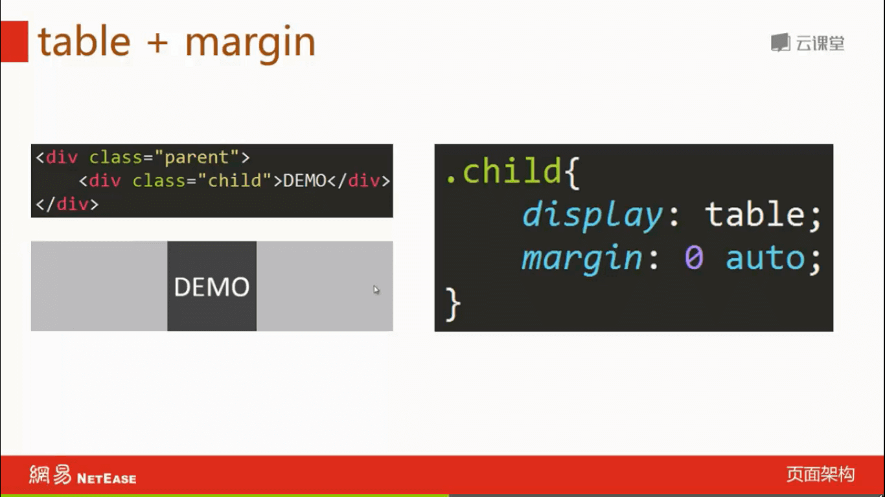
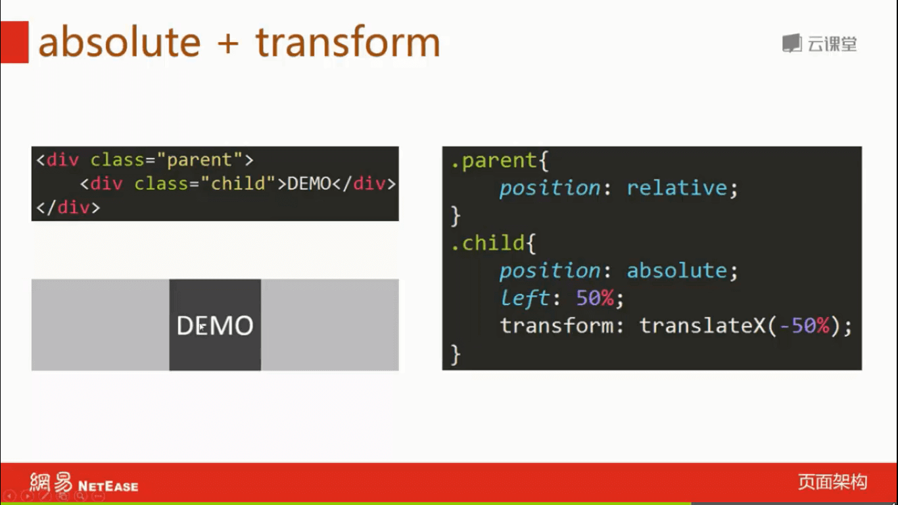
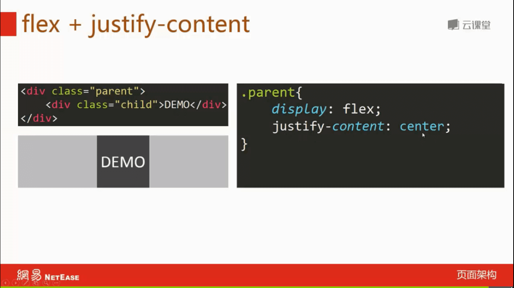
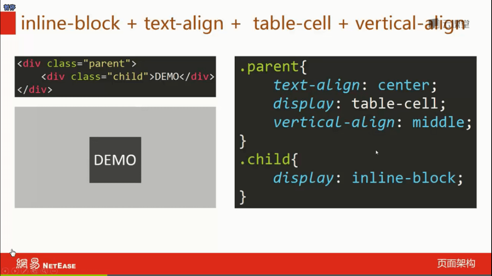

# 2. HTML和CSS

## —— HTML ——

### 1.从规范的角度理解HTML，从分类和语义的角度使用标签

1. [HTML（超文本标记语言）](https://developer.mozilla.org/zh-CN/docs/Web/HTML)


### 2.常用页面标签的默认样式、自带属性、不同浏览器的差异、处理浏览器兼容问题的方式

使用 normalize.css 抹平不同浏览器的样式差异。

使用 PostCSS 的  [`autoprefixer`](https://github.com/postcss/autoprefixer) 处理兼容问题。


### 3.元信息类标签(head、title、meta)的使用目的和配置方法

使用目的：方便搜索引擎检索、定义文本编码、视口宽度、浏览器兼容性等。


```html
<head>
  <meta charset="UTF-8">
  <meta name="viewport" content="width=device-width, initial-scale=1, maximum-scale=2, user-scalable=yes">
  <meta http-equiv="X-UA-Compatible" content="ie=edge">
  <title>Document</title>
</head>
```


### 4.HTML5离线缓存原理

1. [使用应用缓存(appcache)](https://developer.mozilla.org/zh-CN/docs/Web/HTML/Using_the_application_cache)

   >  该特性已经从 Web 标准中删除 

2. [使用 Service Workers](https://developer.mozilla.org/zh-CN/docs/Web/API/Service_Worker_API/Using_Service_Workers)


### 5.可以使用Canvas API、SVG等绘制高性能的动画

- [【带着canvas去流浪】系列](https://github.com/dashnowords/blogs#angel带着canvas去流浪系列)
- [超级强大的SVG SMIL animation动画详解](https://www.zhangxinxu.com/wordpress/2014/08/so-powerful-svg-smil-animation/)

## —— CSS ——

### 1.CSS盒模型，在不同浏览器的差异

### CSS 盒模型可以分为**标准盒模型**和 IE 盒模型（**怪异盒模型**）

- 标准盒模型的构成：外边距、边框、内边距、宽x高、内容

  

- 怪异盒模型的构成：外边距、宽x高、边框、内边距、内容

  

使用 `box-sizing: border-box` 可以实现怪异盒模型的效果，而且有很多适用场景。

### 2.CSS所有选择器及其优先级、使用场景，哪些可以继承，如何运用at规则

#### [CSS 所有的选择器 · MDN](https://developer.mozilla.org/zh-CN/docs/Web/CSS/CSS_Selectors)

- 基本选择器
    - Type（类型）选择器 `input {}`
    - Class（类）选择器 `.wrap {}`
    - ID 选择器 `#root {}`
    - 通用选择器 `* {}`
    - 属性选择器 `[attr=value] {}`
- 组合选择器
    - 紧邻兄弟选择器 `li+li {}`
    - 一般兄弟选择器 `p ~ span {}`
    - 子选择器 `ul>li {}`
    - 后代选择器 `div span {}`
- 伪类 `a:visited {}`
- 伪元素 `p::first-line {}`

> 选择器的使用场景根据具体情况具体分析。

可继承的属性：字体、文本样式等

```
font-family, font-size, font-weight, color, line-height, letter-spacing 等
```

不可继承的属性：边框、盒子模型、背景等

```
display, margin, padding, border, background, height, width 等
```

### 3.CSS伪类和伪元素有哪些，它们的区别和实际应用

[标准伪类索引 · MDN](https://developer.mozilla.org/zh-CN/docs/Web/CSS/Pseudo-classes#标准伪类索引)

常用的伪类：

```
:active, :disabled, :first-child, :first-of-type, :focus, :hover, :not(), :nth-child(), :nth-of-type()
```

[标准伪元素索引 · MDN](https://developer.mozilla.org/zh-CN/docs/Web/CSS/Pseudo-elements#标准伪元素索引)

常用的伪元素：

```
::after, ::before
```

> 区别请参考 MDN 文档，实际应用请动手实践。
>
> 伪元素两个冒号 `::before` 是 CSS3 写法，一个冒号`:before` 是 CSS2 写法，CSS3 这样规定的目的是为了区分为元素和伪类。 **注:** IE8仅支持`:after。` 


### 4.HTML文档流的排版规则，CSS几种定位的规则、定位参照物、对文档流的影响，如何选择最好的定位方式，雪碧图实现原理

#### 文档流的排版规则

（待补充）

#### CSS几种定位的规则 [MDN](https://developer.mozilla.org/zh-CN/docs/Web/CSS/position)

- `static`（默认值）

  该关键字指定元素使用正常的布局行为，即元素在文档常规流中当前的布局位置。此时 `top`, `right`, `bottom`, `left` 和 `z-index `属性无效。

- `relative`

  该关键字下，元素先放置在未添加定位时的位置，再在不改变页面布局的前提下调整元素位置（因此会在此元素未添加定位时所在位置留下空白）。position:relative 对 table-*-group, table-row, table-column, table-cell, table-caption  元素无效。

- `absolute`

  元素会被移出正常文档流，并不为元素预留空间，通过指定元素相对于最近的非 static 定位祖先元素的偏移，来确定元素位置。绝对定位的元素可以设置外边距（margins），且不会与其他边距合并。

- `fixed`

  元素会被移出正常文档流，并不为元素预留空间，而是通过指定元素相对于屏幕视口（viewport）的位置来指定元素位置。元素的位置在屏幕滚动时不会改变。打印时，元素会出现在的每页的固定位置。`fixed` 属性会创建新的层叠上下文。当元素祖先的 `transform`, `perspective` 或 `filter` 属性非 `none` 时，容器由视口改为该祖先。

- `sticky`

  元素根据正常文档流进行定位，然后相对它的*最近滚动祖先（nearest scrolling ancestor）*和 [containing block](https://developer.mozilla.org/en-US/docs/Web/CSS/Containing_Block) (最近块级祖先 nearest block-level ancestor)，包括table-related元素，基于`top`, `right`, `bottom`, 和 `left`的值进行偏移。偏移值不会影响任何其他元素的位置。

  该值总是创建一个新的层叠上下文（stacking context）。注意，一个sticky元素会“固定”在离它最近的一个拥有“滚动机制”的祖先上（当该祖先的`overflow` 是 `hidden`, `scroll`, `auto`, 或 `overlay`时），即便这个祖先不是真的滚动祖先。这个阻止了所有“sticky”行为。

#### 雪碧图

把多张小图片合成一张大的 png 图片，然后使用 CSS `background` 和 `background-position `指定其位置从而正确显示。优点：减少网络请求，提升加载性能，制作帧动画方便；缺点：位置不好控制，不好维护。

### 5.水平垂直居中的方案、可以实现6种以上并对比它们的优缺点

#### 水平居中方案

- `inline-block` + `text-align: center`

  

- `table` + `margin: 0 auto`

  

- `absolute` + `transform`

  

- `flex` + `justify-content`

  

  

#### 垂直居中方案

- `tabel-cell` + `vertical-align: middle`

  

- `absolute` + `transform`

  

- `flex` + `align-items`

  

#### 水平&垂直居中方案

- `inline-block` + `text-align: center` + `tabel-cell` + `vertical-align: middle`

  

- `absolute` + `transform`

  

- `flex` + `justify-content` + `align-items`

  

### 6.BFC实现原理，可以解决的问题，如何创建BFC

（待补充）

[块格式化上下文](https://developer.mozilla.org/zh-CN/docs/Web/Guide/CSS/Block_formatting_context)


### 7.可使用CSS函数复用代码，实现特殊效果

### 8.PostCSS、Sass、Less的异同，以及使用配置，至少掌握一种

Sass、Less、Stylus 都是 CSS 预处理器，支持 变量、嵌套、内置方法、函数 等特性，具体配置请参考官方文档，目前 stylus 用的比较多。

PostCSS 是 CSS 后处理器，支持检查、编译 CSS 以提供更强的兼容性。


### 9.CSS模块化方案、如何配置按需加载、如何防止CSS阻塞渲染


### 10.熟练使用CSS实现常见动画，如渐变、移动、旋转、缩放等等

### 11.CSS浏览器兼容性写法，了解不同API在不同浏览器下的兼容性情况

[浏览器引擎前缀](https://developer.mozilla.org/zh-CN/docs/Glossary/Vendor_Prefix)

- `-webkit- (`谷歌, Safari, 新版Opera浏览器, 以及几乎所有iOS系统中的浏览器(包括iOS 系统中的火狐浏览器); 简单的说，所有基于WebKit 内核的浏览器)
- `-moz- `(火狐浏览器)
- `-o-` (旧版Opera浏览器)
- `-ms-` (IE浏览器 和 Edge浏览器)

使用 [caniuse.com](https://caniuse.com/) 这个网站查询兼容情况

### 12.掌握一套完整的响应式布局方案

## —— 手写 ——

### 1.手写图片瀑布流效果


### 2.使用CSS绘制几何图形（圆形、三角形、扇形、菱形等）


### 3.使用纯CSS实现曲线运动（贝塞尔曲线）


### 4.实现常用布局（三栏、圣杯、双飞翼、吸顶），可是说出多种方式并理解其优缺点

