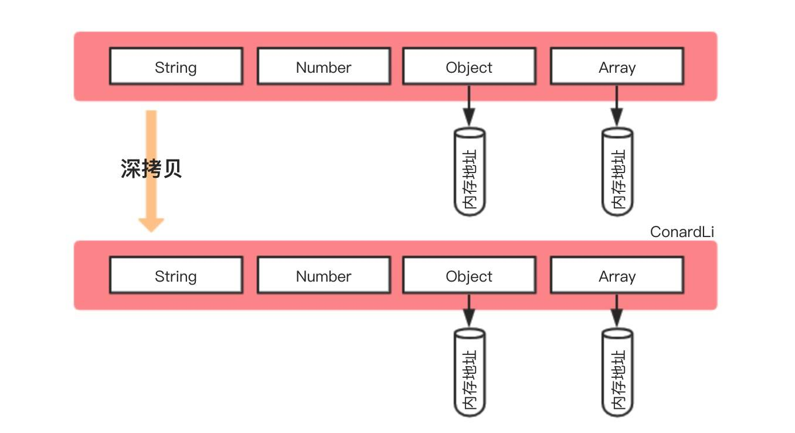

# JS 浅拷贝与深拷贝

本文参考了：

- [如何写出一个惊艳面试官的深拷贝?——ConardLi](https://juejin.im/post/5d6aa4f96fb9a06b112ad5b1#heading-0)
- [js 深拷贝 vs 浅拷贝](https://juejin.im/post/59ac1c4ef265da248e75892b)


## 定义

我们首先来了解以下浅拷贝与深拷贝的定义：

### 浅拷贝的定义

创建一个新对象，这个对象有着原始对象属性值的一份精确拷贝。如果属性值是基本类型，拷贝的就是基本类型的值；如果属性是引用类型，拷贝的就是内存地址。所以如果其中一个对象改变了这个地址（的值），就会影响到另一个对象。

  

### 深拷贝的定义

将一个对象从内存中完整的拷贝一份出来，从堆内存中开辟一个新的区域存放新对象，且修改新对象不会影响原对象。

  

### 实现一个浅拷贝

浅拷贝的原理非常简单，就是对对象的第一层进行拷贝。

```js
// obj 是我们要拷贝的原对象
const obj = {
    name: 'abc',
    age: 1,
    color: ['red', 'green', 'blue']
}

// 使用 ES6 展开语法进行浅拷贝
// const obj2 = {...obj}

// 手动实现一个简单的浅拷贝
function shallowCopy(obj) {
    var newObj = {}
    for (var prop in obj) {
        if (obj.hasOwnProperty(prop)) {
            newObj[prop] = obj[prop]
        }
    }
    return newObj
}

const obj2 = shallowCopy(obj)
obj2.age++
obj2.color.push('yellow') // 新对象 obj2 的引用值进行push()，发现影响了 obj 原对象。
console.log(obj,obj2)
```


下面，我们将用不同方法实现深拷贝。

## 原生方法

```js
JSON.parse(JSON.stringify(obj))
```

这种深拷贝方法非常简单并且效率，且适用场景也很多，但有一些场景不能使用：

- 不能拷贝函数
- 不能拷贝 undefined 值
- 原对象存在循环引用会报错

## 递归实现深拷贝

考虑到深拷贝的原对象可能有未知层的深度，我们要用递归来解决。在原有浅拷贝的基础上，加上判断和递归：

> 判断目标值是对象还是基本类型值，如果是对象，则遍历对象的值，并通过递归，对里面的值进行进一步判断；如果不是对象，则直接返回基本类型的值。

```js
// 改进一下测试用例，新增了 undefined、null、数组、对象、和方法。
let obj = {
    name: 'abc',
    age: 1,
    color: ['red', 'green', 'blue'],
    links: {
        aaa: '1',
        bbb: '2'
    },
    t1: undefined,
    t2: null,
    say: function() {
        console.log('ok')
    }
}

function deepClone(target) {
    if (typeof target === 'object') {
        var newTarget = {}
        for (var prop in target) {
            if (target.hasOwnProperty(prop)) {
                newTarget[prop] = deepClone(target[prop])
            }
        }
        return newTarget
    } else {
        return target
    }
}
const obj2 = deepClone(obj)
console.log(obj, obj2)
```

经过测试，这种简单的深拷贝可以拷贝对象，但不能拷贝数组或是对象中的数组；并且拷贝 null 值时会把 `null` 变成 `{}`，这很好解决，加两个判断就行了：

```js
function deepClone(target) {
    if (target === null) { // （1）判断是否为 null
        return null
    } else if (typeof target === 'object') {
        var newTarget = Array.isArray(target) ? [] : {} // （2）判断是数组还是对象
        for (var prop in target) {
            if (target.hasOwnProperty(prop)) {
                newTarget[prop] = deepClone(target[prop])
            }
        }
        return newTarget
    } else {
        return target
    }
}
```


## 如果原对象中存在循环引用

在上面测试用例的下一行增加一句话，实现对自身的无限循环引用：

```js
let obj = {
    // ...
}
obj.obj = obj
```

这时我们再执行上面的深拷贝函数，会进入死循环导致爆栈（栈内存溢出）：`Uncaught RangeError: Maximum call stack size exceeded`

那么如何解决这个问题呢？

> 解决循环引用问题，我们可以开辟一块新的存储空间，报错当前对象和拷贝对象的关系，要拷贝当前对象时，先去存储空间中找，如果有这个对象则直接返回，如果没有就继续拷贝。
>
> 这个存储空间，可以存储**键值对**形式的数据，键可以时引用类型，我们选择 Map 这种数据结构。

- 创建一个空 Map
- 检查 map 中有无克隆过的对象
  - 有：直接返回该对象
  - 无：将当前对象作为键，克隆对象作为值进行存储
- 继续克隆

```js
function deepClone(target, map=new Map()) { // （1）只在第一次调用时创建 Map，下次调用直接传上一次的值
    if (target === null) {
        return null
    } else if (typeof target === 'object') {
        var newTarget = Array.isArray(target) ? [] : {}
        if (map.get(target)) { // （2）检查 map 中有无克隆过的对象
            return map.get(target) // 有
        }
        map.set(target, newTarget) // 无
        for (var prop in target) {
            if (target.hasOwnProperty(prop)) {
                newTarget[prop] = deepClone(target[prop], map)
            }
        }
        return newTarget
    } else {
        return target
    }
}
```

这样，我们的深拷贝在拷贝递归引用时就可以正常运作了。

改进：推荐把 Map 改成 [WeakMap](https://developer.mozilla.org/zh-CN/docs/Web/JavaScript/Reference/Global_Objects/WeakMap)，起到画龙点睛的作用，理由如下：

- Map 对象之间是强引用的，即使原对象被释放， Map 内存仍然无法释放，就容易导致内存泄漏
- WeakMap 由于是弱引用的关系（也就导致其 key 无法枚举），当下一次垃圾回收机制执行时时内存就会被释放

>  当你不太了解`WeakMap`的真正作用时。我建议你也不要在面试中写这样的代码，结果只能是给自己挖坑，即使是准备面试，你写的每一行代码也都是需要经过深思熟虑并且非常明白的。 ——**ConardLi** 


## 优化

### 性能优化

按照执行效率从高到低排序：`while`>`for`>`for in`。因此我们可以把 `for in` 遍历改为`while`遍历以提升性能。

### 合理判断引用类型

`null` 和 `function`

### 其他数据类型

- 可继续遍历的类型：
  - `Set`、`Map`、`Object`、`Array`
- 不可继续遍历的类型：
  -  `Bool`、`Number`、`String`、`String`、`Date`、`Error` 

## 克隆函数

克隆函数没有实际的应用场景

这里直接上一张 ConardLi 大佬作的图，来总结上述的优化吧：


