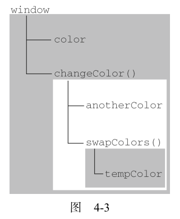

# 第四章 变量、作用域和内存问题

## 基本类型和引用类型的值

- 基本类型指的是简单的数据段（即5种基本数据类型：Number,String,Boolean,Null,Undefined）。
- 引用类型值指的是那些可能由多个值构成的对象（Object）。
- JavaScript不允许直接访问内存中的位置，因此在操作对象时，实际上在操作对象的引用。
- 不能给基本类型的值添加属性，否则这个添加的属性值是undefined。只能给引用类型的值动态的添加属性。

基本类型值在内存中占据固定大小的空间，因此被保存在**栈内存**中；引用类型的值是对象，保存在**堆内存**中。

### 复制变量值

下面的例子可以说明，如果从一个变量向另一个变量复制基本类型的值，会在变量对象上创建一个新值，然后把该值复制
到为新变量分配的位置上。

```js
var num1 = 5;
var num2 = num1;

console.log('num1='+num1+', num2='+num2);   // num1=5, num2=5

num1 = 6;
console.log('num1='+num1+', num2='+num2);   // num1=6, num2=5
```

复制对象时，其实复制的是对象的引用，修改原来的对象值会改变复制后的对象值。


```js
var obj1 = {name:'原始的字符串'};
var obj2 = obj1;

console.log(obj2.name);     // 原始的字符串

obj1.name = '修改一下';

console.log(obj2.name);     // 修改一下
```

### 传递参数

- ECMAScript 中所有函数的参数都是按值传递的。但对于对象就没那么简单了：
    - 在向参数传递**基本类型**的值时，被传递的**值**会被复制给一个局部变量。
    - 在向参数传递**引用类型**的值时，会把这个值在内存中的**地址**复制给一个局部变量，因此这个局部变量的变化会反映在函数的外部。

```js
var obj1 = {name:'name1'};
function setName(obj) {
  obj.name = 'name2';
    // obj 和 obj1 引用的是同一个对象。换句话说，即使这个变量是按值传递的，obj 也会按引用来访问同一个对象。
}
console.log(obj1);  // name1
setName(obj1);
console.log(obj1);  // name2, 这种情况下原来对象的内容会被更改
```

很多人错误的认为：在局部作用域中修改的对象会在全局作用域中反映出来，就说明
参数是按引用传递的。为了证明对象是按值传递的，看一看下面这个例子：

```js
var obj1 = {name:'name1'};
function setName(obj) {
  obj.name = 'name2'
  obj = {name:'new name 2333'};
}
console.log(obj1);
setName(obj1);
console.log(obj1);  // 仍然是name2，而不是在函数内部新建的对象2333。

// 这说明即使在函数内部修改了参数的值，但原始的引用仍然保持未变。
// 实际上，当在函数内部重写 obj 时，这个变量引用的就是一个局部对象了。
// 而这个局部对象会在函数执行完毕后立即被销毁。
```

### 检测类型

确定一个值是哪种**基本类型**可以使用`typeof`操作符，而确定一个值是哪种**引用类型**可以使用`instanceof`操作符。

typeof 操作符是确定一个变量是`string`、`number`、`boolean`，还是 `undefined` 的最佳工具。

```js
var num = 10;
var str = 'helloworld';
var bol = true;
var nul = null;
var und = undefined;
var obj = new Object();
var reg = /0-9/;            // 正则表达式。

console.log(typeof num);    // 'number'
console.log(typeof str);    // 'string'
console.log(typeof bol);    // 'boolean'
console.log(typeof nul);    // 'object'
console.log(typeof und);    // 'undefined'
console.log(typeof obj);    // 'object'
console.log(typeof reg);    // 'object'
```

`typeof` 在检测引用值时用处不大，这时候你需要使用 `instanceof` 操作符。（所有引用类型值都是Object）

语法：`result = variable instanceof constructor`

```js
var persion = new Object();
var arr = [1,2,3,4];
var reg = /0-9/;

console.log(persion instanceof Object);     // true
console.log(arr instanceof Array);          // true
console.log(reg instanceof RegExp);         // true
```

## 执行环境及作用域

执行环境也称作用域，执行环境分为全局执行环境和函数执行环境，没有块作用域。

- **执行环境**定义了变量或函数有权访问的其他数据，决定了他们各自的行为。
- 每个执行环境都有一个与之关联的**变量对象**。
- 在Web浏览器中，全局执行环境是`window`对象。所有全局变量和函数都是作为 window 对象的属性和方法创建的。
- 某个执行环境中的所有代码执行完毕后，其本身及其内部所有变量和函数定义也全部销毁。
- 当代码在一个环境中执行时，会创建变量对象的一个**作用域链**（scope chain）。作用域链的用途，是保证对执行环境有权访问的所有变量和函数的有序访问。

作用域链：内部环境可以通过作用域链访问所有的外部环境，但外部环境不能访问内部环境中的任何变量和函数。



### 没有块级作用域！

```js
if (true) {
  var color = 'blue';
}
console.log(color)  // blue

for (var i=0;i<10;i++);
console.log(i)  // 10
```

如果是在 C、C++或 Java 中，color 会在 if 语句执行完毕后被销毁。但在 JavaScript 中，if 语句中的变量声明会将变量添加到当前的执行环境（在这里是全局环境）中。

由 for 语句创建的变量 i 即使在 for 循环执行结束后，也依旧会存在于循环外部的执行环境中。

如果初始化变量时没有使用 var 声明，该变量会自动被添加到全局环境。

不声明而直接初始化变量是一个常见的错误做法，因为这样可能会导致意外。在严格模式下，初始化未经声明的变量会导致错误。

## 垃圾收集

JavaScript具有自动垃圾收集机制，执行环境会负责管理代码执行过程中使用的内存。

垃圾收集机制必须跟踪哪个变量有用哪个变量没用，对于不在有用的变量打上标记，以备将来收回其占用的内存。
标识无用变量的策略一般有两种：标记清除、引用计数。

### 标记清除

JavaScript 中最常用的垃圾收集方式是标记清除（mark-and-sweep）。当变量进入环境（例如，在函
数中声明一个变量）时，就将这个变量标记为“进入环境”。永远不能释放进入环境的变量所占用的内存，
因为只要执行流进入相应的环境，就可能会用到它们。而当变量离开环境时，则将其标记为“离开环境”。

垃圾收集器在运行的时候会给存储在内存中的所有变量都加上标记，它会去掉**环境中**的变量以及被环境中
的变量引用的变量的标记。最后，垃圾收集器完成内存清除工作，销毁那些带标记的值并回收它们所占用
的内存空间。

### 引用计数

另一种不太常见的垃圾收集策略叫做**引用计数**（reference counting）。引用计数的含义是跟踪记录每
个值被引用的次数。
引用计数遇到了一个严重的问题：循环引用。循环引用指的是对象 A 中包含一个指向对象 B 的指针，
而对象 B 中也包含一个指向对象 A 的引用。当代码中存在循环引用现象时，“引用计数”算法就会导致问题。

将变量设置为 null 意味着切断变量与它此前引用的值之间的连接。
IE9 把 BOM 和 DOM 对象都转换成了真正的 JavaScript 对象。

### 管理内存

由于分配给浏览器的内存数量一般比桌面程序少，我们可以通过将不用的全局变量和全局对象赋值null来释放其引用以达到释放内存的作用。
这个做法叫做**解除引用**（dereferencing）。解除引用的真正作用是让值脱离执行环境，以便垃圾收集器下次运行时将其回收。