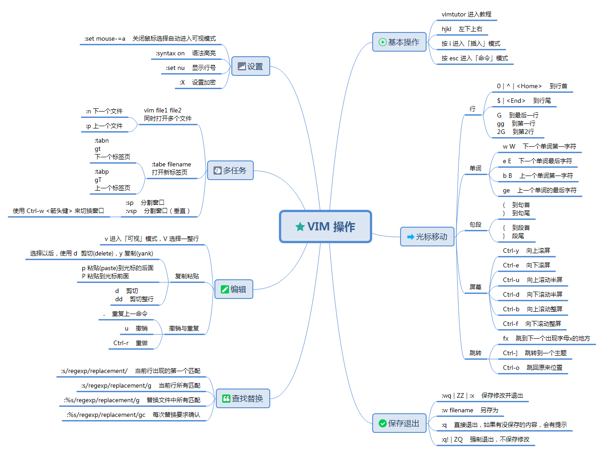
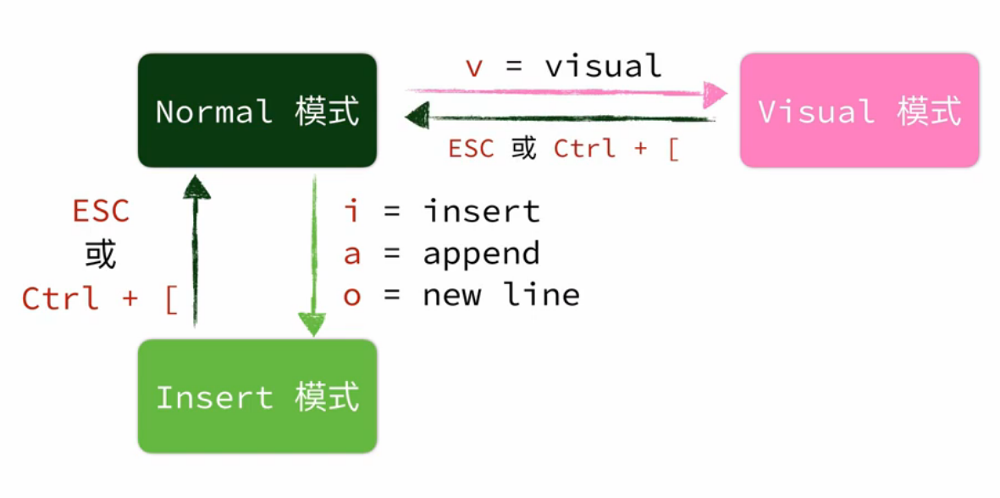

# vim 笔记



## 基本操作

- 使用 `vimtutor` 命令进行交互式的学习，过一遍即可理解基础的 VIM 操作。 
- 在默认状态（命令模式），用来移动光标的 `hjkl` 四个键分别代表 `左下上右`。
- 按 `i` 进入「插入」模式，按 `esc` 退出模式。
- 按 `esc` 进入「命令」模式，此时可以输入一些命令，例如：

  - `:q` 直接退出，如果有没保存的内容，会有提示
  - `:q!` 强制退出，不保存修改
  - `:wq` 保存修改并退出

## 模式切换



- Normal 模式（命令模式）：可以输入vim命令
- Insert 模式（插入模式）：可以输入文字
- Visual 模式（可视模式）：可以选择文本

## 编辑

- `i` `I` `a` `A` `o` `O` 都可进入插入模式
- `x` 删除当前光标文字并放入暂存器
- `d` 删除选取的文字，效果同 `x`；`D` 删除光标后面的内容；`dd` 删除整行；`dG` 删除从光标到文件末尾；`dgg` 删除从光标到文件头
- `c` 删除选取内容并进入插入模式，效果同 `x`
- `r` 取代光标所在的文字
- `>>` `<<` 在当前行增加/删除缩进
- `=` 让选中行自动排版

## 选择、复制粘贴

- 在命令模式，按 `v` 进入「可视」模式，此时可以移动光标进行选择，或按 `V` 选择一整行
- 选择以后，使用 `d` 来剪切(delete)，`y` 来复制(yank)，`yy` 可以复制整行
- 移动光标到你想粘贴的地方，按 `p` 来进行粘贴(paste)(光标的后面)，或者用 `P` 来粘贴到光标前面
- 量词+p可以粘贴多次，如 `5p` 将复制的内容粘贴5次。
- 量词+y同样可以复制多行，`y$` 复制到行尾；`yG` 从光标位置复制到文件末尾；`ygg` 从光标复制到文件首部
- 暂存器：`"` + 字母 + 操作，可以把操作的文字从暂存器读取或写入，例如：`"ay` 将选中的字符复制到暂存器 `a`
- 暂存器和剪贴板共通：`set clipboard=unnamed`

## 撤销与重做

在命令模式，`u` 撤销命令，`U` 撤销行内命令。`ctrl+r` 是重做命令。

## 搜索

- 搜索结果高亮 `:set hlsearch`
- `/` + 字符回车进行搜索；`n N` 搜寻下一个或上一个
- `?` 和 `/` 类似，只不过 `n N` 的作用正好相反
- `*` 向后搜索当前游标所在单词，`#`为反向
- `f` + 字母：在当前行向后定位字母。如：`fx`。`F`+加字母则为反向操作

## 替换文本

语法为：`:[addr]s/源字符串/目的字符串/[option]`

一些示例，[参考](https://www.cnblogs.com/beenoisy/p/4046074.html)

- 全局替换：`:%s/源字符串/目的字符串/g`

## 多文件编辑1

- `:e <文件名>` 打开文件
- `:tabe [文件名]` 打开新分页(Tab)
- `gt` 下一个分页；`gT` 上一个分页
- `:new` 水平分割视窗；`:vnew` 垂直分割视窗
- `ctrl-ww` 来回切换视窗；`ctrl-w-[hjkl]` 左下上右切换视窗
- `vim -o [FILE1] [FILE2]` 一键水平开启多个档案（`-O` 垂直开启，`-p` 用标签页开启）

## 多文件编辑2

- `vim [FILE1] [FILE2]` 同时打开多个文件，分配在不同的 Buffer 中；`vim *` 打开当前目录所有文件
- `:ls` 列出所有Buffer
- `:b3` 切到第3个Buffer；`:b FILENAME` 切换到打开文件的Buffer，文件名可模糊匹配
- `ctrl+^` 切换到前一个Buffer；`:bn` 下一个；`:bp` 上一个；`:bl` 最后一个；`bf` 第一个
- `:bd` 关闭当前 Buffer
- `:tab ba` 将 Buffer 转换成 Tab

## 其他

#### 关闭 vim 鼠标选择自动进入可视模式

> 由于 vim 使用了寄存器，并且在有的系统中寄存器和剪贴板不能互通，导致鼠标选择的内容不能被复制出来。这时就可以关闭鼠标选择自动进入可视模式。

```
:set mouse-=a
```

#### vim 清除命令历史记录

vim 的命令历史记录都会被放到 `~/.viminfo` 之中，直接删除它即可清除历史记录。

#### vim 转换当前打开的文件为 unix 文件格式

```
:set fileformat=unix
```
#### vi 方向键变成 ABCD 问题

命令模式输入：`:set nocp`

```sh
# 保存为设置
echo "set nocp" >> ~/.vimrc
source ~/.vimrc
# 或者 cp /etc/vim/vimrc ~/.vimrc
```

或者安装 vim，然后使用 vim 编辑

---

参考：

- [即將失傳的古老技藝](https://www.bilibili.com/video/BV1fV41187Zr?p=5)
