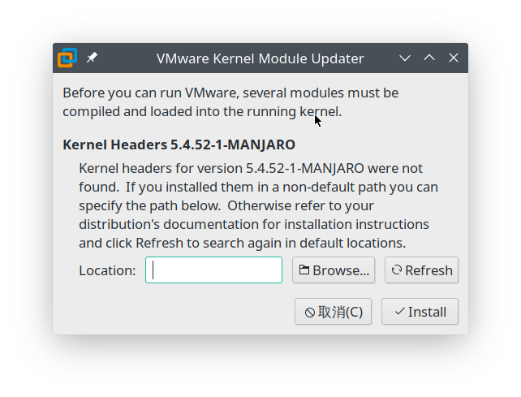
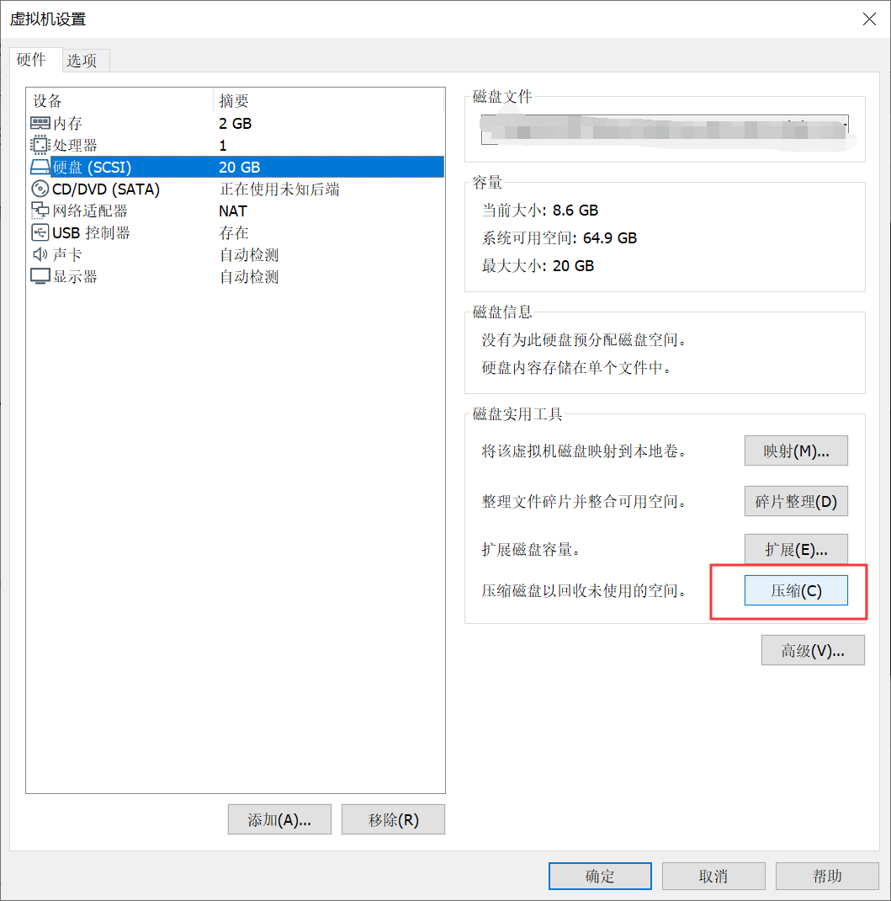

# 虚拟机笔记

## Linux 安装 VMware Workstation 虚拟机

到官网下载 Linux 二进制文件：[VMware-Workstation-Full-15.5.6-16341506.x86_64.bundle](https://download3.vmware.com/software/wkst/file/VMware-Workstation-Full-15.5.6-16341506.x86_64.bundle)

```sh
chmod +x *.bundle
./VMware-Workstation-Full-15.5.6-16341506.x86_64.bundle
```

- Q: Directory must be non-empty System service scripts directory (commonly /etc/init.d)
- A: sudo mkdir `/etc/init.d`

---



启动 VMware，如果出现这个窗口，则需要：`sudo pacman -S linux-headers`，选择对应的版本安装，比如我的是 `linux54-headers`。安装完成后重新打开 VMWare 就可以了。更多说明请查看 [Arch VMware 文档]([https://wiki.archlinux.org/index.php/VMware_(%E7%AE%80%E4%BD%93%E4%B8%AD%E6%96%87)](https://wiki.archlinux.org/index.php/VMware_(简体中文))

## Arch Linux 安装 VirtualBox 虚拟机

```sh
sudo pacman -S virtualbox
# 选择内核对应的版本安装

# 初次启动报错：Kernel driver not installed (rc=-1908)
sudo pacman -S linux-headers
sudo pacman -S virtualbox-host-dkms
sudo modprobe vboxdrv
```

## VMWare vmdk 拆分与合并

> **vmware-vdiskmanager.exe** 的位置在：`C:\Program Files (x86)\VMware\VMware Workstation\vmware-vdiskmanager.exe`

### 多个镜像合并为一个

```sh
# vmware-vdiskmanager -r <原文件路径(含文件名)> -t 0 <合并后文件路径(含文件名)>

vmware-vdiskmanager.exe -r "D:\VM\VMW7\Windows 7.vmdk" -t 0 "D:\VM\Win7-single.vmdk"
```

### 一个镜像拆分为多个

```sh
# vmware-vdiskmanager -r <原文件路径(含文件名)> -t 1 <分割后文件路径(含文件名)>

vmware-vdiskmanager -r G:\ubuntu\Ubuntu.vmdk -t 1 G:\ubuntu\ubuntu2.vmdk
```

## 压缩虚拟磁盘文件大小

- [vmware压缩vmdk文件大小](https://www.cnblogs.com/kagari/p/12010147.html)
- [减小VirtualBox虚拟硬盘文件的大小](https://blog.csdn.net/ganshuyu/article/details/46360271)

### Linux 客户机系统

将系统空闲空间置为 0，有两种方法：

第一种：

```sh
cat /dev/zero > zero.fill;sync;sleep 1;sync;rm -f zero.fill
```

第二种：

```sh
sudo dd if=/dev/zero of=/EMPTY bs=1M
sudo rm -f /EMPTY
```

### Windows 客户机系统

将系统空闲空间置为 0，Windows系统需要下载 [Sysinternals Suite](https://docs.microsoft.com/en-us/sysinternals/downloads/sysinternals-suite) 并执行：

```sh
sdelete –z C:
```

### 通用宿主机 VirtualBox 压缩命令

如果你的虚拟硬盘是Vmware的VMDK格式，那就要麻烦点，因为VirtualBox不支持直接压缩VMDK格式，但是可以变通下：先转换成VDI并压缩，再转回VMDK。执行命令：

```sh
vboxmanage clonehd "source.vmdk" "cloned.vdi" --format vdi
vboxmanage modifyhd cloned.vdi --compact
vboxmanage clonehd "cloned.vdi" "compressed.vmdk" --format vmdk
```

> 事实上，执行命令的过程中可以发现：在从VMDK转换到VDI的过程中似乎已经做了压缩，文件大小已经减少了很多，第二条命令反而没见到文件大小有什么变化，所以这里第二条命令应该可以省略了。

### Linux 宿主机 VMware 压缩命令

```
/usr/bin/vmware-toolbox-cmd disk shrinkonly
```

如果提示：`shrink disk is disabled for this virtual machine`，有两种可能：

- 磁盘是固定分配大小的，这样的话不能收缩
- 当前磁盘存在快照，删除快照后就再试

### Windows 宿主机 VMware 压缩命令

第一种：右键我的电脑->管理->存储->磁盘管理->右键任意磁盘->压缩卷->压缩

第二种：vmware安装目录下，vmware-vdiskmanager.exe -k vmdk路径

```
D:\VMware>vmware-vdiskmanager.exe -k  C:\Users\windows\Desktop\xxxx-disk1.vmdk
```

第三种：



## VMware Workstation 与 Device/Credential Guard 不兼容?

> VMware Workstation 与 Device/Credential Guard 不兼容。在禁用 Device/Credential Guard 后，可以运行 VMware Workstation。

这往往是因为开启了 Hype-V 功能导致的，先关闭 Hyper-V，然后在命令行以管理员身份执行：`bcdedit /set hypervisorlaunchtype off`，重启电脑。

## [Arch Linux中使用VMware Workstation不能打开vmmon内核模块](https://www.cnblogs.com/zhuxiaoxi/p/8423544.html)

##### 解决方法1

你可以在启动VMware前运行`/etc/init.d/vmware start`来启动服务

##### 解决方法2

在Arch Linux上可以通过安装`vmware-systemd-serverices`这个AUR包，来添加systemctl服务

- 使用`systemctl enable vmware.service`让它每次开机都运行
- 使用`systemctl start vmware.service`让它临时启动

##### 解决方法3

添加这个文件
*/etc/systemd/system/vmware.service*

```
[Unit]
Description=VMware daemon
Requires=vmware-usbarbitrator.service
Before=vmware-usbarbitrator.service
After=network.target

[Service]
ExecStart=/etc/init.d/vmware start
ExecStop=/etc/init.d/vmware stop
PIDFile=/var/lock/subsys/vmware
RemainAfterExit=yes

[Install]
WantedBy=multi-user.target
```

- 使用`systemctl enable vmware.service`让它每次开机都运行
- 使用`systemctl start vmware.service`让它临时启动

## 如何在 Linux 客户机挂载 VirtualBox 共享文件夹

首先需要安装增强工具。

如果勾选了自动挂载，并设置了挂载点（如 `VMShared`），则一般来说会挂载到 `/media/sf_VMShared/`，但这个目录只有 `root` 用户或 `vboxsf` 组的用户才有权限访问（[参考](https://stackoverflow.com/a/26981786)）。

```sh
# 添加当前用户到组
sudo adduser $USER vboxsf
# 如果上面那条执行失败就用这一条
sudo usermod --append --groups vboxsf $USER
```

需要重新登录或重启才能生效。

如果没有自动挂载成功，下面是手动挂载的方法：

参考：[Mounting VirtualBox shared folders on Ubuntu Server 16.04 LTS](https://gist.github.com/estorgio/1d679f962e8209f8a9232f7593683265)

首先，要确保安装了增强功能。然后在「设置-共享文件夹」中添加一个共享文件夹，勾选「自动挂载」并填入挂载点，例如「VMShared」。

到客户机，执行以下命令：

```sh
# 创建挂载目标
sudo mkdir /mnt/VMShared

# 挂载共享目录
sudo mount -t vboxsf VMShared /mnt/VMShared

# 挂载为可写，用户是 user
sudo mount -t vboxsf LinuxZone -o rw,dmode=777,gid=user,uid=user /mnt/LinuxZone1
```

这样就可以完成挂载。
