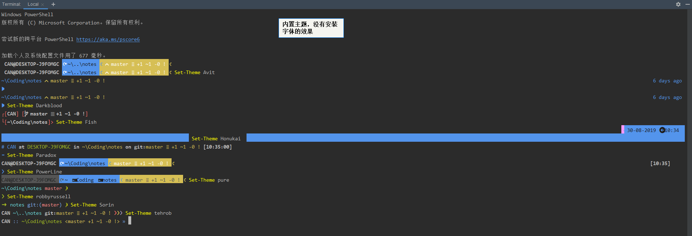

# Windows 

## Win+R 常用命令

- `control` 控制面板
- `regedit` 注册表编辑器
- `eventvwr` 事件查看器
- `mmc` Microsoft 管理控制台
- `gpedit.msc` 组策略
- `devmgmt.msc` 设备管理器
- `diskmgmt.msc` 磁盘管理
- `services.msc` 服务
- `certmgr.msc` 证书
- `taskschd.msc` 计划任务程序
- `wf.msc` 高级安全 Windows 防火墙
- `%windir%\explorer.exe shell:::{4234d49b-0245-4df3-b780-3893943456e1}` 打开 Applications 目录

## Windows 在 Powershell 安装 oh-my-posh

>参考: https://blog.walterlv.com/post/beautify-powershell-like-zsh.html

```powershell
Install-Module posh-git -Scope CurrentUser
Install-Module oh-my-posh -Scope CurrentUser
Import-Module oh-my-posh
# 如果执行出错：因为在此系统上禁止运行脚本，请使用管理权限运行命令：set-executionpolicy remotesigned
Import-Module oh-my-posh
Set-Theme Agnoster
# 输入 $profile 查看默认配置文件地址，编辑默认配置文件，输入上面2行即可每次自动加载配置
```



## 无法加载文件 xxx.ps1，因为在此系统上禁止运行脚本

使用管理权限运行命令：`set-executionpolicy remotesigned`

## Win10如何删除壁纸历史记录

运行 regedit，定位到 `计算机\HKEY_CURRENT_USER\SOFTWARE\Microsoft\Windows\CurrentVersion\Explorer\Wallpapers`，里面有类似 `BackgroundHistoryPath` 这样的条目，可以直接删除。

## 一条命令关闭 Windows 显示器

```powershell
PowerShell -windowstyle hidden -command "(Add-Type -MemberDefinition "\"[DllImport(\"\"user32.dll\"\")]`npublic static extern int SendMessage(int hWnd, int hMsg, int wParam, int lParam);"\" -Name \"Win32SendMessage\" -Namespace Win32Functions -PassThru)::SendMessage(0xffff, 0x0112, 0xF170, 2)"
```

## Win10 离线安装 .NET Framework 3.5（需要系统光盘）

选择和当前系统版本相同的原版 iso 系统光盘，右键“装载”，会有一个DVD驱动器，记住盘符，比如 `L:`

以管理员权限运行 PowerShell，输入如下命令（请确保盘符正确）即可自动安装。

```sh
dism.exe /online /enable-feature /featurename:netfx3 /Source:L:\sources\sxs
```

```
PS C:\Windows\system32> dism.exe /online /enable-feature /featurename:netfx3 /Source:G:\sources\sxs

部署映像服务和管理工具
版本: 10.0.17763.1

映像版本: 10.0.17763.316

启用一个或多个功能
[==========================100.0%==========================]
操作成功完成。
```

## Windows 递归修改文件夹权限为Everyone

```sh
icacls "D:\CodeArchive" /grant Everyone:M /t
```

## 解决WIN10 1803及以后版本的蓝牙音量（绝对音量）问题

```
1、win+r，输入regedit，打开注册表
2、进入路径：计算机\HKEY_LOCAL_MACHINE\SYSTEM\ControlSet001\Control\Bluetooth\Audio\AVRCP\CT
3、找到DisableAbsoluteVolume值，修改为1，如果没有，右键新建DWORD32位，建立对应值。
4、重启。
```
